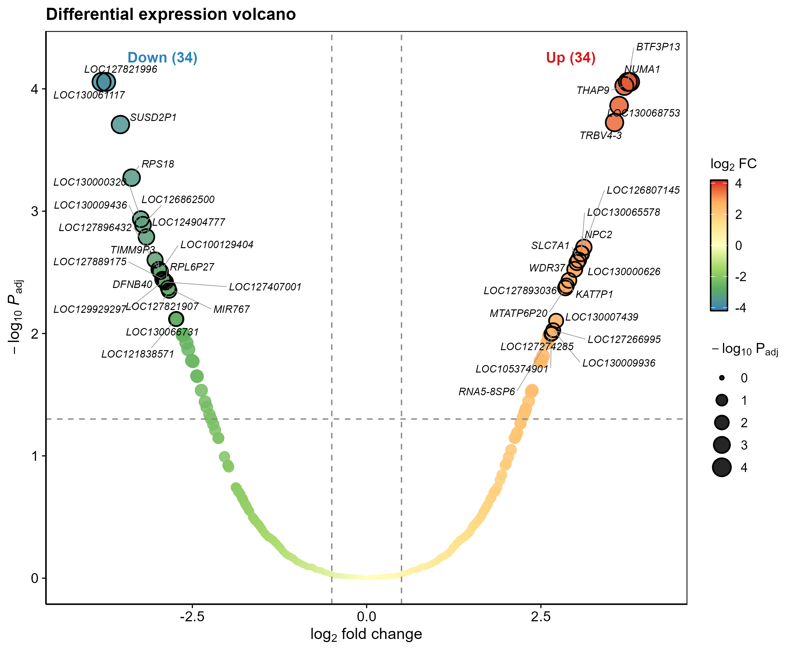

# Reusable Bioinformatics Code Library

A set of self-contained R and Python modules for common bioinformatics analyses.
Each module ships with a small example dataset and runs from the command line to
produce vector, journal-style figures. Replace the example with your own data to
reuse it in a project.

- ~115 modules across 22 analysis categories (~55 run turnkey on bundled/synthetic
  example data; the rest are server/GPU/template — see status marks in the catalog)
- A shared plotting framework (`_framework/`) for consistent figure style
- A project scaffold, quality checklist, and static linter for reproducible pipelines
- Tested with R 4.4 and Python 3.12

## Repository layout

```
modules/              analysis modules, grouped by purpose
├── _framework/             shared toolkit (themes, palettes, scaffold, linter)
├── 01_..21_..              module categories (catalog below)
└── <NNN_module>/           one folder per module:
    ├── <NNN_module>.R|.py   main script (runs on example_data/ by default)
    ├── README.md            input spec, method, outputs
    ├── example_data/        small synthetic input
    └── assets/              committed preview figures
```

Run-time outputs (`results/`, `figures/`) are git-ignored.

## Quick start

```bash
git clone https://github.com/fsy2004/bioinfo-reusable-code.git
cd bioinfo-reusable-code/modules

# run a module on its bundled example data
Rscript 03_transcriptomics_deg/010_geo_deg_volcano_heatmap_pca/010_*.R

# run on your own data
Rscript 03_transcriptomics_deg/010_geo_deg_volcano_heatmap_pca/010_*.R \
        --input your_matrix.csv --outdir results/run1
```

Each module folder documents its exact input format, method, and outputs.

## Example outputs

Rendered directly from the bundled example data:

| Differential expression | Single-cell clustering | Mendelian randomization |
|:---:|:---:|:---:|
|  |  |  |

## Module catalog

Per-module one-liners (purpose, input → output, dependencies, figure types) plus a
**figure-type → module reverse index** and a status legend live in
[`modules/CATALOG.md`](modules/CATALOG.md). Category overview:

| #  | Category | Modules | Typical output |
|----|----------|---------|----------------|
| 01 | Network pharmacology & target databases | 001–006, 011 | Venn, UpSet, target tables |
| 02 | GO / KEGG enrichment | 007 | dot/bar plots, pathway graph |
| 03 | Transcriptomics (GEO) & differential expression | 008–010, 056 | volcano, heatmap, PCA, batch correction |
| 04 | Machine-learning feature selection | 012–015, 034, 035, 052, 059, 502 | LASSO, RF, SVM-RFE, SHAP, AUC heatmap, triple-vote |
| 05 | Diagnostic models & validation | 016, 063, 503 | ROC, calibration, DCA, nomogram, LODO generalization |
| 06 | Immune infiltration | 017–021, 492, 520 | composition, boxplot, correlation, BayesPrism deconvolution |
| 07 | Molecular docking & dynamics | 022, 086 | binding-energy bubble, MD metrics |
| 08 | Single-cell / spatial / trajectory | 023–027, 044–051, 058, 062, 082, 506, 517 | UMAP, dot plot, marker heatmap, scVI/scANVI integration, VECTOR direction |
| 09 | Mendelian randomization & GWAS | 028–033, 043, 055, 075, 079, 508, 519 | MR scatter, forest, funnel, two-step mediation, local pipeline |
| 10 | TWAS (single-cell eQTL weights) | 036–042 | weight tables |
| 11 | WGCNA co-expression | 054, 504 | soft-threshold, module-trait heatmap, hdWGCNA |
| 12 | TCGA prognosis (reference only) | 048, 057, 060 | KM, time-dependent ROC, risk plot |
| 13 | Transcription-factor regulation / circos | 047, 053, 081, 511 | chromosome circos, regulon network, TF convergence |
| 14 | Single-cell in-silico perturbation | 067–069, 085, 494, 495, 507 | gene-knockout effects, Geneformer in-silico |
| 15 | Drug perturbation / repurposing | 070, 071, 078, 518 | pharmacovigilance signals, beyondcell drug response |
| 16 | Spatial communication / cell fate | 072–074, 076, 077, 080, 505, 509, 521 | CellRank, niche maps, RCTD, communication loop, SpatialGlue multi-omics |
| 17 | Advanced result figures | 498, 512–516 | raincloud, ridgeline, dumbbell, chord, composite |
| 18 | External method sources | manifest only | — |
| 19 | Multi-omics integration & subtyping | 083, 084 | MOFA, consensus clustering |
| 20 | Mutation / CNV / methylation / proteome / metabolome | 5 templates | oncoprint, volcano, heatmap |
| 21 | Disease burden (GBD / NHANES / CHARLS / comorbidity) | 527–530 | ASR/EAPC/decomposition, survey-weighted, longitudinal+equating, comorbidity network |
| 22 | Single-cell metabolism | 510 | metabolic pathway activity (scMetabolism-style) |

Categories 10, 14, 16 and parts of 07/12 require heavy or GPU-bound toolchains
(FUSION, GROMACS, deep-learning models); their scripts and dependency notes are
kept for reference rather than local one-command rendering. Some turnkey modules
run a re-implemented method **core** or an honest **baseline** locally and need the
full package on the analysis server — see
[`_framework/SERVER_DEPENDENCIES.md`](modules/_framework/SERVER_DEPENDENCIES.md)
for the per-module real-package + install inventory.

## Framework (`_framework/`)

Shared by all modules so figures and I/O stay consistent:

- `theme_pub.R` / `pubstyle.py` — Nature-aligned journal theme; discrete palettes
  (NPG/AAAS/Lancet/… plus the colourblind-safe **Okabe-Ito** set), viridis for continuous
  and RdBu for diverging scales, and `save_fig()` (vector PDF + 300 dpi PNG)
- `CONVENTIONS.md` — module layout, run conventions, figure rules
- `ANALYSIS_TEMPLATE/` — scaffold for a new multi-step project: central config
  (seed, relative paths, parameters), setup with checkpointed steps
  (`cache_step`), logged statistics, and an environment snapshot; R and Python versions
- `QUALITY_CHECKLIST.md` — pre-/in-/post-analysis checklist
- `qc_lint.py` — static checks for hard-coded paths, missing random seeds,
  non-vector figure exports, and missing environment snapshots; also run in CI
  (`.github/workflows/qc.yml`): full-tree report + a blocking gate on changed files

## Conventions

- Modules run on bundled example data with no edits; use `--input` / `--outdir` to switch.
- No absolute paths or `setwd()`; figures are exported as vector PDF + 300 dpi PNG.
- Reuse the framework instead of re-implementing themes or I/O.
- Figure text in English; analysis logic left intact when standardizing a module.

## License

Each module follows the license of the tools and methods it uses. Vendored
third-party code (e.g. category 18) keeps its original license — see the relevant
module README and upstream repository.
