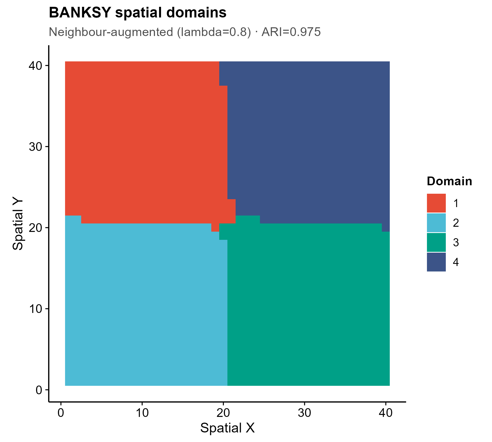
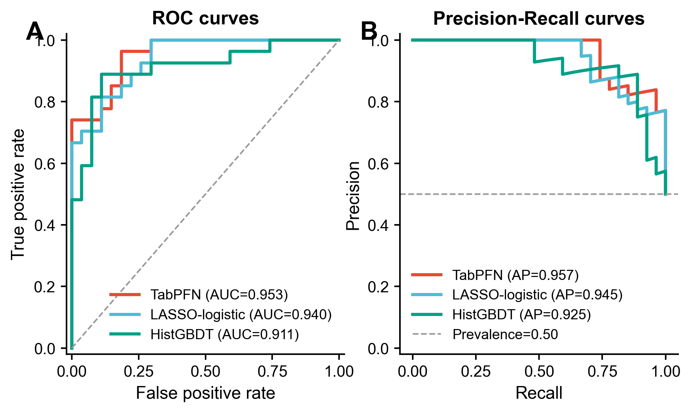
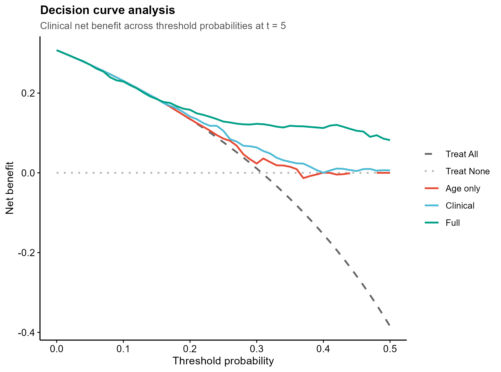

# Reusable Bioinformatics Code Library · 可复用生物信息学代码库

> **Self-contained, run-out-of-the-box R & Python modules for everyday bioinformatics.**
> Each module ships a tiny example dataset, runs from a single command, and renders
> journal-style vector figures. Copy any one of them and its `README` tells you exactly
> what data to feed in, what analysis it does, and what figures come out.
>
> **开箱即跑的 R / Python 生信分析模块库。** 每个模块自带小型示例数据,一条命令即可运行,
> 输出顶刊风格矢量图。复制走任意一个,看它的 `README` 就知道:**喂什么数据、做什么分析、出什么图**。

<p>


</p>

---

## Contents · 目录

[What you get](#what-you-get--这个库给你什么) ·
[How a module works](#how-a-module-works--一个模块怎么用) ·
[Quick start](#quick-start--快速开始) ·
[Status legend](#status-legend--状态图例) ·
[★ New in 2026](#-new-in-2026--2026-新增前沿工具30-个模块) ·
[Example figures](#example-figures--示例图) ·
[All categories](#all-categories--全部分类) ·
[Framework](#framework--共享框架) ·
[Reproducibility](#reproducibility--conventions--可复现与约定) ·
[License](#license--许可)

---

## What you get · 这个库给你什么

**EN** — A practical toolbox for dry-lab bioinformatics: ~145 modules across 23 analysis
categories (single-cell, spatial, Mendelian randomization, WGCNA, ML signatures,
docking/MD, enrichment, and more). Most run **turnkey** on bundled or synthetic example
data with no edits; the rest keep their real script + dependency notes for a server/GPU.
A shared plotting framework gives every figure the same journal-ready look, and a static
linter + quality checklist keep pipelines reproducible.

**中文** — 一套实用的干实验生信工具箱:横跨 23 个分析类别(单细胞、空间转录组、孟德尔随机化、
WGCNA 共表达、机器学习签名、对接/分子动力学、富集等)共约 145 个模块。**大多数开箱即跑**
(自带或合成的示例数据,无需改动);少数需要服务器/GPU 的也保留了真实脚本与依赖说明。
共享绘图框架让所有图保持统一的顶刊审美,静态检查器 + 质量清单保证管道可复现。

**Design principles · 设计原则**

- **Reuse, never from scratch · 复用而非从头写** — start from a real module or a real
  published tool; never hand-write analysis from memory (that invites hallucinated APIs).
  从既有模块或真实已发表工具起手,绝不凭记忆手写分析(那会产生臆造的 API)。
- **Honest baselines built in · 内置诚实基线** — every deep-learning / complex model module
  ships a simple baseline (PCA / linear / LASSO / permutation null), because in 2026 these
  often *don't* beat the baseline — the module reports both so you can judge.
  每个深度学习/复杂模型模块都配一个简单基线(PCA / 线性 / LASSO / 置换 null);2026 年这些
  方法常常**打不过**基线,模块会把两者都报出来让你判断。
- **No plain bar charts · 不用平凡条形图** — top journals rarely use them; modules default
  to lollipop / dot / dumbbell / violin / raincloud / heatmap / network.
  顶刊很少用条形图,模块默认改用棒棒糖图 / 点图 / 哑铃图 / 小提琴 / 云雨图 / 热图 / 网络图。
- **Reproducible · 可复现** — fixed seeds, relative paths only, vector PDF + 300 dpi PNG,
  environment snapshots, CI lint gate. 固定随机种子、仅用相对路径、矢量 PDF + 300dpi PNG、
  环境快照、CI 检查门。

---

## How a module works · 一个模块怎么用

Every module is a self-contained folder. 每个模块都是一个自带一切的文件夹:

```
<category>/<NNN_module>/
├── <NNN_module>.R | .py     # main script · 主脚本 (runs on example_data/ by default)
├── README.md                # input spec, method, outputs · 输入规格 / 方法 / 输出图
├── example_data/            # small synthetic input · 小型合成输入(可直接跑通)
└── assets/                  # committed preview figures · 提交进库的预览图
```

**EN** — Run it as-is to render the bundled example; point `--input` / `--outdir` at your
own data to reuse it. Open the module's `README.md` to see the exact input format, the
method (and its honest baseline), and every output figure with a preview. Run-time
outputs (`results/`) are git-ignored.

**中文** — 直接运行就出示例图;用 `--input` / `--outdir` 指向你自己的数据即可复用。打开
模块的 `README.md` 就能看到:**确切的输入格式、方法(及其诚实基线)、每一张输出图的预览**。
运行时产物(`results/`)默认被 git 忽略。

---

## Quick start · 快速开始

```bash
git clone https://github.com/fsy2004/bioinfo-reusable-code.git
cd bioinfo-reusable-code/modules

# run a module on its bundled example data · 用自带示例数据运行
Rscript 03_transcriptomics_deg/010_geo_deg_volcano_heatmap_pca/010_*.R
python  08_singlecell_spatial_trajectory/543_squidpy_spatial_statistics/543_*.py

# run on your own data · 换成你自己的数据
Rscript 03_transcriptomics_deg/010_geo_deg_volcano_heatmap_pca/010_*.R \
        --input your_matrix.csv --outdir results/run1
```

Tested with **R 4.4** and **Python 3.12**. 已在 R 4.4 / Python 3.12 下测试。
Per-module dependencies are listed in each module's `README.md`.
每个模块的依赖见其 `README.md`。

---

## Status legend · 状态图例

| Mark | Meaning · 含义 |
|------|----------------|
| ✅ | Turnkey — runs locally on bundled/synthetic data, no edits · 开箱即跑,无需改动 |
| 🟡 | Honest baseline / core runs locally; full method needs the package on a server · 本地跑诚实基线/核心,完整方法需服务器装包 |
| 🔴 | Heavy / GPU / external toolchain (GROMACS, deep-learning FMs) — reference wrapper · 重型/GPU/外部工具链,参考封装 |
| 📄 | Template — bring your own data + install · 模板,自备数据与安装 |
| 📦 | Vendored third-party package · 内置的第三方包源码 |

Full per-module index (purpose, input→output, deps, figure types) + a **figure-type → module
reverse index** live in **[`modules/CATALOG.md`](modules/CATALOG.md)**.
逐模块完整索引(用途、输入→输出、依赖、图类型)与**「图类型→模块」反查表**见
**[`modules/CATALOG.md`](modules/CATALOG.md)**。

---

## ★ New in 2026 · 2026 新增前沿工具(30 个模块)

**EN** — 30 modules wrapping **2026-H1 new methods** across seven analysis lines. Each is
grounded in the real published package, run-verified on synthetic data, and ships an
**honest simple-baseline comparison** (FMs/complex models often don't beat PCA/linear/LASSO
— the module reports the baseline). Format: **`NNN`** `package` — what it does *(its niche)* ·
output figures · status.

**中文** — 30 个模块封装 **2026 年上半年的新方法**,覆盖七条分析线。每个都接地于真实已发表的
软件包、在合成数据上跑通验证,并**内置诚实基线对照**(基础模型/复杂模型常打不过 PCA/线性/LASSO,
模块会把基线一并报出)。格式:**`编号`** `包名` — 做什么 *(工具侧重点)* · 输出图 · 状态。

### 🔬 Single-cell · 单细胞 (08, 03, 17)

- **`557`** `sccomp` — Bayesian beta-binomial differential **composition** test *（侧重组成性、防比例假阳）* · boxplot+lines · lollipop · raincloud · ✅
- **`559`** `muscat` — multi-sample **pseudobulk** differential state *（样本级聚合,2026 金标准,防伪重复)* · MDS · pathway-volcano · heatmap · lollipop · ✅
- **`558`** `miloR` — KNN-**neighbourhood** differential abundance, no clusters *（连续状态、邻域级 DA)* · beeswarm · network · volcano · 🟡
- **`560`** `copyKAT` — scRNA **copy-number / aneuploidy** calling *（inferCNV 已弃用后的替代)* · CNV heatmap · UMAP · lollipop · ✅
- **`532`** `SCpubr` — one-call **publication-grade** single-cell figures *（统一顶刊审美、色盲友好)* · UMAP · dot · alluvial · ✅

### 🗺️ Spatial transcriptomics · 空间转录组 (08, 16)

- **`541`** `BANKSY` — spatial **domain** segmentation *（自表达+邻域+方位梯度,非DL可解释)* · domain map · ARI vs baseline · UMAP · ✅
- **`542`** `nnSVG` — **spatially variable genes** (nearest-neighbour GP) *（区分空间结构 vs 单纯高变)* · spatial expr · lollipop · scatter · ✅
- **`543`** `squidpy` — **spatial statistics**: Moran / neighbourhood / Ripley *（带置换 null 基线)* · nhood heatmap · Moran lollipop · co-occurrence · ✅
- **`544`** `PASTE` — multi-slice **alignment** by optimal transport *（切片配准、3D 堆叠)* · before/after scatter · overlay · ✅
- **`545`** `SPOTlight` — spot **deconvolution** + scatterpie *（带已知比例 RMSE 校验)* · spatial scatterpie · heatmap · scatter · ✅
- **`531`** `LIANA+` — **consensus** cell-cell communication *（统一多方法、共识更稳)* · L-R dotplot · chord · tile · ✅

### 🧬 Mendelian randomization · 孟德尔随机化 (09) — *all summary-data, fully local · 全部 summary-data 纯本地*

- **`534`** `MendelianRandomization` — **MVMR-cML** constrained-ML multivariable MR *（抗相关+非相关多效性)* · forest · dumbbell · heatmap · ✅
- **`535`** `MRBEE` — bias-correcting cis / MVMR estimator *（校正测量误差偏倚)* · lollipop · forest · scatter · ✅
- **`533`** `MRcare` — **winner's-curse-free** robust MR *（内生化选择偏倚)* · lollipop · forest · scatter · 🟡
- **`536`** `MR-link-2` — single-region **cis-MR**, pleiotropy-robust *（单关联区域、控假阳)* · forest · LD heatmap · scatter · 🟡
- **`537`** `SharePro` — **effect-group colocalization** *（多因果变异共定位)* · locuscompare · dot · heatmap · 📦

### 🕸️ Co-expression networks · 共表达网络 (11)

- **`538`** `NetRep` — cross-dataset **module preservation** permutation test *（模块可重复性、外部验证)* · Zsummary scatter · lollipop · null density · ✅
- **`539`** `SmCCNet` — phenotype-driven **multi-omics sparse-CCA** network *（性状特异跨组学子网)* · network · adjacency heatmap · lollipop · ✅
- **`540`** `CWGCNA` — **causal-direction** module↔trait mediation *（回应「共表达=相关≠因果」)* · forest · network · lollipop · 🟡

### 🤖 ML & survival · 机器学习与生存 (04, 05, 12, 23)

- **`554`** `RobustRankAggreg` — **consensus** feature selection by robust rank aggregation *（稳定性>单方法)* · lollipop · rank heatmap · UpSet · ✅
- **`550`** `TabPFN` — tabular **foundation model** classifier *（小样本能打过 GBDT 的 2026 硬证据;折内防泄漏)* · ROC+PR · calibration · lollipop · ✅
- **`551`** `aorsf` — accelerated **oblique** random survival forest *（比标准 RSF 更准、对照 Cox)* · time-AUC · importance lollipop · KM · ✅
- **`552`** `survex` / `SurvSHAP(t)` — **time-dependent** survival explanation *（特征贡献随时间变化)* · SurvSHAP curve · importance · BD · ✅
- **`553`** `riskRegression` — calibration + **decision curve** + time-AUC *（Stop-Chasing-C-index:补校准与临床获益)* · calibration · DCA · time-AUC · ✅
- **`555`** `MAPIE` / `crepes` — **conformal prediction** UQ *（给签名预测统计有效的覆盖保证)* · calibration scatter · set-size violin · coverage · dumbbell · ✅

### ⚗️ Docking & MD · 分子对接与动力学 (07)

- **`547`** `ProLIF` — protein-ligand **interaction fingerprint** *（逐帧占据率、客观非主观挑残基)* · barcode · interaction heatmap · lollipop · ✅
- **`548`** `bio3d` — MD **DCCM / PCA / RMSF** ensemble analysis *（集体运动与柔性区)* · DCCM heatmap · PCA scatter · RMSF lollipop · ✅
- **`556`** `PoseBusters` — docking-pose **physical validity** gate *（>50% DL pose 物理无效→守门)* · tick heatmap · per-check lollipop · dumbbell · ✅

### 📊 Enrichment · 富集 (02)

- **`546`** `enrichplot` — dotplot / **cnetplot** / emapplot / treeplot *（代替富集条形图;cnetplot 已迁 ggtangle)* · dot · gene-concept network · module map · tree · ✅
- **`549`** `GOplot` — **chord / circle** enrichment figures *（基因-通路多对多关系)* · GOChord · GOCircle · GOHeat · ✅

> Background, dated sources, and "does it beat PCA/linear?" notes for these 2026 tools are
> compiled in the companion knowledge base (`bioinfo-DL-library/analysis-tools-2026/`).
> 这些 2026 工具的背景、发表年月与「打不打得过基线」的提醒,汇编在配套知识库
> `bioinfo-DL-library/analysis-tools-2026/`。

---

## Example figures · 示例图

Rendered directly from bundled/synthetic example data · 直接由自带/合成示例数据渲染:

| DE volcano · 差异火山 | scRNA UMAP · 单细胞 | MR scatter · 孟德尔随机化 |
|:---:|:---:|:---:|
|  |  |  |

| Spatial domains · 空间域 (BANKSY) | Composition · 组成 (sccomp) | Enrichment network · 富集网络 (cnetplot) |
|:---:|:---:|:---:|
|  |  |  |

| Spatial niche · 空间邻域 (squidpy) | Diagnostic ROC · 诊断 (TabPFN) | Decision curve · 决策曲线 (riskRegression) |
|:---:|:---:|:---:|
|  |  |  |

---

## All categories · 全部分类

| # | Category · 类别 | Typical output · 典型输出 |
|---|-----------------|---------------------------|
| 01 | Network pharmacology & target DBs · 网络药理与靶点库 | Venn, UpSet, target tables |
| 02 | GO / KEGG enrichment · 富集 | dot, cnetplot, emapplot, chord |
| 03 | Transcriptomics & DE · 转录组与差异表达 | volcano, heatmap, PCA, pseudobulk DS |
| 04 | ML feature selection · 机器学习特征选择 | LASSO, RF, SHAP, consensus, UpSet |
| 05 | Diagnostic models · 诊断模型 | ROC, calibration, DCA, nomogram, TabPFN |
| 06 | Immune infiltration · 免疫浸润 | composition, boxplot, deconvolution |
| 07 | Docking & MD · 对接与分子动力学 | interaction fingerprint, DCCM, PoseBusters |
| 08 | Single-cell / spatial / trajectory · 单细胞/空间/轨迹 | UMAP, dotplot, BANKSY domains, sccomp, copyKAT |
| 09 | Mendelian randomization & GWAS · 孟德尔随机化 | scatter, forest, MVMR-cML, MRBEE, coloc |
| 10 | TWAS (single-cell eQTL) · 单细胞 eQTL 权重 | weight tables |
| 11 | WGCNA co-expression · 共表达网络 | module-trait heatmap, NetRep, SmCCNet |
| 12 | TCGA prognosis · 预后 | KM, time-ROC, aorsf, SurvSHAP, DCA |
| 13 | TF regulation / circos · 转录因子调控 | chromosome circos, regulon network |
| 14 | Single-cell in-silico perturbation · 虚拟扰动 | gene-knockout effects, Geneformer |
| 15 | Drug perturbation / repurposing · 药物扰动 | pharmacovigilance, beyondcell |
| 16 | Spatial communication / fate · 空间通讯与命运 | CellRank, niche, LIANA+, PASTE, SPOTlight |
| 17 | Advanced result figures · 高级结果图 | raincloud, ridgeline, dumbbell, chord |
| 18 | External method sources · 外部方法源 | manifest only |
| 19 | Multi-omics integration · 多组学整合 | MOFA, consensus clustering |
| 20 | Mutation / CNV / methylation / proteome · 变异/甲基化/蛋白组 | oncoprint, volcano, heatmap |
| 21 | Disease burden (GBD / NHANES / CHARLS) · 疾病负担 | ASR/EAPC, survey-weighted, comorbidity network |
| 22 | Single-cell metabolism · 单细胞代谢 | metabolic pathway activity |
| 23 | Uncertainty & conformal prediction · 不确定性与共形预测 | coverage, calibration, prediction-set size |

Categories 10, 14, parts of 07/16 need heavy/GPU toolchains (FUSION, GROMACS, DL FMs);
their scripts + dependency notes are kept for reference. Modules marked 🟡 run a real
**baseline/core** locally and need the full package on a server — see
[`modules/_framework/SERVER_DEPENDENCIES.md`](modules/_framework/SERVER_DEPENDENCIES.md).
类别 10、14 及 07/16 的部分需要重型/GPU 工具链;🟡 模块本地跑真实基线/核心,完整方法需服务器装包,
详见 [`SERVER_DEPENDENCIES.md`](modules/_framework/SERVER_DEPENDENCIES.md)。

---

## Framework · 共享框架 (`modules/_framework/`)

Shared by all modules so figures and I/O stay consistent · 所有模块共用,保证图与 I/O 一致:

- **`theme_pub.R` / `pubstyle.py`** — Nature-aligned theme; journal palettes (NPG / AAAS /
  Lancet + colour-blind-safe **Okabe-Ito**), viridis for continuous, RdBu for diverging;
  `save_fig()` exports vector PDF + 300 dpi PNG. 顶刊主题与配色,一次导出矢量 PDF + 300dpi PNG。
- **`CONVENTIONS.md`** — module layout, turnkey rules, figure rules · 模块结构、开箱即跑、绘图规范。
- **`ANALYSIS_TEMPLATE/`** — scaffold for a new multi-step project (central config, seed,
  checkpointed steps, env snapshot; R + Python) · 新项目脚手架。
- **`QUALITY_CHECKLIST.md`** — pre/in/post-analysis checklist · 分析前/中/后质量清单。
- **`qc_lint.py`** — static checks for hard-coded paths, missing seeds, non-vector exports,
  missing env snapshots; also a CI gate · 静态检查 + CI 门。
- **`TOOL_SELECTION_GUIDE.md`** — pick the right module/tool for a task · 任务→模块/工具选择指南。

---

## Reproducibility · 可复现与约定

- Modules run on bundled example data with no edits; use `--input` / `--outdir` to switch.
  模块用自带示例数据零改动即跑;用 `--input` / `--outdir` 切换。
- No absolute paths or `setwd()`; figures exported as vector PDF + 300 dpi PNG.
  不用绝对路径或 `setwd()`;图导出为矢量 PDF + 300dpi PNG。
- Fixed seeds; honest baselines reported alongside complex models; figure text in English,
  code comments bilingual. 固定随机种子;复杂模型旁报诚实基线;图中文字英文、代码注释中文。
- Reuse the framework instead of re-implementing themes or I/O.
  复用框架而非重写主题与 I/O。

---

## License · 许可

Each module follows the license of the tools and methods it uses. Vendored third-party code
keeps its original license — see the relevant module `README` and upstream repository.
每个模块遵循其所用工具与方法的许可。内置的第三方代码保留其原始许可,详见对应模块 `README`
与上游仓库。
