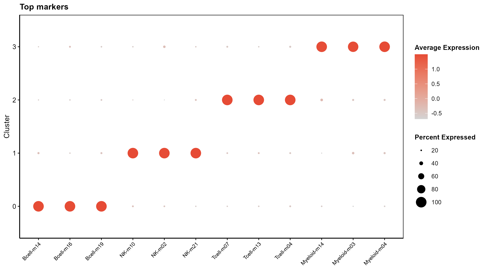
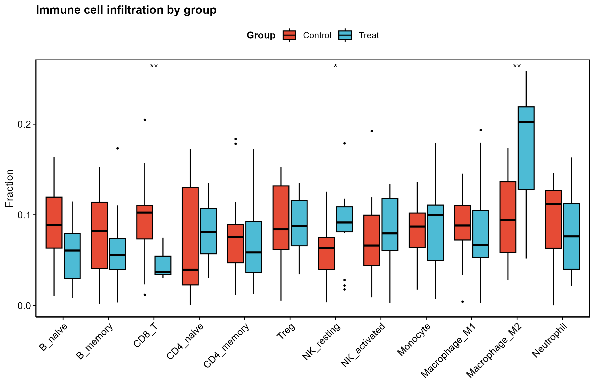

<div align="center">

# 🧬 生物信息学可复用代码库
### Reusable Bioinformatics Code Library

**放入数据 → 一条命令 → 输出顶刊级图**
*Drop in your data → one command → publication-grade figures*

涵盖 网络药理学 · 富集分析 · 转录组差异 · 机器学习 · 诊断/预后模型 · 免疫浸润 · 分子对接 · 单细胞/空间 · 孟德尔随机化 · WGCNA · 分子分型 · 药物警戒 等 21 大类


</div>

---

## ✨ 这个库有什么不一样

| | |
|---|---|
| 🎯 **Turnkey 零改动** | 每个模块自带小示例数据,`Rscript 模块.R` 一条命令直接出图,不用改路径 |
| 🎨 **顶刊级图** | 统一 `theme_pub` 期刊主题(NPG/Lancet 配色 + viridis)· 矢量 PDF + 300dpi PNG · 信息密度高 |
| 📖 **逐模块文档** | 每个模块 README 讲清 ①输入数据 ②方法原理 ③用途 ④亮点 ⑤输出图(配真图) |
| 🧩 **统一框架** | `_framework/` 提供主题、配色、存图、零依赖 Venn、命令行参数等可复用工具 |
| 🔬 **科学严谨** | 只用成熟工具/库,不臆造;只标准化 I/O + 升级美化 + 文档,**不改动原有分析逻辑** |

---

## 🖼️ 图廊 Gallery

> 以下均为**真实运行示例数据渲染**的输出图(非示意图)。

| 差异分析 · 火山图 | SHAP 模型解释 · 蜂群图 | 单细胞 · marker 点图 |
|:---:|:---:|:---:|
|  |  |  |
| **预后 · KM 生存曲线** | **WGCNA · 模块-性状热图** | **基因组 · 染色体圈图** |
|  |  |  |
| **孟德尔随机化 · 散点图** | **免疫浸润 · 分组箱线** | **网络药理 · 桑基冲积图** |
|  |  |  |

---

## 🚀 快速开始 Quick Start

```bash
# 1) 克隆
git clone https://github.com/fsy2004/bioinfo-reusable-code.git
cd bioinfo-reusable-code/按分析用途分类

# 2) 直接跑示例(每个模块都自带小样例数据,零改动出图)
Rscript 03_GEO转录组整理与差异分析/010_GEO差异分析_火山热图PCA/010_*.R
#   → 在该模块 results/ 与 assets/ 下生成火山图 / 热图 / PCA

# 3) 换成你自己的数据
Rscript 03_GEO转录组整理与差异分析/010_GEO差异分析_火山热图PCA/010_*.R \
        --input 你的表达矩阵.csv --outdir 你的结果目录
```

> 输入数据规格、必需列、示例,见每个模块文件夹下的 `README.md`。

---

## 📂 模块目录 Catalog

> ✅ = turnkey 旗舰(自带示例 + 真图 + 文档) · 📦 = 上游引擎/数据前处理 · ⏭️ = 需重型/外部环境(深度学习/专用工具链,保留脚本作参考)

| # | 类别 | turnkey 模块 | 典型输出图 |
|:--:|------|------|------|
| 01 | [网络药理学与靶点](按分析用途分类/01_网络药理学与靶点数据库/) | ✅ 001-006 011 | Venn · UpSet · 靶点表 |
| 02 | [GO/KEGG 富集](按分析用途分类/02_GO_KEGG富集分析/) | ✅ 007 | 气泡 · 柱状 · 通路网络 |
| 03 | [GEO 转录组差异](按分析用途分类/03_GEO转录组整理与差异分析/) | ✅ 008 009 010 056 | 火山 · 热图 · PCA · 批次校正 |
| 04 | [机器学习特征筛选](按分析用途分类/04_机器学习筛选特征基因/) | ✅ 012-015 034 035 052 | LASSO · RF · SVM-RFE · **SHAP** · AUC 热图 |
| 05 | [诊断模型与验证](按分析用途分类/05_诊断模型与验证/) | ✅ 016 063 | ROC · 校准 · DCA · 列线图 |
| 06 | [免疫浸润可视化](按分析用途分类/06_免疫浸润与免疫可视化/) | ✅ 021 · 📦 017-020 | 堆叠组成 · 分组箱线 · 相关热图 |
| 07 | [分子对接](按分析用途分类/07_分子对接与结合能可视化/) | ✅ 022 · ⏭️ 086 | 结合能热图 · 气泡 |
| 08 | [单细胞/空间/轨迹](按分析用途分类/08_单细胞_空间转录组_细胞轨迹/) | ✅ 046 旗舰 · ⏭️ 多个 | UMAP · 点图 · marker 热图 · 小提琴 |
| 09 | [孟德尔随机化](按分析用途分类/09_孟德尔随机化_GWAS处理/) | ✅ 032 · 📦 028-031 | MR 散点 · 森林 · 漏斗 · 留一 |
| 10 | [TWAS / eQTL 权重](按分析用途分类/10_TWAS_单细胞eQTL权重/) | ⏭️ FUSION | — |
| 11 | [WGCNA 共表达](按分析用途分类/11_WGCNA共表达网络/) | ✅ 054 | 软阈值 · 模块树 · 模块-性状热图 |
| 12 | [TCGA 预后生存](按分析用途分类/12_TCGA_肿瘤预后生存_仅参考/) | ✅ 048 057 060 | KM · 时间ROC · 风险图 · 蝴蝶图 |
| 13 | [转录因子/圈图](按分析用途分类/13_转录因子调控_基因组圈图/) | ✅ 053 · ⏭️ 047 081 | 染色体圈图 |
| 14 | [单细胞虚拟扰动](按分析用途分类/14_单细胞虚拟扰动_扰动数据库/) | ⏭️ GEARS/CellOracle | — |
| 15 | [药物扰动/重定位](按分析用途分类/15_药物扰动_药物重定位/) | ✅ 078 · ⏭️ 070 071 | 药物警戒 ROR 森林 · 信号热图 |
| 16 | [空间通讯/细胞命运](按分析用途分类/16_空间通讯_细胞命运/) | ⏭️ CellRank/Tangram | — |
| 17 | [高级结果图](按分析用途分类/17_高级结果图与闭环可视化/) | ✅ 498 | 桑基/冲积图 |
| 19 | [多组学整合/分型](按分析用途分类/19_多组学整合_分型模板/) | ✅ 084 · ⏭️ 083 | 共识矩阵 · 分型热图 |
| 20 | [突变/甲基化/蛋白/代谢](按分析用途分类/20_突变_CNV_甲基化_蛋白组_代谢组模板/) | 📄 5 个模板 | oncoprint · 火山 · 热图 |
| 21 | [疾病负担 GBD/NHANES/CHARLS](按分析用途分类/21_疾病负担_共病_GBD_NHANES_CHARLS/) | 📄 外部源码/规范 | — |
| 18 | [AI 科学示意图](按分析用途分类/18_外部方法源码_待整合/) | 📄 外部工具索引 | — |

---

## 🧩 统一框架 `_framework/`

所有模块共享 [`_framework/theme_pub.R`](按分析用途分类/_framework/theme_pub.R),提供:

- **`theme_pub()`** — Nature/Cell 风格 ggplot 主题(干净、黑轴、合适字号)
- **`pal_pub(n, "npg"/"lancet"/...)`** — 期刊离散配色;连续色用 viridis
- **`save_fig()`** — 一次导出矢量 **PDF + 300dpi PNG**
- **`venn_pub()`** — **零依赖** 的期刊级 Venn(2-3 集,免装 eulerr/VennDiagram)
- **`bio_args()` / `bio_script_dir()` / `read_table_smart()`** — 命令行参数、路径自适应、智能读表

Python 模块共享 [`_framework/pubstyle.py`](按分析用途分类/_framework/pubstyle.py)(matplotlib 期刊 rcParams + 配色)。
完整约定见 [`_framework/CONVENTIONS.md`](按分析用途分类/_framework/CONVENTIONS.md)。

---

## 📐 设计原则

1. **不破坏科学价值** — 只标准化输入输出、升级图形美化、补全文档;**原有分析逻辑原样保留**。
2. **能用现成工具就用** — 优先成熟 R/Python 库,不重复造轮子、不臆造方法。
3. **示例数据小而快** — 每个模块的 `example_data/` 仅用于"零改动跑通 + 出图",刻意做小(数十基因/数十样本)。
4. **重型方法诚实标注** — 需 GPU 深度学习、外部工具链(GROMACS/FUSION)或 GB 级数据库的模块标 `⏭️`,保留原脚本与依赖说明,不强行本地渲染。

---

## 📄 许可 License

各模块沿用其所用工具/方法的原始许可;库内整理代码供学习与科研复用。外部第三方源码(18 类、497 等)仅保留 manifest 指针与原 LICENSE,请前往其官方仓库获取完整代码。

<div align="center">

**输入数据 → 一条命令 → 顶刊级图。** 让每一次生信分析都省心、好看、可复现。

</div>
