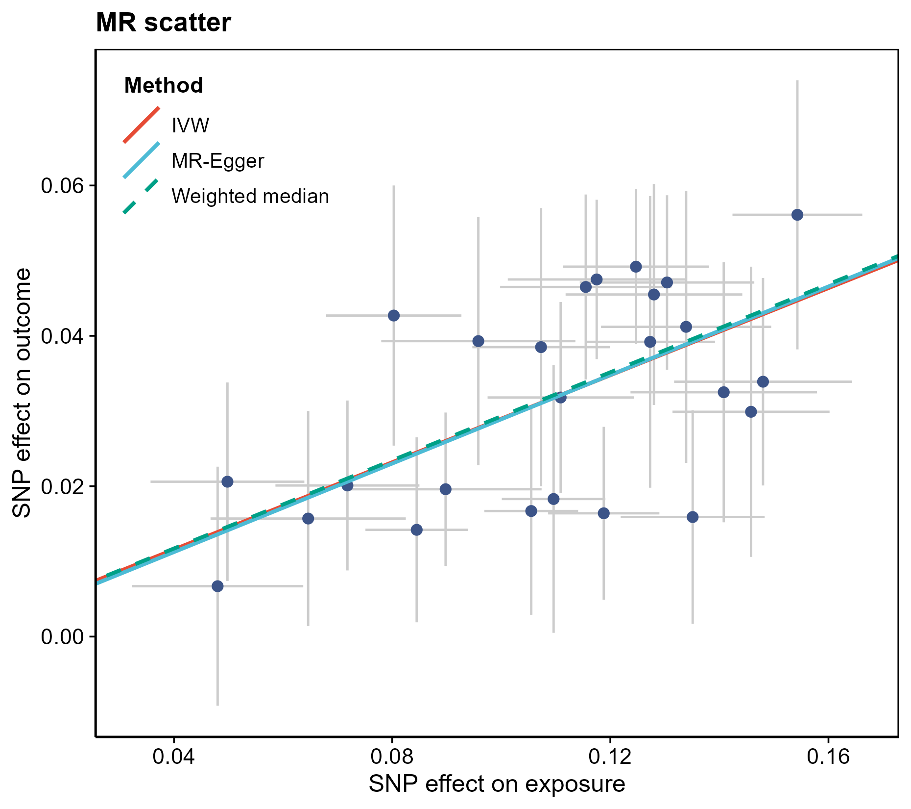
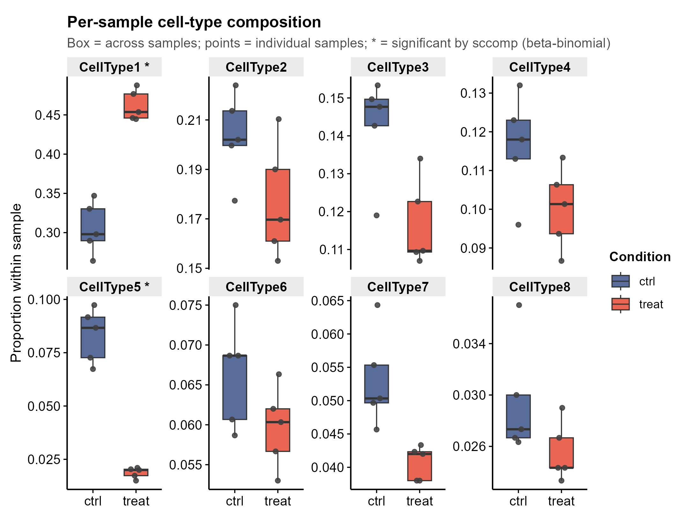

# Reusable Bioinformatics Code Library · 可复用生物信息学代码库

> **Self-contained, run-out-of-the-box R & Python modules for everyday bioinformatics.**
> Each module ships a tiny example dataset, runs from a single command, and renders
> journal-style vector figures. Copy any one of them and its `README` tells you exactly
> what data to feed in, what analysis it does, and what figures come out.
>
> **开箱即跑的 R / Python 生信分析模块库。** 每个模块自带小型示例数据,一条命令即可运行,
> 输出顶刊风格矢量图。复制走任意一个,看它的 `README` 就知道:**喂什么数据、做什么分析、出什么图**。

<p>


</p>

---

## Contents · 目录

[What you get](#what-you-get--这个库给你什么) ·
[How a module works](#how-a-module-works--一个模块怎么用) ·
[Quick start](#quick-start--快速开始) ·
[Status legend](#status-legend--状态图例) ·
[★ New in 2026](#-new-in-2026--2026-新增前沿工具30-个模块) ·
[★ Source-grounded batch](#-source-grounded-batch--源码接地的一批36-个模块561596) ·
[Example figures](#example-figures--示例图) ·
[All categories](#all-categories--全部分类) ·
[Framework](#framework--共享框架) ·
[Reproducibility](#reproducibility--conventions--可复现与约定) ·
[License](#license--许可)

---

## What you get · 这个库给你什么

**EN** — A practical toolbox for dry-lab bioinformatics: 196 modules across 10 domains and 53 subcategories (single-cell, spatial, Mendelian randomization, WGCNA, ML signatures,
docking/MD, enrichment, and more). Most run **turnkey** on bundled or synthetic example
data with no edits; the rest keep their real script + dependency notes for a server/GPU.
A shared plotting framework gives every figure the same journal-ready look, and a static
linter + quality checklist keep pipelines reproducible.

**中文** — 一套实用的干实验生信工具箱:横跨 10 个域、53 个子类(单细胞、空间转录组、虚拟扰动、因果推断与遗传、机器学习、
Bulk 组学、临床转化、结构与药物设计、网络药理、可视化)共 196 个模块。**大多数开箱即跑**
(自带或合成的示例数据,无需改动);少数需要服务器/GPU 的也保留了真实脚本与依赖说明。
共享绘图框架让所有图保持统一的顶刊审美,静态检查器 + 质量清单保证管道可复现。

**Design principles · 设计原则**

- **Reuse, never from scratch · 复用而非从头写** — start from a real module or a real
  published tool; never hand-write analysis from memory (that invites hallucinated APIs).
  从既有模块或真实已发表工具起手,绝不凭记忆手写分析(那会产生臆造的 API)。
- **Honest baselines built in · 内置诚实基线** — every deep-learning / complex model module
  ships a simple baseline (PCA / linear / LASSO / permutation null), because in 2026 these
  often *don't* beat the baseline — the module reports both so you can judge.
  每个深度学习/复杂模型模块都配一个简单基线(PCA / 线性 / LASSO / 置换 null);2026 年这些
  方法常常**打不过**基线,模块会把两者都报出来让你判断。
- **No plain bar charts · 不用平凡条形图** — top journals rarely use them; modules default
  to lollipop / dot / dumbbell / violin / raincloud / heatmap / network.
  顶刊很少用条形图,模块默认改用棒棒糖图 / 点图 / 哑铃图 / 小提琴 / 云雨图 / 热图 / 网络图。
- **Reproducible · 可复现** — fixed seeds, relative paths only, vector PDF + 300 dpi PNG,
  environment snapshots, CI lint gate. 固定随机种子、仅用相对路径、矢量 PDF + 300dpi PNG、
  环境快照、CI 检查门。

---

## How a module works · 一个模块怎么用

Every module is a self-contained folder. 每个模块都是一个自带一切的文件夹:

```
<category>/<NNN_module>/
├── <NNN_module>.R | .py     # main script · 主脚本 (runs on example_data/ by default)
├── README.md                # input spec, method, outputs · 输入规格 / 方法 / 输出图
├── example_data/            # small synthetic input · 小型合成输入(可直接跑通)
└── assets/                  # committed preview figures · 提交进库的预览图
```

**EN** — Run it as-is to render the bundled example; point `--input` / `--outdir` at your
own data to reuse it. Open the module's `README.md` to see the exact input format, the
method (and its honest baseline), and every output figure with a preview. Run-time
outputs (`results/`) are git-ignored.

**中文** — 直接运行就出示例图;用 `--input` / `--outdir` 指向你自己的数据即可复用。打开
模块的 `README.md` 就能看到:**确切的输入格式、方法(及其诚实基线)、每一张输出图的预览**。
运行时产物(`results/`)默认被 git 忽略。

---

## Quick start · 快速开始

```bash
git clone https://github.com/fsy2004/bioinfo-reusable-code.git
cd bioinfo-reusable-code/modules

# run a module on its bundled example data · 用自带示例数据运行
Rscript 06_bulk_omics/01_differential_expression/010_geo_deg_volcano_heatmap_pca/010_*.R
python  02_spatial_transcriptomics/02_domains_svg_stats/543_squidpy_spatial_statistics/543_*.py

# run on your own data · 换成你自己的数据
Rscript 06_bulk_omics/01_differential_expression/010_geo_deg_volcano_heatmap_pca/010_*.R \
        --input your_matrix.csv --outdir results/run1
```

Tested with **R 4.4** and **Python 3.12**. 已在 R 4.4 / Python 3.12 下测试。
Per-module dependencies are listed in each module's `README.md`.
每个模块的依赖见其 `README.md`。

---

## Status legend · 状态图例

| Mark | Meaning · 含义 |
|------|----------------|
| ✅ | Turnkey — runs locally on bundled/synthetic data, no edits · 开箱即跑,无需改动 |
| 🟡 | Honest baseline / core runs locally; full method needs the package on a server · 本地跑诚实基线/核心,完整方法需服务器装包 |
| 🔴 | Heavy / GPU / external toolchain (GROMACS, deep-learning FMs) — reference wrapper · 重型/GPU/外部工具链,参考封装 |
| 📄 | Template — bring your own data + install · 模板,自备数据与安装 |
| 📦 | Vendored third-party package · 内置的第三方包源码 |

Full per-module index (purpose, input→output, deps, figure types) + a **figure-type → module
reverse index** live in **[`modules/CATALOG.md`](modules/CATALOG.md)**.
逐模块完整索引(用途、输入→输出、依赖、图类型)与**「图类型→模块」反查表**见
**[`modules/CATALOG.md`](modules/CATALOG.md)**。

---

## ★ New in 2026 · 2026 新增前沿工具(30 个模块)

**EN** — 30 modules wrapping **2026-H1 new methods** across seven analysis lines. Each is
grounded in the real published package, run-verified on synthetic data, and ships an
**honest simple-baseline comparison** (FMs/complex models often don't beat PCA/linear/LASSO
— the module reports the baseline). Format: **`NNN`** `package` — what it does *(its niche)* ·
output figures · status.

**中文** — 30 个模块封装 **2026 年上半年的新方法**,覆盖七条分析线。每个都接地于真实已发表的
软件包、在合成数据上跑通验证,并**内置诚实基线对照**(基础模型/复杂模型常打不过 PCA/线性/LASSO,
模块会把基线一并报出)。格式:**`编号`** `包名` — 做什么 *(工具侧重点)* · 输出图 · 状态。

### 🔬 Single-cell · 单细胞 (08, 03, 17)

- **`557`** `sccomp` — Bayesian beta-binomial differential **composition** test *（侧重组成性、防比例假阳）* · boxplot+lines · lollipop · raincloud · ✅
- **`559`** `muscat` — multi-sample **pseudobulk** differential state *（样本级聚合,2026 金标准,防伪重复)* · MDS · pathway-volcano · heatmap · lollipop · ✅
- **`558`** `miloR` — KNN-**neighbourhood** differential abundance, no clusters *（连续状态、邻域级 DA)* · beeswarm · network · volcano · 🟡
- **`560`** `copyKAT` — scRNA **copy-number / aneuploidy** calling *（inferCNV 已弃用后的替代)* · CNV heatmap · UMAP · lollipop · ✅
- **`532`** `SCpubr` — one-call **publication-grade** single-cell figures *（统一顶刊审美、色盲友好)* · UMAP · dot · alluvial · ✅

### 🗺️ Spatial transcriptomics · 空间转录组 (08, 16)

- **`541`** `BANKSY` — spatial **domain** segmentation *（自表达+邻域+方位梯度,非DL可解释)* · domain map · ARI vs baseline · UMAP · ✅
- **`542`** `nnSVG` — **spatially variable genes** (nearest-neighbour GP) *（区分空间结构 vs 单纯高变)* · spatial expr · lollipop · scatter · ✅
- **`543`** `squidpy` — **spatial statistics**: Moran / neighbourhood / Ripley *（带置换 null 基线)* · nhood heatmap · Moran lollipop · co-occurrence · ✅
- **`544`** `PASTE` — multi-slice **alignment** by optimal transport *（切片配准、3D 堆叠)* · before/after scatter · overlay · ✅
- **`545`** `SPOTlight` — spot **deconvolution** + scatterpie *（带已知比例 RMSE 校验)* · spatial scatterpie · heatmap · scatter · ✅
- **`531`** `LIANA+` — **consensus** cell-cell communication *（统一多方法、共识更稳)* · L-R dotplot · chord · tile · ✅

### 🧬 Mendelian randomization · 孟德尔随机化 (09) — *all summary-data, fully local · 全部 summary-data 纯本地*

- **`534`** `MendelianRandomization` — **MVMR-cML** constrained-ML multivariable MR *（抗相关+非相关多效性)* · forest · dumbbell · heatmap · ✅
- **`535`** `MRBEE` — bias-correcting cis / MVMR estimator *（校正测量误差偏倚)* · lollipop · forest · scatter · ✅
- **`533`** `MRcare` — **winner's-curse-free** robust MR *（内生化选择偏倚)* · lollipop · forest · scatter · 🟡
- **`536`** `MR-link-2` — single-region **cis-MR**, pleiotropy-robust *（单关联区域、控假阳)* · forest · LD heatmap · scatter · 🟡
- **`537`** `SharePro` — **effect-group colocalization** *（多因果变异共定位)* · locuscompare · dot · heatmap · 📦

### 🕸️ Co-expression networks · 共表达网络 (11)

- **`538`** `NetRep` — cross-dataset **module preservation** permutation test *（模块可重复性、外部验证)* · Zsummary scatter · lollipop · null density · ✅
- **`539`** `SmCCNet` — phenotype-driven **multi-omics sparse-CCA** network *（性状特异跨组学子网)* · network · adjacency heatmap · lollipop · ✅
- **`540`** `CWGCNA` — **causal-direction** module↔trait mediation *（回应「共表达=相关≠因果」)* · forest · network · lollipop · 🟡

### 🤖 ML & survival · 机器学习与生存 (04, 05, 12, 23)

- **`554`** `RobustRankAggreg` — **consensus** feature selection by robust rank aggregation *（稳定性>单方法)* · lollipop · rank heatmap · UpSet · ✅
- **`550`** `TabPFN` — tabular **foundation model** classifier *（小样本能打过 GBDT 的 2026 硬证据;折内防泄漏)* · ROC+PR · calibration · lollipop · ✅
- **`551`** `aorsf` — accelerated **oblique** random survival forest *（比标准 RSF 更准、对照 Cox)* · time-AUC · importance lollipop · KM · ✅
- **`552`** `survex` / `SurvSHAP(t)` — **time-dependent** survival explanation *（特征贡献随时间变化)* · SurvSHAP curve · importance · BD · ✅
- **`553`** `riskRegression` — calibration + **decision curve** + time-AUC *（Stop-Chasing-C-index:补校准与临床获益)* · calibration · DCA · time-AUC · ✅
- **`555`** `MAPIE` / `crepes` — **conformal prediction** UQ *（给签名预测统计有效的覆盖保证)* · calibration scatter · set-size violin · coverage · dumbbell · ✅

### ⚗️ Docking & MD · 分子对接与动力学 (07)

- **`547`** `ProLIF` — protein-ligand **interaction fingerprint** *（逐帧占据率、客观非主观挑残基)* · barcode · interaction heatmap · lollipop · ✅
- **`548`** `bio3d` — MD **DCCM / PCA / RMSF** ensemble analysis *（集体运动与柔性区)* · DCCM heatmap · PCA scatter · RMSF lollipop · ✅
- **`556`** `PoseBusters` — docking-pose **physical validity** gate *（>50% DL pose 物理无效→守门)* · tick heatmap · per-check lollipop · dumbbell · ✅

### 📊 Enrichment · 富集 (02)

- **`546`** `enrichplot` — dotplot / **cnetplot** / emapplot / treeplot *（代替富集条形图;cnetplot 已迁 ggtangle)* · dot · gene-concept network · module map · tree · ✅
- **`549`** `GOplot` — **chord / circle** enrichment figures *（基因-通路多对多关系)* · GOChord · GOCircle · GOHeat · ✅

> Background, dated sources, and "does it beat PCA/linear?" notes for these 2026 tools are
> compiled in the companion knowledge base (`bioinfo-DL-library/analysis-tools-2026/`).
> 这些 2026 工具的背景、发表年月与「打不打得过基线」的提醒,汇编在配套知识库
> `bioinfo-DL-library/analysis-tools-2026/`。

---

## ★ Source-grounded batch · 源码接地的一批(36 个模块,561–596)

**EN** — 36 modules wrapping 2025-2026 methods from *Cell*, *Nature Methods*, *Nature
Biotechnology*, *Genome Biology* and *Nature Communications*. What is different about this
batch is how it was built: each upstream repository was **fetched locally**, and every call
a module makes is traced to a **file and symbol in that source** — not to the upstream
README. A second agent then independently re-checked all 674 of those traces.

That pass caught two fabrications a README read would never surface: `582` had the D-SPIN
hyperparameters as `lam_l1_j` / `lam_l1_interaction` (the real names are `lambda_l1_j`,
`dspin/dspin.py:251`, and `lambda_l1_interaction`, `:493`), and `586` claimed a return
annotation on upstream's `Custom.__call__` that the source does not carry — while labelling
it "read from source". It also fixed non-API defects: a crash on the counts-only path in
`562`, a summary field in `563` asserting a geometry reference the code never uses, and
several README claims about upstream (pretraining scale, whether a repo ships tutorials,
where weights live) that the source contradicts.

All 31 PMIDs were verified against PubMed. Where no peer-reviewed paper could be found, the
module says so instead of inventing one. Every module ships a baseline that runs on
already-installed packages, so a result never depends on the heavy upstream install.

**中文** — 36 个模块封装 2025–2026 的新方法。这批的不同之处在**怎么建的**:36 个上游仓库
**全部拉到本地**,模块里每一个上游调用都要能**指到源码的文件与符号**(不是 README),
再由另一个 agent 独立复核这 674 条溯源。

复核抓到两处读 README 绝不可能发现的编造:`582` 把 D-SPIN 超参写成 `lam_l1_j` /
`lam_l1_interaction`(真名是 `lambda_l1_j`,`dspin/dspin.py:251`;`lambda_l1_interaction`,`:493`),
`586` 给上游 `Custom.__call__` 编了个源码里没有的返回注解、还标注"读自源码"。
同时改掉了非 API 的真问题:`562` 在 counts-only 路径直接崩溃、`563` 的 summary 里写了一条
代码从未使用的几何参照断言,以及若干与源码矛盾的 README 陈述(预训练规模、仓库有没有
tutorials、权重放在哪)。

31 个 PMID 全部对 PubMed 核实过;查不到经同行评审论文的,模块里如实写明,不编。
每个模块都带一条用本机已有依赖就能跑的基线,出结果不依赖上游重型安装。

### 🔬 Single-cell · 单细胞

- **`562`** `mixhvg` — 混合多种 HVG 打分方法(按秩取max)选高变基因,自带 Seurat vst 基线 + ground-truth recall / ARI / silhouette 评测 · 🟡
- **`563`** `CONCORD` — 多批次单细胞整合模块:3 个本机可跑基线(PCA/批次中心化/ComBat+PCA)+ 守卫式 CONCORD 接口,用「批次混合熵 / 生物保真(kNN纯度+ARI/NMI) · 🟡
- **`564`** `scExtract` — 多批次 scRNA 整合评测:以「批次混合熵 × 细胞类型 kNN 保真度 × 稀有类型保真度」双轴对比未校正 PCA / ComBat(/Harmony),并守卫式封装 sc · 🟡
- **`565`** `scMultiBench` — 把 scMultiBench 的 scIB 评测层封装成模块:给任意整合 embedding 打生物保留/批次校正/综合分,强制与朴素 PCA 基线对比,出热图+权衡散点+lo · 🟡
- **`566`** `Φ-Space` — PhiSpace 连续表型软注释：把 query 细胞投影到参考类型张成的表型空间，给出每细胞×每类型的连续得分而非硬标签 · 🟡
- **`567`** `GLIMES` — 多供体单细胞原始 UMI 计数上的 Poisson-GLMM(供体随机截距)差异表达,与朴素细胞级 t 检验、pseudobulk 两条基线同台对比,量化供体伪重复造成的一类错 · 🟡
- **`568`** `scPRINT` — scPRINT 单细胞基础模型三任务(GRN 推断 / 去噪 / 细胞嵌入与标签预测)的本机可跑朴素基线 + 守卫式官方 API 封装,评估口径逐条对齐上游源码 · 🟡
- **`569`** `Nicheformer` — Nicheformer(单细胞+空间联合预训练基础模型)守卫式封装 + 本机可跑的线性对照基线:比较 intrinsic 表达 PCA 与 niche-aware(⊕空间 kN · ✅
- **`570`** `EpiAgent` — scATAC 细胞×cCRE 矩阵 → TF-IDF+SVD(LSI) 基线做嵌入/聚类/细胞类型预测/填补/批次混合评估,并守卫式封装 EpiAgent 基础模型路径(仅环境 · 🟡
- **`571`** `CAPTAIN` — 配对 CITE-seq「RNA→表面蛋白」填补基准台：matched-gene 与 PCA+Ridge 两条防泄漏基线 + CAPTAIN 本体守卫式探测（含 Drive 占位 · 🟡
- **`572`** `CellVQ` — 离散「细胞词表」(VQ codebook)单细胞表征模块：PCA+k-means 码本基线量化离散化的信息损失/码本坍缩/重构 R²，并对官方 CellVQ 提供逐符号核实过的 · 🟡

### 🗺️ Spatial · 空间转录组

- **`573`** `proseg` — 成像空间转录组转录本点云的细胞分割:自带「最近核外扩」可跑基线(半径扫描 + recall/precision/ambient-leak/ARI 评分),Proseg 本体为 · 🟡
- **`574`** `STAIR` — 多切片空间转录组整合模块：本机可跑的三级整合阶梯基线（PCA / ComBat+PCA / 空间平滑+ComBat+PCA，scIB 式双轴评分），外加签名逐行核对自上游源码的 · 🟡
- **`575`** `SCALE` — 空间组学多尺度空间域识别:空间平滑×Leiden分辨率网格上的跨种子稳定性搜索(朴素基线)+ SCALE 上游守卫式封装,含无空间信息对照 · 🟡
- **`576`** `CellNEST` — 空间转录组细胞通讯:空间受限 LR 共表达乘积基线(本机 CPU 即跑)+ CellNEST(GATv2 图注意力)守卫式封装,输出与 CellNEST 官方 9 列 sche · 🟡
- **`577`** `SPIDER` — 在相邻 spot 之间构建 interface(容量约束 Delaunay 图),对配体-受体对做 interface 层面 Moran's I 置换检验找空间可变互作(SVI · 🟡
- **`578`** `SpatialEx` — 用 H&E 形态学做锚,把一张切片测到的组学 panel 跨切片翻译到另一张切片(SpatialEx/SpatialEx+ 的 panel 对角整合),自带 Ridge+空间平 · 🟡
- **`579`** `SIMO` — — 把无空间坐标的单细胞多组学(scRNA + 非转录组模态)通过最优传输概率性映射到空间转录组切片 · 🟡
- **`580`** `Novae` — 多切片空间转录组的空间域/niche 划分与跨切片可迁移性评估 · 🟡

### 🧪 Virtual perturbation · 虚拟扰动

- **`561`** `RegVelo` — GRN 约束的 RNA 速率 + 逐 TF in-silico 调控子敲除,经 CellRank 命运概率重分配打分筛查转录因子 · ✅
- **`581`** `veloAgent` — 空间信息驱动的 RNA velocity 与 in-silico 敲除:scVelo + 空间 kNN 平滑基线 + veloAgent 守卫式封装,出速度场 quiver / · 🟡
- **`582`** `D-SPIN` — 从多重扰动 scRNA-seq 反推程序级 Ising 自旋网络(共享耦合矩阵 J + 每扰动场向量 h),自带混池相关 / 朴素平均场两条带真值评分的基线,D-SPIN 正式 · 🟡
- **`583`** `KEGNI` — 知识图增强 GRN 推断:5 种本机可跑基线(Pearson/Spearman/PCA 嵌入点积/纯知识先验/知识-表达秩融合)按 BEELINE 口径出 EPR/AUPRC/ · 🟡
- **`584`** `CellPolaris` — 在已有 GRN 上建高斯概率图模型做 TF 虚拟敲除(ΔX),并用 ΔX 与真实相邻状态表达差的余弦相似度沿分化轨迹排主控 TF · 🟡
- **`585`** `IGNITE` — 用非对称动力学 Ising 模型的反问题（IGNITE，PLoS Comput Biol 2026）从未扰动的伪时序单细胞数据反推有向有符号 GRN 并模拟基因敲除，自带 3 · ✅
- **`586`** `PSGRN` — 从带干预标签的单细胞扰动矩阵(CRISPRi/Perturb-seq 风格,含 non-targeting 对照)推断有向基因调控网络 · 🟡
- **`587`** `RegFormer` — RegFormer GRN 重建评测台：把上游「基因嵌入→余弦相似度 TF 有向图→谱聚类模块」下游链路本地复刻，用共表达/PCA 朴素嵌入作必跑基线，可插入任意外部 gene · 🟡
- **`588`** `scCausalVI` — 案例-对照单细胞扰动响应的因果解耦模块：默认跑可复现线性基线（条件中心化 PCA 背景表示 + 全局/细胞类型特异 Δ 反事实 + kNN 响应细胞打分），scCausalVI · 🟡
- **`589`** `scDrugLink` — 按 scDrugLink 上游源码复刻的单细胞药物重定位打分:Drug2Cell 靶点臂(促进/抑制)× 扰动签名臂(敏感/耐药)在细胞类型层面 exp(weight) 相乘串 · 🟡
- **`590`** `scPerturBench` — 把自己的单细胞扰动预测按 scPerturBench (Nat Methods 2026) 的同一套指标打分，并强制与上游口径的朴素基线 (controlBaseline / · 🟡
- **`591`** `scArchon` — Leave-one-batch-out benchmarking harness for single-cell perturbation response predictio · 🟡

### 🧬 Causal genetics · 因果推断与遗传

- **`592`** `TWiST` — 拟时序(细胞状态)分辨的 TWAS:用 B-spline eQTL 权重矩阵沿拟时序逐点做 FUSION 式 burden 检验,与静态 TWAS 同框对照 · 🟡
- **`593`** `CASE` — 多细胞类型 eQTL 联合精细定位:区分跨细胞类型共享效应与细胞类型特异效应,内置「完全特异」「完全共享」两条纯 base R 极端基线 + 守卫式 CASE 上游调用 · 🟡
- **`594`** `ColocBoost` — 同一基因座多性状(GWAS+eQTL/sQTL/pQTL)共定位:真包 coloc::coloc.abf 两两基线 + 守卫式 colocboost 多性状联合封装,出 dot · 🟡
- **`595`** `MR-EILLS` — 不变性(EILLS)稳健 MR：整合多个异质 GWAS summary 数据集，对含水平多效性的无效工具做筛选并给出单/多暴露因果估计，与 MVMR-IVW / MR-Egge · 🟡

### ⚗️ Virtual screening · 虚拟筛选

- **`596`** `SCORCH2` — SCORCH2 双视图共识 ML 重打分的守卫式封装 + 本机可跑的虚拟筛选富集评测骨架(EF1%/EF5%/BEDROC/AUROC,按靶点分层、GroupKFold 防泄漏 · 🟡

> 逐模块完整索引(用途、输入→输出、依赖、图型、状态)见
> **[`modules/CATALOG.md`](modules/CATALOG.md)**;方法类的评测与批评(基础模型打不打得过
> PCA、silhouette 在整合基准中的缺陷、扰动预测泛化性)见
> **[`modules/_framework/BENCHMARKS_AND_CRITIQUES.md`](modules/_framework/BENCHMARKS_AND_CRITIQUES.md)**。

---

## Example figures · 示例图

Rendered directly from bundled/synthetic example data · 直接由自带/合成示例数据渲染:

| DE volcano · 差异火山 | scRNA UMAP · 单细胞 | MR scatter · 孟德尔随机化 |
|:---:|:---:|:---:|
|  |  |  |

| Spatial domains · 空间域 (BANKSY) | Composition · 组成 (sccomp) | Enrichment network · 富集网络 (cnetplot) |
|:---:|:---:|:---:|
|  |  |  |

| Spatial niche · 空间邻域 (squidpy) | Diagnostic ROC · 诊断 (TabPFN) | Decision curve · 决策曲线 (riskRegression) |
|:---:|:---:|:---:|
|  |  |  |

---

## All categories · 全部分类

**EN** — Organised as **domain → subcategory**, so "which analysis am I doing" maps to one
folder. Ten domains, forty-nine subcategories. Full per-module index (purpose, input→output,
deps, figure types) in [`modules/CATALOG.md`](modules/CATALOG.md).

**中文** — 按 **域 → 子类** 两级组织,让「我要做哪类分析」直接对应到一个文件夹。
共 10 个域、49 个子类。逐模块完整索引见 [`modules/CATALOG.md`](modules/CATALOG.md)。

| 域 | Domain · 域 | 子类 · Subcategories |
|---|---|---|
| [01](modules/01_single_cell) | **Single-cell · 单细胞分析** | 上游与质控 · 整合与批次校正 · 注释与分型 · 组成/丰度差异 · 差异表达 · 轨迹与 RNA 速率 · 拷贝数与克隆 · 活性打分 · 单细胞↔bulk 表型 · 基础模型 |
| [02](modules/02_spatial_transcriptomics) | **Spatial · 空间转录组** | 上游与细胞分割 · 空间域/SVG/空间统计 · 解卷积与映射 · 切片配准与 3D · 细胞通讯 · 空间多组学 · 空间基础模型 |
| [03](modules/03_virtual_perturbation) | **Virtual perturbation · 虚拟扰动** | 虚拟敲除 · 基因调控网络推断 · 因果与反事实 · 药物扰动 · 扰动预测基准 |
| [04](modules/04_causal_inference_genetics) | **Causal genetics · 因果推断与遗传** | 工具变量准备 · 两样本 MR · cis-MR 与药靶 · 中介与 MVMR · 共定位 · TWAS/sc-eQTL · 稳健 MR 估计量 |
| [05](modules/05_machine_learning) | **Machine learning · 机器学习** | 特征筛选 · 分类模型 · 生存 ML · 可解释性 · 不确定性量化 · 泛化与外部验证 |
| [06](modules/06_bulk_omics) | **Bulk omics · Bulk 组学** | 差异表达 · 富集 · 共表达网络(WGCNA 家族) · 多组学整合与分型 · 突变/甲基化/蛋白/代谢 |
| [07](modules/07_clinical_translational) | **Clinical · 临床与转化** | 诊断模型 · 预后与生存 · 免疫浸润与解卷积 · 药物警戒 · 疾病负担与人群队列 |
| [08](modules/08_structure_drug_design) | **Structure & drugs · 结构与药物设计** | 分子对接 · 分子动力学 · 虚拟筛选与打分 |
| [09](modules/09_network_pharmacology) | **Network pharmacology · 网络药理** | 靶点数据库提取 · 靶点交集 · 成药性评分 |
| [10](modules/10_visualization) | **Visualization · 可视化** | 高级图型 · 模板与外部资源 |

Foundation-model, MD and TWAS/FUSION subcategories need heavy/GPU toolchains; their scripts
+ dependency notes are kept for reference. Modules marked 🟡 run a real **baseline/core**
locally and need the full package on a server — see
[`modules/_framework/SERVER_DEPENDENCIES.md`](modules/_framework/SERVER_DEPENDENCIES.md).
基础模型、分子动力学、TWAS/FUSION 等子类需要重型/GPU 工具链;🟡 模块本地跑真实基线/核心,
完整方法需服务器装包,详见 [`SERVER_DEPENDENCIES.md`](modules/_framework/SERVER_DEPENDENCIES.md)。

---

## Framework · 共享框架 (`modules/_framework/`)

Shared by all modules so figures and I/O stay consistent · 所有模块共用,保证图与 I/O 一致:

- **`theme_pub.R` / `pubstyle.py`** — Nature-aligned theme; journal palettes (NPG / AAAS /
  Lancet + colour-blind-safe **Okabe-Ito**), viridis for continuous, RdBu for diverging;
  `save_fig()` exports vector PDF + 300 dpi PNG. 顶刊主题与配色,一次导出矢量 PDF + 300dpi PNG。
- **`CONVENTIONS.md`** — module layout, turnkey rules, figure rules · 模块结构、开箱即跑、绘图规范。
- **`ANALYSIS_TEMPLATE/`** — scaffold for a new multi-step project (central config, seed,
  checkpointed steps, env snapshot; R + Python) · 新项目脚手架。
- **`QUALITY_CHECKLIST.md`** — pre/in/post-analysis checklist · 分析前/中/后质量清单。
- **`qc_lint.py`** — static checks for hard-coded paths, missing seeds, non-vector exports,
  missing env snapshots; also a CI gate · 静态检查 + CI 门。
- **`TOOL_SELECTION_GUIDE.md`** — pick the right module/tool for a task · 任务→模块/工具选择指南。
- **`BENCHMARKS_AND_CRITIQUES.md`** — the yardsticks: top-journal papers that *benchmark or
  criticise* whole method classes (single-cell foundation models vs PCA, silhouette's flaws
  in integration benchmarking, perturbation-prediction generalization). Read before writing
  "our new method is better". 尺子与警告:专门评测/批评某类方法的顶刊论文,写「更好」之前先过一遍。
- **`gen_catalog.py`** — regenerates `CATALOG.md` + each domain's `README.md` from the folder
  tree, so the index never drifts from what is on disk · 从目录树重新生成索引,避免索引与实际脱节。

---

## Reproducibility · 可复现与约定

- Modules run on bundled example data with no edits; use `--input` / `--outdir` to switch.
  模块用自带示例数据零改动即跑;用 `--input` / `--outdir` 切换。
- No absolute paths or `setwd()`; figures exported as vector PDF + 300 dpi PNG.
  不用绝对路径或 `setwd()`;图导出为矢量 PDF + 300dpi PNG。
- Fixed seeds; honest baselines reported alongside complex models; figure text in English,
  code comments bilingual. 固定随机种子;复杂模型旁报诚实基线;图中文字英文、代码注释中文。
- Reuse the framework instead of re-implementing themes or I/O.
  复用框架而非重写主题与 I/O。

---

## License · 许可

Each module follows the license of the tools and methods it uses. Vendored third-party code
keeps its original license — see the relevant module `README` and upstream repository.
每个模块遵循其所用工具与方法的许可。内置的第三方代码保留其原始许可,详见对应模块 `README`
与上游仓库。
