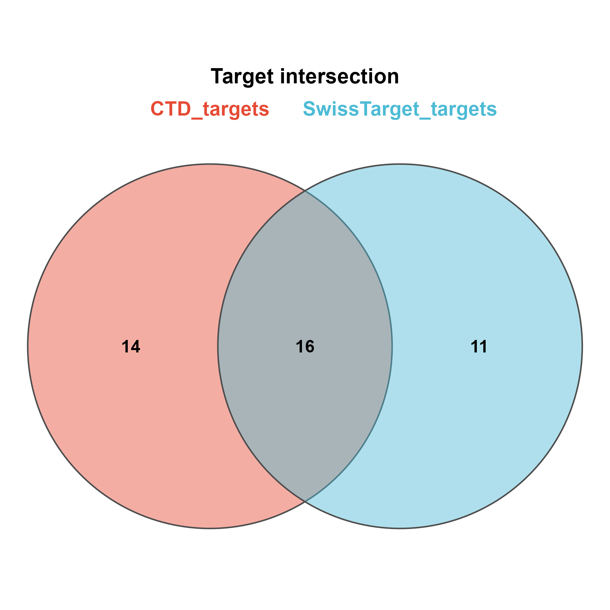

# 003 · CTD and SwissTarget compound-target Venn

Compute the intersection and union of multiple compound-target lists (CTD / SwissTargetPrediction) and render a Venn diagram and set-size bar chart.

## Input

A directory passed via `--input` containing at least two target lists (csv). The gene column is detected automatically (`Gene` / `Gene Symbol` / first column). Each file name is used as the set name. The bundled example data is in `example_data/` (CTD + SwissTarget target csv).

## Method

Each list is read in, then `Reduce(union/intersect)` computes the union and intersection. Output is rendered with `venn_pub` (up to 3 sets) plus a set-size bar chart, and UpSet (3 or more sets).

## Usage

```bash
Rscript 003_target_intersection_venn.R                       # 示例
Rscript 003_target_intersection_venn.R --input data/lists    # 你的目录
```

## Outputs

The union and intersection tables are written to `results/`; figures are written to `assets/`.

| File | Figure type |
|------|------|
| `assets/Target_Venn.png` | Venn |
| `assets/Set_size_bar.png` | Set-size bar |



## Dependencies

R, with `theme_pub` (dependency-free Venn) and `UpSetR`. Install UpSetR with `install.packages("UpSetR")`; the Venn is provided by `theme_pub.R`.
