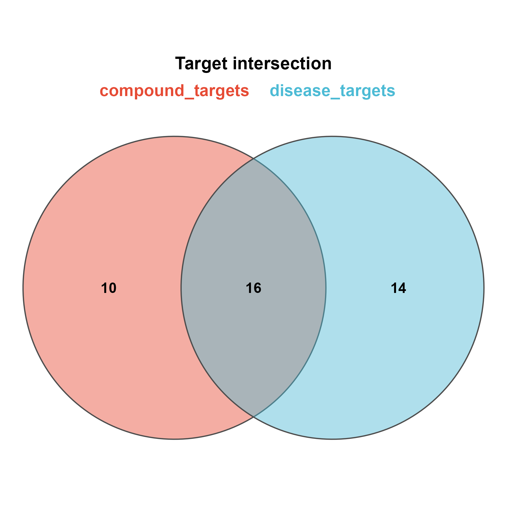

# 006 · Disease and Compound Target Intersection Venn

Computes the intersection of disease targets and compound targets, the shared core targets, and renders a Venn diagram.

## Input

`--input` directory containing disease and compound target lists (csv; the `Gene` column or first column is detected automatically).

## Method

The intersection of the two sets is the set of disease-compound shared targets (the core targets in network pharmacology), visualized with `venn_pub` and a bar plot.

## Usage

```bash
Rscript 006_disease_compound_venn.R
```

## Outputs

- `results/`: intersection table
- `assets/Target_Venn.png`: Venn diagram
- `assets/Set_size_bar.png`: set size bar plot

The shared targets are written directly for downstream PPI and enrichment analysis (module 007).



## Dependencies

R, `theme_pub`, `UpSetR`.

```r
install.packages("UpSetR")
```
