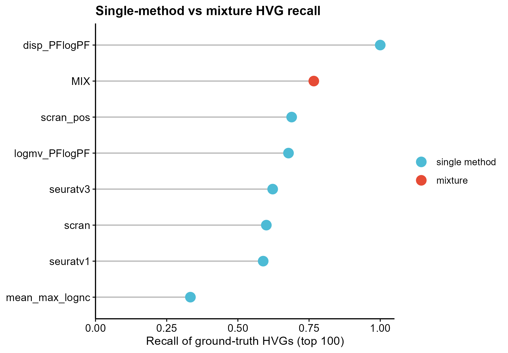
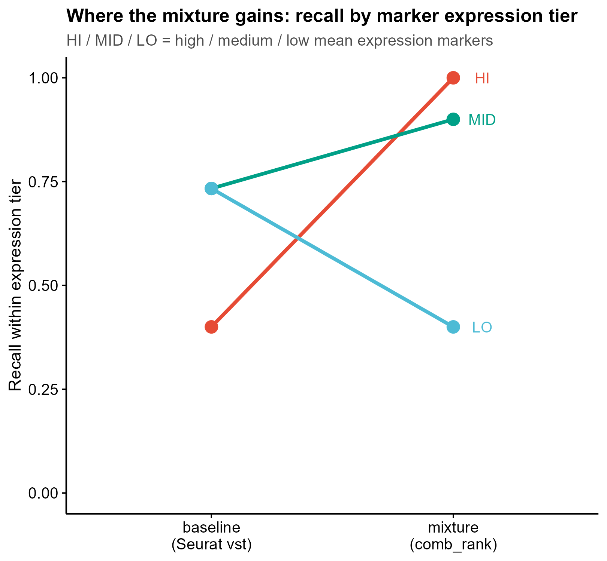
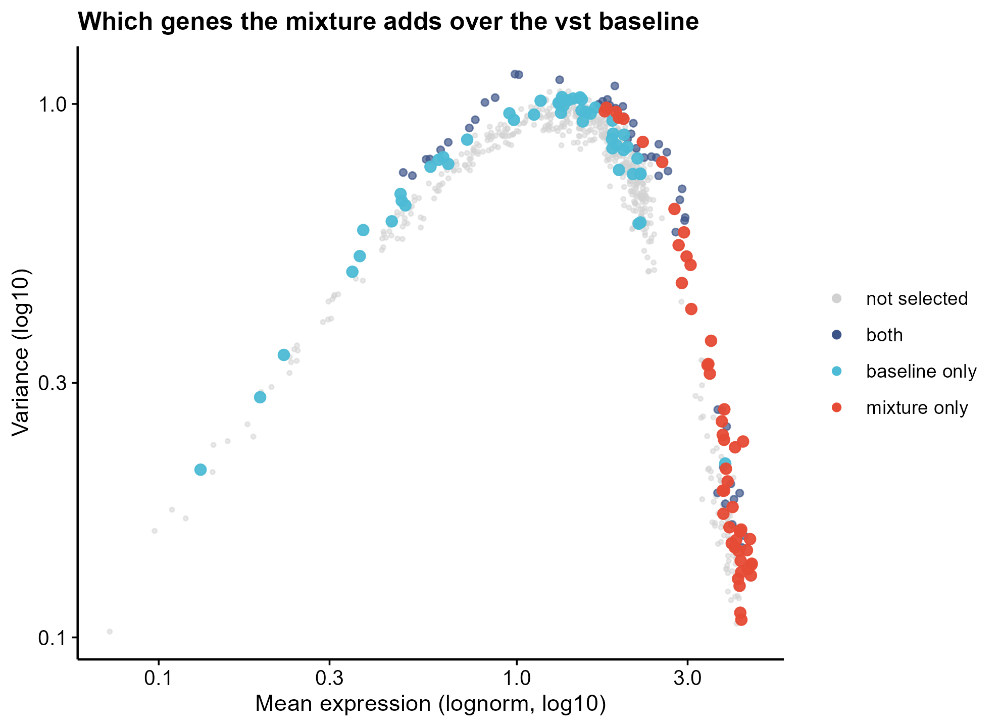
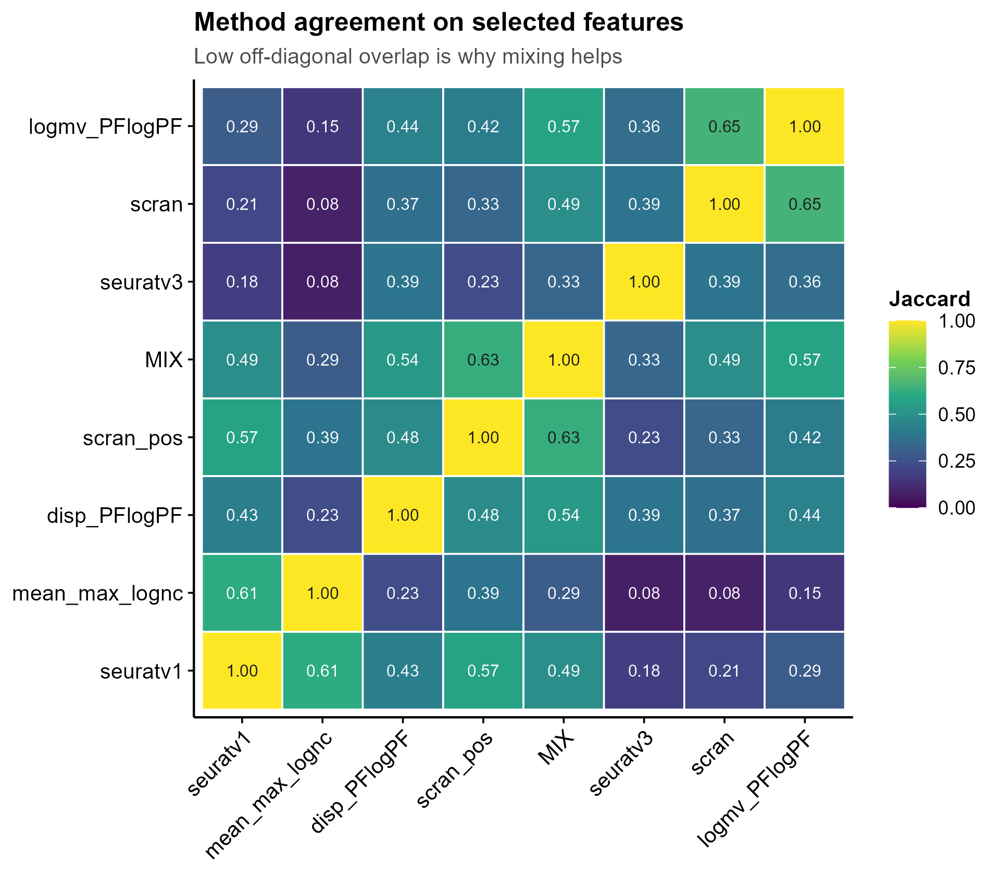
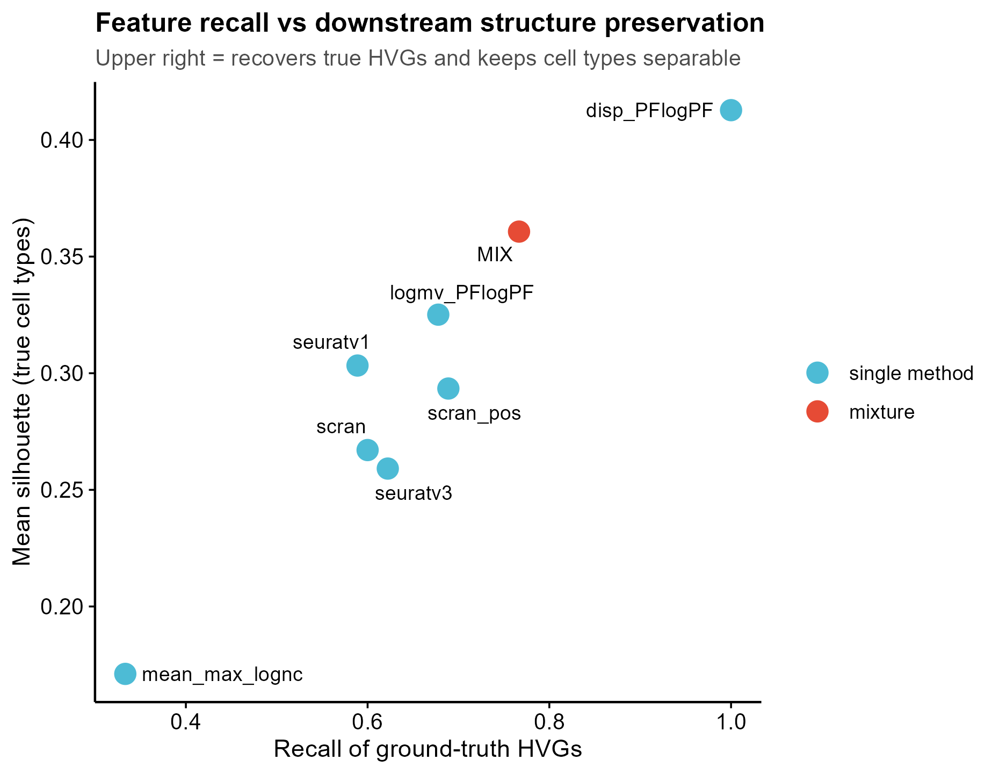

# 562 · 混合多方法高变基因选择 mixHVG

> 一句话定位:输入 **scRNA-seq count 矩阵** → 用**多种 HVG 方法各自打分再按秩混合**选高变基因 →
> 出 **方法对比 lollipop / 分档 slopegraph / 均值-方差散点 / 方法重合 heatmap / recall-silhouette 散点**。
> 自带 **Seurat vst 基线**,混合结果永远和单一方法并排报告。

| | |
|---|---|
| **语言 / 主依赖** | R · `Seurat` `Matrix` `scran` `SingleCellExperiment` `SummarizedExperiment` `scuttle` `mclust`(可选)· 上游包 `mixhvg`(可选) |
| **一句话用途** | 单一 HVG 方法各有盲区,混合多方法的秩以覆盖互补的真信号 |
| **输入** | `example_data/counts.csv`(+ 可选细胞标签、ground-truth HVG) |
| **输出** | `results/`(运行生成)· 展示图见 `assets/` |
| **状态** | 🟡 基线与按上游源码复现的混合逻辑本机零改动跑通出图;官方 `mixhvg` 包本机未装,走守卫路径 |

---

## ① 输入数据

**文件 1**:`counts.csv`(csv;行 = 基因,列 = 细胞;**原始 count,不要预先归一化**)

| 列名 | 类型 | 必需 | 示例 | 说明 |
|------|------|:---:|------|------|
| `Gene` | str | ✔ | `MK_HI_001` | 首列固定为基因名,作行名 |
| `<细胞名>` | int | ✔ | `14` | 其余每列一个细胞的原始 count |

**文件 2**(可选,给了才算下游指标):`cell_metadata.csv`

| 列名 | 类型 | 必需 | 示例 | 说明 |
|------|------|:---:|------|------|
| `Cell` | str | ✔ | `Cell_001` | 须与 counts 列名对应 |
| `CellType` | str | ✔ | `T` | 真实细胞类型,用于算 ARI / silhouette |

**文件 3**(可选,给了才算 recall):`ground_truth_hvg.csv`

| 列名 | 类型 | 必需 | 示例 | 说明 |
|------|------|:---:|------|------|
| `Gene` | str | ✔ | `MK_LO_007` | 已知应当被选中的基因 |
| `Tier` | str | | `LO` | 任意分组标签,会自动分档算 recall |

**命名/格式约定**:counts 首列必须是基因名;细胞名唯一。三个文件均为
`example_data/` 里的**合成数据(synthetic, for demo only)**,生成逻辑见
[`example_data/README.md`](example_data/README.md)。

**样例(前 3 行,已截断)**:
```
Gene,Cell_001,Cell_002,Cell_003,...
MK_HI_001,14,27,20,...
MK_HI_002,4,7,10,...
```

## ② 方法 / 原理

单细胞流程里 HVG 选择决定了后面 PCA / 聚类 / 注释看得到什么。Genome Biology 2025 那篇
系统评测在 19 个数据集上比了 47 种 HVG 方法,结论是**没有单一方法处处最好,把几种方法的
top features 混起来比任何单一方法都稳**。上游把它做成了 R 包 `mixhvg`,主函数
`FindVariableFeaturesMix()` 是 Seurat `FindVariableFeatures()` 的 drop-in 替代。

本模块的三步:

1. **逐方法打分**。每种方法的底层调用与参数,逐行读自上游源码 `R/FindVariableFeaturesMix.R`
   的 `FindFeatureVal()`,没有臆造:
   - `seuratv3` = Seurat vst 打在 **counts** 上(取 `vst.variance.standardized`)
   - `seuratv1` = Seurat disp 打在 **lognormalized** 上(取 `mvp.dispersion`,负值截 0)
   - `scran` = `scuttle::logNormCounts` 归一化后跑 `scran::modelGeneVar`(取 `bio` 分量,
     负值截 0)。注意上游 `"scran"` 分支在 **counts 非空**时走的是 `logNormCounts`
     (size factor + log2),只有 counts 为空才退回"把 lognormalized 当 logcounts 用";
     本模块传的是 counts,所以走前者
   - `scran_pos` = `scran::modelGeneVarByPoisson` 打在 counts 上
   - `logmv_* / disp_* / mv_*` = 同样的打分器换一种输入矩阵
     (counts / normalized / lognormalized / **PFlog1pPF**)
   - `PFlog1pPF` = proportional fitting → `log1p` → 再 proportional fitting,
     用 `NormalizeData(scale.factor = mean(colSums(...)))` 两步实现(照抄源码)
2. **按秩混合 `comb_rank`**。上游的混合不是取交集也不是加权平均:把每种方法的分数各自
   `rank(ties.method = "min")`,**逐基因取各方法秩的最大值**,再按该值降序取 top-n。
   效果是"**在任一方法里排得足够靠前就能入选**",所以覆盖的是各方法盲区的并集。
3. **评测**。对 ground-truth marker 算总体 recall 与分档 recall;再用所选基因做
   基因内 z-score → PCA → kmeans,与真实标签算 **ARI**;并算**平均轮廓宽度
   (silhouette)**,因为 ARI 在容易的数据上会饱和成全 1、分不出高下。

**基线(必跑)**:`seuratv3`,即 Seurat `FindVariableFeatures()` 的默认 vst。这是绝大多数
流程实际在用的东西,混合方法的任何"更好"都必须先打得过它。

### 关于 API 的诚实说明

- 函数签名逐字读自上游,**未固定于猜测**:
  ```r
  FindVariableFeaturesMix(object,
                          method.names = c("scran","scran_pos","seuratv1"),
                          nfeatures = 2000, loess.span = 0.3, clip.max = "auto",
                          num.bin = 20, binning.method = "equal_width",
                          extra.rank = NULL, verbose = FALSE)
  ```
  来源:`man/FindVariableFeaturesMix.Rd` 与 `R/FindVariableFeaturesMix.R`(链接见文末)。
- ⚠️ **上游自身文档不一致**:GitHub README 正文写默认组合是
  `c("scran","seuratv1","mv_PFlogPF","scran_pos")`,而 `.Rd` 与源码里都是
  `c("scran","scran_pos","seuratv1")`。本模块**以源码为准**。真要复现论文结果,
  请以你安装的那个版本的源码为准。
- 本机**未安装** `mixhvg`(不装包是本库规矩)。模块里的混合逻辑是**按上游源码复现**的
  `comb_rank`,不是调用官方函数。装上 `mixhvg` 后重跑,Step 6 会自动调用官方
  `FindVariableFeaturesMix()` 并报告官方结果与本地实现的 Jaccard 一致性 —— 在把本模块
  用于正式分析前,建议先跑这一步确认。

## ③ 用途

回答的问题是:**这套数据该用哪些基因进下游分析,单一 HVG 方法漏了什么。**

典型场景:
- 流程里发现某个稀有细胞群怎么都聚不出来 —— 很可能是它的 marker 表达低,被 vst 漏掉了;
- 换 HVG 方法后聚类结构大变,想知道到底是哪批基因在起作用;
- 做方法学比较时,需要一个带基线、带 ground-truth recall 的 HVG 评测骨架。

## ④ 特点 / 亮点

- **turnkey**:`Rscript 562_mixhvg_hvg_selection.R` 一条命令跑完,默认读 `example_data/`;
- **有基线**:Seurat vst 永远并排跑,不存在"只报混合结果"的情况;
- **接地不臆造**:每个方法的底层调用取自上游源码,官方包未装时走守卫路径并明说;
- **评测不止看基因名**:recall 之外还有下游 kmeans ARI 与 silhouette,避免"选中了但没用";
- **顶刊图**:lollipop / slopegraph / 散点 / heatmap,**不用条形图**;矢量 PDF + 300dpi PNG。

### 示例数据上的结果(合成数据,仅说明管道可用)

| 方法 | recall | recall_HI | recall_MID | recall_LO | silhouette |
|---|---|---|---|---|---|
| `disp_PFlogPF` | 1.000 | 1.00 | 1.00 | 1.00 | 0.413 |
| **`MIX`(scran+scran_pos+seuratv1)** | **0.767** | 1.00 | 0.90 | 0.40 | **0.361** |
| `scran_pos` | 0.689 | 0.97 | 0.93 | 0.17 | 0.293 |
| `logmv_PFlogPF` | 0.678 | 0.73 | 0.80 | 0.50 | 0.325 |
| **`seuratv3`(基线)** | **0.622** | 0.40 | 0.73 | 0.73 | **0.259** |
| `scran` | 0.600 | 0.40 | 0.83 | 0.57 | 0.267 |
| `seuratv1` | 0.589 | 1.00 | 0.53 | 0.23 | 0.303 |
| `mean_max_lognc` | 0.333 | 1.00 | 0.00 | 0.00 | 0.171 |

**怎么读这张表**(不要过度解读):

- 混合确实打过了 vst 基线(recall 0.767 vs 0.622,silhouette 0.361 vs 0.259),
  且分档看得出机制:基线在高表达档只有 0.40,混合是 1.00。
- 但混合在**低表达档仍输给基线**(0.40 vs 0.73)—— 因为默认组合里没有 vst。
  这正说明混合组合要按数据选,不是万能开关。
- 单一方法 `disp_PFlogPF` 在这份合成数据上拿到满分 **1.000**,比混合还好。这是合成数据的
  产物,不构成"这个方法最好"的证据。
- **合成数据只能证明这套管道跑得通、指标算得出,证明不了"混合更好"。**
  后者的证据是上游论文在 19 个真实数据集上的评测,不是这里的 700×235 玩具矩阵。

## ⑤ 输出结果图

| 文件 | 图型 | 说明 |
|------|------|------|
| `assets/562_fig1_recall_lollipop.png` | lollipop | 各方法 ground-truth recall,混合红点高亮 |
| `assets/562_fig2_tier_slopegraph.png` | slopegraph | 基线 → 混合,按 marker 表达档分别看 recall 怎么变 |
| `assets/562_fig3_mean_variance_scatter.png` | 散点 | 均值-方差平面上,混合相对基线多选/少选了哪批基因 |
| `assets/562_fig4_method_jaccard_heatmap.png` | heatmap | 方法两两选择重合度(离对角越低,越说明有互补空间) |
| `assets/562_fig5_recall_vs_silhouette.png` | 散点 | recall 与下游结构保留的联合表现 |

`results/` 另有 `562_method_metrics.csv`(指标表)、`562_selected_features.csv`
(各方法选中的基因及秩)、`562_summary.txt`(汇总)。`results/` 不提交进库。











---

## 运行

```bash
# 零改动跑示例
Rscript 562_mixhvg_hvg_selection.R

# 换成自己的数据(只有 counts 也能跑,此时不算 recall/ARI)
Rscript 562_mixhvg_hvg_selection.R --counts data/我的_counts.csv --outdir results/run1

# 换混合组合与基线、改选多少基因
Rscript 562_mixhvg_hvg_selection.R --nfeatures 2000 \
        --methods scran,seuratv1,mv_PFlogPF,scran_pos --baseline seuratv3
```

可用 `--methods` 取值(与上游 `FindFeatureVal()` 的 switch 分支一一对应):`scran` `scran_pos`
`mv_ct` `mv_nc` `mv_PFlogPF` `seuratv3` `logmv_nc` `logmv_lognc` `logmv_PFlogPF` `seuratv1`
`disp_ct` `disp_lognc` `disp_PFlogPF` `mean_max_ct` `mean_max_nc` `mean_max_lognc`
`mean_max_PFlogPF`。上游的三个别名 `logmv_ct`→`seuratv3`、`mv_lognc`→`scran`、
`disp_nc`→`seuratv1`(源码 341-343 行)本模块也照样接受。

## 依赖安装

本机已有 `Seurat` `Matrix` `scran` `SingleCellExperiment` `scuttle` `mclust` `ggplot2`,
零改动即可跑。缺哪个装哪个:

```r
install.packages(c("Seurat", "Matrix", "mclust", "ggplot2"))
BiocManager::install(c("scran", "SingleCellExperiment", "SummarizedExperiment", "scuttle"))
# 可选:装上后 Step 6 会自动与官方实现做一致性核对
install.packages("mixhvg")
```

`scran` 系缺失时模块会打印 `[guard]` 并跳过对应方法,其余照跑,不会静默降级。

## 引用

Zhao R, Lu J, Li Y, Zhou W, Zhao N, Ji H. A systematic evaluation of highly variable gene
selection methods for single-cell RNA-sequencing. *Genome Biology* 2025;26(1):424.
PMID **41382205** · doi:**10.1186/s13059-025-03887-x** · PMC12699822

> 引用已用 NCBI E-utilities `esummary` 核实:PMID 41382205 确为该篇,期刊、卷期页、
> DOI、作者列表(Zhao R … Ji H)均对得上。

**上游资源(本模块实际读取 API 的地址)**:
- 仓库 https://github.com/RuzhangZhao/mixhvg
- 函数文档 https://raw.githubusercontent.com/RuzhangZhao/mixhvg/HEAD/man/FindVariableFeaturesMix.Rd
- 源码实现 https://raw.githubusercontent.com/RuzhangZhao/mixhvg/HEAD/R/FindVariableFeaturesMix.R
- CRAN https://cran.r-project.org/web/packages/mixhvg/index.html(v1.0.1;CRAN 页仍指向
  预印本 doi:10.1101/2024.08.25.608519,正式发表版即上面的 Genome Biology 2025)
- 评测代码仓库 https://github.com/RuzhangZhao/benchmarkHVG(仓库名首字母小写,已用 GitHub API
  核实 `full_name` 与 `R/` 目录清单:实际文件名是 `benchmark_HVG_1_Methods.R` /
  `benchmark_HVG_2_Evaluation_Criteria.R` / `benchmark_HVG_3_RunExample.R`,
  该仓库 README 正文里写成首字母大写,以实际文件名为准。README 载明评测场景为
  cell sorting、CITEseq、MultiomeATAC 三类。想复现论文级评测从这里起手)
