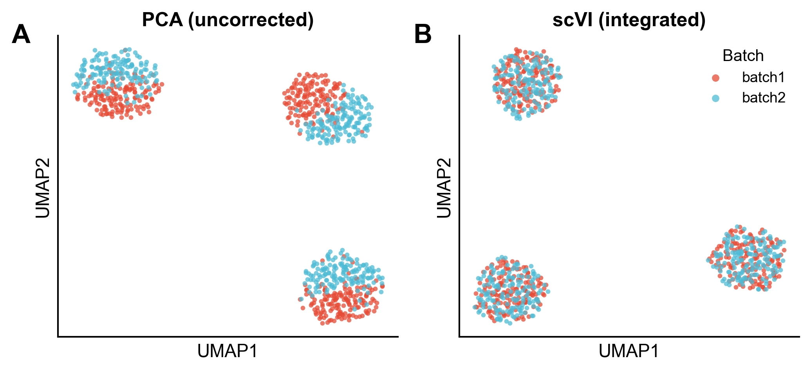
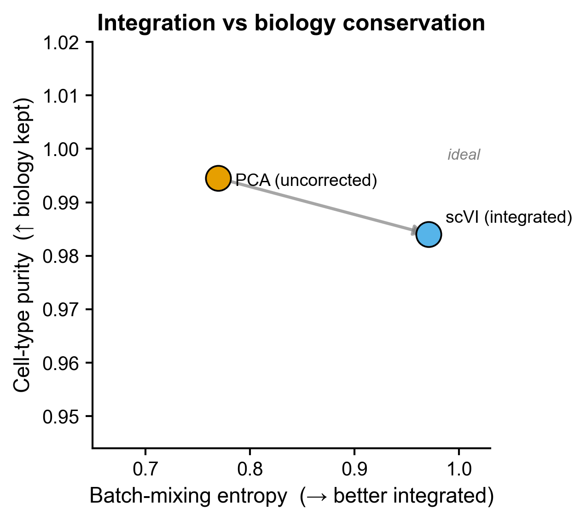

# 506 · scVI / scANVI deep-generative integration & label transfer

Integrates multi-batch single-cell data with the **scVI** deep generative model and
transfers cell-type labels semi-supervised with **scANVI**, benchmarked against an
**uncorrected PCA baseline** on *two* metrics — batch mixing **and** biology
conservation — so the integration/over-correction trade-off is shown honestly.

| | |
|---|---|
| Language / deps | Python · `scvi-tools` `scanpy` `scikit-learn` `matplotlib` |
| Purpose | Batch integration (scVI) + label transfer (scANVI) with an honest baseline |
| Input | `--input your.h5ad` (`batch_key`, `label_key`); else synthetic |
| Output | `results/` metrics + predictions; preview in `assets/` |
| Runtime | CPU-friendly (~3–5 min on the 900-cell demo); GPU optional |

## Input

| Field | Spec |
|------|------|
| `X` | raw **counts** (cells × genes); stored to `layers["counts"]` for scVI |
| `obs[batch_key]` | batch / sample label (default column `batch`) |
| `obs[label_key]` | cell-type label (default `celltype`); used as scANVI ground truth |

Demo data is synthetic (900 cells × 300 genes, 2 batches × 3 cell types, NB
over-dispersion + 20% dropout + a moderate, *correctable* batch effect), generated
on first run — `for demo only`.

## Method

1. **Baseline** — log-normalize → PCA → UMAP on the uncorrected data (this is the
   comparator the deep model must beat).
2. **scVI** — `setup_anndata(layer="counts", batch_key=...)`, train a negative-binomial
   VAE conditioned on batch; the latent `X_scVI` is the integrated embedding.
3. **scANVI** — initialise from the trained scVI model, hide 40% of labels as `Unknown`,
   train semi-supervised, `predict()` the held-out cells and score against truth.
4. **Honest dual metrics** — kNN **batch-mixing entropy** (↑ = better mixed) *and*
   **cell-type purity** (↑ = biology kept). A good method raises mixing *without*
   collapsing purity.

## Use

Drop-in batch integration + automated annotation for atlas-scale or multi-cohort
single-cell studies, with a built-in baseline comparison that pre-empts the standard
reviewer question "did you check this beats PCA/Harmony?".

## Honest-baseline note (one of the "two knives")

> **Genome Biol 2025** (`10.1186/s13059-025-03574-x`): learned single-cell embeddings
> do **not** automatically beat PCA / Harmony, and integration that over-mixes can
> erase real biology. **Always** report both an integration metric **and** a
> conservation metric against a simple baseline — which is exactly what this module
> ships. Treat scVI as a strong default, not an automatic winner; on your own data,
> add Harmony and pick by the metric pair, not by the prettier UMAP.

## Outputs

| File | Type | Description |
|------|------|------|
| `results/integration_metrics.csv` | table | batch mixing + cell-type purity, PCA vs scVI |
| `results/scanvi_predictions.csv` | table | per-cell true / predicted label + held-out flag |
| `assets/umap_batch.png` | UMAP×2 | batch colouring, PCA (separated) vs scVI (mixed) |
| `assets/umap_celltype.png` | UMAP | scVI latent coloured by cell type (biology kept) |
| `assets/metrics_scatter.png` | scatter | integration-vs-conservation trade-off (scIB-style; ideal = top-right) |
| `assets/scanvi_confusion.png` | heatmap | scANVI label-transfer confusion on held-out cells |




## Run

```bash
python 506_scvi_scanvi_integration.py                          # synthetic demo
python 506_scvi_scanvi_integration.py --input your.h5ad \
       --batch_key batch --label_key celltype --epochs 200
```

## Dependencies

```bash
# torch (CPU build is fine for small data) is pulled in automatically
pip install scvi-tools scanpy scikit-learn
# China mirror if PyPI is flaky:
pip install -i https://pypi.tuna.tsinghua.edu.cn/simple scvi-tools
```
