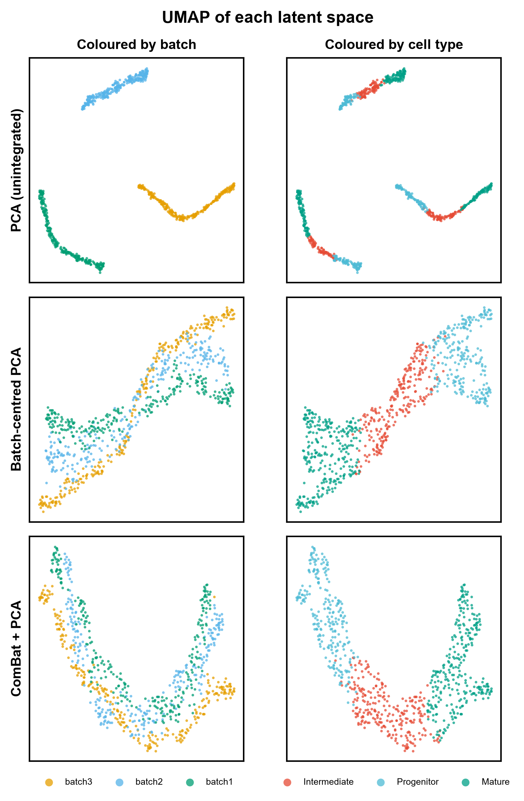
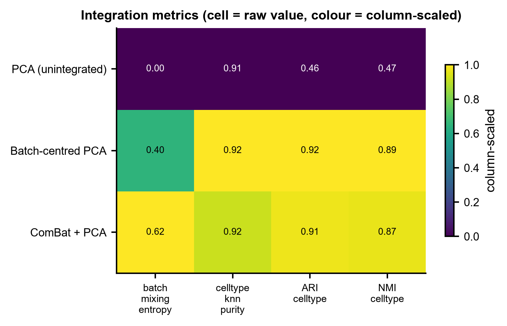
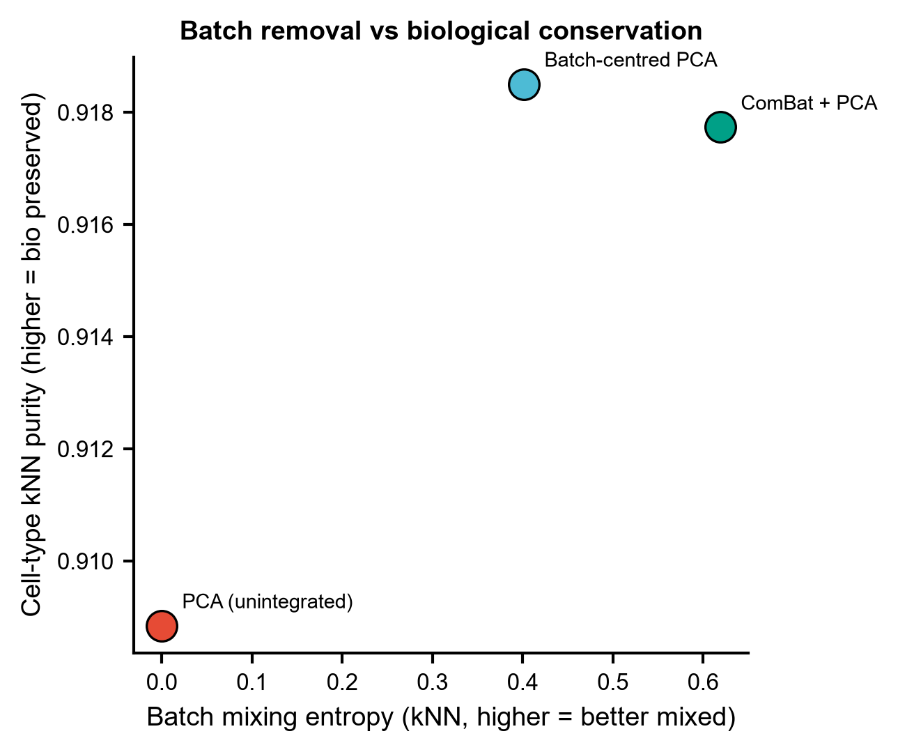
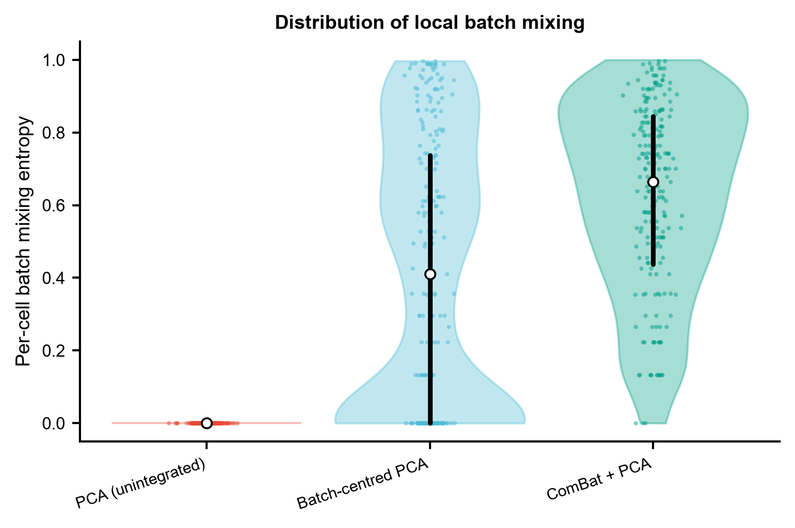

# 563 · CONCORD 对比学习整合 — contrastive single-cell integration

> 一句话定位:**输入** 多批次单细胞表达矩阵 + 批次/细胞类型标注 → **做** 潜空间整合(自带 3 个可跑基线 + 守卫式 CONCORD 接口)并用「批次混合 / 生物保真 / 全局几何」三类指标同台评估 → **出** UMAP 散点矩阵、指标热图、权衡散点、每细胞熵 violin。

| | |
|---|---|
| **语言 / 主依赖** | Python 3.12 · 基线 `scanpy` `scikit-learn` `umap-learn` `anndata`;CONCORD 路径 `concord-sc`(上游 v1.0.13,MIT;本机**未装**,已实测 `import concord` 报 ModuleNotFoundError) |
| **一句话用途** | 跨批次单细胞整合 + 整合质量三维评估(不是只看 UMAP 好不好看) |
| **输入** | `example_data/counts.csv` + `cell_meta.csv`(+ 可选 `true_geometry.csv`) |
| **输出** | `results/`(运行生成)· 展示图见 `assets/` |
| **状态** | 🟡 基线与评估harness 本机零改动跑通出图;CONCORD 本体需装包(建议 GPU) |

---

## ① 输入数据

**文件 1**:`counts.csv`(行=细胞,列=基因;原始 count)

| 列名 | 类型 | 必需 | 示例 | 说明 |
|------|------|:---:|------|------|
| (index) | str | ✔ | `C00000` | 细胞条码 |
| `G0000` … | float | ✔ | `2.0` | 每个基因一列,未归一化 count |

**文件 2**:`cell_meta.csv`(行=细胞,与 `counts.csv` 索引一致)

| 列名 | 类型 | 必需 | 示例 | 说明 |
|------|------|:---:|------|------|
| (index) | str | ✔ | `C00000` | 细胞条码,须与 counts 对齐 |
| `batch` | str | ✔ | `batch3` | 批次键,`--batch-key` 可改名 |
| `cell_type` | str | ✔ | `Intermediate` | 生物标签,`--label-key` 可改名 |
| `true_time` | float | ✗ | `0.6370` | 仅合成数据有,不参与评估 |

**文件 3(可选)**:`true_geometry.csv` — **无批次效应的干净信号空间**的前 20 个主成分,只有合成数据才有。它是 `trustworthiness` 与 `global_geometry_rho` 的参照系。**真实数据没有这个文件时,这两个指标会被直接省略而不是硬算** —— 若拿"未整合 PCA"当参照,未整合方法就会自比得 1.000,那是自证的假赢。

**命名/格式约定**:两个 CSV 的行索引必须能对上;首行 `#` 注释会被跳过。

**样例(`cell_meta.csv` 前 3 行)**:
```
# synthetic, for demo only -- module 563 CONCORD
,batch,cell_type,true_time
C00000,batch3,Intermediate,0.6369616873214543
```

## ② 方法 / 原理

**共用预处理**(三条路走同一份输入,否则比较不公平):`normalize_total` → `log1p` → HVG。

**基线库(本机依赖即可跑完,是"更好"的判据下限)**
1. **PCA(未整合)** — 批次效应原样留着,下限。
2. **批次中心化 + PCA** — 按批次做基因级均值中心化,等价于扣掉线性批次截距项。
3. **ComBat + PCA** — 经验贝叶斯位置-尺度校正(Johnson et al., *Biostatistics* 2007),scanpy 自带,无需额外装包。

**CONCORD 路径(`--run-concord`,守卫式)**
自监督对比学习,单个潜空间里同时做去噪、降维与批次整合;论文原话是通过 dataset-aware sampling 纠正批次效应、通过 hard-negative sampling 提升生物分辨率(源码里对应 `domain_key` 与 `p_intra_knn` / `sampler_knn` / `clr_beta`),由此"preserving both local geometric relationships and global topological structures"(摘要原文)。

已核实的真实接口(下方"API 来源"给了逐行出处,**未读到的参数一律没写进代码**):
```python
feats = ccd.ul.select_features(adata, n_top_features=2000, flavor='seurat_v3')
model = ccd.Concord(adata, save_dir='save/', copy_adata=False, verbose=False,
                    input_feature=feats, domain_key='batch',
                    latent_dim=100, n_epochs=15, seed=0, device=dev)
model.fit_transform(output_key='Concord')      # 结果写回 adata.obsm['Concord']
ccd.ul.run_umap(adata, source_key='Concord', result_key='Concord_UMAP', ...)
```
`Concord.__init__` 的形参只有 `(adata, save_dir, copy_adata, verbose, **kwargs)`(`concord.py:59`),上表其余键都落在 `default_params`(`concord.py:94-143`)里:`domain_key=None` / `class_key=None` / `latent_dim=100` / `n_epochs=15` / `clr_temperature=0.4` / `p_intra_knn=0.0` / `p_intra_domain=1.0` / `encoder_dims=[1000]` / `preload_dense=False` / `chunked=False` 等。注意 `setup_config`(`concord.py:171`)对不在 `default_params` 中的键**直接抛 ValueError**,所以键名写错不会被静默吞掉。**超参的推荐取值随数据规模变化,以上游教程为准,本模块不擅自固定。**

**评估 harness**(三类指标一起看;只优化其中一类必然被 gaming)
- 批次混合:kNN 邻域批次标签的归一化香农熵(思路同 Azizi et al., *Cell* 2018 的 batch mixing entropy,此处按全局批次占比归一化);
- 生物保真:kNN 细胞类型纯度 + KMeans 聚类的 ARI / NMI;
- 拓扑与几何:`sklearn` `trustworthiness`(局部)与成对距离的 Spearman 相关(全局几何,即 CONCORD 的核心主张)。

## ③ 用途

回答的问题:**多批次单细胞数据整合后,批次效应是真被去掉了,还是把生物结构也一起抹平了?**
典型场景 —— 合并多个 GEO scRNA 数据集做图谱;跨供体/跨平台整合;发育或分化轨迹数据(此时"全局几何"尤其重要,常规整合方法容易把连续轨迹压成离散团块);以及给任何整合方法选型时提供一把带朴素对照的公共尺子。

## ④ 特点 / 亮点

- **turnkey**:`python 563_concord_contrastive_integration.py` 一条命令,自动生成合成数据、跑完 3 个基线、出 4 张图;
- **绝不裸报单一方法**:任何整合结果都与未整合 PCA / 批次中心化 / ComBat 同表对照;
- **诚实的参照系**:没有 ground-truth 几何时,几何类指标直接省略而不是自比造假;
- **守卫式 CONCORD 封装**:`concord-sc` 装不上就打印真实安装命令并只跑基线,**不静默降级冒充 CONCORD 结果**;参数名全部来自上游源码,未读到的不编;
- **顶刊图风格**:统一 `pubstyle`,矢量 PDF + 300dpi PNG 双出;**全程无条形图**(lollipop/violin/散点/heatmap)。

**合成数据的 sanity-check**(证明 harness 确实能测出批次效应及其去除):未整合 PCA 的批次混合熵 = 0.00、ARI = 0.46、全局几何 ρ = 0.77;批次中心化后分别升到 0.40 / 0.92 / 0.96,ComBat 后 0.62 / 0.91 / 0.96。

## ⑤ 输出结果图

| 文件 | 图型 | 说明 |
|------|------|------|
| `assets/563_fig1_embeddings.png` | 散点矩阵 | 行=方法,列=按批次/按细胞类型上色的 UMAP |
| `assets/563_fig2_metric_heatmap.png` | 热图 | 方法 × 指标,格内为原值、颜色为列内归一化 |
| `assets/563_fig3_tradeoff.png` | 散点 | 批次混合 vs 生物保真;只往右不往上=过度整合 |
| `assets/563_fig4_percell_entropy.png` | violin + 抖动散点 | 每细胞批次混合熵的**分布**,不是只看均值 |

`results/` 另出 `563_integration_metrics.csv`、`563_percell_batch_entropy.csv`、`563_summary.json` 与各方法 embedding 的 `.npy`。









> 注:只有 3 个方法时,fig2 的列内归一化会饱和成"最亮/最暗"两色;接上 CONCORD 后梯度才有意义。原始数值以格内文字和 CSV 为准。

---

## 运行

```bash
# 零改动跑示例(仅基线,本机可跑通)
python 563_concord_contrastive_integration.py

# 换成自己的数据
python 563_concord_contrastive_integration.py --indir data/mydata --outdir results/run1 \
    --batch-key donor --label-key celltype

# h5ad 输入
python 563_concord_contrastive_integration.py --h5ad data/atlas.h5ad --batch-key sample

# 接上真实 CONCORD(需先装包,建议 GPU)
python 563_concord_contrastive_integration.py --run-concord --concord-epochs 15
```

其他参数:`--n-comps`(潜空间维度,默认 30)、`--knn`(邻域大小,默认 30)、`--regen-example`(重建合成数据)。随机种子固定为 0。

## 依赖安装

基线所需的包本机均已具备(`scanpy` `scikit-learn` `umap-learn` `anndata` `pandas` `scipy` `matplotlib`)。CONCORD 本体需另装:

```bash
pip install concord-sc                 # 稳定版
# 或开发版
pip install git+https://github.com/Gartner-Lab/Concord.git
```

## API 来源(逐符号对到源码行号)

唯一权威 = 本地克隆的上游源码 `Gartner-Lab/Concord`,版本 **1.0.13**(`src/concord/__init__.py:1`),
2026-07-21 逐行复核。README 只作线索,凡指不出源码位置的调用一律不写进代码。

| 本模块用到的上游符号 | 源码文件:行 | 已核对内容 |
|---|---|---|
| `import concord as ccd` | `src/concord/__init__.py` | 末行 `from . import ml, pl, ul, bm, sm` + `from .concord import Concord`;PyPI 包名 `concord-sc`,import 名 `concord`(`setup.py`) |
| `ccd.Concord(...)` | `src/concord/concord.py:44` / `:59` | 显式形参只有 `(adata, save_dir='save/', copy_adata=False, verbose=False, **kwargs)` |
| 传入的 kwargs | `concord.py:94-143`(`default_params`) | `input_feature`(None)、`domain_key`(None)、`latent_dim`(**100**)、`n_epochs`(**15**)、`seed`(0)、`device`(cuda:0 if available)——键名与默认值逐个对过;`setup_config`(`:171`)对未知键直接 `ValueError`(抛出点 `:187`),所以不存在"多传一个也没事" |
| `.fit_transform(output_key=...)` | `concord.py:613` | 默认 `output_key="Concord"`,另有 `return_decoded/decoder_domain/return_class/return_class_prob/save_model` |
| 结果落点 `adata.obsm[key]` | `concord.py:585` → `:590` | `_add_results_to_adata` 里 `adata_to_update.obsm[output_key] = embeddings`,且 `:649` 传的是 `_adata_original`;`fit_transform` 本身返回 `None`,必须回读 `obsm` |
| 输入需已归一化 | `concord.py:97` 注释 / `:845` `_check_input_format` | `normalize_total`/`log1p` 默认 False,raw counts 只 warning。本模块喂的是 normalize+log1p 后的 `.X` |
| faiss 缺失回落 | `src/concord/model/knn.py:80` | warn 后回落 sklearn,不是硬依赖 |
| `ccd.ul.select_features` | `src/concord/utils/feature_selector.py:182` | `n_top_features=2000, flavor='seurat_v3'`(本模块未调用,改用 scanpy HVG;签名仍核过) |
| `ccd.ul.run_umap` | `src/concord/utils/dim_reduction.py:5` | `source_key/result_key/n_components/n_neighbors=30/min_dist=0.1/metric='cosine'`(本模块未调用,出图走本库 `pubstyle`) |
| `ccd.pl.plot_embedding` | `src/concord/plotting/pl_embedding.py:29` | 同上,未调用 |
| 许可证 | `LICENSE.md` | MIT(© 2025 CONCORD authors) |
| 安装命令 / 依赖下限 | 上游 `README.md` / `setup.py` | `pip install concord-sc`;`python_requires>=3.9`,依赖含 `anndata>=0.8` `scanpy>=1.1` `torch`(README 要求先自行按 CUDA 装 torch) |
| 文档站 | 上游 `README.md` 正文 | `https://qinzhu.github.io/Concord_documentation/`(仓库内**没有** tutorials/ 或 notebooks/ 目录,教程在文档站,本 README 不宣称仓库自带教程) |

## 引用

Zhu Q, Jiang Z, Zuckerman B, Weinberger L, Thomson M, Gartner ZJ.
**Revealing a coherent cell-state landscape across single-cell datasets with CONCORD.**
*Nature Biotechnology*, 2026 Jan 5. doi:10.1038/s41587-025-02950-z · PMID 41491253

> 引用已核实:通过 NCBI E-utilities `esummary` 查 PMID 41491253,返回的标题、期刊、作者与 DOI 与上述一致。仓库 README 中的 citation 块仍写着 bioRxiv 2025 预印本版本(上游未同步更新),此处以已发表的 Nature Biotechnology 版本为准。

基线方法引用:Johnson WE, Li C, Rabinovic A. Adjusting batch effects in microarray expression data using empirical Bayes methods. *Biostatistics* 2007;8(1):118-27.
