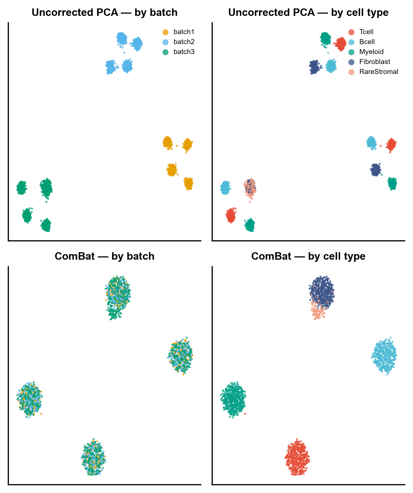
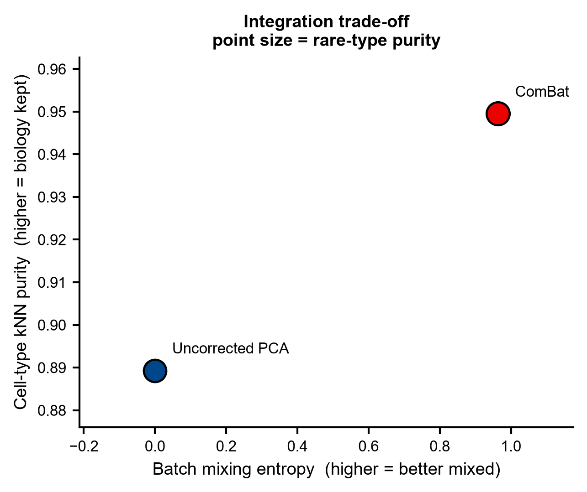
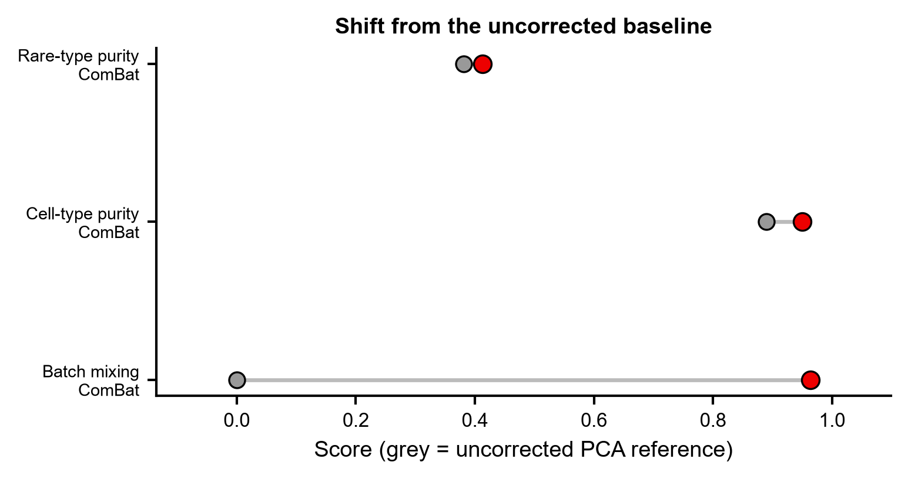
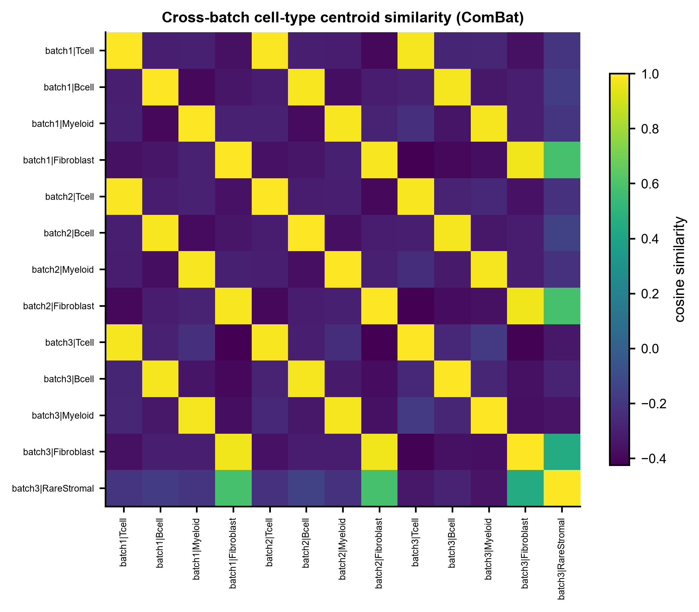

# 564 · scExtract 先验加权跨数据集整合 (scanorama-prior / cellhint-prior)

> 一句话定位:输入**多批次 scRNA AnnData(带批次键 + 细胞类型标签)**→ 用「批次混合度 × 生物学保真度」双轴评测整合效果,并封装 **scExtract 的两个注释先验整合算法**;出 UMAP 对比、权衡散点、dumbbell、跨批次相似度热图。

| | |
|---|---|
| **语言 / 主依赖** | Python(上游 `pyproject.toml` 未声明 `requires-python`;其 `.readthedocs.yaml` 用 3.10)· 基线:`scanpy` `anndata` `scikit-learn` `umap-learn` `matplotlib`;完整方法:`scextract` + `scanorama_prior` 或 `cellhint_prior` |
| **一句话用途** | 跨数据集整合:在**对齐批次**与**不抹平真实生物学差异**之间做权衡评估 |
| **输入** | `example_data/synthetic_3batch.h5ad`(需 `obs['batch']` + `obs['cell_type']`) |
| **输出** | `results/`(运行生成)· 展示图见 `assets/` |
| **状态** | 🟡 基线本机零改动跑通出图;`scanorama_prior` / `cellhint_prior` 完整路径需装包 + 一份细胞类型 embedding 字典 |

---

## ① 输入数据

**文件**:`synthetic_3batch.h5ad`(类型:h5ad / AnnData;orientation:行=细胞,列=基因)

| 字段 | 类型 | 必需 | 示例 | 说明 |
|------|------|:---:|------|------|
| `X` | float32 matrix | ✔ | `1890 × 300` | 表达矩阵,已 log-normalized 量级 |
| `obs['batch']` | categorical | ✔ | `batch1` | 批次 / 数据集来源键,`--batch-key` 可改名 |
| `obs['cell_type']` | categorical | ✔ | `Tcell` | 细胞类型标签,`--label-key` 可改名 |
| `var_names` | str | ✔ | `G0042` | 基因名;真实数据须跨数据集统一为同一命名体系 |

**命名/格式约定**:先验整合的前提是**每个数据集都已有细胞类型标签**(所以是 "prior-informed")。标签在各数据集间**不需要**用词一致 —— 上游正是靠 embedding 相似度去跨数据集对齐 `T cell` 与 `T lymphocyte` 这类同义标签。

**样例(`adata.obs` 前 3 行)**:
```
         batch cell_type
C00000  batch1     Tcell
C00001  batch1     Tcell
C00002  batch1     Tcell
```

示例数据为**合成数据**(`synthetic, for demo only`),固定种子 `seed=0`,删除后重跑主脚本会自动重建。设计细节见 `example_data/README.txt`。

## ② 方法 / 原理

**上游 scExtract 的先验整合思路**:常规整合(Scanorama / CellHint / Harmony)只看表达空间的邻近关系,谁靠得近就把谁拉到一起 —— 这会把「不同批次的同一类细胞」和「本来就该分开的不同细胞类型」一视同仁。scExtract 的做法是把**注释衍生的先验**注入合并过程:先为细胞类型标签取语义 embedding,算出类型间的先验相似度矩阵,再把它交给整合算法去调制跨数据集的匹配。目标是**该对齐的对齐,该保留的差异保留**。

源码里这条路径的实际走法(逐行核对 `integrate.py`,commit `f3ef7fb` / v0.2.0):

| 步骤 | 源码位置 |
|---|---|
| 读 `embedding_dict_path` pickle,按 harmonized 细胞类型取向量 | `integrate.py:271-272`(scanorama_prior)、`:435-436`(cellhint_prior) |
| 内积得类型×类型相似度 DataFrame | `integrate.py:275-276` |
| 传给整合后端 | `scanorama_prior.scanorama.integrate_scanpy(adatas, type_similarity_matrix=…)` @ `integrate.py:287-295`;`cellhint_prior.harmonize(adata_all, dataset='Dataset', cell_type='cell_type', use_rep='X_pca', use_pct=…, embedding_dict=…)` @ `integrate.py:437` |
| 结果嵌入 | `obsm['X_scanorama_prior']` @ `integrate.py:298`;`obs['harmonized_cellhint_prior']` @ `integrate.py:439` |

> ⚠️ 本模块早期版本曾把该机制写成 `create_prior_similarity_matrix` → `normalize_connectivities(df_raw, prior_similarity_matrix_df, prior_weight)`。这两个函数**确实存在**(`integrate.py:458` 与 `:89`),但全仓库 grep 显示**没有任何调用点** —— 它们是未接线的代码,不是上述两个方法实际执行的路径。已按源码更正。

**本模块的可跑基线(始终执行,CPU,本机依赖即可)**:

1. `Uncorrected PCA` —— 不做任何校正的 PCA 嵌入,批次分离的下限参照。
2. `ComBat`(`sc.pp.combat`)—— 经典线性批次校正。
3. `Harmony` —— 本机若装了 `harmonypy` 则自动加入;没有就打印跳过原因,**不安装**。

三者用同一套指标打分:

- **批次混合熵**:每个细胞 k 近邻中批次标签的 Shannon 熵 / log(批次数),1 = 完全混合;
- **细胞类型 kNN 保真度**:k 近邻中同类型的比例,1 = 生物学结构完好;
- **稀有类型保真度**:单独追踪只存在于一个批次的 `RareStromal`;
- **KMeans ARI**:聚类结果对真标签的 adjusted Rand index(用 KMeans 而非 Leiden,避免 `leidenalg` 依赖)。

> 混合度与保真度必须**成对**看。只报混合度会奖励"把所有细胞搅成一团"的坏整合 —— 这正是先验整合声称要解决的问题,所以基线里必须留着这根标尺。

**scExtract 路径(`--run-scextract`,守卫式)**。函数签名与参数取值**实读自上游源码**,非推测:

- `src/scextract/integration/integrate.py` → https://github.com/yxwucq/scExtract/blob/HEAD/src/scextract/integration/integrate.py

  ```python
  integrate_processed_datasets(file_list: List[str], method: str, output_path: str,
                               config_path: str = 'config.ini',
                               alignment_path: Optional[str] = None,
                               embedding_dict_path: Optional[str] = None,
                               downsample: Optional[bool] = False,
                               downsample_cells_per_label: Optional[int] = 1000,
                               search_factor: int = 5, approx: bool = False,
                               use_gpu: bool = False, batch_size: int = 5000,
                               dimred: int = 100, use_pct: bool = False, **kwargs) -> None
  ```
- `src/scextract/utils/parse_args.py` → `--method` 合法取值:
  `['scExtract', 'scanorama_prior', 'scanorama', 'cellhint_prior', 'cellhint']`

**本模块只暴露 `scanorama_prior` / `cellhint_prior`(及无先验的 `scanorama` / `cellhint` 作对照),刻意不封装 `scExtract` 方法** —— 那一支走 LLM 自动注释链路,需要外部 API key,且细胞类型判定不应交给 LLM。传入 `scExtract` 会被显式拒绝。

**`*_prior` 需要一份细胞类型 embedding 字典 pickle**(`--embedding-dict`)。上游用
`scExtract extract_celltype_embedding --file_list <h5ad> --cell_type_column cell_type --output_embedding_pkl <pkl>`
生成,该步骤**会调用 LLM API**。本模块不代跑这一步:你自备 pickle,或自行执行上游命令。缺字典时脚本会说明原因并退出,不会静默降级。

**上游对输入 h5ad 的硬性要求**(上游未做友好检查,本模块在调用前替它自查,见 `_check_upstream_preconditions()`):

| 要求 | 源码依据 |
|---|---|
| `adata.raw` 必须存在 | 单文件 `adata_all.raw.to_adata()` @ `integrate.py:263 / :315 / :353`;多文件 `csr_matrix(adata.raw.X)` @ `integrate.py:58` |
| `obs['Dataset']`(上游的批次键)—— **仅单文件路径必需** | `highly_variable_genes(batch_key='Dataset')` @ `integrate.py:265 / :317 / :355`;多文件路径缺失时由 `merge_datasets` 用文件名自动补 @ `integrate.py:42-43` |
| `obs['cell_type']`(单文件路径) | `integrate.py:359` |
| `cell_type` / `leiden` / `louvain` 之一(多文件路径) | `merge_datasets` @ `integrate.py:45-52` |
| `scanorama(_prior)` 只接受**一个已合并**的文件 | `assert len(file_list) == 1` @ `integrate.py:258 / :310` |

⚠️ **一处已知的上游文档不一致(以源码为准)**:仓库 README 的示例写 `-f *.h5ad` 表示输入文件,但 `parse_args.py:100` 里 `-f` 是 `--config_path`,输入文件是 `-i/--file_list`(`parse_args.py:99`)。

## ③ 用途

回答的科学问题:**把多个来源的 scRNA 数据合到一起时,批次被对齐了,但真实的生物学差异有没有被一并抹掉?**

典型场景:
- 跨研究/跨平台合并同一组织的多个公共数据集(GEO 多 accession 拼图谱);
- 图谱构建时保护**只在部分数据集中出现的细胞类型/状态**(疾病特异亚群、稀有基质细胞),这类群体最容易被激进的批次校正吃掉;
- 各数据集已有各自注释、但标签用词不统一时的整合;
- 给任何"我们的整合更好"的说法配一个诚实对照 —— 先赢过 ComBat/未校正基线再说。

## ④ 特点 / 亮点

- **turnkey**:`python 564_scextract_prior_integration.py` 一条命令跑完,示例数据缺失时自动按固定种子重建;
- **基线不可绕过**:未校正 PCA + ComBat 始终跑,scExtract 装没装都有可比的数字落盘;
- **合成数据是探针不是摆设**:`RareStromal` 与 `Fibroblast` 共享 2/3 标志基因且只在一个批次出现,专门用来暴露过度校正 —— 示例结果里 ComBat 把批次混合度从 0.00 拉到 0.96,但稀有类型保真度只从 0.38 动到 0.41,`fig1` 能直接看到它被并进 Fibroblast 团块;
- **不臆造 API**:上游签名、`--method` 合法取值、输入前置条件全部逐行实读自本地克隆源码(带文件:行号,见 ②),LLM 注释链路显式拒绝而非假装支持;调用前先跑 `_check_upstream_preconditions()` 替上游把不友好的 `AttributeError`/`KeyError` 翻译成可读原因;
- **顶刊图风格**:统一 `pubstyle`,矢量 PDF + 300dpi PNG 双出;**全程无条形图**(散点 / dumbbell / heatmap)。

## ⑤ 输出结果图

| 文件 | 图型 | 说明 |
|------|------|------|
| `results/564_baseline_metrics.csv` | 表 | 各方法四项指标 |
| `results/564_summary.json` | JSON | 指标 + scExtract 路径状态 + 图清单 |
| `assets/fig1_umap_batch_vs_celltype.png` | UMAP 散点网格 | 行=方法,列=按批次/按类型着色 |
| `assets/fig2_mixing_vs_purity_tradeoff.png` | 权衡散点 | x=批次混合,y=类型保真,点大小=稀有类型保真 |
| `assets/fig3_shift_from_baseline.png` | dumbbell | 各方法相对未校正基线的移动量 |
| `assets/fig4_crossbatch_celltype_similarity.png` | 热图 | 跨批次细胞类型质心余弦相似度 |



上图是本模块的核心读法:ComBat 把三个批次完全混匀(左下),但右下可以看到 `RareStromal`(浅粉)被压进了 `Fibroblast`(深蓝)团块 —— 混合度满分,真实差异却在流失。





热图里共享类型的跨批次同名格子(如 `batch1|Tcell` × `batch3|Tcell`)已对齐成高相似度块,而 `batch3|RareStromal` 对各批次 `Fibroblast` 保持中等相似 —— 这正是先验加权要区分开的那对。

---

## 运行

```bash
# 零改动跑示例(基线 + 四张图)
python 564_scextract_prior_integration.py

# 换成自己的数据
python 564_scextract_prior_integration.py --h5ad data/mine.h5ad \
    --batch-key dataset --label-key celltype --outdir results/run1

# 尝试真实 scExtract 先验整合(需装包 + embedding 字典)
python 564_scextract_prior_integration.py --run-scextract \
    --method scanorama_prior --embedding-dict my_embedding_dict.pkl
```

主要参数:`--n-pcs`(默认 30)、`--k`(kNN 指标邻居数,默认 30)、`--method`
(`scanorama_prior` / `cellhint_prior` / `scanorama` / `cellhint`)。随机种子固定为 0。

## 依赖安装

基线所需的包本机已具备(`scanpy` `anndata` `scikit-learn` `umap-learn` `matplotlib`)。完整方法:

```bash
# 上游 README Step1 的官方装法
git clone https://github.com/yxwucq/scExtract && cd scExtract && pip install -e .

# ★ 整合后端一个都不在 scExtract 的 pyproject 依赖里(依赖只有 scanpy/openai/anthropic/
#   harmonypy/oaklib/leidenalg/louvain/mygene/networkx/… ),按 --method 自行安装。
#   注意 prior 两支 import 的是 scanorama_prior / cellhint_prior 这两个**独立的 fork**,
#   PyPI 上的 scanorama / cellhint 不能替代(上游 README「Integration」节明确要求装这两个 fork):
pip install git+https://github.com/yxwucq/scanorama_prior   # --method scanorama_prior
pip install git+https://github.com/yxwucq/cellhint_prior    # --method cellhint_prior
pip install scanorama                                       # --method scanorama(无先验对照)
pip install cellhint                                        # --method cellhint(无先验对照)
```

> 上面两条 fork 的 `pip install git+…` 写法是按其 GitHub 地址推导的常规装法;上游 README 只给了仓库链接、未给具体命令,**本机也未实际安装验证过**。

可选:`pip install harmonypy` 会让本模块基线自动多出一个 Harmony 对照(`harmonypy>=0.0.9` 恰好也是 scExtract 自身的依赖之一)。

## 引用

Wu Y, Tang F. scExtract: leveraging large language models for fully automated single-cell
RNA-seq data annotation and prior-informed multi-dataset integration.
*Genome Biology* 2025. doi:10.1186/s13059-025-03639-x · PMID 40537825

> 引用状态:**已核实**。NCBI E-utilities `efetch` 取回摘要原文比对:
> *Genome Biol.* 2025 Jun 19;**26(1):174**,DOI `10.1186/s13059-025-03639-x`,PMCID PMC12178070,
> 作者 Wu Y(北京大学 BIOPIC)、Tang F。摘要中与本模块直接相关的原文说法:
> 提出 **scanorama-prior 与 cellhint-prior**,"incorporate prior annotation information for improved
> batch correction while preserving biological diversities";并**整合 14 套数据集构建 44 万细胞的
> 人皮肤图谱**(14 datasets / 440,000 cells —— 数字取自摘要原文,非估算)。

**上游仓库事实核对**(本地克隆 commit `f3ef7fb`,2025-07-20):

| 项 | 核对结果 | 依据 |
|---|---|---|
| 版本 | 0.2.0 | `pyproject.toml` |
| 许可证 | **BSD 2-Clause**,Copyright (c) 2025 George Wu | `LICENSE` |
| 是否有 tutorials | **有** · Sphinx 文档 `docs/source/`,含 `tutorials.rst`(皮肤图谱端到端教程)、`usage.rst`、`installation.rst`,及 4 个预处理 notebook(`batch_10X` / `batch_csv` / `single_10X` / `single_txt`) | `docs/` 目录实读 |
| 有无预训练权重 | **无**。scExtract 不是预训练模型,细胞类型 embedding 由**外部 LLM API 实时生成**(`get_cell_type_embedding_by_llm` @ `auto_extract/agent.py:238`),配置在 `config.ini` 的 `[API]` 段(上游 README 示例用 DeepSeek / OpenAI / Claude 接口) | `README.md` Step2 · `extract_celltype_embedding.py:56,60` |
| 支持的模态 | **仅 scRNA-seq**(AnnData 表达矩阵 + 文章 PDF/txt);未见空间 / ATAC / 多组学支持 | 上游 README 首段 · `auto_extract/` |
| 示例数据 | Zenodo https://zenodo.org/records/13827072(上游 README「Annotate」节给出;**本模块未下载核验其内容**) | 上游 `README.md` |
