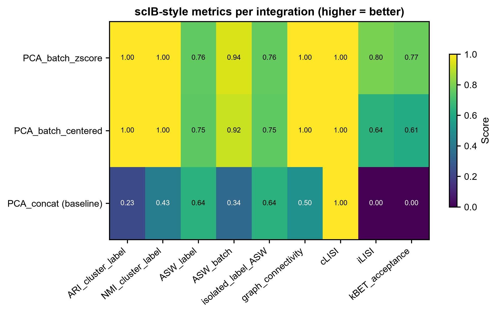
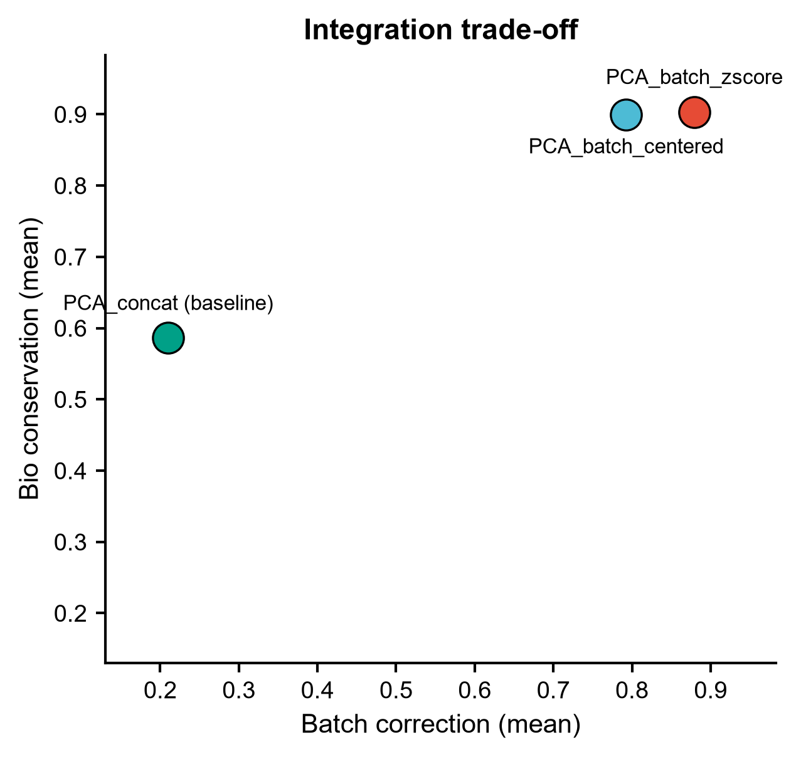
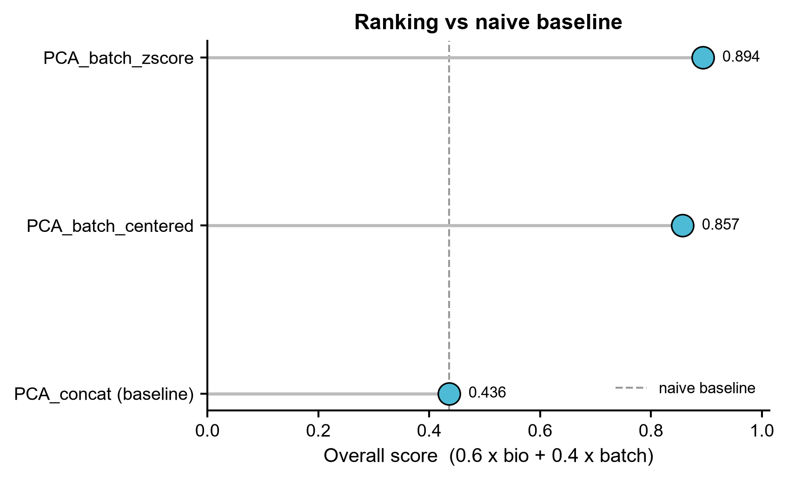

# 565 · scMultiBench — 单细胞多模态整合的基准评测打分

> 一句话定位:**输入**多模态计数(或你自己的整合 embedding)+ celltype/batch 标签 → **做**
> scMultiBench 所用的那套 scIB 指标打分(生物保留 / 批次校正 / 综合)→ **出**指标热图、
> 权衡散点、对基线的排名 lollipop。让我们自己的整合结果能用**同一把尺子**被衡量。

| | |
|---|---|
| **语言 / 主依赖** | Python 3.12 · `numpy` `pandas` `scipy` `scikit-learn` `networkx` `matplotlib`(全部本机已有);上游路径可选 `scib` |
| **一句话用途** | 给任意整合 embedding 打 scIB 基准分,并强制与朴素 PCA 基线对比 |
| **输入** | `example_data/rna_counts.csv` + `adt_counts.csv` + `metadata.csv`,或 `--emb 名称=path.csv` |
| **输出** | `results/metric.csv` `565_summary.json` + 3 张图(展示图见 `assets/`) |
| **状态** | 🟡 本机零改动跑通出图(指标为 scIB 公式的本机近似实现);调用官方 `scib` 需另装包 |

---

## ① 输入数据

**文件 1-2**:`rna_counts.csv` / `adt_counts.csv`(csv;行=细胞,列=特征;原始 count)

| 列名 | 类型 | 必需 | 示例 | 说明 |
|------|------|:---:|------|------|
| `cell` | str | ✔ | `cell0000` | 行索引,两个模态与 metadata 必须一致 |
| `Gene001`…/`ADT01`… | int | ✔ | `26` | 该细胞该特征的 count |

**文件 3**:`metadata.csv`

| 列名 | 类型 | 必需 | 示例 | 说明 |
|------|------|:---:|------|------|
| `cell` | str | ✔ | `cell0000` | 与计数矩阵行名对应 |
| `celltype` | str | ✔ | `CT3` | 生物标签(评"生物保留") |
| `batch` | str | ✔ | `batch2` | 批次标签(评"批次校正") |

**命名/格式约定**:CSV 首行允许 `#` 注释行(脚本用 `comment="#"` 读)。评测外部 embedding 时用
`--emb 名称=path.csv`,该 CSV 行索引须为 cell、其余列为 embedding 维度,行集合与 metadata 一致。

**样例(前 3 行,`metadata.csv`)**:
```
# synthetic, for demo only -- generated for module 565, not real data
cell,celltype,batch
cell0000,CT3,batch2
```

`example_data/` 为**合成数据**(400 细胞 × 4 细胞类型 × 2 批次,RNA 150 特征 + ADT 15 特征),
刻意让**批次效应强于生物信号**,以便朴素基线明显失败、校正后明显改善。

## ② 方法 / 原理

1. **构建待评测 embedding**:各模态独立 log-CPM + z-score → 拼接 → PCA(20 维)。默认产出三个:
   `PCA_concat (baseline)`(不做任何批次校正,**朴素对照**)、`PCA_batch_centered`(批次内中心化)、
   `PCA_batch_zscore`(批次内 z-score)。装了 `harmonypy` 会自动追加 Harmony;
   自己的整合结果用 `--emb` 加进来一起排。
2. **打分**:对每个 embedding 计算 9 个 scIB 指标 ——
   生物保留 `ARI` `NMI` `ASW_label` `cLISI` `isolated_label_ASW`;
   批次校正 `ASW_batch` `graph_connectivity` `iLISI` `kBET_acceptance`。
3. **汇总**:`Overall = 0.6 × mean(bio) + 0.4 × mean(batch)`(scIB 的加权方案)。
   出图并在 `565_summary.json` 里明确写 `beats_naive_baseline`。

**关于"本机近似实现"(重要,请勿混淆)**:上游 scMultiBench 调用的是 `scib` 包。本机没有 `scib`,
所以默认路径是**按公开公式用 numpy/sklearn/networkx 重算**,与官方管线有两处已知偏差:
(a) 聚类用 KMeans(k = 真实细胞类型数),而 scIB 用 optimised Leiden;
(b) cLISI/iLISI 用 kNN 邻域的离散 inverse-Simpson,未做 LISI 的 perplexity 距离加权;
kBET 用邻域批次组成对全局组成的卡方检验的接受率。**数值可与官方结果不同,不能直接与论文表格并列引用。**

**上游路径 `--use-scib`(守卫式)**:装了 `scib` 才会执行,调用形式**逐字取自**上游脚本
`evaluation_pipelines/scib_metrics/scib_metrics.py`(2026-07 抓取),例如
`scib.me.clisi_graph(adata, label_key="celltype", type_="embed", use_rep="X_emb")`、
`scib.me.silhouette_batch(adata, batch_key="batch", label_key="celltype", embed="X_emb")`、
`scib.me.kBET(adata, batch_key="batch", label_key="celltype", type_="embed", embed="X_emb")`。
未装则打印安装命令后跳过,**不静默降级**。
**API 溯源(2026-07-21 复核,两级都落到真实源码)**:

1. **上游调用形式** — 逐字比对本地克隆的 `PYangLab/scMultiBench@main`
   `evaluation_pipelines/scib_metrics/scib_metrics.py`,本模块 12 个 `scib.me.*` 调用
   与该文件 **L87–L112** 的函数名、关键字参数、参数顺序完全一致。
2. **被调函数确实存在** — `theislab/scib@HEAD` 源码已克隆到本地
   (`upstream-sources/_dependency_theislab_scib/`),逐个核对 `def` 签名:
   `ari`(ari.py:16)、`nmi`(nmi.py:17)、`silhouette`(silhouette.py:12)、
   `silhouette_batch`(silhouette.py:58)、`isolated_labels_asw`(isolated_labels.py:85)、
   `isolated_labels_f1`(isolated_labels.py:9)、`clisi_graph`(lisi.py:117)、
   `ilisi_graph`(lisi.py:40)、`graph_connectivity`(graph_connectivity.py:6)、
   `kBET`(kbet.py:10);全部经 `scib/metrics/__init__.py` 导出,`scib.me = metrics`
   别名见 `scib/__init__.py:34`。所用关键字参数名全部命中。

**`iso_threshold` 跟随上游**:scib 文档定义其为 "max number of batches per label for label
to be considered as isolated";上游 `scib_metrics.py:72` 传 `num = np.max(batch)+1`
(= n_batches+1,等于把所有 label 都视作 isolated),而 **scib 自身默认 `None`**(取 label
出现的最小批次数)。本模块默认 `None` → 按上游折算成 `n_batches+1`,而非沿用 scib 默认。

> ⚠ **这条路径未执行验证(honest status)**:本机没有安装 `scib`,`kBET` 还额外需要 R 的
> `kBET` 包 + `rpy2`(pip 装 scib 不会带上)。因此 `--use-scib` 只经过**静态 API 核对**
> (函数名/参数名已落到上面两级真实源码),**从未真正跑通**。实现上做了三处加固:
> (a) 把 `sc.pp.neighbors(adata, use_rep="X_emb")` 提到所有指标之前 ——
> `graph_connectivity` 缺 `adata.uns["neighbors"]` 会 `raise KeyError`
> (`scib/metrics/graph_connectivity.py:44-45`),而 `clisi_graph`/`ilisi_graph` 内部
> 经 `recompute_knn()`(`lisi.py:199`,`type_="embed"` 分支自建 knn;调用点
> `lisi.py:96`/`lisi.py:177`)自建 knn,提前算不影响它们;
> (b) `iso_threshold` 按上游折算(见上);
> (c) 每个指标单独 `try`,失败只写 `<指标>_error` 而不让整轮评测崩掉。
> 默认路径(本机近似实现)不受影响。

**上游未在本模块固定的部分**:scMultiBench 共 5 条评测线,本模块只封装
dimension-reduction + batch-correction + clustering 这一条(上游把这三者归为一组、
共用 `scib_metrics.py`,分组方式见上游 `evaluation_pipelines/README.md`)。另外 4 条:
`classification/`、`imputation/`、`spatial_registration/`(三者目录均在上游树中);
以及 **feature selection** —— 上游 `evaluation_pipelines/README.md` 记录其脚本为
`evaluation_pipelines/fs/marker_intersection.Rmd` 与 `marker_correlation.Rmd`,
但本地克隆(258 文件:213 `.py` / 17 `.ipynb` / 12 `.R` / 7 `.md` / 3 `.yml` / 2 `.yaml` /
2 `.txt` / 2 LICENSE)**一个 `.Rmd` 都没有**,`evaluation_pipelines/` 下也没有 `fs/` 子目录
(实际子目录为 `classification/ clustering/ imputation/ scib_metrics/ spatial_registration/`)。
故 `fs/` 及 `classification_metrics.Rmd`、`sMSE.Rmd` 的存在依据**只是上游 README 的文字描述,
非本地源码文件**。上游论文级的分数归一化/跨数据集
聚合方式未在此固定,`Overall` 用的是 scIB 的 0.6/0.4 加权。

## ③ 用途

- 我们自己做完整合(scVI / Concord / Harmony / 任意方法)后,**用基准同款指标打分**,而不是只看 UMAP 好不好看;
- 在**多个整合方案里选一个**:综合分排名 + bio/batch 权衡图,一眼看出谁是"过校正"(批次分高、生物分塌);
- **防自欺**:任何"我们的整合更好"的说法,先看有没有赢过 `PCA_concat (baseline)`。

## ④ 特点 / 亮点

- **turnkey**:`python 565_scmultibench_integration_benchmark.py` 一条命令跑完,不需要装任何新包;
- **强制基线**:朴素 PCA(零批次校正)始终参评,并在 lollipop 图上画成参考虚线;
- **管道阴性对照可查**:传一个纯随机高斯 embedding(400×20)进去,batch 类指标顶到天花板
  而 bio 类指标塌到地板 —— 指标没有退化成"越乱越好"。2026-07-21 实测,跨 5 个随机种子
  (0/1/7/42/2026)的范围:

  | 指标 | 随机 embedding 实测 | 方向 |
  |---|---|---|
  | `iLISI` | 0.923(5 个种子完全一致) | batch ↑ 满分 |
  | `kBET_acceptance` | 0.945 – 0.978 | batch ↑ 满分 |
  | `graph_connectivity` | 0.985 – 1.000 | batch ↑ 满分 |
  | `ARI_cluster_label` | −0.004 – 0.003(≈ 随机水平) | bio ↓ 地板 |
  | `NMI_cluster_label` | 0.004 – 0.011 | bio ↓ 地板 |
  | `cLISI` | 0.179(5 个种子完全一致) | bio ↓ 地板 |

  复现:`np.random.default_rng(seed).normal(size=(400, 20))` 传入 `compute_metrics_local()`。
- **诚实边界**:近似实现与官方 `scib` 的差异逐条写明,官方路径以逐字核对的真实 API 封装;
- 固定随机种子 2026,路径全相对,出图一次给 PDF + PNG;
- 出图不用条形图(热图 / 散点 / lollipop)。

## ⑤ 输出结果图

| 文件 | 图型 | 说明 |
|------|------|------|
| `results/metric.csv` | 表 | 每方法 × 9 指标 + Bio/Batch/Overall |
| `results/565_summary.json` | JSON | 排名、best、是否赢过基线、实现方式与种子 |
| `assets/fig1_metric_heatmap.png` | 热图 | scIB 风格指标总览(viridis,0–1) |
| `assets/fig2_bio_vs_batch_scatter.png` | 散点 | 生物保留 vs 批次校正的权衡 |
| `assets/fig3_overall_lollipop.png` | lollipop | 综合分排名 + 朴素基线参考线 |







---

## 运行

```bash
# 零改动跑示例(本机已验证,退出码 0)
python 565_scmultibench_integration_benchmark.py

# 评测自己的整合结果(可多次 --emb)
python 565_scmultibench_integration_benchmark.py \
  --rna data/rna.csv --adt data/adt.csv --meta data/meta.csv \
  --emb scVI=results/scvi_emb.csv --emb Concord=results/concord_emb.csv \
  --outdir results/run1

# 额外走上游 scib 路径(未装 scib 会跳过并打印安装命令)
python 565_scmultibench_integration_benchmark.py --use-scib
```

## 依赖安装

默认路径**无需安装**(numpy/pandas/scipy/scikit-learn/networkx/matplotlib 本机已有)。可选:

```bash
pip install scib        # 官方指标实现,--use-scib 才需要;建议独立环境
pip install harmonypy   # 装了会自动把 Harmony 加入对比
```

## 引用

- **上游基准**:Liu C, Ding S, Kim HJ, Long S, Xiao D, Ghazanfar S, Yang P.
  Multitask benchmarking of single-cell multimodal omics integration methods.
  *Nat Methods*. 2025;22(11):2449-2460. doi:10.1038/s41592-025-02856-3 · **PMID 41083898**
  (已用 NCBI E-utilities esummary 核实标题/期刊/卷期页/DOI 与本文对应。
  上游被描述为 Registered Report,但 PubMed 的 publication type 只标 Journal Article,该点未确认。)
  仓库 <https://github.com/PYangLab/scMultiBench>(Apache-2.0)
- **指标定义**:Luecken MD, et al. Benchmarking atlas-level data integration in single-cell genomics.
  *Nat Methods*. 2022;19(1):41-50. **PMID 34949812**(scIB;本模块的指标分组与 0.6/0.4 加权来源)
