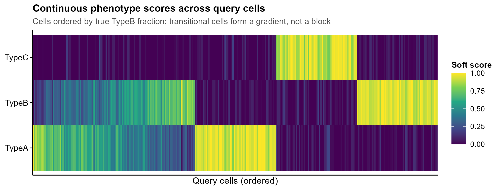
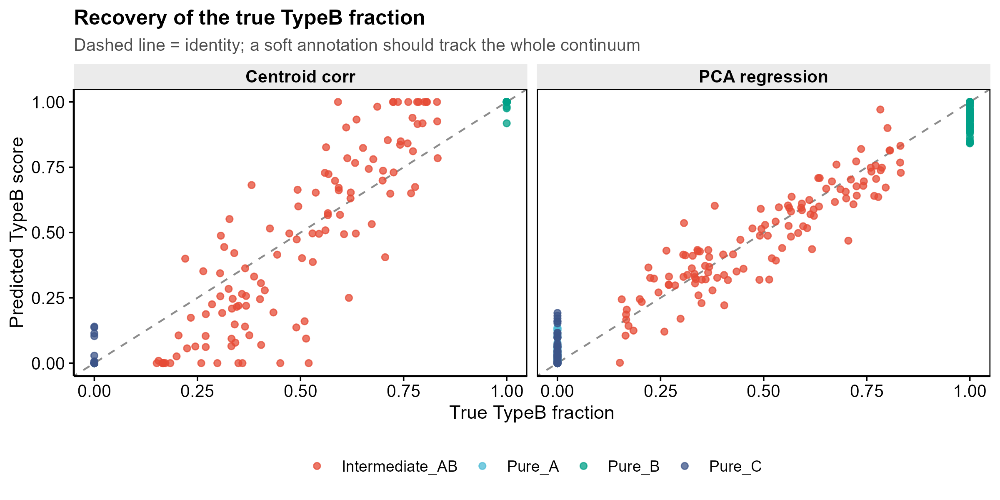
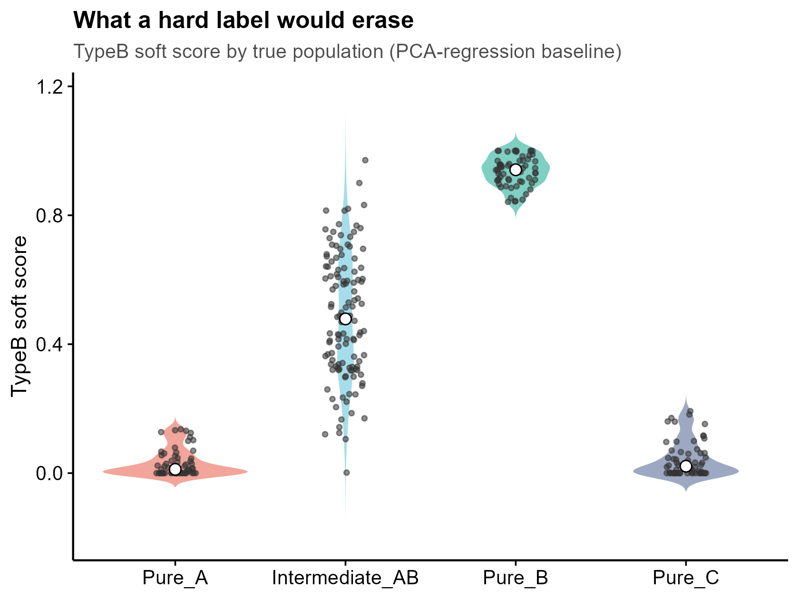
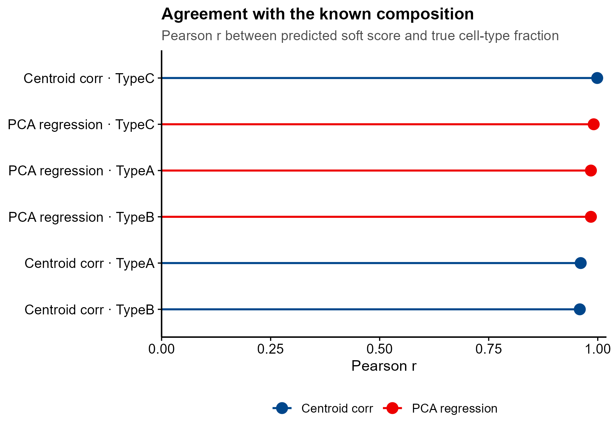

# 566 · Phi-Space 连续表型注释 (PhiSpace soft annotation)

> 一句话定位:**输入**参考集表达矩阵+细胞类型标签 与 query 表达矩阵 → **做**把 query 细胞投影到参考类型张成的表型空间、给出**每个细胞对每个类型的连续得分**(而不是一个硬标签) → **出**软得分热图、真值-预测散点、过渡态小提琴图、方法一致性棒棒糖图。

| | |
|---|---|
| **语言 / 主依赖** | R · `ggplot2`(框架 `theme_pub.R`);可选 `PhiSpace` + `SingleCellExperiment` + `S4Vectors`(需 R ≥ 4.5.0) |
| **一句话用途** | 软注释:保留中间态/过渡态细胞,不被硬标签抹平 |
| **输入** | `example_data/reference_counts.csv` `reference_metadata.csv` `query_counts.csv` `query_metadata.csv` |
| **输出** | `results/`(运行生成) · 展示图见 `assets/` |
| **状态** | 🟡 朴素基线本机零改动跑通并出图;PhiSpace 本体需装包(守卫式封装) |

---

## ① 输入数据

**文件 1**:`reference_counts.csv` / `query_counts.csv`(csv;orientation:**行=基因,列=细胞**,第一列为基因名)

| 列名 | 类型 | 必需 | 示例 | 说明 |
|------|------|:---:|------|------|
| `gene` | str | ✔ | `G001` | 第一列固定为基因名 |
| `<cell_id>` | int/num | ✔ | `3` | 每个细胞一列,原始计数(脚本内部做 CPM+log1p) |

**文件 2**:`reference_metadata.csv`

| 列名 | 类型 | 必需 | 示例 | 说明 |
|------|------|:---:|------|------|
| `cell` | str | ✔ | `R0001` | 须与 `reference_counts.csv` 列名一致 |
| `cell_type` | str | ✔ | `TypeA` | 参考类型标签,列名可用 `--label_col` 改 |

**文件 3**:`query_metadata.csv`(**可选**;仅用于评估)

| 列名 | 类型 | 必需 | 示例 | 说明 |
|------|------|:---:|------|------|
| `cell` | str | ✔ | `Q0001` | 与 query 矩阵列名一致 |
| `true_group` | str | | `Intermediate_AB` | 真实群体标签 |
| `true_<类型名>` | num | | `0.37` | 每个参考类型的**真实组成比例**;齐全时脚本自动做定量评估,缺失则跳过(真实数据的常态) |

**命名/格式约定**:参考集与 query 的基因名须可对齐(脚本取交集,交集 <10 报错);`true_*` 列名须为 `true_` + 参考类型名。

**样例(前 3 行)**:
```
gene,Q0001,Q0002,Q0003,...
G001,3,0,2,...
G002,2,0,1,...
```
```
cell,true_group,true_TypeA,true_TypeB,true_TypeC
Q0001,Pure_A,1,0,0
Q0002,Pure_A,1,0,0
```

`example_data/` 为 `set.seed(566)` 泊松模型生成的 **synthetic, for demo only** 数据:参考集 3 类各 80 个纯细胞;query = 纯 A/B/C 各 60 + **A↔B 连续过渡态 120**(混合比例 w~U(0.15,0.85) 已知),专门用来检验软注释能否还原连续混合比例。

## ② 方法 / 原理

**核心思想(上游)**:PhiSpace 不给硬标签,而是用 **PLS / PCA 回归**把 query 投影到由参考集细胞类型张成的低维「表型空间」,每个细胞得到一个**跨所有参考类型的连续得分向量**。中间态、过渡态、多细胞混合 spot 因此可以被表示为多个类型的组合,而不是被强行归入某一类。

**本模块跑的三条路**:

1. **基线 A · 质心相关**(始终跑):对每个参考类型取表达质心,算 query 细胞与各质心的 Spearman 相关 → 截断非负后按行归一为组成比例。最朴素的软打分下限。
2. **基线 B · PCA 回归软注释**(始终跑):把参考标签 dummy 编码为 Y → 参考集 log 表达做 SVD 取前 `ncomp` 个成分 → OLS 拟合 Y → 用**同一组载荷、同一组基因均值**投影 query 并预测。
   > ⚠️ 这是我们为了有对照而自己写的**朴素同构版**,思路上对应上游的 `regMethod = "PCA"`,但**不是 PhiSpace 的实现,不要当作复现 PhiSpace**。
3. **PhiSpace 本体**(`--run_phispace`,守卫式):装了才调,没装就打印真实安装命令并跳过,绝不静默降级。

同时输出 `argmax` 硬标签,用来量化「硬标签在过渡态上必然二选一」这件事——示例数据里 120 个真实过渡态细胞被硬标签劈成 TypeA=63 / TypeB=57,而纯细胞准确率是 1.000,即硬标签在纯群上完全正确、在过渡态上信息全丢。

**PhiSpace 调用签名来源(已逐个对照克隆下来的上游源码核对,源码为准)**:

| 本模块调用 | 上游源码位置 | 核对结果 |
|---|---|---|
| `PhiSpace(reference, query, phenotypes, refAssay, regMethod, ncomp, updateRef)` | `pkg/R/PhiSpaceR.R:55` | 7 个形参名全部存在;`refAssay` 默认 `"rank"`、`regMethod` 默认 `c("PLS","PCA")`、`updateRef` 默认 `FALSE` |
| `RankTransf(sce, "counts")` | `pkg/R/RankTransf.R:11` | 形参为 `assayname`(**小写 n**)、`targetAssay='rank'`、`sparse=TRUE`;本模块用**位置参数**传入 |
| 返回值取分数 `reducedDim(res, "PhiSpace")` | `pkg/R/PhiSpaceR.R` 文档段 + 函数体 | `updateRef=FALSE` 时返回**更新后的 query SCE**,归一化分数写在 `reducedDim(query, reducedDimName)`,默认名 `"PhiSpace"` |
| 二者可见性 | `pkg/NAMESPACE` | `export(PhiSpace)`、`export(RankTransf)` 均在 |

> ⚠️ 上游仓库自带的 `PhiSpace_Guide_for_VibeCoding.md` 把参数写成 `assayName`(大写 N),与 `pkg/R/RankTransf.R` 源码里的 `assayname` **不一致**——文档笔误。本模块用位置参数,不受影响。

本模块守卫路径:`RankTransf(sce,"counts")` 得到 `"rank"` assay → `PhiSpace(..., refAssay="rank", regMethod="PLS", updateRef=FALSE)` → `reducedDim(res,"PhiSpace")` 取分数。

关于 `ncomp`:上游 `pkg/R/PhiSpaceR_1ref.R:213` 是 `if(is.null(ncomp)) ncomp <- ncol(YY)`,即**默认等于表型总数**。本模块的 `--ncomp`(默认 10)是给 PCA 基线调的,语义不同,因此只在 `--ncomp <= 表型数` 时才透传给 PhiSpace,否则传 `NULL` 让上游用自己的默认。

**关于返回分数矩阵的列名**(可从源码推定):`codeY.R:27` 把 dummy 矩阵 `YY` 的列名设为参考集该 phenotype 列的取值(`colnames(YY_temp) <- labs`);`phenotype.R:53` 返回 `XX_cent %*% Bhat`,`Bhat` 的列名来自 `YY`;`normPhiScores.R:22` 在 `method="col"` 分支显式 `dimnames(Xout) <- dimnames(X)` 保留列名。因此 `reducedDim(res,"PhiSpace")` 的列名**应当**就是参考类型名。但这条是**读源码推的,本机未实跑验证**(见「依赖安装」的 R 版本限制),所以脚本仍保留守卫:只在列名能与参考类型对上时才并入并列比较,否则单独落盘并提示,避免张冠李戴。

⚠️ **PhiSpace 分数不是组成比例**:`PhiSpaceR_1ref.R` 返回的 `PhiSpaceNorm` 经过 `normPhiScores()`(默认 `method="col"`,即按列减中位数再除以最大绝对值),**结果可为负、每行不和为 1**。本模块为了和两个基线并列比较,对它套了和基线同一个 `to_comp()`(截断非负 + 按行归一)——这是**本模块施加的后处理**,不是 PhiSpace 的原生输出。原始分数始终原样落盘在 `results/phispace_scores.csv`,需要 PhiSpace 本身的数值时请用该文件,不要用比较图。

上游另有 `tunePhiSpace()` / `normPhiScores()` / `plotPhiSpaceHeatMap()`(均在 `pkg/NAMESPACE` 中导出)可做调参、归一与出图,本模块未固定,请以官方教程为准。PLS 数值结果本身本机同样未验证。

## ③ 用途

回答的科学问题:**「这个细胞更像哪一类」不是一个二选一的问题时,怎么注释?**

- 分化/转分化轨迹上的**中间态**细胞(如上皮-间质转化中间群、成纤维细胞亚状态之间的连续谱);
- 空间转录组 **Visium spot 级多细胞混合**的类型构成(上游有专门的 ST 分支);
- query 与参考集**平台不同**(scRNA→bulk atlas、scATAC→scRNA)时,硬标签往往过度自信,连续得分更能反映真实的相似度分布;
- 免疫细胞**极化连续谱**(M1/M2、Th 亚型之间)不适合离散标签的场景。

## ④ 特点 / 亮点

- **turnkey**:`Rscript 566_phispace_soft_annotation.R` 一条命令跑完,零改动出全部 4 张图;
- **自带基线**:两个用本机已有依赖就能跑的朴素软注释对照(质心相关 / PCA 回归),任何「连续注释更好」的说法都有对照,不孤零零地报;
- **自带真值**:示例数据的混合比例已知,可直接量化「软得分是否真的还原了连续谱」(示例中 PCA 回归 Pearson r≈0.98,RMSE≈0.07);
- **诚实守卫**:PhiSpace 未安装时打印真实安装命令并跳过,不用假 API 假装跑通;返回列名对不上时拒绝并列比较;
- **顶刊图风格**:统一 `theme_pub.R`,矢量 PDF + 300dpi PNG 双出;**全程无条形图**(热图 / 散点 / 小提琴 / 棒棒糖)。

## ⑤ 输出结果图

| 文件 | 图型 | 说明 |
|------|------|------|
| `assets/fig1_soft_score_heatmap.png` | 热图 (viridis) | query 细胞按真实 TypeB 比例排序 × 3 个参考类型的软得分;过渡态呈平滑梯度而非色块 |
| `assets/fig2_truth_vs_score_scatter.png` | 散点(分面) | 真实 TypeB 比例 vs 预测得分,按方法分面,虚线为 identity |
| `assets/fig3_score_by_population_violin.png` | 小提琴+抖动点 | 按真实群体看 TypeB 软得分——过渡态稳稳落在两个纯群之间,这正是硬标签抹掉的信息 |
| `assets/fig4_method_agreement_lollipop.png` | 棒棒糖图 | 各方法 × 各类型与真实组成比例的 Pearson r |









`results/` 内(不提交):`soft_scores_centroid_corr.csv`、`soft_scores_pca_regression.csv`、`hard_labels_argmax.csv`、`score_vs_truth_metrics.csv`,以及 `--run_phispace` 成功时的 `phispace_scores.csv`。

---

## 运行

```bash
# 零改动跑示例(基线 + 全部出图)
Rscript 566_phispace_soft_annotation.R

# 换成自己的数据
Rscript 566_phispace_soft_annotation.R \
  --ref_expr data/ref_counts.csv --ref_meta data/ref_meta.csv \
  --query_expr data/query_counts.csv --label_col cell_type \
  --ncomp 15 --outdir results/run1

# 装了 PhiSpace 之后再加这个开关(未装会打印安装命令并跳过)
Rscript 566_phispace_soft_annotation.R --run_phispace
```

## 依赖安装

```r
# 基线路径:本机已有 ggplot2 即可跑
install.packages("ggplot2")

# PhiSpace 本体(本机未安装,走守卫路径)
if (!requireNamespace("BiocManager", quietly = TRUE)) install.packages("BiocManager")
BiocManager::install("jiadongm/PhiSpace/pkg")   # 与上游 README 的安装命令一致
BiocManager::install(c("SingleCellExperiment", "S4Vectors"))
```

> ⚠️ **本机装不上,这是硬约束不是懒**:上游 `pkg/DESCRIPTION` 写的是 `Depends: R (>= 4.5.0)`,
> 本机为 **R 4.4.3**,低于该下限。脚本因此在 `--run_phispace` 时**先查 R 版本**,不满足就直接
> 报明原因跳过,不会伪装成跑通。
>
> 另注:`DESCRIPTION` 的 `Remotes:` 里有 `ByronSyun/vizOmics`(且 `NAMESPACE` 中 `import(vizOmics)`),
> 这是个 GitHub-only 依赖,`BiocManager::install` 未必自动解析,必要时需先
> `remotes::install_github("ByronSyun/vizOmics")`。上游 `Depends` 还包含 `SpatialExperiment`。
>
> **许可证**:上游 `pkg/DESCRIPTION` 写的是 `License: AGPL (>= 3)`(强 copyleft)。本模块只做守卫式调用、
> 未拷贝任何上游代码,但若你把 PhiSpace 嵌进要分发的产品,请自行确认 AGPL-3 的合规义务。
> 上游版本为 `Version: 1.1.0.9000`(开发版后缀 `.9000`,非正式 release tag)。

## 引用

Mao J, Deng Y, Lê Cao KA. **Φ-Space: continuous phenotyping of single-cell multi-omics data.**
*Genome Biology* 2025;26(1):323. doi:10.1186/s13059-025-03755-8 · PMID **41029411**

> 引用已核实:NCBI E-utilities esummary(db=pubmed, id=41029411)返回的标题、作者、期刊、卷期页与 DOI 与上述完全一致。
> 仓库 https://github.com/jiadongm/PhiSpace · 文档 https://jiadongm.github.io/PhiSpace/
> 上游另有 ST 分支论文(Φ-Space ST,Cell Reports Methods),本模块未涉及。
