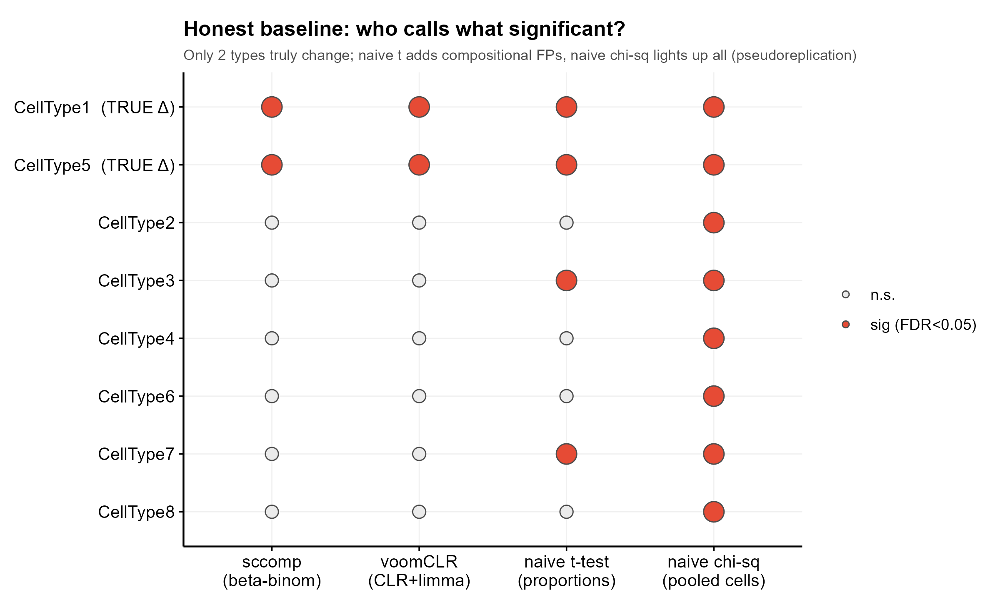
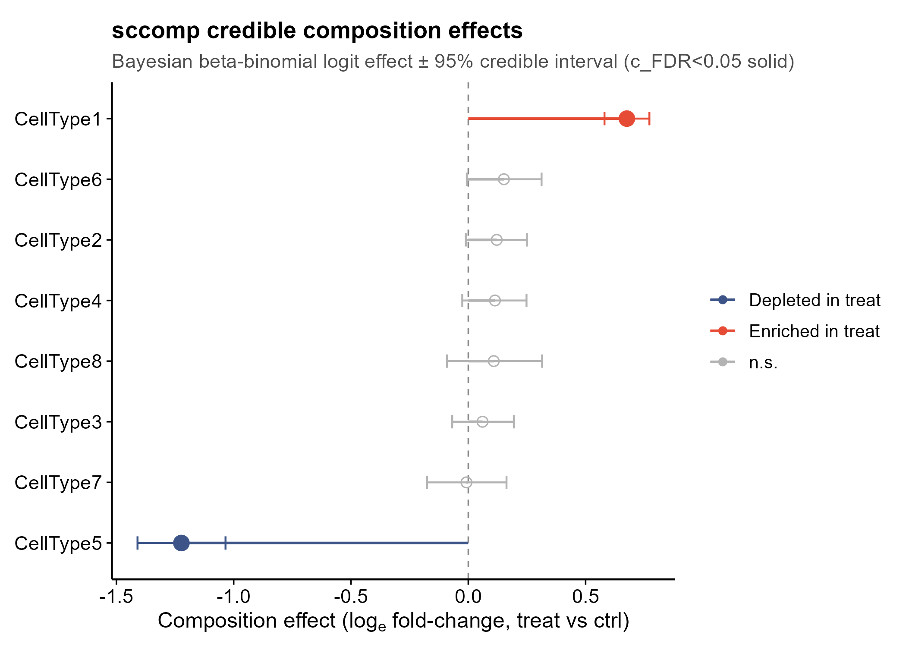

<!-- 图中文字英文,正文中文。 -->

# 557 · 单细胞细胞组成差异检验 sccomp Compositional Differential Abundance

> 一句话定位:输入【各样本 × 各细胞类型的计数】→ 用贝叶斯 sum-constrained
> beta-binomial 检验【细胞类型比例】是否随条件变化 → 出可信效应 lollipop / 比例
> raincloud / 配对组成 boxplot，并**内置 3 种诚实基线对照**(naive t / naive 卡方 /
> voomCLR)直观暴露组成性数据误用导致的假阳性。

| | |
|---|---|
| **语言 / 主依赖** | R · `sccomp`(贝叶斯主方法) `voomCLR`+`limma`(2026 对照) `ggplot2` `ggbeeswarm` `dplyr` `tidyr` |
| **一句话用途** | 细胞组成差异丰度(differential abundance / composition）：建模各样本细胞比例随条件变化 |
| **输入** | `example_data/composition_counts.csv`（long-format：sample / cell_group / count / condition） |
| **输出** | `results/`（5 个 CSV，运行生成） · 展示图见 `assets/`（4 张 PDF+PNG） |

---

## ① 输入数据

**文件**：`composition_counts.csv`（类型：csv；long-format，行 = 一个样本中一个细胞类型的计数）

| 列名 | 类型 | 必需 | 示例 | 说明 |
|------|------|:---:|------|------|
| `sample` | str | ✔ | `ctrl_1` | 样本 ID（生物学重复单位；DA 检验在此层级进行） |
| `cell_group` | str | ✔ | `CellType1` | 细胞类型 / 聚类标签 |
| `count` | int | ✔ | `878` | 该样本中该类型的细胞数 |
| `condition` | str | ✔ | `treat` | 样本级协变量（比较的分组）；每个 `sample` 唯一对应一个 `condition` |

**命名/格式约定**：`count` 必须为整数计数（不是比例）；`condition` 须为样本级（同一 sample 的所有
行 condition 相同）。旁置 `composition_truth.csv` 为**合成数据的真值表**（仅 demo 用于 sanity-check
与图注，真实数据无此文件，脚本自动跳过）。

**样例(前 4 行)**：
```
sample,cell_group,count,condition
ctrl_1,CellType1,878,ctrl
ctrl_1,CellType2,623,ctrl
ctrl_1,CellType3,427,ctrl
```

**从真实 Seurat / SCE 取输入**（README 示例，不在脚本内执行）：
```r
# Seurat: meta.data 含 orig.ident(样本) / cell_type / group(条件)
df <- as.data.frame(table(seu$orig.ident, seu$cell_type))
colnames(df) <- c("sample","cell_group","count")
df$condition <- meta$group[match(df$sample, meta$sample)]
write.csv(df, "data/counts.csv", row.names = FALSE)
# 然后: Rscript 557_sccomp_composition_da.R --input data/counts.csv
```

## ② 方法 / 原理（含 ★诚实基线）

**主方法 — sccomp（Mangiola et al., *PNAS* 2023）**：
1. 把各样本"细胞落入各类型"的计数视为 **sum-constrained beta-binomial**（尊重比例和=1 的组成性，
   各类型非独立）；
2. `formula_composition = ~condition` 估计比例随条件的 **logit 效应** `c_effect` ± 95% 可信区间；
   `formula_variability = ~condition` 同时建模**差异变异性**（离散度随条件变，sccomp 特色）；
3. 经验贝叶斯收缩 + 离群稳健 → 小样本(每组 ~5)也稳健；`sccomp_test()` 给后验 H0 概率 `c_pH0` 与
   FDR `c_FDR`；`sccomp_proportional_fold_change()` 把 logit 效应转成可解释的比例倍数。

**★诚实基线对照（本模块核心卖点，三种并列）**：
- **naive 比例 t-test**：把各类型比例当**独立连续量**做 Welch t 检验 —— 组成性数据的经典误用。
  比例被迫和=1，少数类型真变会**被动**推移其余"稳定"类型的观测比例 → 误判它们显著（**组成性假阳性**）。
- **naive 卡方**：把所有样本的细胞**汇总**成 类型×条件 列联表做卡方 —— 忽略样本层级变异、把上万个
  细胞当独立观测（**伪重复 pseudoreplication**）→ n 极大致几乎全部"显著"。
- **voomCLR（2026 对照，Stijn Hawinkel et al.）**：CLR 中心对数比变换 + `limma` 经验贝叶斯 +
  偏倚校正（`applyBiasCorrection`/`topTableBC`）。组成性感知的**频率派**对照，远优于 naive，但 CLR 的
  几何均值参照会随真变类型漂移，个别稳定类型仍可能残留弱假阳性。

→ 四法并排：展示"**组成性建模 + 样本级层级**"如何同时压住伪重复(卡方)与组成性反弹(naive t)两类假阳性。

## ③ 用途

回答 **"两条件(如 treat vs ctrl / disease vs healthy)间，哪些细胞类型的比例显著改变?"** ——
单细胞 / 空间转录组下游标配分析(细胞组成重塑),用于免疫浸润变化、治疗响应、疾病进展等场景。
相比同目录 **558(Milo 邻域 DA,无需离散聚类的连续状态富集)**,本模块面向**已注释离散细胞类型**的
组成比较,二者互补。

## ④ 特点 / 亮点

- **turnkey**:一条命令即跑,自动生成合成数据 + 编译/缓存 Stan 模型 + 出图;
- **★内置诚实基线**:naive t / naive 卡方 / voomCLR 三法并排,直观暴露组成性数据误用陷阱
  (合成示例仅 2 类真变 → naive_t 判 4 个、naive 卡方判 8 个全显著、sccomp 与 voomCLR 干净判 2 个);
- **管道有效性自检(sanity-check)**:打印 sccomp 在真变类型上的 TP 与不变类型上的 FP,对齐真值;
- **顶刊级合成图(禁条形图)**:配对组成 boxplot+样本点 / 可信效应 lollipop(色=方向) / 比例 raincloud
  / 四法显著性 dot-matrix;
- **接地真实 API 不臆造**:全部函数(`sccomp_estimate`/`sccomp_test`/`sccomp_proportional_fold_change`/
  `voomCLR`/`applyBiasCorrection`/`topTableBC`)均最小实跑确认;并修复了 sccomp 两个真实坑(见下)。

> **两个已修复的 sccomp 真实坑**(本机实测):
> 1. **模型缓存到不可写构建路径**:sccomp 1.10.0 把编译好的 Stan 模型缓存到**构建机器**的绝对路径
>    `C:\Users\biocbuild\...\.sccomp_models\`,本机不可写 → 估计直接报 *cannot open the connection*。
>    脚本用 `assignInNamespace()` 把包内常量 `sccomp_stan_models_cache_dir` 改指到用户可写目录修复。
> 2. **自带绘图方法在 ggplot2 4.x 下失效**:`sccomp_boxplot()` / `plot_1D_intervals()` 用了已弃用的
>    S3 theme 构造(报 *must be an <S7_object>*)→ 本脚本**不依赖其绘图方法**,全部从 `sccomp_test`
>    结果自绘顶刊图(也符合框架 §3:不用包默认简陋图)。

## ⑤ 输出结果图

| 文件 | 图型 | 说明 |
|------|------|------|
| `assets/fig1_composition_boxplot.png` | 分面 boxplot + 样本点 | 各类型在两条件下的样本级比例分布;`*` = sccomp 显著 |
| `assets/fig2_sccomp_credible_lollipop.png` | lollipop + 可信区间 | sccomp logit 效应 ± 95% CI;色=富集/耗竭方向,显著实心 |
| `assets/fig3_proportion_raincloud.png` | raincloud(violin+box+点) | 各类型比例分布按条件分色;代替条形图 |
| `assets/fig4_baseline_method_comparison.png` | 四法显著性 dot-matrix | ★核心对照图:谁判谁显著;真变类型置顶标 (TRUE Δ) |




**结果表**(`results/`):`sccomp_composition_DA.csv`(主结果:c_effect/c_FDR/比例倍数/statement)、
`baseline_naive_ttest.csv`、`baseline_naive_chisq.csv`、`baseline_voomCLR.csv`、
`method_comparison_significance.csv`(四法显著性对照)、`sessionInfo.txt`(依赖版本快照)。

---

## 运行

```bash
# 零改动跑示例(首次会编译 Stan 模型,稍慢;之后从缓存秒载)
Rscript 557_sccomp_composition_da.R

# 换成自己的数据 + 调阈值
Rscript 557_sccomp_composition_da.R --input data/counts.csv --fdr 0.05 --lfc 0.2
```

参数:`--input` long-format CSV;`--fdr` 显著阈值(默认 0.05);`--lfc` sccomp 检验的 logit 效应阈值
`test_composition_above_logit_fold_change`(默认 0.10,≈10% 比例变化);`--cores` Stan 并行核数;
`--outdir` 输出目录。

## 依赖安装

```r
# Bioconductor
BiocManager::install(c("sccomp", "limma", "edgeR"))
# voomCLR(GitHub;CLR + limma 的 2026 组成性 DA 法)
remotes::install_github("statOmics/voomCLR")
# CRAN
install.packages(c("ggplot2", "ggbeeswarm", "dplyr", "tidyr"))
```

> sccomp 需 `cmdstanr` + 已安装的 cmdstan(本模块在 cmdstan 2.39.0 上验证)。首次运行会编译 Stan
> 模型并缓存到 `~/.sccomp_models/<version>/`(脚本已自动处理缓存路径)。
