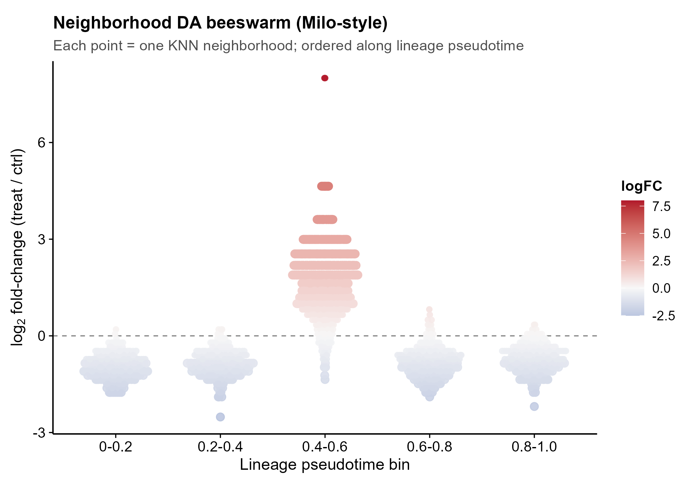
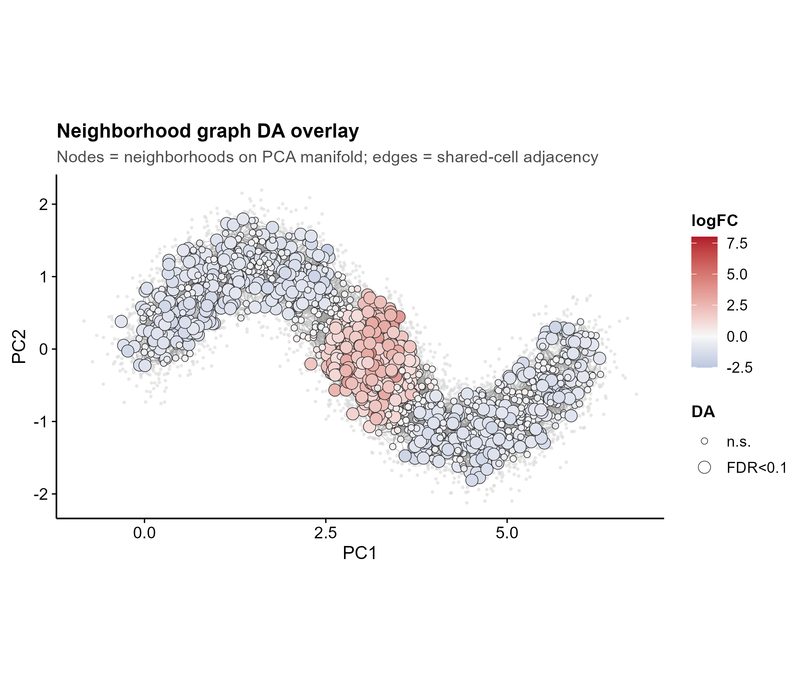
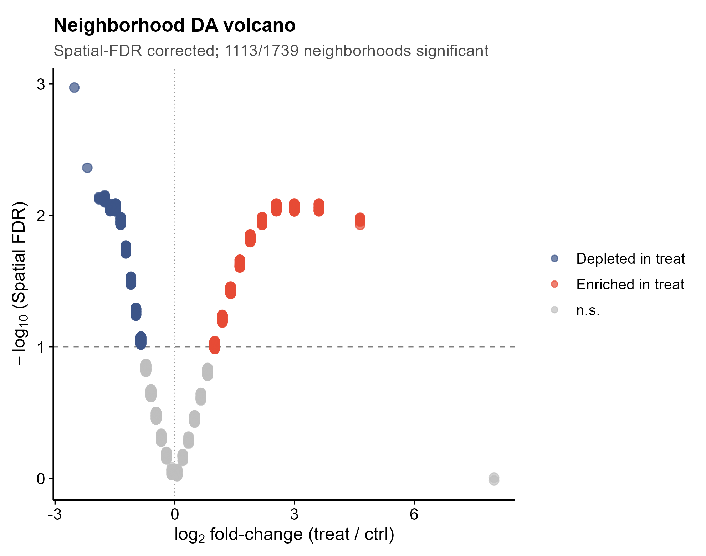
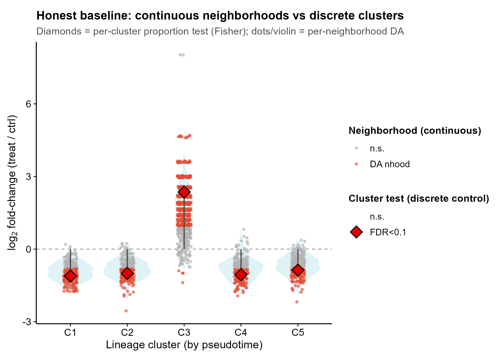

<!-- 图中文字英文,正文中文。 -->

# 558 · Milo KNN 邻域差异丰度 Milo neighborhood differential abundance

> 🟡 **降级模块(DEGRADED)**:`miloR` 当前装不上(Bioc `loadNamespace` 失败)。脚本**接地真实 miloR API**(经官方 vignette 确认),并提供**完全跑通、自包含的降级实现**(BiocNeighbors + 手算邻域 + 共享离散度 GLM,概念等价复现 Milo),无需缺失包即可出图。装上 miloR 后脚本自动改走官方实现。

> 一句话定位:输入连续流形的 **SingleCellExperiment(reducedDim + 两条件)** → 在 **KNN 图的代表性邻域**上检验细胞密度随条件变化(**无需先离散聚类**)→ 出 **DA beeswarm / 邻域图叠加 / 邻域 volcano**,并内置 **离散簇比例检验作诚实对照**。

| | |
|---|---|
| **语言 / 主依赖** | R · (优先) `miloR`;(降级,已装) `BiocNeighbors` `SingleCellExperiment` `igraph` `ggbeeswarm` `ggplot2` |
| **一句话用途** | 连续状态(发育谱系/轨迹)上的差异丰度:把"哪段轨迹在某条件下细胞富集/缺失"定位到 KNN 邻域,比离散簇法分辨率更高 |
| **输入** | 脚本内合成 `SingleCellExperiment`(synthetic demo only);真实数据见下方规格 |
| **输出** | `results/`(运行生成 DA 结果表) · 展示图见 `assets/` |

---

## ① 输入数据

本模块输入为 **`SingleCellExperiment`(SCE)对象**,合成示例脚本内生成(`synthetic, for demo only`)。真实数据替换 `make_sce()` 即可,需满足:

| 组件 | 类型 | 必需 | 说明 |
|------|------|:---:|------|
| `reducedDim(sce, "PCA")` | matrix(cell × dim) | ✔ | 降维坐标(PCA/Harmony/scVI 隐空间均可),建 KNN 图与定义邻域用 |
| `colData$sample` | factor/str | ✔ | **生物学重复样本** ID(DA 检验在样本层级做,≥2 样本/条件) |
| `colData$condition` | factor | ✔ | 两条件(如 `ctrl`/`treat`),DA 比较的分组 |
| `colData$cluster` | factor | ○ | 离散簇标签 —— **仅供诚实基线对照**与邻域注释;邻域 DA 本身不需要 |
| `colData$ptime` | num | ○ | 谱系拟时序 —— 用于 beeswarm 排序与 sanity-check;无则用 PC1 替代 |

**合成示例设计**:6 样本(`ctrl×3` / `treat×3`),一条 2D 连续轨迹(PC1 随拟时序单调);**真信号** = 拟时序窗口 `ptime∈[0.47,0.58]` 在 `treat` 下额外富集 0.8× 背景密度 → 期望该段邻域检出明确正 `logFC`,其余段因构成性(compositional)效应轻度负 `logFC`。

## ② 方法 / 原理

**核心思想(Milo, Dann et al. *Nat Biotechnol* 2022)**:不先把细胞硬切成离散簇,而是在 KNN 图上抽样"代表性邻域"(每个 = 一个 index 细胞 + 其 K 近邻),对**每个邻域**按样本计数,用 NB-GLM 检验条件间丰度差异 → 连续状态也能定位局部富集。

流程(**接地真实 miloR API**,经官方 vignette `milo_gastrulation.Rmd` 确认):

```
Milo(sce) → buildGraph(k,d,reduced.dim) → makeNhoods(prop,k,refined)
→ countCells(sample=) → calcNhoodDistance → testNhoods(design=~condition, design.df)
→ annotateNhoods(coldata_col) → buildNhoodGraph → plotDAbeeswarm / plotNhoodGraphDA
```
返回的 DA 表含 `logFC` / `PValue` / `SpatialFDR`(重叠邻域加权的多重检验校正)。

**🟡 降级实现(本机 miloR 装不上时,自动启用,概念等价)**:
1. **KNN 图**:`BiocNeighbors::findKNN(reducedDim, k)`(真实 API);
2. **代表性邻域**:按 `prop` 抽样 index 细胞,`refined` 近似(吸附到局部密度中心),邻域 = index + K 近邻;
3. **计数**:每邻域 × 每样本 计细胞数;
4. **检验**:每邻域 `glm(counts ~ condition + offset(log lib.size), poisson)` 取 `logFC` + SE;**全邻域汇总 Pearson 残差估一个共同离散度 phi**(= edgeR/miloR 的 common-dispersion,显著提升小样本功效),用 phi 缩放得 quasi-likelihood p 值;
5. **Spatial FDR**:接地 `miloR::graphSpatialFDR` 思路的**加权 Benjamini–Hochberg**(权重 = 邻域第 k 近邻距离,校正邻域重叠导致的检验非独立)。

> ★诚实基线对照(`fig4`):**同一份数据**按离散簇(`cluster`)做"每簇细胞比例"的 **Fisher 检验**。预期对比 —— 邻域法把局部富集定位到峰值 `logFC`,而簇法把整簇平均 → 信号被簇内非富集细胞稀释,峰值偏小。脚本实测:邻域法峰值 `|logFC|≈4.6` vs 簇法 C3 `|logFC|≈2.4`,**连续法定位更锐**。

## ③ 用途

回答:**"在某条件下,连续轨迹/状态谱的哪一段细胞密度发生了变化?"** 典型场景:发育/分化轨迹上的条件差异(疾病 vs 健康、处理 vs 对照)、连续激活态(T 细胞耗竭梯度、纤维化连续谱)等**离散聚类会丢信息**的场景。

## ④ 特点 / 亮点

- **turnkey**:一条命令即跑(合成数据 in-script 生成,CPU 秒级)。
- **接地真实工具不臆造**:官方 miloR 函数序列/参数取自 vignette;降级路径只用已装基础包,API 真实。
- **★内置诚实基线**:邻域法 vs 离散簇法并排,证明连续法的分辨率优势(而非只报好看指标)。
- **结果可信性自检**:正向 DA 邻域的拟时序中位落入真信号窗 `[0.47,0.58]`(脚本打印 sanity-check),验证管道有效。
- **顶刊级图**:beeswarm / 流形网络叠加 / volcano,发散配色(RdBu),矢量 PDF+PNG;**无平凡条形图**。

## ⑤ 输出结果图

| 文件 | 图型 | 说明 |
|------|------|------|
| `assets/fig1_DA_beeswarm.png` | DA beeswarm | 邻域按谱系拟时序分箱,y=logFC,色=logFC;真信号窗(0.4-0.6)整体上移=富集 |
| `assets/fig2_nhood_graph_DA.png` | 邻域图网络叠加 | 邻域为节点布于 PCA 流形,边=共享成员邻接,色=logFC;红色富集区精准落在轨迹中段 |
| `assets/fig3_DA_volcano.png` | 邻域 volcano | x=logFC, y=-log10(SpatialFDR);红=treat 富集 / 蓝=缺失 / 灰=n.s. |
| `assets/fig4_baseline_nhood_vs_cluster.png` | ★诚实基线对照 | 每簇:邻域法 logFC 分布(violin+jitter)vs 簇法 Fisher 检验(菱形);连续法峰值更高=分辨率优势 |






---

## 运行

```bash
# 零改动跑合成示例(降级路径,无需 miloR)
Rscript 558_milo_neighborhood_da.R

# 调参(邻域 K、抽样比例、显著阈值)
Rscript 558_milo_neighborhood_da.R --k 50 --prop 0.1 --fdr 0.05
```

换真实数据:在脚本 `make_sce()` 处替换为你的 SCE(对齐 `reducedDim("PCA")` + `colData$sample/condition`),其余不动。

## 依赖安装

```r
# ★ 推荐:装上 miloR 后脚本自动走官方实现(本机当前 Bioc loadNamespace 失败 → 降级)
BiocManager::install("miloR")          # 建议在 Linux 服务器装(依赖 igraph/edgeR/BiocNeighbors 编译)

# 降级路径所需(本机已装):
BiocManager::install(c("SingleCellExperiment","BiocNeighbors"))
install.packages(c("igraph","ggbeeswarm","ggplot2"))
```

> 🟡 **降级与服务器说明**:本机 `requireNamespace("miloR")` / `library(miloR)` 失败(Bioc `loadNamespace` error),故脚本默认走**降级实现**并出图(已验证退出码 0、4 图非空)。要跑**官方 miloR** 实现,请在能装上 `miloR` 的环境(推荐 Linux 服务器)运行;脚本顶部 `USE_MILO` 自动探测,装上即切换,无需改代码。降级实现是 Milo 算法的**概念等价复现**(同样的 KNN 邻域 + 共享离散度 GLM + 加权 BH Spatial FDR),用于演示与冒烟测试;正式分析请以官方 miloR 结果为准。
