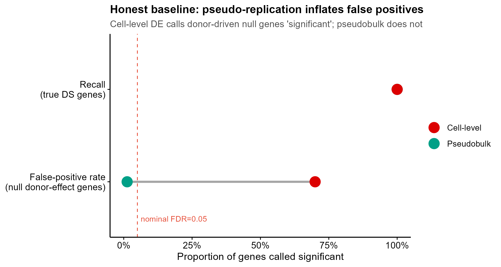
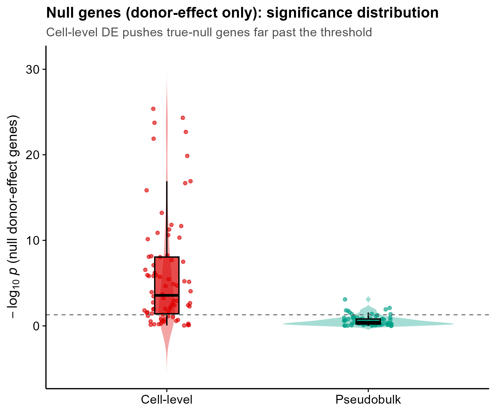
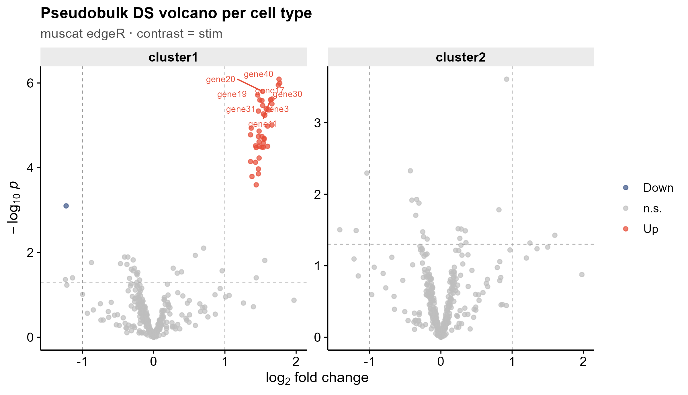
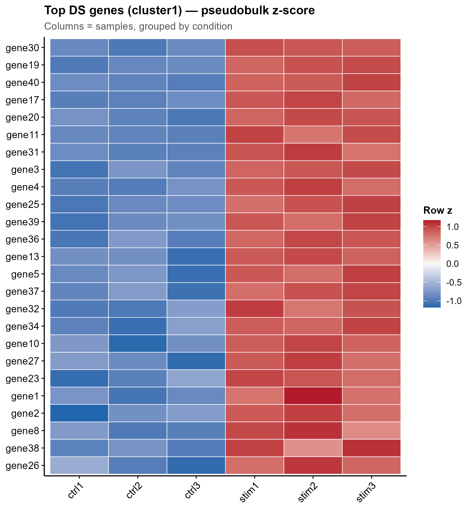

<!-- 图中文字英文,正文中文。 -->

# 559 · 单细胞多样本多条件 pseudobulk 差异状态 muscat pseudobulk DS

> 一句话定位:**输入**多样本×多条件的 scRNA(SingleCellExperiment)→ **做**样本级 pseudobulk 聚合 + edgeR/limma-voom/DESeq2 差异状态(DS)检验,并内置 cell-level DE 诚实基线 → **出**伪重复危害量化对照图 + 每细胞类型火山/DS 热图/top-DS lollipop。

| | |
|---|---|
| **语言 / 主依赖** | R · `muscat` `SingleCellExperiment` `scater` `edgeR` `limma` (`DESeq2` 可选) `ggplot2` |
| **一句话用途** | 多样本多条件 scRNA 的 2026 金标准差异状态分析,避免把单个细胞当独立样本造成的伪重复(I 类错误膨胀) |
| **输入** | `--input` 一个 `.rds`(SCE);缺省自动生成 `example_data/demo_sce.rds`(synthetic, demo only) |
| **输出** | `results/`(运行生成,表+sessionInfo) · 展示图见 `assets/` |

---

## ① 输入数据

**文件**:一个 `SingleCellExperiment` 对象(`.rds`),`assays` 含 `counts`,`colData` 含三列:

| 列名 | 类型 | 必需 | 示例 | 说明 |
|------|------|:---:|------|------|
| `cluster_id` | factor/str | ✔ | `cluster1` / `T cell` | 细胞类型 / 亚群标签 |
| `sample_id` | factor/str | ✔ | `ctrl1` / `donorA_t0` | 生物学样本(供体),DS 的"重复单元" |
| `group_id` | factor/str | ✔ | `ctrl` / `stim` | 实验条件(2 水平,对比的两端) |

**命名/格式约定**:每个 `group_id` 须含 ≥2 个不同 `sample_id`(否则无法在样本水平做差异检验);`counts` 为原始计数(非 log)。缺省 `--input` 时脚本内生成合成 SCE:400 基因 × 840 细胞 = 6 样本(2 条件 × 3 重复)× 2 细胞类型,其中 40 个真 DS 基因(仅 cluster1/stim 上调),80 个"无条件效应但带供体随机效应"的 null 基因(伪重复陷阱)。

**样例(colData 前 3 行)**:
```
        cluster_id sample_id group_id
cell1     cluster1     ctrl1     ctrl
cell2     cluster1     ctrl1     ctrl
cell3     cluster1     ctrl1     ctrl
```

## ② 方法 / 原理与诚实基线

**金标准流程(muscat;Crowell et al., Nat Commun 2020)**:
1. `prepSCE()` —— 规范 `cluster_id`/`sample_id`/`group_id` 元数据;
2. `aggregateData(by = c("cluster_id","sample_id"), fun="sum")` —— 把同一(细胞类型 × 样本)的细胞 counts **求和**成 pseudobulk profile,得到 "每细胞类型一份 样本×基因 矩阵";
3. `pbDS(method = "edgeR" / "limma-voom" / "DESeq2")` —— 在每个细胞类型内,以**样本**为观测单元、对 `group_id` 做 bulk 级差异检验;`resDS()` 拍平成 tidy 结果表(`logFC` / `p_val` / `p_adj.loc`)。

**★诚实基线(第 7 类铁律 · 防伪重复)**:脚本对同一份数据另做一遍 **cell-level DE**——把每个细胞当独立样本,直接用 edgeR QLF 检验 `group_id`(忽略样本结构)。合成数据在 80 个 null 基因上注入了**样本(供体)随机效应**,它们没有真实条件差异。两法在已知 truth 上对照实测:

| 方法 | null(供体效应)基因假阳性率 | 真 DS 基因召回 | 显著基因总数 |
|------|:---:|:---:|:---:|
| Pseudobulk(muscat,正确) | **1.3%** | 100% | 41 |
| Cell-level DE(伪重复) | **70%** | 100% | 155 |

> 解读:cell-level 把有效样本量虚增到细胞数,p 值被严重低估,把 70% 的供体波动 null 基因误判显著;pseudobulk 把 I 类错误拉回名义 FDR(~1%),同时不损失真信号召回。这正是"不要把细胞当样本"的量化证据。

## ③ 用途

回答:**在有生物学重复的多样本 scRNA 实验里,哪些基因在某个细胞类型内随条件(疾病/处理/时间点)真正发生了表达状态改变?** 典型场景:病例 vs 对照的细胞类型特异 DEG、药物刺激前后、多供体 atlas 的条件比较。pseudobulk 是这类设计的统计正确做法,审稿人普遍要求(取代早期"Seurat FindMarkers 跨条件"那种伪重复分析)。

## ④ 特点 / 亮点

- **turnkey**:`Rscript 559_muscat_pseudobulk_ds.R` 一条命令,缺省合成数据,CPU 秒级跑通;
- **真包实跑**:全程 muscat 真实 API(`prepSCE`/`aggregateData`/`pbDS`/`resDS`),非 stub;
- **★内置诚实基线**:同数据 pseudobulk vs cell-level 对照,在已知 truth 上量化伪重复的假阳性爆炸(70% vs 1.3%),并出专门对照图;
- **顶刊级合成图(无平凡条形)**:pseudobulk MDS(按样本)、每细胞类型 facet 火山、行 z-score DS 热图、top-DS lollipop、基线对照 dumbbell + null 基因 significance violin/raincloud;
- 一次出**矢量 PDF + 300dpi PNG**,图中文字英文;路径全相对、固定种子、末尾 `sessionInfo()` 锁依赖。

## ⑤ 输出结果图

| 文件 | 图型 | 说明 |
|------|------|------|
| `assets/fig1_pseudobulk_mds.png` | MDS 散点 | 按样本的 pseudobulk MDS,质控:样本是否按条件分离 |
| `assets/fig2_volcano_per_celltype.png` | facet 火山 | 每细胞类型 DS 火山(cluster1 有真信号,cluster2 无) |
| `assets/fig3_ds_heatmap.png` | 行 z 热图 | top DS 基因 × 样本,列按条件分组(ctrl 蓝 / stim 红 块状分离) |
| `assets/fig4_top_ds_lollipop.png` | lollipop | 按 \|log2FC\| 排序的显著 DS 基因,点大小=−log10 p |
| `assets/fig5_honest_baseline_dumbbell.png` | dumbbell | ★pseudobulk vs cell-level 的实测假阳性率/召回对照 |
| `assets/fig6_null_pvalue_distribution.png` | violin+raincloud | ★null 供体基因的 −log10 p 分布,cell-level 被推过阈值、pseudobulk 贴零 |






---

## 运行

```bash
# 零改动跑合成示例(自动生成 example_data/demo_sce.rds)
Rscript 559_muscat_pseudobulk_ds.R

# 换成自己的 SCE(colData 须含 cluster_id/sample_id/group_id;assays 含 counts)
Rscript 559_muscat_pseudobulk_ds.R --input data/my_sce.rds --outdir results/run1

# 切换 pseudobulk 引擎(edgeR 默认 / limma-voom / DESeq2)
Rscript 559_muscat_pseudobulk_ds.R --method DESeq2
```

## 依赖安装

```r
if (!requireNamespace("BiocManager", quietly = TRUE)) install.packages("BiocManager")
BiocManager::install(c("muscat", "SingleCellExperiment", "scater", "edgeR", "limma", "DESeq2"))
install.packages(c("ggplot2", "ggrepel"))
```
