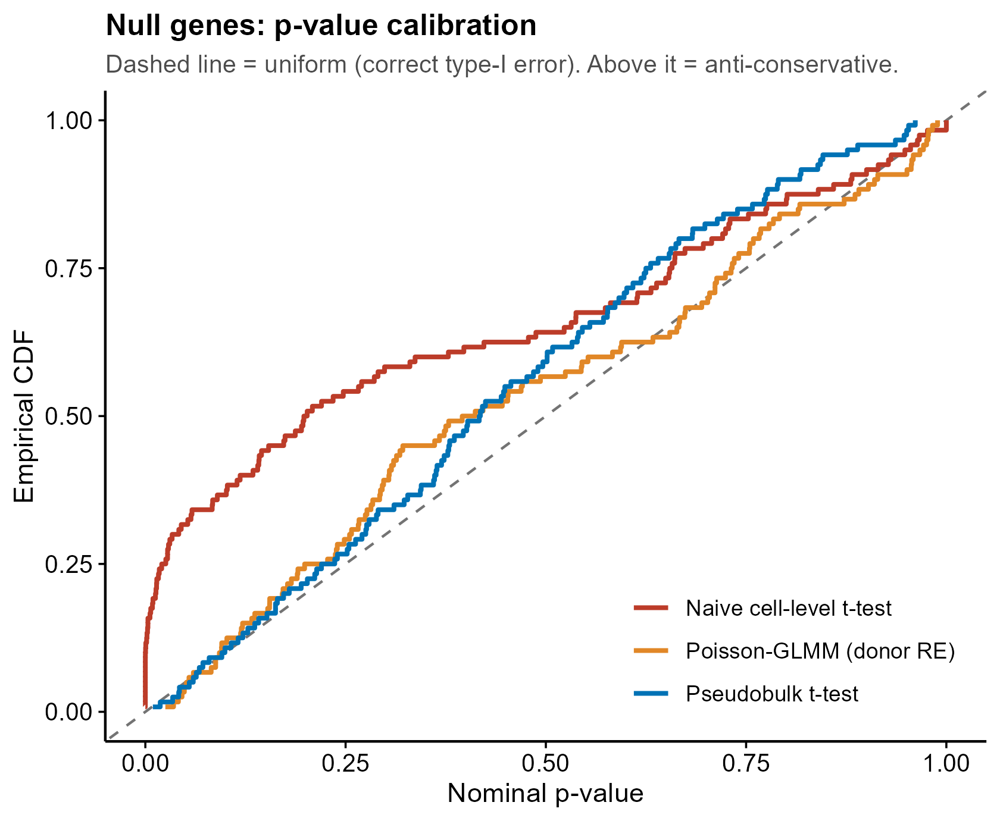
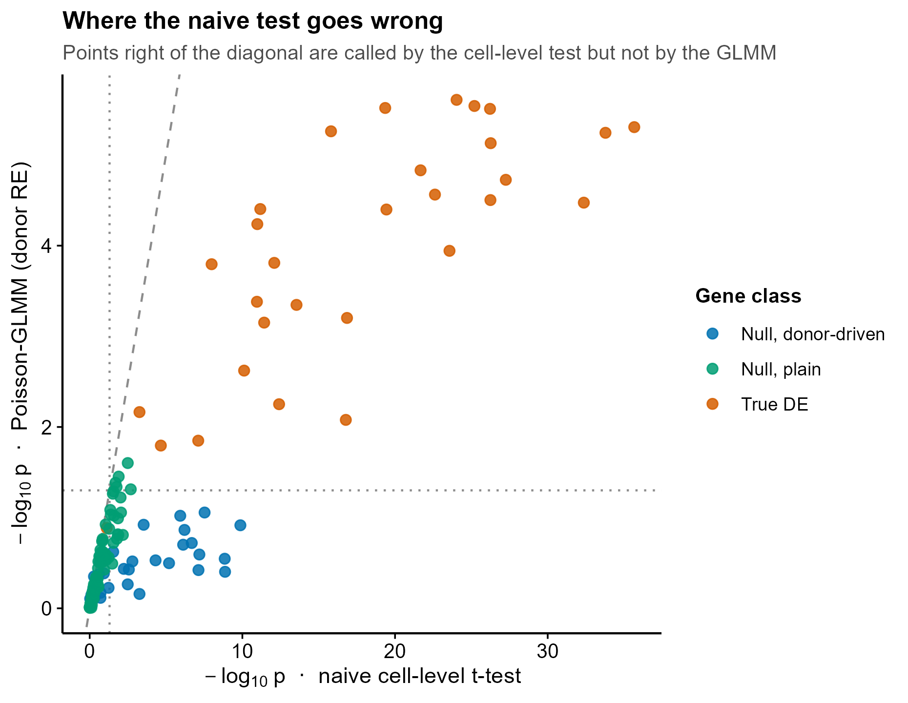
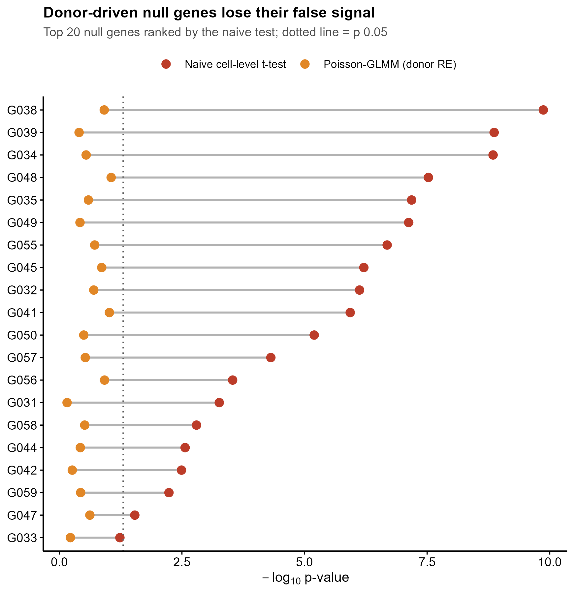
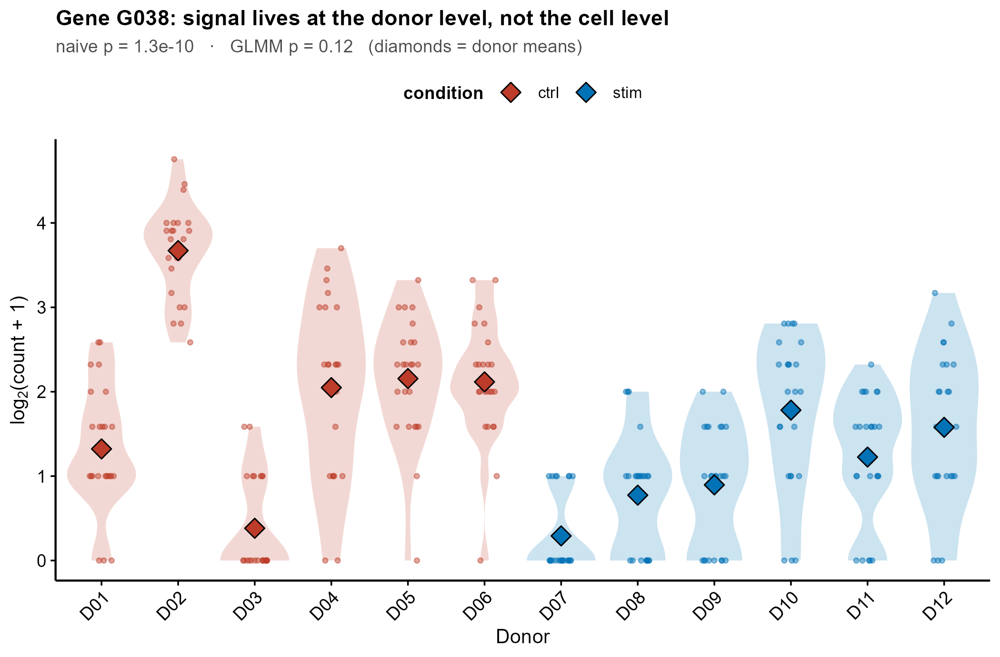

# 567 · GLIMES —— 单细胞广义线性混合效应差异表达(供体随机效应)

> 一句话定位:输入**多供体 × 两组条件的原始 UMI 计数矩阵 + 细胞元数据** → 用
> **Poisson-GLMM(供体随机截距)** 做差异表达,并与「把细胞当独立重复的朴素 t 检验」
> 和「pseudobulk 供体级 t 检验」两条基线同台对比 → 出 **p 值校准曲线 / ROC / 散点 /
> 哑铃图 / 供体级小提琴点图**,直接量化**供体伪重复(pseudoreplication)**造成的假阳性。

| | |
|---|---|
| **语言 / 主依赖** | R 4.4.3 · `MASS`(glmmPQL)`nlme` `ggplot2` —— 均随 R 分发或已装,**不需要额外装包** |
| **一句话用途** | 在原始计数上做带供体随机效应的 DE,并证明朴素细胞级检验的一类错误膨胀 |
| **输入** | `example_data/counts.csv` + `example_data/cell_meta.csv`(+可选 `truth.csv`) |
| **输出** | `results/`(运行生成) · 展示图见 `assets/` |
| **状态** | 🟡 三条方法(朴素 / pseudobulk / Poisson-GLMM)本机零改动跑通出图;**官方 GLIMES 包本机未安装**,走守卫式引用封装 |

---

## ① 输入数据

### 文件 1:`counts.csv` —— 原始 UMI 计数矩阵(行 = 基因,列 = 细胞)

首行为 `# synthetic, for demo only` 注释行,脚本以 `comment.char = "#"` 跳过。

| 列名 | 类型 | 必需 | 示例 | 说明 |
|------|------|:---:|------|------|
| 第 1 列(此处 `gene`) | str | ✔ | `G001` | 基因 ID,作为行名 |
| 其余各列 | int | ✔ | `6` | **每个细胞一列**,列名 = 细胞 ID;**原始 UMI 计数,不要预先归一化** |

**样例(前 3 行,已截断列)**:
```
# synthetic, for demo only -- 由 make_example_data.R 生成,不是真实实验数据
gene,C0001,C0002,C0003,C0004,C0005,...
G001,6,4,1,3,3,...
```

### 文件 2:`cell_meta.csv` —— 细胞元数据

| 列名 | 类型 | 必需 | 示例 | 说明 |
|------|------|:---:|------|------|
| 第 1 列(此处 `cell`) | str | ✔ | `C0001` | 细胞 ID,**必须与 counts 的列名一一对应** |
| `donor` | str | ✔ | `D01` | 供体 / 生物学重复(`--donor` 指定;对应上游 `replicates`) |
| `condition` | str | ✔ | `ctrl` | 比较变量,**必须恰好两个水平**(`--group` 指定;对应上游 `comparison`) |
| `exp_batch` | str | ✖ | `B1` | 实验批次(对应上游 `exp_batch`,本模块基线路径未使用) |

**样例(前 3 行)**:
```
# synthetic, for demo only -- 由 make_example_data.R 生成,不是真实实验数据
cell,donor,condition,exp_batch
C0001,D01,ctrl,B1
```

### 文件 3(可选):`truth.csv` —— 合成数据金标准

`gene, gene_class, is_de`。**只有合成 benchmark 才有**;换成真实数据时删掉此文件或不传
`--truth`,脚本会自动跳过 ROC / 假阳率一类需要金标准的评估与图 1-4,其余照常出。

**命名/格式约定**:`counts.csv` 的列名集合必须等于 `cell_meta.csv` 第一列的取值集合,
否则脚本报错退出(不静默丢细胞)。

**示例数据规模**:150 基因 × 288 细胞 × 12 供体(6 ctrl / 6 stim,每供体 24 细胞)。
其中 30 个真 DE 基因、30 个「供体驱动的空基因」(无条件效应但供体随机截距方差大)、
90 个普通空基因。**synthetic, for demo only。**

---

## ② 方法 / 原理

上游方法是 GLIMES:**不做归一化、不做 pseudobulk、不假设零膨胀**,直接对原始 UMI
计数拟合广义线性混合模型,把供体放进**随机截距**里,从而把「同一供体内细胞不独立」
这件事写进模型而不是无视它。

本模块跑三条路线并同台比较:

1. **方法 A · naive cell-level t-test**(朴素基线)
   把每个细胞当独立重复,对原始计数直接两样本 Welch t 检验。这就是论文要打的靶子
   —— 有效样本量被虚报成「细胞数」而不是「供体数」,一类错误必然膨胀。
   **与上游 `simple_mean_DE()` 同属细胞级朴素对照,但不是它的复刻**:上游取 `t.test`
   的统计量后用 `2*pt(-|t|, df = length(cellgroup1) + length(cellgroup2) - 1)` 手算
   p 值(两个入参是全长逻辑向量,故 `df = 2*n_cells - 1`),与 Welch 自由度不同。
   本模块只需一条朴素基线,直接用 `t.test` 的 p 值,不冒充上游实现。
2. **方法 B · pseudobulk t-test**(标准基线)
   每供体把细胞计数加和 → log-CPM → 供体级两样本 t 检验(自由度 = 每组供体数)。
   这是目前实践中最常见的伪重复解法。论文把 pseudobulk 路线(pb-DESeq2 / pb-edgeR)
   作为并列比较的对照方法之一,而不是断言「pseudobulk 一定有偏」;论文摘要列出的四个
   「curses」是 excessive zeros / normalization / donor effects / cumulative biases
   (原文核对自 PubMed 摘要与 PMC11912664 全文)。
3. **方法 C · Poisson-GLMM + 供体随机截距**(GLIMES 的模型)
   `MASS::glmmPQL(count ~ comparison, random = list(replicates = ~1), family = poisson)`,
   取 `tTable[2, "p-value"]` 作为条件效应 p 值,`log2FC = log2(exp(beta))`,BH 校正。
   另附上游 `identifyDEGs()` 的「新判定标准」(在 `BH < 0.05 & |log2FC| > log2(1.5)`
   之外,再要求 `log2mean > -2.25` 或 `log2meandiff > -1`,滤掉低表达假阳),
   输出为 `glmm_DEG_new` / `glmm_DEG_old` 两列。

有金标准时脚本自动算:ROC-AUC、BH<0.05 下的**实际假发现比例**、**空基因名义 5% 假阳率**、
空基因 p 值对均匀分布的 KS 检验、真 DE 基因的检出功效,写进 `results/metrics_summary.csv`。

### ★ API 与诚实边界(必读)

- **上游函数签名来自实读源码**,不是猜的。已把上游仓库克隆到本地逐行核对,
  每个符号都能指出定义位置(文件:行号,均为 `C-HW/GLIMES` 仓库):

  | 上游调用 | 源码位置 |
  |---|---|
  | `poisson_glmm_DE(sce, comparison, replicates, exp_batch = NULL, other_fixed = NULL, freq_expressed = 0.05)` | `R/DE_methods.R:45-50` |
  | `binomial_glmm_DE(...)`(同签名) | `R/DE_methods.R:144-149` |
  | `identifyDEGs(adj_pval, log2FC, log2mean = NA, log2meandiff = -Inf, pvalcutoff = 0.05, log2FCcutoff = log2(1.5), log2meancutoff = -2.25, log2meandiffcutoff = -1, newcriteria = T)` | `R/DE_methods.R:255-257` |
  | `simple_mean_DE(counts, cellgroup1, cellgroup2)` | `R/DE_methods.R:12` |
  | 4 个函数的导出 | `NAMESPACE`(export 共 4 条) |
  | glmmPQL 拟合式 `count ~ comparison` + `random = list(replicates = ~1)` + `family = stats::poisson` | `R/DE_methods.R:60,110-113` |
  | 输出列 `genes/mu/beta_comparison/log2FC/sigma_square/status/pval/BH/log2mean/log2meandiff` | `R/DE_methods.R:74-76` |
  | 取值方式 `gm$tTable[2,"p-value"]` `gm$sigma^2` `gm$coefficients$fixed[1:2]` | `R/DE_methods.R:121-124` |
  | 低表达跳过规则 `mean(count != 0) <= freq_expressed` → `zero mean`/`lowly expressed` | `R/DE_methods.R:103-106` |
  | 计数取自 `sce@assays@data$counts[i,]`(故 assay 必须叫 `counts`) | `R/DE_methods.R:91` |
  | 分组/供体取自 `SummarizedExperiment::colData(sce)[, comparison]` | `R/DE_methods.R:52-53` |
  | 依赖 `MASS, Matrix, edgeR, SummarizedExperiment, stats, MAST`;`R >= 4.2.2`;BSD-3-Clause | `DESCRIPTION` / `LICENSE.txt` |
- **官方 GLIMES 包本机未安装**(不在 CRAN/Bioconductor,需 `devtools::install_github`,
  且依赖 Bioconductor 的 `MAST`/`edgeR`)。本模块**不装包**,给出守卫式路径:
  加 `--use-glimes` 时脚本尝试 `GLIMES::poisson_glmm_DE()`,包缺失就打印真实安装命令
  后跳过,**不静默降级、不伪造官方结果**。
- **默认路径的方法 C 是按上游源码逐行复刻的等价拟合**(同一个 `glmmPQL` 调用、同一组
  输出列名、同一套 `identifyDEGs` 阈值),**不是官方包本身**。由于官方包未在本机跑过,
  **本模块不对「复刻结果 == 官方包结果」作任何等价性断言**;要出版级结果请装官方包用
  `--use-glimes` 复核。
- `binomial_glmm_DE`(零比例模型)本模块**未复刻**。原因写在这里以免误解:上游该函数
  虽把响应变量改成 0/1 指示量,但源码里 `family` 仍写作 `stats::poisson`(见上述源码
  URL),这是上游代码的原样,我不清楚是有意为之还是笔误,因此不擅自改成 `binomial`
  去「修正」它。需要该模型请直接用官方包。

---

## ③ 用途

回答这个问题:**「我这批多供体单细胞数据里,某个基因的组间差异,到底是条件效应,还是
几个供体自己的个体差异被细胞数放大出来的?」**

典型场景:
- 病例 vs 对照的 scRNA-seq(每组只有几个病人,但每人上千细胞)——最容易踩伪重复;
- 某个细胞亚群的条件间 DE,亚群细胞数少、供体间比例波动大;
- 已经用 Seurat `FindMarkers`(Wilcoxon,细胞级)出了一版结果,想知道有多少条会在
  供体层面塌掉 —— 直接把同一份计数丢进本模块看图 3 / 图 4;
- 给审稿人「我控制了供体伪重复」的证据图(图 1 的 p 值校准曲线)。

---

## ④ 特点 / 亮点

- **turnkey**:`Rscript 567_glimes_mixed_effect_de.R` 一条命令跑完,零依赖安装
  (`MASS`/`nlme` 随 R 分发)。
- **自带朴素基线**:朴素细胞级检验 + pseudobulk 两条对照与 GLMM 同表同图,
  「更好」是量出来的不是声称的 —— 本次示例数据实测(见 `results/metrics_summary.csv`):

  | 方法 | BH<0.05 命中 | AUC | 实际假发现比例 | 空基因名义 5% 假阳率 | 真 DE 功效 |
  |---|---:|---:|---:|---:|---:|
  | Naive cell-level t-test | 58 | 0.979 | **0.500** | **0.317** | 0.967 |
  | Pseudobulk t-test | 26 | 0.998 | 0.000 | 0.042 | 0.867 |
  | Poisson-GLMM (donor RE) | 27 | 0.995 | 0.000 | 0.042 | 0.900 |

  即:朴素检验在这份数据上有**一半的显著基因是假的**,名义 5% 的检验实际漏了 31.7%;
  GLMM 与 pseudobulk 都把假阳压回名义水平,而 GLMM 在功效上略高于 pseudobulk
  (0.900 vs 0.867)。**这是单次合成数据集的单点结果,不是方法学基准结论。**
- **诚实的守卫式封装**:官方包缺失时打印真实安装命令并跳过,复刻部分明确标注为复刻。
- **换数据即跑**:`--counts/--meta/--group/--donor` 全部可覆盖;无金标准时自动降级为
  只出方法比较图。
- **顶刊图风格,全程无条形图**:折线(ECDF/ROC)、散点、哑铃图、小提琴+抖动点+菱形均值。

---

## ⑤ 输出结果图

`results/`(不入库):

| 文件 | 说明 |
|------|------|
| `de_results_all_methods.csv` | 三法逐基因结果:各自 p / BH / log2FC,GLMM 的 `sigma_square`、`status`、`DEG_new`/`DEG_old`,检出率,以及金标准列 |
| `metrics_summary.csv` | 每法的 AUC / 实际假发现比例 / 空基因假阳率 / KS 均匀性 p / 功效 |
| `glimes_official_poisson.csv` | **仅当** `--use-glimes` 且官方包已装时生成 |

`assets/`(入库展示图,同名 `.pdf` 矢量版一并生成):

| 文件 | 图型 | 说明 |
|------|------|------|
| `fig1_null_pvalue_calibration.png` | 阶梯折线 | 空基因 p 值经验 CDF vs 均匀分布,一类错误控制 |
| `fig2_roc_true_de.png` | ROC 折线 | 三法回收真 DE 基因的能力(含 AUC) |
| `fig3_naive_vs_glmm_scatter.png` | 散点 | 朴素 vs GLMM 的 −log10 p,按基因真实类别着色 |
| `fig4_dumbbell_null_genes.png` | 哑铃图 | 朴素检验排名前 20 的空基因,显著性在 GLMM 下的塌陷 |
| `fig5_donor_level_variation.png` | 小提琴 + 抖动点 + 菱形均值 | 单个假阳基因的供体级表达,直观展示伪重复 |
| `fig6_dispersion_vs_naive_significance.png` | 散点(x 对数轴) | GLMM 残差离散度 vs 朴素检验显著性 |









---

## 与 559(muscat pseudobulk)的分工

| 模块 | 建模层级 | 处理伪重复的方式 |
|---|---|---|
| 559 muscat | 供体级 pseudobulk | 先聚合再检验,依赖归一化与 bulk 模型 |
| **567 GLIMES** | **细胞级原始计数** | **供体进随机效应,不聚合、不归一化** |

两者假设不同,结论一致时才更可信;本模块把 pseudobulk 直接作为内建基线一起跑,
便于同数据横向对照。

---

## 运行

```bash
# 零改动跑示例(约 1-2 分钟,150 基因 × 288 细胞)
Rscript 567_glimes_mixed_effect_de.R

# 换成自己的数据
Rscript 567_glimes_mixed_effect_de.R \
  --counts data/my_counts.csv --meta data/my_meta.csv \
  --group condition --donor donor \
  --freq_expressed 0.05 --outdir results/run1 --assets results/run1_fig

# 若已安装官方 GLIMES 包,追加官方结果一栏
Rscript 567_glimes_mixed_effect_de.R --use-glimes
```

## 依赖安装

基线路径**无需安装任何东西**(`MASS`/`nlme` 随 R 分发,`ggplot2` 本库通用依赖)。

官方 GLIMES 包(可选,本机未安装):

```r
install.packages("devtools")               # 前置工具,上游 README 未列
devtools::install_github("C-HW/GLIMES")    # 上游 README「Installation」原样给出
# 上游 DESCRIPTION 声明的 Imports:MASS, Matrix, edgeR, SummarizedExperiment, stats, MAST
# 其中 edgeR / SummarizedExperiment / MAST 来自 Bioconductor:
# BiocManager::install(c("edgeR", "SummarizedExperiment", "MAST"))
```

## 引用

Wu CH, Zhou X, Chen M. **Exploring and mitigating shortcomings in single-cell
differential expression analysis with a new statistical paradigm.**
*Genome Biology* 2025;26(1):58. PMID **40098192** · doi:**10.1186/s13059-025-03525-6**

> 引用已核实:经 NCBI E-utilities `esummary` 查询 PMID 40098192,返回标题、作者
> (Wu CH / Zhou X / Chen M)、期刊 *Genome Biol* 26(1):58、DOI 10.1186/s13059-025-03525-6
> 与 PMC ID PMC11912664,与上表完全一致。

摘要原文核对(efetch):四个「curses」= excessive zeros / normalization / donor effects /
cumulative biases;GLIMES 被描述为 generalized Poisson/Binomial mixed-effects model,
对比了 six existing DE methods。PMC11912664 全文中确认出现 pb-DESeq2 / pb-edgeR 作为对照方法。

上游仓库:https://github.com/C-HW/GLIMES —— 仅 GitHub。**已核**:CRAN 包页返回 404
且不在 CRAN 全量包索引中;Bioconductor 包页不存在(重定向到 removed-packages)。
许可证 BSD-3-Clause(上游 `LICENSE.txt`,Copyright 2023 Chih-Hsuan Wu)。
