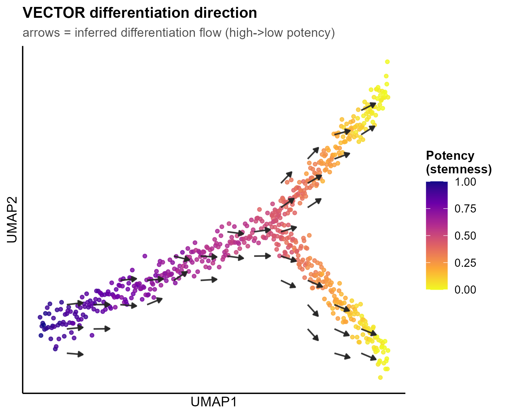

# 517 · VECTOR differentiation direction (expression-only vector field)

Infers the **direction of differentiation** on a 2D embedding without RNA velocity,
following the core idea of **VECTOR** (Zhang et al.): cell potency is approximated by
expression breadth (CytoTRACE assumption — more genes expressed ≈ more progenitor-like);
the embedding is gridded and arrows point down the potency gradient, drawn as a vector field.

| | |
|---|---|
| Language / deps | R · `ggplot2` (+ shared `theme_pub.R`) |
| Purpose | Add a direction arrow field to a trajectory / embedding |
| Input | `--embedding umap.csv` + `--expr expr.csv`; else synthetic branching trajectory |
| Output | `results/` potency + vector field; `assets/vector_field.png` |

## Input

| File | Spec |
|------|------|
| `embedding.csv` | columns `UMAP1,UMAP2` (one row per cell) |
| `expr.csv` / `.rds` | gene × cell matrix (raw or normalized counts) |

Demo data is synthetic (660 cells, root → 2 branches), generated on first run.

## Method

1. **Potency** ≈ number of expressed genes per cell, min-max scaled (CytoTRACE-style).
2. Grid the embedding (`--ngrid`), average potency per grid cell.
3. **Vector field** = negative potency gradient (finite differences) → differentiation flow.

## Use

Overlay a differentiation-direction field on any UMAP/embedding to argue *root → fate*
direction when velocity data are unavailable. Complements modules 062/082 (trajectory).

## ⚠️ Full version on the server

This turnkey module **re-implements the VECTOR core** so it runs anywhere with only
`ggplot2`. For production use the original package and a calibrated potency:

```r
# real VECTOR (not installed locally; install on the analysis server)
# remotes::install_github("jumphone/Vector")   # via gh-proxy if blocked
```

For a rigorous potency estimate, replace the expression-breadth proxy with
**CytoTRACE2** (module 082) and feed it as the per-cell potency.

## Outputs

| File | Type | Description |
|------|------|------|
| `results/cell_potency.csv` | table | per-cell coordinates + potency |
| `results/vector_field.csv` | table | grid arrow coordinates |
| `assets/vector_field.png` | vector field | potency UMAP + differentiation arrows |



## Run

```bash
Rscript 517_vector_trajectory_direction.R
Rscript 517_vector_trajectory_direction.R --embedding umap.csv --expr expr.csv --ngrid 16
```

## Dependencies

```r
install.packages("ggplot2")
```
