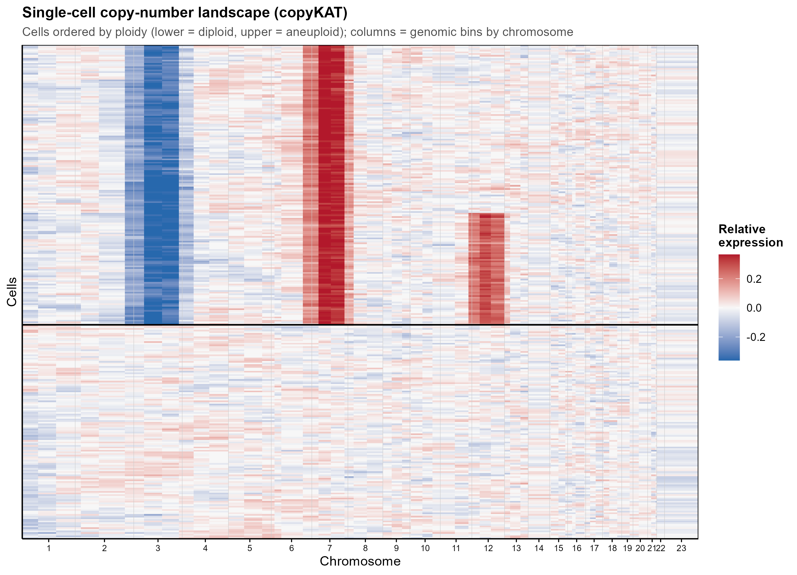
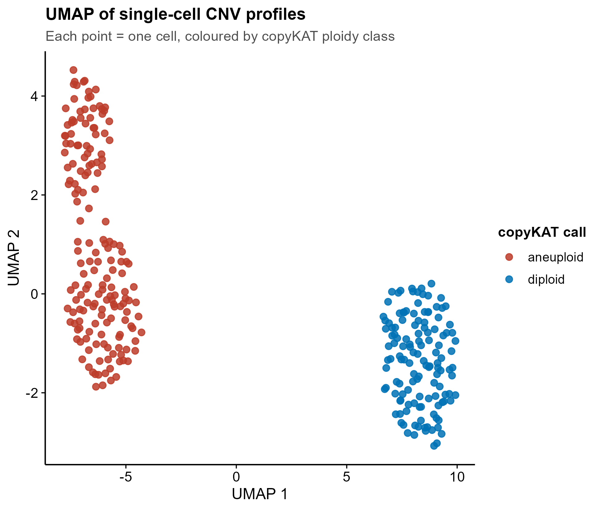
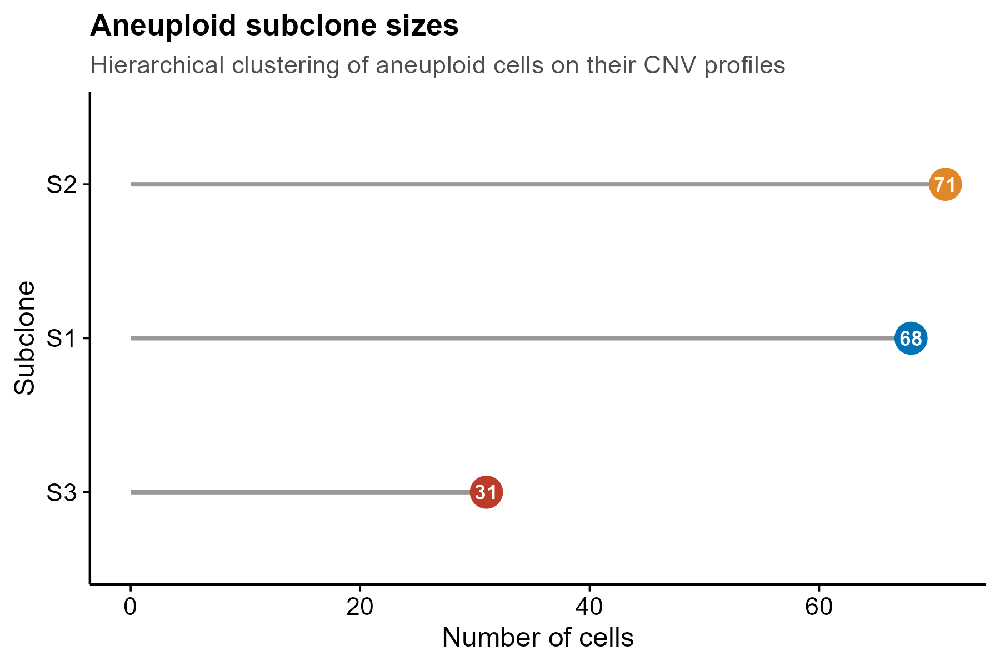
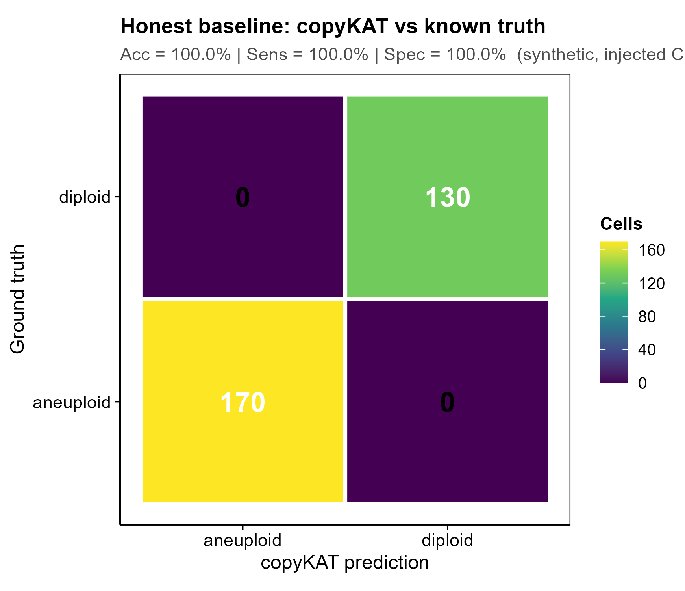

<!-- 图中文字英文,正文中文。 -->

# 560 · scRNA 拷贝数/非整倍体推断 copyKAT scRNA CNV & aneuploid calling

> 一句话定位:输入 scRNA-seq **原始 UMI 计数(基因 × 细胞)** → copyKAT 贝叶斯分割推断单细胞拷贝数 → 把细胞分为**非整倍体(肿瘤)/二倍体(正常)**,并出 CNV 热图、ploidy 嵌入图、亚克隆大小图,**附已知真值的诚实基线核验**。

| | |
|---|---|
| **语言 / 主依赖** | R · `copykat`(v1.2.5) `ggplot2` `uwot`(UMAP,可选降级 PCA) |
| **一句话用途** | 无需已知正常参考,从 scRNA 计数推断单细胞 CNV 并判定肿瘤(非整倍体)细胞 |
| **输入** | `example_data/synthetic_counts.csv`(基因×细胞 UMI)+ `synthetic_truth.csv`(真值标签,合成自带) |
| **输出** | `results/`(预测/基线表,运行生成) · 展示图见 `assets/` |

> copyKAT(Gao *et al.*, *Nat Biotechnol* 2021,navinlabcode/copykat)是已停止维护的 **inferCNV** 的活跃替代:用混合高斯 + KS 分割从表达谱估计基因组拷贝数,**不要求预先指定正常细胞**即可贝叶斯地把细胞分为非整倍体/二倍体。

---

## ① 输入数据

**文件**:`synthetic_counts.csv`(csv;行=基因,列=细胞;首列=基因名,其余列=各细胞原始 UMI 计数)

| 列 | 类型 | 必需 | 示例 | 说明 |
|------|------|:---:|------|------|
| `gene`(首列) | str | ✔ | `TP53` | 基因标识:`--idtype S` 用 HGNC 符号 / `--idtype E` 用 Ensembl id |
| `<cell_1>` … | int | ✔ | `0,3,12,…` | 每细胞一列,**原始计数**(非归一化/对数化) |

**真值文件(可选,诚实基线用)** `synthetic_truth.csv`:列 `cell,truth`,`truth ∈ {aneuploid, diploid}`。真实数据若无金标准可省略(`--truth` 不指向存在文件即自动跳过基线)。

**命名/格式约定**:计数须为整数原始 UMI;基因数太少会触发 copyKAT `LOW.DR` 警告但仍可跑。合成示例:1540 基因 × 300 细胞(130 二倍体 + 170 非整倍体)。

**样例(前几列)**:
```
gene,DIP_001,DIP_002,...,ANE_001,...
DDX11L1,2,4,...,5,...
WASH7P,3,1,...,8,...
```

## ② 方法 / 原理 与 ★诚实基线

1. **合成数据**:取 copyKAT 自带 hg20 注释(`full.anno`)的真实 HGNC 符号,按基因组坐标散布到 chr1–22;构造一群二倍体(无 CNV)+ 一群非整倍体(**chr7 整臂 ~2.2× 增益 + chr3 整臂 ~0.45× 缺失**),非整倍体内再注入一个 **chr12 增益亚克隆**。真值标签随注入而确定。
2. **copyKAT 推断**:`copykat(rawmat, id.type, ngene.chr, win.size, KS.cut, …)` → 返回 `$prediction`(每细胞 `aneuploid`/`diploid`)+ `$CNAmat`(基因组 bin × 细胞 的相对拷贝数)。
3. **★诚实基线**:把 copyKAT 调用与**已知真值**对齐 → 混淆矩阵 + **准确率/灵敏度/特异度/精确率**,证明调用可信而非只展示好看热图(对应记忆「结果可信性:对照验证管道」铁律)。
4. **下游可视化**:CNAmat 做 PCA→UMAP 2D 嵌入;对非整倍体细胞按 CNV 谱层次聚类(ward.D2)切亚克隆并计数。

> 核心方法引用:Gao R. *et al.* *Nat Biotechnol* 39:599–608 (2021);R 包 `navinlabcode/copykat` v1.2.5。

## ③ 用途

回答:**scRNA 数据里哪些细胞是肿瘤(非整倍体)细胞、它们携带哪些臂级 CNV、是否存在拷贝数亚克隆。** 典型场景:实体瘤 scRNA 中区分恶性上皮 vs 正常基质/免疫细胞、肿瘤内异质性/克隆演化、为下游恶性细胞富集分析提供标签。

## ④ 特点 / 亮点

- **turnkey**:`Rscript 560_copykat_scrna_cnv.R` 一条命令即跑(自动合成示例数据 → 真包 copyKAT 实跑 → 出图);
- **真包实跑**:非 stub,assets 图来自 copyKAT v1.2.5 真实推断(`$prediction`/`$CNAmat`);
- **★内置诚实基线**:已知真值混淆矩阵 + 准确率/灵敏度/特异度,本示例 copyKAT **Acc=100%(TP=170,TN=130,FP=FN=0)**,验证管道可信;
- **顶刊级图、零平凡条形**:CNV 栅格热图 / 散点嵌入 / **lollipop**(亚克隆大小)/ 混淆矩阵热图,统一 `theme_pub` 矢量 PDF + 300dpi PNG;
- **相对路径**:copyKAT 写盘文件被收进 `results/`(临时切 cwd 后恢复),无任何硬编码绝对路径 / `setwd` 绝对路径。

## ⑤ 输出结果图

| 文件 | 图型 | 说明 |
|------|------|------|
| `assets/fig1_cnv_heatmap.png` | 栅格热图(cells × genome bins) | 细胞按 ploidy 分块(黑线分隔),列为按染色体排序的基因组 bin;非整倍体块清晰显示 chr3 缺失(蓝)/chr7 增益(红)/chr12 亚克隆增益 |
| `assets/fig2_embedding_ploidy.png` | 2D 嵌入散点 | UMAP(降级 PCA)按 copyKAT ploidy 类着色,非整倍体与二倍体分群 |
| `assets/fig3_subclone_lollipop.png` | lollipop | 非整倍体细胞按 CNV 谱层次聚类得到的亚克隆大小 |
| `assets/fig4_honest_baseline_confusion.png` | 混淆矩阵热图 | ★诚实基线:copyKAT 调用 vs 已知真值,标注 Acc/Sens/Spec |






---

## 运行

```bash
# 零改动跑示例(自动生成合成数据 + 诚实基线)
Rscript 560_copykat_scrna_cnv.R

# 换成自己的数据(基因 HGNC 符号)
Rscript 560_copykat_scrna_cnv.R --input counts.csv --idtype S --outdir results/run1

# Ensembl gene id 输入;若有金标准真值标签可启用诚实基线
Rscript 560_copykat_scrna_cnv.R --input counts.csv --idtype E --truth truth.csv
```

参数:`--input`(基因×细胞计数 csv)·`--idtype`(`S` HGNC / `E` Ensembl)·`--truth`(可选真值 `cell,truth`)·`--outdir`。

> 运行时间:示例 ~1540 基因 × 300 细胞,单核约 3–4 分钟(瓶颈是 copyKAT 内部分割/出图)。真实大数据请加大 `n.cores`(脚本内 copyKAT 调用处)。

## 依赖安装

```r
# copyKAT(GitHub 源;依赖 Bioconductor 注释)
install.packages("devtools")
devtools::install_github("navinlabcode/copykat")
install.packages(c("ggplot2", "uwot"))   # uwot 缺失时自动降级 PCA
```
