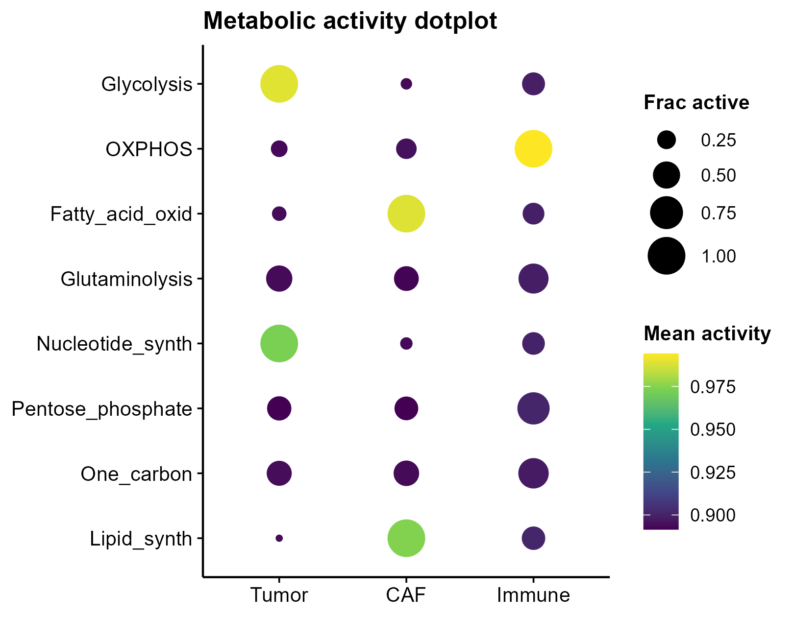
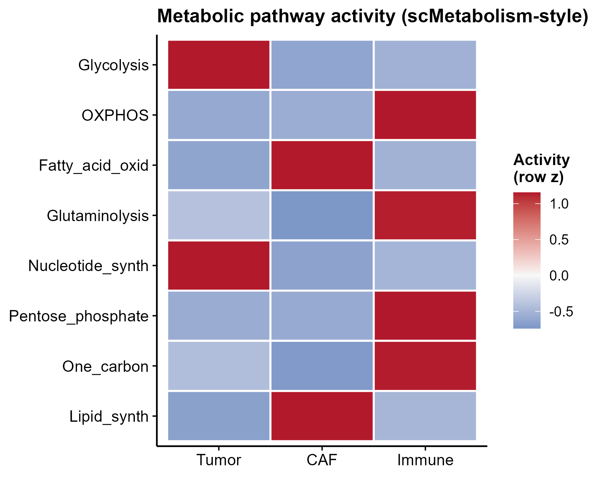

# 510 · Single-cell metabolic pathway activity (scMetabolism / AUCell-style)

Scores every cell on a panel of metabolic pathways with a rank-based (AUCell/UCell-style)
algorithm, then summarises which **cell type prefers which metabolic program** — the core
scMetabolism output, rendered as the signature activity **dotplot**, a row-z **heatmap**,
and a distribution for the most cell-type-variable pathway.

| | |
|---|---|
| Language / deps | R · `ggplot2` (+ shared `theme_pub.R`; self-contained scorer) |
| Purpose | Per-cell metabolic pathway activity + cell-type metabolic preference |
| Input | `--expr expr.csv` + `--meta meta.csv` (+ optional `--genesets pathways.gmt`); else synthetic |
| Output | `results/` activity tables; preview in `assets/` |

## Method

1. **Score** — for each pathway gene set, a rank/U-statistic activity score per cell
   (AUCell/UCell-style; robust to library size, no scaling needed).
2. **Aggregate** — mean activity and fraction-active per cell type.
3. **Test** — Kruskal–Wallis across cell types per pathway to flag metabolic heterogeneity.

## Input

| File | Spec |
|------|------|
| `expr.csv` | gene × cell expression matrix (counts or log-norm) |
| `meta.csv` | `cell,celltype` |
| pathways | default = 8 built-in KEGG-like metabolic sets; supply your own `.gmt` / list |

Demo data is synthetic (200 genes × 360 cells, 3 cell types with designed metabolic
preferences: Tumor→glycolysis/nucleotide, Immune→OXPHOS, CAF→fatty-acid/lipid),
generated on first run.

## Use

Map metabolic reprogramming across cell types/states in tumour micro-environment or
immune studies; a turnkey alternative to scMetabolism/scFEA that needs no extra install.
Swap in real KEGG/Reactome metabolic gene sets for publication.

## Outputs

| File | Type | Description |
|------|------|------|
| `results/pathway_activity_by_celltype.csv` | table | mean activity, pathway × cell type |
| `results/pathway_kruskal.csv` | table | Kruskal–Wallis p per pathway |
| `assets/pathway_dotplot.png` | dotplot | size = fraction active, colour = mean activity |
| `assets/pathway_heatmap.png` | heatmap | row-z activity, pathway × cell type (RdBu) |
| `assets/top_pathway_violin.png` | violin+box | most cell-type-variable pathway |




## Run

```bash
Rscript 510_scmetabolism_pathway_activity.R
Rscript 510_scmetabolism_pathway_activity.R --expr expr.csv --meta meta.csv
```

## Dependencies

```r
install.packages("ggplot2")
# real metabolic gene sets: scMetabolism (KEGG/Reactome), or AUCell/UCell from Bioconductor
```
