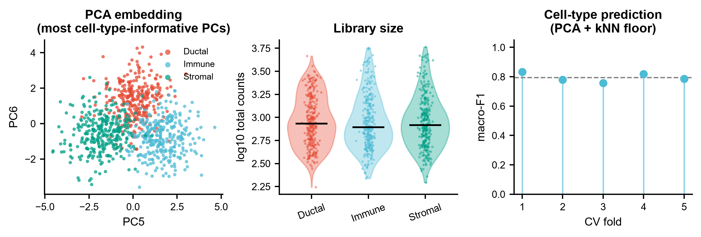
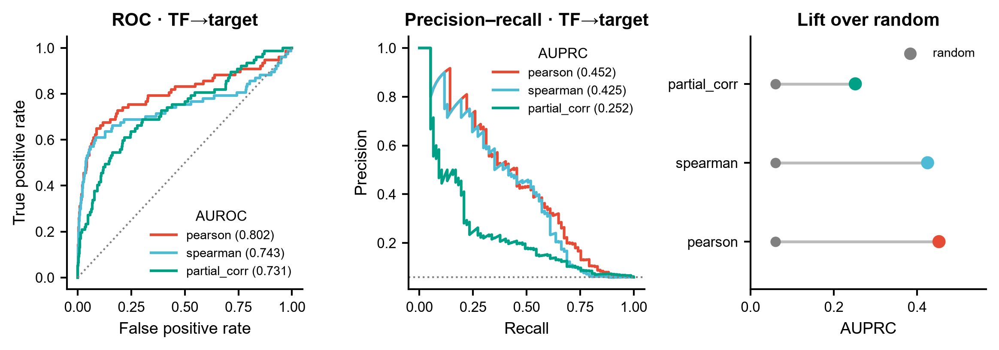
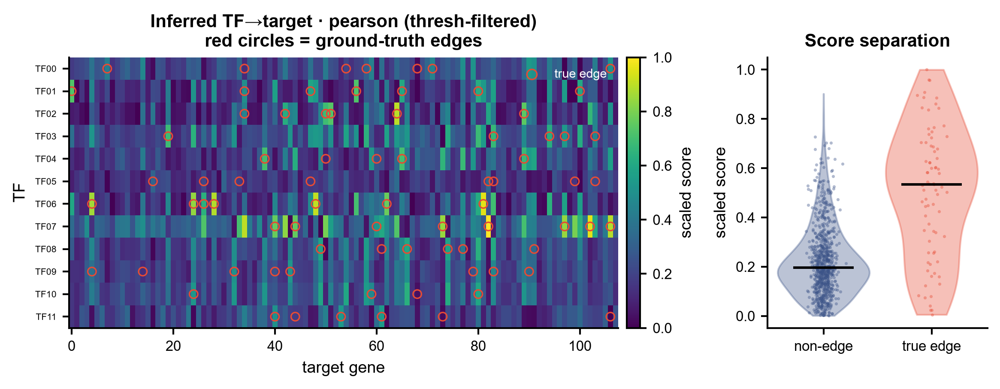
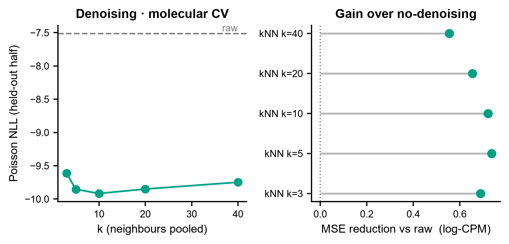

# 568 · scPRINT —— 单细胞基础模型:细胞嵌入 / 去噪 / 从注意力推断基因调控网络

**scPRINT**(Kalfon、Samaran、Peyré、Cantini,*Nature Communications* 2025)是一个在
**cellxgene 数据库 5000 万以上细胞**上预训练的「large cell model」。它的卖点不是又一个嵌入,
而是**把 transformer 的注意力矩阵直接读作基因–基因调控网络**,
同时兼做去噪、批次校正与细胞标签预测(论文摘要原话:GRN 推断优于 state of the art,
denoising / batch correction / cell label prediction 为 competitive zero-shot 能力)。

> **本模块诚实定位**:官方三件套 `Embedder` / `Denoiser` / `GNInfer` 依赖
> `scdataloader` + `lamindb` + `bionty` + `lightning` + HuggingFace 权重(见上游 `pyproject.toml`),
> 上游只在 MacOS / Ubuntu 20.04 + Python 3.10 上测过。
> (上游 docs 写明**无 triton 也能跑 CPU**,但载 flashattention 权重时必须 `transformer="normal"`;
> 实用规模仍应上 GPU。)本机不装包,故官方路径写成**守卫式封装**(`--run-scprint`)。
> 模块主体是一条**本机零改动可跑的朴素基线**,一次覆盖 scPRINT 的三个任务:
> **GRN 推断 / 去噪 / 细胞嵌入与标签预测**,每个任务都带对照与随机基准。
> 任何"基础模型更强"的说法,都必须**先打赢这三条地板线**
> (Genome Biol 2025:单细胞 FM 的 zero-shot 注释常打不过 PCA;
> Nat Methods 2025:深度扰动模型常打不过线性基线)。

| | |
|---|---|
| 语言 / 主依赖 | Python 3.12 · 基线仅需 `numpy` `pandas` `scipy` `scikit-learn` `matplotlib`(本机已装)· 官方路径需 `scprint` + 权重 + GPU |
| 输入 | 细胞 × 基因 原始计数 CSV + 细胞元数据 CSV(+ 可选真值 GRN 边表,用于评估) |
| 输出 | `results/` 4 张指标表 + 汇总 JSON;`assets/` 4 张展示图 |
| 运行时间 | 示例数据 CPU 约 15 秒 |
| 状态 | 🟡 诚实基线本机零改动跑通并出图;完整 scPRINT 需装包(Python 3.10)+ HuggingFace 权重,建议 GPU |

---

## ① 输入数据

三个 CSV(示例见 `example_data/`,**synthetic, for demo only**):

| 文件 | 规格 | 说明 |
|---|---|---|
| `counts.csv` | 900 细胞 × 120 基因(236 KB) | 行索引 = `cell_id`,列 = 基因名,**原始计数**(scPRINT 要求 raw counts,见上游 docs/index.md:不要喂整合过的数据) |
| `cell_meta.csv` | 900 行 | 必需列 `cell_id`;`cell_type` 为标签列;`organism_ontology_term_id` 是官方路径的**硬性字段**(见上游 `docs/usage.md`:`adata.obs['organism_ontology_term_id'] = "NCBITaxon:9606"`) |
| `true_grn_edges.csv` | 77 条边 | `tf,target,weight` —— **只有合成数据才有真值**,真实数据请换成 ChIP-seq / 已知 GRN(上游 `GNInfer(known_grn=...)` 走的也是这个位置) |

样例前 3 行:

```
# counts.csv (前 6 列)
,TF00,TF01,TF02,TF03,TF04,TF05
CELL0000,2,1,4,13,1,1
CELL0001,3,0,7,5,0,3
CELL0002,9,0,9,2,8,3

# cell_meta.csv
cell_id,cell_type,organism_ontology_term_id
CELL0000,Ductal,NCBITaxon:9606
CELL0001,Ductal,NCBITaxon:9606

# true_grn_edges.csv
tf,target,weight
TF00,GENE007,0.5584
TF00,GENE034,-0.5897
```

**合成数据的设计意图**(这点决定了对照有没有信息量):

- 12 个 TF 的**活性** = 细胞类型均值 + **3 个共享隐因子** + 细胞噪声
  → TF 之间彼此高度共表达,**共表达打分很难分清"哪一个 TF"才是真上游**;
- 每个 TF 调控 4–8 个 target,target 对数表达率 = 基线 + Σ w·TF活性;
- **TF 的 mRNA 只是其活性的含噪代理**(系数 0.45、噪声 0.8)——
  复刻真实生物学里"转录本 ≠ 蛋白活性"(翻译后修饰、核转位不写在转录组里)的根本困难;
- 未被任何 TF 选中的 target 构成真阴性边:候选边 1296 条中真边仅 77 条(**阳性率 5.9%**),
  所以 GRN 评估用 **AUPRC** 为主、AUROC 为辅(类别极不平衡时 AUROC 会虚高)。

换成自己的数据:

```bash
python 568_scprint_foundation_grn.py \
  --counts my_counts.csv --meta my_meta.csv \
  --true_grn my_known_grn.csv --label_key celltype --tf_prefix TF
```

---

## ② 方法 / 原理

### 基线(始终运行,纯 CPU)

**预处理**:CPM(target_sum=1e4)+ `log1p`,即 `scanpy.pp.normalize_total` + `log1p` 的最小实现。

**任务 A · GRN 推断**(对应 scPRINT 的 `GNInfer`)
三种朴素打分,只在 **TF × non-TF** 候选边集合上评估:

| 打分 | 做法 |
|---|---|
| `pearson` | log-CPM 标准化后的皮尔逊相关绝对值 |
| `spearman` | 秩变换后的相关绝对值(抗离群) |
| `partial_corr` | 协方差对角收缩 0.10 → 伪逆取精度矩阵 → 标准化为偏相关(试图扣掉共享隐因子的间接边) |

评估:AUROC / AUPRC + **随机基准 = 阳性率**;并按上游 `GNInfer.filter` 的 `"thresh"` 分支
(`adj[adj < 1/adj.shape[-1]] = 0`,见 `scprint/tasks/grn.py`)做同口径稀疏化后出图。

**任务 B · 去噪**(对应 `Denoiser`)——**分子交叉验证(molecular cross-validation)**
1. 用上游 `denoise.py::split_molecules` **同式**把每个 UMI 计数二项拆成 X / Y 两半;
2. 只在 X 半上做 kNN 池化去噪(PCA→k 近邻→原始计数求和),k ∈ {3,5,10,20,40};
3. 用上游 `denoise.py::poisson_nll_loss` 与 log-CPM 上的 MSE 对 **完全未参与去噪的 Y 半** 打分,
   深度按上游 `open_benchmark` 的做法对齐(`pred / pred_total × y_total`)。
   **防泄漏**:PCA 与近邻图只看 X 半,评估只看 Y 半。

kNN 池化是 Wagner & Yan kNN-smoothing 的简化一步版 —— 上游把该算法**整份 vendored** 在
`scprint/tasks/knn_smooth.py`(`knn_smoothing(X, k, d=10, dither=0.03, seed=0)`),
并在 `denoise.py` 的 `withknn(adata, k=10)` 里当作对照方法调用。本模块只用 numpy+sklearn 重写最小版,
以便本机零依赖跑通。

**任务 C · 细胞嵌入与标签预测**(对应 `Embedder`)
log-CPM → z-score → PCA(20 PC)→ 分层 5 折 CV + kNN(k=15)分类器,报每折 macro-F1。
表征构建全程**无监督**,标签只在 fit 折内使用。
> Fig 1 左panel 为了看得见结构,选了**最有判别力的两个 PC**(方差最大的 PC 被 TF 共享隐因子占据)。
> 这一步用到了标签,因此**只影响可视化,绝不参与上面的 CV 指标**——脚本里也是分开算的。

### 官方 scPRINT 路径(`--run-scprint`,需装包 + 权重 + GPU)

下列签名逐一读自**本地克隆的上游源码** `C:\Users\fsy\Desktop\upstream-sources\568_scPRINT\`:

| 真实 API(已读到源码) | 位置 |
|---|---|
| `from scprint import scPrint` | `scprint/__init__.py` L3 |
| `class scPrint(L.LightningModule, PyTorchModelHubMixin)`;`__init__(genes, organisms=["NCBITaxon:9606"], precpt_gene_emb=None, d_model=512, nhead=8, d_hid=512, nlayers=6, classes={}, transformer="fast", cell_emb_style="cls", zinb=True, lr=1e-4, ...)` | `scprint/model/model.py` L37(class)–L70(签名结束,含 `**flash_attention_kwargs`) |
| `scPrint.load_from_checkpoint(ckpt, precpt_gene_emb=None, transformer="normal")` —— **无 triton / 走 CPU 时必须传 `transformer="normal"`** | `docs/index.md` L97–L102 |
| `Embedder(batch_size=64, num_workers=8, how="random expr", max_len=2000, doclass=True, add_zero_genes=0, precision="16-mixed", pred_embedding=[...], devices=[0], dtype=torch.float16, output_expression="none")`;调用 `embedder(model, adata, cache=False)`,把嵌入写进 `adata.obsm["scprint"]` / `["scprint_umap"]` | `scprint/tasks/cell_emb.py` L29–L85 |
| `Denoiser(batch_size=10, num_workers=1, max_len=5000, how="most var", predict_depth_mult=4, downsample=None, devices=[0])`;调用 `denoiser(model, adata)` | `scprint/tasks/denoise.py` L27–L71 |
| `GNInfer(layer=None, num_genes=3000, cell_type_col="cell_type", how="random expr", preprocess="softmax", head_agg="mean", filtration="thresh", k=10, symmetrize=False, known_grn=None, max_cells=0, devices=[0])`;调用 `gninfer(model, adata, cell_type=None)` → `GRNAnnData`。**返回的邻接阵切了 `[8:, 8:]`,前 8 个 token 是特殊 token** | `scprint/tasks/grn.py` L44–L129 |
| `TASKS = [("embed", Embedder), ("gninfer", GNInfer), ("denoise", Denoiser)]` | `scprint/cli.py` L12 |
| 命令行 `scprint fit/train/predict/test/denoise/embed/gninfer --config config/[medium\|large\|vlarge]`(注:仓库 `config/` 里的实际文件名是 `pretrain_medium.yml` / `pretrain_large.yml` / `pretrain_vlarge.yml` / `pretrain_xlarge.yml`) | `docs/index.md` L86 + `config/` 目录实际内容 |

> ⚠️ **两处必须提醒**:
> 1. 上游 `docs/usage.md` 的示例写成 `Denoiser(model, batch_size=20, ...)`,
>    但**源码里 `Denoiser.__init__` 根本没有 `model` 参数** —— model 是在 `__call__(model, adata)` 时传的。
>    文档已过时,**以源码为准**,本模块按源码签名写。
> 2. 上游仓库 README 第一行即写着「go to **cantinilab/scPRINT** for the latest version」。
>    本模块所记录的签名来自 `jkobject/scPRINT` @ main 的克隆快照,**换到新仓库前请重新核对**。

**引用(已核实)**

Kalfon J, Samaran J, Peyré G, Cantini L. **scPRINT: pre-training on 50 million cells allows
robust gene network predictions.** *Nat Commun.* 2025 Apr 16;16(1):3607.
doi:10.1038/s41467-025-58699-1 · **PMID 40240364** · PMCID PMC12003772

> 核实方式:NCBI E-utilities `esearch`(term=scPRINT,唯一命中 40240364)→ `esummary` + `efetch`,
> 返回的标题、期刊 *Nat Commun*、卷期页 16(1):3607、DOI、四位作者与本模块所指论文一致;
> "5000 万细胞、来自 cellxgene"取自 **PubMed 抓回的摘要原文**,非转述估计。

---

## ③ 用途(回答什么科学问题)

- **这批细胞里谁调控谁?** —— TF→target 打分与网络导出(`568_grn_top_edges.csv`)。
- **上基础模型值不值?** —— 先看共表达/偏相关能到多少 AUPRC;基线已接近上限时,
  scPRINT 的边际收益需要重新论证,而不是默认它更好。
- **测序太浅要不要去噪?** —— 分子交叉验证给出"去噪到底有没有帮助、k 取多少最优"的客观答案,
  而不是凭 UMAP 变好看下结论。
- **细胞类型注释的地板在哪?** —— PCA + kNN 的 CV macro-F1,是任何 zero-shot 注释宣称的对照线。
- **给服务器版打样**:本模块的输入格式(raw counts + `organism_ontology_term_id`)
  与评估口径(AUPRC / Poisson NLL)与官方 scPRINT 一致,装好包后可直接换引擎不换评估。

---

## ④ 特点 / 亮点

- **一个模块覆盖 scPRINT 的三个任务**,每个任务都自带随机基准或"不处理"对照,
  单独一个数字不允许出现在结论里。
- **评估口径接地于上游源码**:`split_molecules` 与 `poisson_nll_loss` 是照
  `scprint/tasks/denoise.py` 的实现写的;GRN 稀疏化用上游 `GNInfer.filter` 的 `"thresh"` 同式。
- **合成数据把 GRN 做"难"了**:共享隐因子 + TF mRNA 只是活性代理 →
  示例数据上最好基线 AUPRC 仅 **0.452**(随机 0.059),留出了基础模型该赢的空间;
  如果合成数据随手一做,相关系数就能打到 0.99,对照就失去意义。
- **防泄漏写死在流程里**:去噪的 PCA/近邻只看 X 半、评估只看 Y 半;
  分类的表征构建无监督;作图用的判别性 PC 与 CV 指标**分开计算并在 README 明示**。
- **不装包也能跑**:仅用本机已有的 numpy/scipy/sklearn 栈;官方路径缺包/缺权重时优雅退出,
  打印**真实签名 + 源码行号 + 真实安装命令**,不静默降级、不伪造结果。
- **不臆造 API**:上表每一行都能在克隆下来的源码里指出定义位置;
  还主动指出了上游**文档与源码不一致**的一处(`Denoiser` 的 `model` 参数)。
- **绘图守规矩**:散点 / violin+抖动 / ROC-PR 曲线 / lollipop / heatmap,**全程无条形图**;
  图中文字英文,矢量 PDF + 300 dpi PNG 双出。

---

## ⑤ 输出结果图

| 文件 | 内容 |
|---|---|
| `results/568_grn_benchmark.csv` | 三种打分的 AUROC / AUPRC / 随机基准 / 边数 |
| `results/568_grn_top_edges.csv` | 最优打分的 top-200 边:`tf, target, score, in_true_grn`(precision@k 由此表算出,写进 `568_summary.json` 的 `task_A_grn.precision_at_k`) |
| `results/568_denoise_benchmark.csv` | 各 k 的 Poisson NLL 与 log-CPM MSE(含 raw 对照) |
| `results/568_celltype_cv_macro_f1.csv` | 每折 macro-F1 |
| `results/568_summary.json` | 全部参数、三任务指标、官方路径状态、**依赖版本快照** |
| `assets/fig1_cells_embedding_and_labels.png/.pdf` | PCA 嵌入散点 + 文库大小 violin + 每折 macro-F1 |
| `assets/fig2_grn_benchmark.png/.pdf` | ROC / PR 曲线 + AUPRC 相对随机的 lollipop |
| `assets/fig3_grn_heatmap.png/.pdf` | 推断得分热图(真值边红圈叠加)+ 真/假边得分分布 |
| `assets/fig4_denoise_molecular_cv.png/.pdf` | Poisson NLL 随 k 的曲线 + 相对 raw 的 MSE 改善 lollipop |

**Fig 1 · 细胞嵌入与标签预测地板**



**Fig 2 · GRN 推断:三种基线打分 vs 随机**



**Fig 3 · 推断网络与真值的就地对照**



**Fig 4 · 去噪:分子交叉验证**



### 示例数据上的实际数字(本机 seed=42 跑出,非手填)

| 任务 | 结果 |
|---|---|
| A · GRN | `pearson` AUPRC **0.452** / AUROC 0.802;`spearman` 0.425 / 0.743;`partial_corr` 0.252 / 0.731;**随机 AUPRC = 0.059** |
| A · top 边精度 | precision@20 = **0.80**,@50 = 0.56,@100 = 0.41,@200 = 0.26 |
| B · 去噪 | raw Poisson NLL −7.512 → kNN k=10 **−9.917**(最优);log-CPM MSE 4.069 → 3.332(k=5 最优) |
| C · 细胞类型 | 5 折 macro-F1 **0.795 ± 0.028**(3 类,随机水平约 0.33) |

> 这些数字来自**合成数据**,只用于演示流程与对照逻辑,**不构成任何 benchmark 结论**,
> 更不能当作 scPRINT 或任何方法的性能证据。
> 值得注意的是 `partial_corr` 在这里**输给了朴素 Pearson** —— 偏相关本意是扣掉间接边,
> 但 1296 候选边 / 900 细胞的样本量下精度矩阵估计不稳。这类"更复杂 ≠ 更好"正是要留对照的原因。

---

## 运行

```bash
# 零改动即跑(读 example_data/ → results/ + assets/)
python 568_scprint_foundation_grn.py

# 换数据 + 调参
python 568_scprint_foundation_grn.py \
  --counts my_counts.csv --meta my_meta.csv --true_grn my_grn.csv \
  --label_key celltype --tf_prefix TF \
  --n_pcs 30 --folds 5 --knn_k 5,10,25,50 --outdir results/run1

# 重新生成合成示例数据
python 568_scprint_foundation_grn.py --regen-data

# 查看官方 scPRINT 真实 API 签名与依赖(缺包会优雅打印后跳过)
python 568_scprint_foundation_grn.py --run-scprint --checkpoint /path/to/scprint.ckpt
```

固定随机种子 `--seed 42`;全部路径为脚本相对路径,无 `setwd` / 无绝对路径硬编码。

## 依赖安装

基线所需(**本机已装,无需操作**):`numpy pandas scipy scikit-learn matplotlib`

官方 scPRINT(**本模块不代为安装**;上游 `pyproject.toml` 锁 python 3.10 + torch 2.2):

以下命令据上游 `docs/index.md` L38–L45 的 "Install scPRINT" 一节整理
(**上游只在 MacOS / Ubuntu 20.04 上测过**,见 `docs/index.md` L33;
上游原文环境名写作 `"[whatever]"`,`conda activate` 一行为本模块补全):

```bash
conda create -n scprint python==3.10
conda activate scprint
pip install scprint                 # scPRINT 已上 PyPI(badge 在上游 docs/index.md L4,不在 README)
# 仅当有兼容 GPU 且要用 flashattention2 时(上游注明需 triton 2.0.0.dev20221202):
pip install scprint[flash]
# 无 triton 也能跑 CPU,但从 flashattention 权重载入时必须 transformer="normal"
```

`scDataLoader` 的多数据集模式与 `Preprocessor` 需要 **lamin.ai** 账号
(上游 `docs/index.md`:先 `lamin login <email> --key <API-key>`,再跑任何东西)。
配套包:`scDataLoader`(数据加载)、`GRnnData`(GRN 数据结构)、`benGRN`(GRN benchmark)。

预训练权重在 HuggingFace **https://huggingface.co/jkobject/scPRINT**(上游 `docs/index.md` L176;
`test.ipynb` 里给的直链是 `.../resolve/main/small.ckpt`)。
基因嵌入文件**不需要单独下载** —— 上游 docs 明确写着 embeddings 已存在权重里,
`load_from_checkpoint(..., precpt_gene_emb=None)` 即可。

数据需带 `adata.obs['organism_ontology_term_id']`,并过一遍 `scdataloader.Preprocessor(do_postp=False)`。
