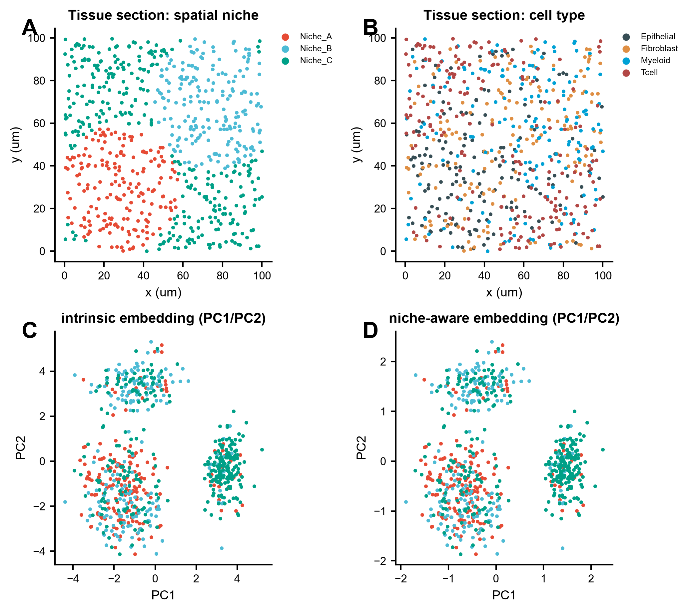
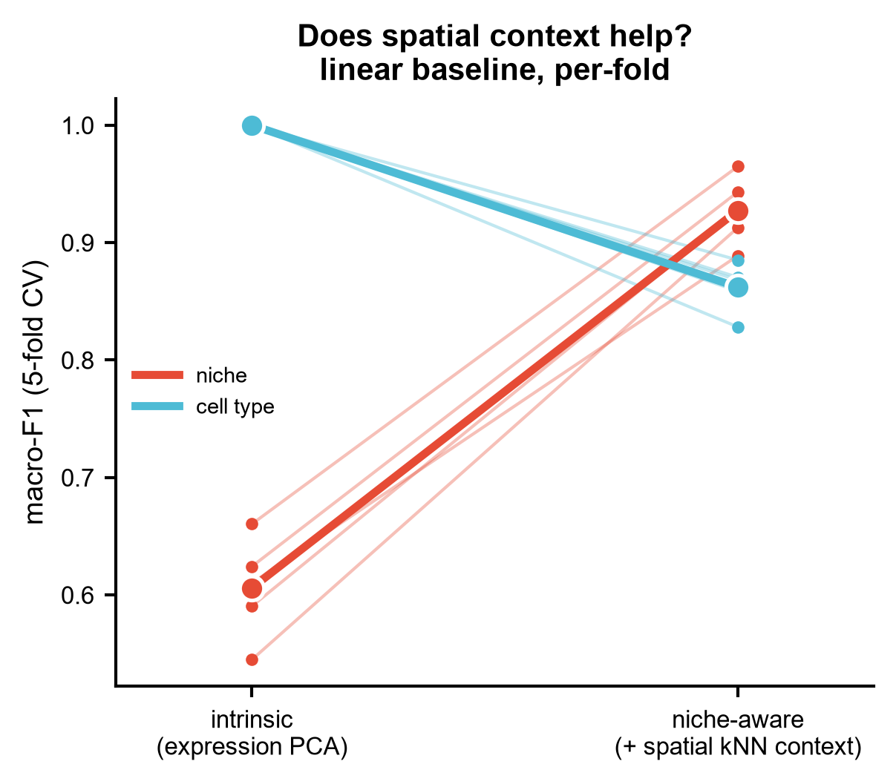
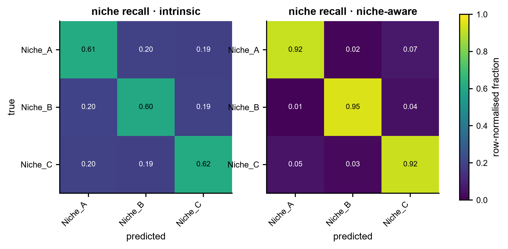

# 569 · Nicheformer —— 单细胞 + 空间联合预训练基础模型(空间感知嵌入 / 生态位与标签转移)

**Nicheformer**(Tejada-Lapuerta, Schaar 等,*Nat Methods* 2025)在 **SpatialCorpus-110M**
(摘要原文:5700 万解离细胞 + 5300 万空间解析细胞,横跨 73 个组织;人 + 小鼠)上**联合预训练**,
把每个细胞的自身表达 **与其空间邻域细胞** 一起送进 transformer,产出"带空间上下文"的细胞嵌入,
用于**生态位(niche)标签预测**与**解离 ↔ 空间之间的标签迁移**。

> **本模块诚实定位**:官方 Nicheformer 需要源码安装 + 官方 checkpoint(Mendeley Data)+ tokenization 流程 + GPU,
> 本机不装包,故官方路径写成**守卫式引用封装**(`--run-nicheformer`)。
> 模块主体是一条**本机零改动可跑的线性基线**:把"邻域上下文"退化成 **空间 kNN 邻域均值表达**,
> 与"只看细胞自身表达"的 PCA 在同一套交叉验证下对打。
> 任何"基础模型更好"的说法,都必须**先打赢这条线**(Genome Biol 2025:zero-shot 常打不过 PCA)。

| | |
|---|---|
| 语言 / 主依赖 | Python 3.12 · 基线仅需 `numpy` `pandas` `scikit-learn` `matplotlib`(本机已装)· 官方路径需 `nicheformer` + GPU |
| 输入 | 空间切片表达矩阵 + 坐标/标签元数据;解离 scRNA 参考表达矩阵 + 标签 |
| 输出 | `results/` 每折 macro-F1 表 + 汇总 JSON;`assets/` 3 张展示图 |
| 运行时间 | 示例数据 CPU 约 10 秒 |
| 状态 | 🟡 诚实基线本机跑通出图;完整 Nicheformer 需装包 + 官方权重 + GPU |

---

## ① 输入数据

四个 CSV(示例见 `example_data/`,**synthetic, for demo only**):

| 文件 | 规格 | 说明 |
|---|---|---|
| `spatial_query_expression.csv` | 700 细胞 × 60 基因 | 行索引 = `cell_id`,列 = 基因,**原始计数** |
| `spatial_query_meta.csv` | 700 行 | 必需列 `cell_id, x, y` + 标签列(默认 `niche`, `cell_type`) |
| `dissociated_reference_expression.csv` | 500 细胞 × 60 基因 | 解离 scRNA 参考集,同上格式 |
| `dissociated_reference_meta.csv` | 500 行 | 必需列 `cell_id` + 标签列(默认 `cell_type`) |

样例前 3 行:

```
# spatial_query_meta.csv
cell_id,x,y,niche,cell_type
SP0000,80.22,17.47,Niche_C,Myeloid
SP0001,74.78,75.54,Niche_B,Fibroblast
SP0002,98.88,51.07,Niche_B,Fibroblast

# spatial_query_expression.csv (前 4 列)
,Epithelial_prog00,Epithelial_prog01,Epithelial_prog02
SP0000,0,1,2
SP0001,0,1,1
SP0002,1,1,1
```

合成数据的设计意图(这一点很关键,否则对照没有信息量):**4 个细胞类型程序 + 3 个空间生态位**;
生态位对表达的**直接**影响故意做得很弱(+0.35 log),但**不同生态位的细胞类型组成不同**。
因此 niche 标签主要要靠**邻域上下文**才能恢复,而 cell_type 靠细胞自身表达就够 ——
两个任务方向相反,可以同时暴露空间上下文的**收益与代价**。

换成自己的数据:

```bash
python 569_nicheformer_sc_spatial_fm.py \
  --sp_expr my_spatial.csv --sp_meta my_spatial_meta.csv \
  --ref_expr my_ref.csv --ref_meta my_ref_meta.csv \
  --niche_key domain --label_key celltype
```

---

## ② 方法 / 原理

**基线(始终运行,CPU)**

1. CPM 归一化 + `log1p`(等价于 `scanpy.pp.normalize_total` + `log1p` 的最小实现)。
2. 构建两种表征:
   - `intrinsic` = 细胞自身表达 → StandardScaler → PCA(15 PC),**不含任何空间信息**;
   - `niche-aware` = `intrinsic` ⊕ **空间 kNN(k=15,排除自身)邻域均值表达的 PCA**,两块各自 z-score 后拼接。
     这是 Nicheformer 里 **niche token**(源码中的 `X_niche_0` … `X_niche_4`,即每个细胞的空间近邻)的**线性对照版** —— 论文用 transformer 编码邻域,这里故意用邻域均值,做成一条朴素地板。
3. **同折**分层 5 折交叉验证 + kNN 分类器,报每折 macro-F1(niche 任务与 cell type 任务各一套)。
   防泄漏:标签只在 fit 折内使用;两种表征均由**无监督**步骤构建(PCA / 邻域均值不看标签)。
4. 跨模态标签迁移:在解离参考集上拟合 scaler+PCA,把空间 query 投到同一空间做 kNN 传标签 ——
   这是**不做批次校正**的地板值,不是 benchmark 成绩。

**Nicheformer 官方路径(`--run-nicheformer`,需装包 + 权重 + GPU)**

下列名称来自 **实际读取的上游源码**(2026-07-20 抓取):

- `https://raw.githubusercontent.com/theislab/nicheformer/main/README.md`
- `https://raw.githubusercontent.com/theislab/nicheformer/main/src/nicheformer/__init__.py`
- `https://raw.githubusercontent.com/theislab/nicheformer/main/src/nicheformer/models/__init__.py`
- `https://raw.githubusercontent.com/theislab/nicheformer/main/src/nicheformer/models/_nicheformer.py`
- `https://raw.githubusercontent.com/theislab/nicheformer/main/src/nicheformer/_embeddings.py`

**A. 公共 API**(由 `nicheformer/models/__init__.py` 导出,可直接 import)

| 真实 API | 源码位置 | 说明 |
|---|---|---|
| `nicheformer.models.Nicheformer` | `models/__init__.py:1` → `models/_nicheformer.py:15` | `pl.LightningModule`;签名见 `_nicheformer.py:16-36`:`__init__(dim_model, nheads, dim_feedforward, nlayers, dropout, batch_first, masking_p, n_tokens, context_length, lr, warmup, batch_size, max_epochs, cls_classes=164, supervised_task=None, learnable_pe=True, specie=False, assay=False, modality=False, contrastive=False)` |
| `Nicheformer.get_embeddings(batch, layer=-1, with_context=False)` | `_nicheformer.py:272` | 取指定 transformer 层的细胞嵌入。`layer<0` = 倒数第 layer 层;`with_context=False` 丢掉前 3 个上下文 token(`embeddings[:, 3:, :]`)后对 token 维求均值;返回 `(batch, dim_model)` 张量 |
| `nicheformer.models.NicheformerFineTune` | `models/__init__.py:2` → `models/_nicheformer_fine_tune.py:18` | 微调用的完整 `pl.LightningModule`(不只是一个头),自带 `get_embeddings(batch, layer=-1)`(`:322`) |

**B. 非公共 API —— 只能当参考实现读,不能当接口调用**

| 符号 | 源码位置 | 实测状况 |
|---|---|---|
| `src/nicheformer/_embeddings.py::get_embeddings_model(config)` | `_embeddings.py:10` | config 键 `checkpoint_path` / `fine_tuned_checkpoint_path` / `organ`(`:17,:26`,取值样例见 `config_files/_config_embeddings.py:2-4`);merlin 列名 `X`、`X_niche_0`…`X_niche_4`、`idx`、`assay`、`specie`、`modality`(`:32,:48`),这些列随后成为 batch 键(`:109-122`);输出 `embeddings.npy`(512 维,`:100,:138`)+ `metadata_embeddings.csv`(`:139`) |

> ⚠️ 该函数**原样调用必失败**,三个实测原因:
> ① 文件顶部是 `from models._nicheformer import ...`(非包内相对导入),装成包后 import 不到;
> ② 所有 `path_organ` 都是作者集群的 `/lustre/groups/ml01/...` 硬编码路径;
> ③ 同目录入口 `get_embeddings.py:3` 导入的是 `get_embeddings_organ`,而 `_embeddings.py` 里**不存在**这个名字(上游自身不一致)。
>
> ⚠️ **未确认部分**:官方**没有渲染好的 API 文档站** —— `docs/api.md` 至今仍是 cookiecutter 模板占位
> (里面写的 `nicheformer.pp.basic_preproc` / `tl.basic_tool` / `pl.basic_plot` 在源码中并不存在),
> 上游 README 第 7 行也只说 Jupyter book "will be available soon"。
> 上表以外的完整 config 键值、调用顺序、tokenization 细节**以官方 notebook 为准,本模块不固定签名**。
> 数据须先过 `notebooks/tokenization/`,该目录下**实际只有 3 个** notebook:
> `cosmx_human_lung.ipynb`、`xenium_human_lung.ipynb`、`scRNAseq_mouse_brain_haviv.ipynb`(**没有 merfish 版**)。
> 另:上游 README:53 写明权重托管在 **Mendeley Data**,**不是 HuggingFace**(与本模块立项描述不符,以仓库为准)。

**上游事实核对**(逐条可指源码)

| 陈述 | 依据 |
|---|---|
| 预训练语料 SpatialCorpus-110M = **5700 万解离 + 5300 万空间**细胞、**73 个组织** | 论文摘要原文(efetch PMID 41168487):"over 57 million dissociated and 53 million spatially resolved cells across 73 tissues"。★5700 万只是解离那一半,**不是总量** |
| 支持模态 | 解离 scRNA-seq + **靶向**空间转录组(摘要:"targeted spatial transcriptomics");物种为人 + 小鼠 |
| 权重位置 | 上游 `README.md:53` + `data/README.md`:Mendeley Data |
| 许可证 | `LICENSE:1`:**BSD 3-Clause**,Copyright (c) 2024 Theislab |
| Python 版本 | `pyproject.toml:10` `requires-python = ">=3.9"`(README:33 亦为 `python=3.9`) |
| 关键依赖 | `pyproject.toml:23-45`:`torch>=2.5.1`、`pytorch-lightning>=2.0.0`、`numpy==1.26.4`、`pandas==1.5.3`、`squidpy`、`pyensembl==2.3.13`、`merlin-core/merlin-dataloader>=23.8.0`、`dask-cuda>=24.2.0`。★`numpy`/`pandas` 是**钉死的旧版**,`dask-cuda` 要 CUDA —— 与本机环境(numpy 2.x / pandas 2.x)直接冲突,这也是本模块不装包的原因 |
| 有无 tutorials | `notebooks/` 下共 5 个可用 notebook(3 个 tokenization + `notebooks/experiments/` 下 `get_embeddings.ipynb`、`downstream_fine_tune.ipynb`);另有 `docs/notebooks/example.ipynb`,但那是 cookiecutter 模板占位、非教程。**没有**渲染好的文档站 |

**引用(已核实)**

Tejada-Lapuerta A, Schaar AC, Gutgesell R, Palla G, Halle L, Minaeva M, Vornholz L, Dony L, Drummer F,
Richter T, Bahrami M, Theis FJ. **Nicheformer: a foundation model for single-cell and spatial omics.**
*Nat Methods*. 2025 Dec;22(12):2525-2538. doi:10.1038/s41592-025-02814-z · **PMID 41168487** · PMCID PMC12695652

> 核实方式:NCBI E-utilities `efetch`(db=pubmed, id=41168487, rettype=abstract)拉回摘要原文,
> 逐项核对标题、期刊 *Nat Methods*、卷期页 22(12):2525-2538、Epub 2025-10-30、DOI、12 位作者列表,
> 以及本 README 引用的**预训练规模数字**,全部一致。
> 仓库 README 上仍写着 bioRxiv 2024 的旧引用(未随正刊发表更新),此处以 PubMed 记录为准。

---

## ③ 用途(回答什么科学问题)

- **这块组织里的细胞处在什么生态位?** —— niche / spatial domain 标签预测。
- **空间上下文到底带来了多少增量?** —— 同折 CV 下 `intrinsic` vs `niche-aware` 的直接对比,而不是只报一个好看的数。
- **解离 scRNA 的注释能不能搬到空间切片上?** —— 跨模态标签迁移的未校正地板值。
- **要不要上基础模型?** —— 先看线性邻域基线能到多少;基线已接近上限时,基础模型的边际收益需要重新论证。

---

## ④ 特点 / 亮点

- **必带对照**:两种表征在**同一折划分**下比较,差值 `delta` 直接落盘,不允许单独汇报一个数字。
- **两个方向相反的任务**:示例数据上,空间上下文让 **niche** 任务 macro-F1 从 **0.606 → 0.928(+0.321)**,
  却让 **cell type** 任务从 **1.000 → 0.862(−0.138)** —— 邻域信息会稀释细胞自身身份信号。
  这个代价在只报"最好那个任务"的写法里通常看不见。
- **防泄漏**:表征构建全程无监督,标签仅在 fit 折内使用;`niche-aware` 的邻域均值明确排除细胞自身。
- **不装包也能跑**:仅用本机已有的 `scikit-learn` 栈;官方路径缺包/缺权重时优雅退出并打印**真实安装命令**,不静默降级。
- **不臆造 API**:上表每个函数名/参数都能**指到本地克隆源码的文件:行号**;并把"公共 API"与
  "看着像 API、其实调不通的集群脚本"(`get_embeddings_model`)明确**分开标注**,读不到的部分标"未确认"。
- **绘图守规矩**:slopegraph / 散点 / heatmap,**无条形图**;图中文字英文,矢量 PDF + 300dpi PNG 双出。

---

## ⑤ 输出结果图

| 文件 | 内容 |
|---|---|
| `results/569_cv_macro_f1_per_fold.csv` | 长表:task × representation × fold × macro_f1 |
| `results/569_summary.json` | 参数、两种表征的均值±SD、delta、跨模态迁移指标、Nicheformer 路径状态 |
| `assets/fig1_tissue_and_embeddings.png/.pdf` | 组织切片(niche / cell type)+ 两种嵌入的 PC 散点 |
| `assets/fig2_representation_slopegraph.png/.pdf` | 每折 macro-F1 的 slopegraph:intrinsic → niche-aware |
| `assets/fig3_niche_confusion_heatmap.png/.pdf` | niche 标签行归一化混淆矩阵热图(两种表征并排) |

**Fig 1 · 切片与嵌入**



**Fig 2 · 空间上下文有没有用(每折 slopegraph)**



**Fig 3 · niche 召回混淆矩阵**



> 图中数值来自合成数据,**只用于演示流程与对照逻辑,不构成任何 benchmark 结论**。
> 特别地,跨模态迁移在示例数据上 accuracy = 1.000,是因为合成的细胞类型程序过于可分,
> 真实数据不会这样 —— 该数字是流程连通性的证明,不是性能宣称。

---

## 运行

```bash
# 零改动即跑(读 example_data/ → results/ + assets/)
python 569_nicheformer_sc_spatial_fm.py

# 换数据 + 调参
python 569_nicheformer_sc_spatial_fm.py \
  --sp_expr my_spatial.csv --sp_meta my_meta.csv \
  --ref_expr my_ref.csv --ref_meta my_ref_meta.csv \
  --niche_key domain --label_key celltype \
  --n_pcs 30 --k_spatial 20 --folds 5 --outdir results/run1

# 尝试官方 Nicheformer 路径(缺包/缺权重会优雅跳过并打印安装命令)
python 569_nicheformer_sc_spatial_fm.py --run-nicheformer --checkpoint /path/to/nicheformer.ckpt
```

固定随机种子 `--seed 42`;全部路径为脚本相对路径,无 `setwd` / 绝对路径。

## 依赖安装

基线所需(本机已装,无需操作):`numpy pandas scikit-learn matplotlib`

官方 Nicheformer 路径(**本模块不代为安装**):

```bash
mamba create -n nicheformer_env python=3.9
mamba activate nicheformer_env
git clone https://github.com/theislab/nicheformer.git
cd nicheformer && pip install -e .
```

预训练权重按仓库 README 从 **Mendeley Data** 下载,连同 technology-specific mean vectors 放入 `data/` 子目录;
数据需先经 `notebooks/tokenization/` 下的官方 notebook 处理。GPU 强烈建议。
