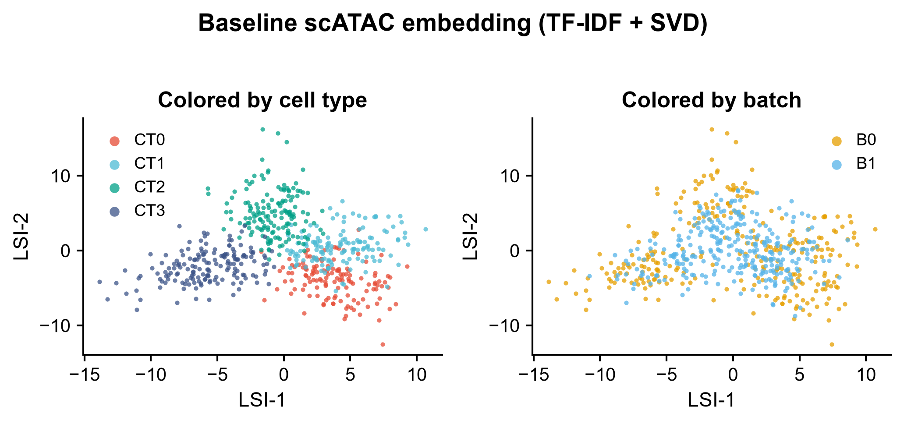
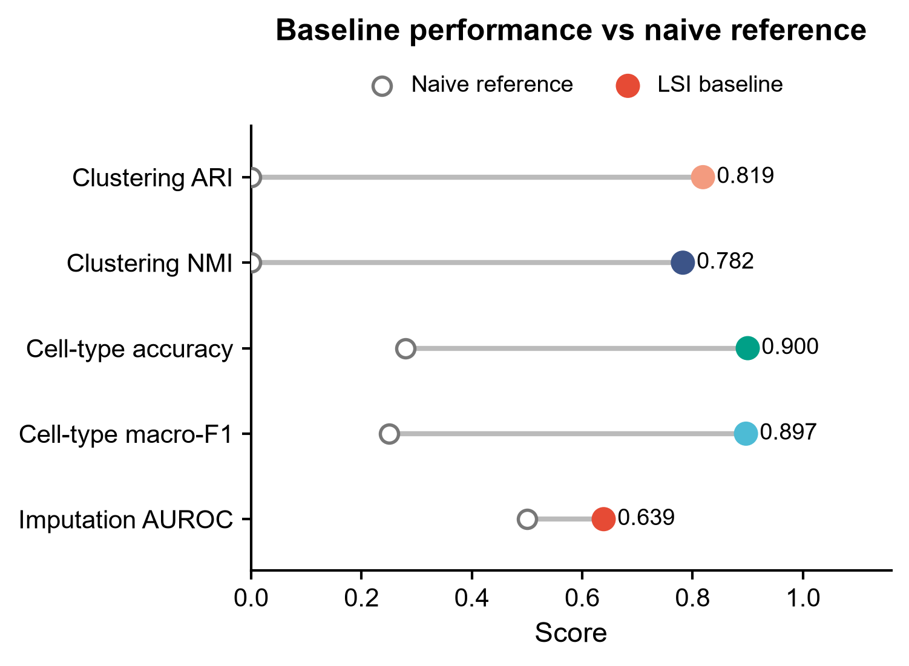
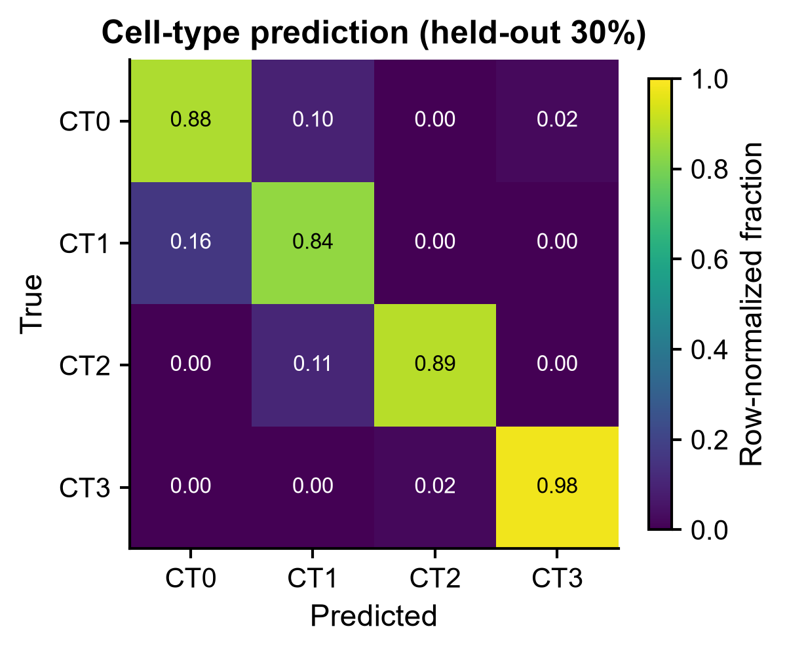
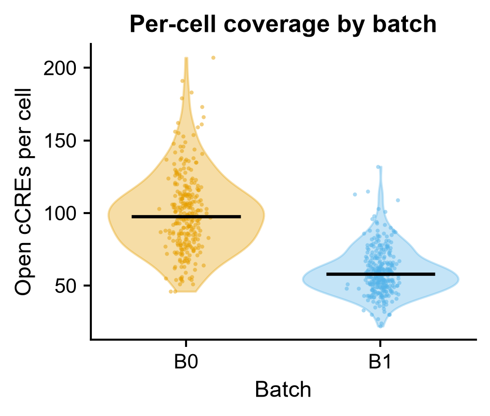

# 570 · EpiAgent — 单细胞染色质可及性基础模型 (scATAC foundation model)

> 一句话定位:输入 **细胞 × cCRE 可及性矩阵** → 跑一条永远可跑的 **TF-IDF + SVD (LSI) 基线**
> (嵌入 / 聚类 / 细胞类型预测 / 填补)并守卫式封装 **EpiAgent** 基础模型路径 → 出
> 散点、lollipop、热图、violin 四张图。

| | |
|---|---|
| **语言 / 主依赖** | Python 3.12 · 基线:`numpy` `pandas` `scikit-learn` `matplotlib`;EpiAgent 路径:`epiagent` + `flash-attn` + **CUDA GPU** |
| **一句话用途** | scATAC 细胞嵌入、细胞类型预测、可及性填补;并给基础模型配一个可量化的朴素对照 |
| **输入** | `example_data/cell_by_ccre_counts.csv` + `example_data/cell_metadata.csv` |
| **输出** | `results/`(运行生成) · 展示图见 `assets/` |
| **状态** | 🟡 基线本机零改动跑通并出图;EpiAgent 完整方法需在装了 GPU + flash-attn 的服务器上跑 |

---

## ① 输入数据

**文件 1**:`cell_by_ccre_counts.csv`(csv;orientation:**行 = 细胞,列 = cCRE / peak**)

| 列名 | 类型 | 必需 | 示例 | 说明 |
|------|------|:---:|------|------|
| (行索引,无列名) | str | ✔ | `Cell0000` | 细胞条码,须与元数据的行索引一致 |
| `cCRE00000` … | int/float | ✔ | `0` / `1` | 该细胞在该 cCRE 的 fragment 计数;内部一律二值化为「开放 / 不开放」 |

**文件 2**:`cell_metadata.csv`(csv;行 = 细胞)

| 列名 | 类型 | 必需 | 示例 | 说明 |
|------|------|:---:|------|------|
| (行索引,无列名) | str | ✔ | `Cell0000` | 细胞条码 |
| `cell_type` | str | ✔ | `CT2` | 真值细胞类型标签,供有监督评估用 |
| `batch` | str | ✔ | `B1` | 批次 / 样本标签,供批次混合度评估用 |

**命名/格式约定**:两份文件的行索引必须能对齐(脚本按矩阵的细胞顺序取元数据);
以 `#` 开头的行按注释跳过。示例数据为 **synthetic, for demo only**,并非真实 scATAC。

**样例(前 3 行)**:
```
# synthetic, for demo only -- NOT real scATAC data
,cCRE00000,cCRE00001,cCRE00002,...
Cell0000,0,0,1,...
```
```
# synthetic, for demo only -- NOT real scATAC data
,cell_type,batch
Cell0000,CT3,B1
```

## ② 方法 / 原理

### 基线(永远可跑,CPU)

scATAC 领域的标准朴素做法是 **LSI**(TF-IDF + 截断 SVD,即 Signac / ArchR 的默认降维)。
本模块用它给 EpiAgent 声明的三项能力各配一个可量化对照:

1. **TF-IDF**:二值化 → 按细胞测序深度做 TF → 按 cCRE 文档频率做 IDF → `log1p`。
2. **截断 SVD** 取 30 维,**丢弃第 1 主成分**(领域惯例:PC1 通常主要编码测序深度而非生物学)。
3. **三项评估**
   - *嵌入 / 聚类*:KMeans(k = 真值类别数)→ ARI / NMI;
   - *细胞类型预测*:LSI 嵌入 + 逻辑回归,**分层 7:3 划分,指标只在 held-out 折报告**;
     嵌入本身在全体细胞上无监督拟合(不看标签),分类器只在训练折拟合 → 防数据泄漏;
   - *填补*:随机遮蔽 15% 的「已观测开放」位点(打成人工 dropout)+ 等量闭合位点作负例,
     用低秩 SVD 重构打分 → AUROC。
4. **批次混合度**:kNN(k=20)中同批次邻居比例,并给出「完美混合」的期望值 Σpᵢ² 作参照。

朴素参照线(lollipop 图中的空心点):ARI / NMI 随机划分 ≈ 0;分类准确率参照 = 多数类占比;
macro-F1 参照 = 1/类别数;AUROC 随机 = 0.5。

### EpiAgent 路径(`--run-epiagent`,守卫式)

EpiAgent 把每个细胞表示为按可及性排序的 “cell sentence”,用双向注意力做自监督预训练,
下游支持细胞嵌入、细胞类型注释、信号重构/填补、批次校正与扰动预测。

以下参数**取自上游源码默认值,不是从论文正文转述**:

- **18 层 Transformer**、隐藏维 512、8 注意力头、最大序列长 8192
  (`epiagent/model.py:28-38` 的 `EpiAgent.__init__` 默认值);
- **cCRE 词表 1,355,445**(`tokenization.tokenization` 的 `num_cCREs` 默认值,
  `epiagent/tokenization.py:6`;上游随包附带的 `data/cCRE.bed` 实测正好 **1,355,445 行**),
  模型侧 `vocab_size=1355449` = 1,355,445 个 cCRE + 4 个特殊 token
  (`[PAD]=0` / `[CLS]=1` / `[SEP]=2`,见 `dataset.py:70,79`);
- 预训练语料 **Human-scATAC-Corpus**;上游 README 2025.09.09 更新日志自述其规模为
  **>5.4 million cells、37 个组织或细胞系**(该数字出自上游 README 与语料库论文,
  Nat Methods 摘要原文只写 “manually curated large-scale Human-scATAC-Corpus”,未给数字)。

脚本对该路径**只做环境探测**(能否 import、有无 CUDA、有无 flash-attn),
并打印上游真实 API 与官方教程指引,**不构造未经官方教程验证的端到端调用序列**。

#### API 溯源(逐文件实读,非推测)

下表每一行都对照 upstream 仓库(`epiagent` PyPI v0.0.3,`setup.py:version`)源码逐行核过,
「源码位置」列给的是文件名 + 定义所在行号:

| 上游对象 | 实读到的签名 | 源码位置 |
|---|---|---|
| `preprocessing.construct_cell_by_ccre_matrix` | `(intersect_file, ccre_bed_path)` → 返回 `AnnData` | `epiagent/preprocessing.py:8` |
| `preprocessing.global_TFIDF` | `(adata, cCRE_document_frequency)` | `epiagent/preprocessing.py:52` |
| `tokenization.tokenization` | `(adata: AnnData, num_cCREs=1355445)` → 写入 `adata.obs['cell_sentences']` | `epiagent/tokenization.py:6` |
| `dataset.CellDataset` | `(cell_sentences, max_length=8192, is_random=True)` | `epiagent/dataset.py:6`(`__init__` 在 `:20`) |
| `dataset.collate_fn` | `(data)` → 以 `[PAD]=0` 右填充后 stack 成 `[B, L]` LongTensor | `epiagent/dataset.py:75` |
| `model.EpiAgent` | `(vocab_size=1355449, num_layers=18, embedding_dim=512, num_attention_heads=8, max_rank_embeddings=8192, MLP_hidden_for_RLM=64, MLP_hidden_for_CCA=128, pos_weight_for_RLM=False, pos_weight_for_CCA=False, pos_weight_signals=torch.tensor(100), use_flash_attn=True)` | `epiagent/model.py:8`(`__init__` 在 `:27`) |
| `model.EpiAgent_supervised` | `(vocab_size=1355449, num_layers=18, embedding_dim=512, num_attention_heads=8, max_rank_embeddings=8192, num_classes=10, use_flash_attn=True)` | `epiagent/model.py:268`(`__init__` 在 `:284`) |
| `model.EpiAgent_BC` | 继承 `EpiAgent` 的批次校正变体 | `epiagent/model.py:419` |
| `model.EpiAgent_PT` | 扰动预测变体 | `epiagent/model.py:627` |
| `inference.infer_cell_embeddings` | `(model, device, dataloader)` | `epiagent/inference.py:78` |
| `inference.infer_cell_types` | `(model, device, dataloader, need_cell_embeddings=True)` | `epiagent/inference.py:117` |
| `inference.infer_reconstructed_signals` | `(model, device, dataloader, need_cell_embeddings=True, predicted_cCRE_indices=None)` | `epiagent/inference.py:7` |

微调入口(本模块未调用,仅登记以备后续扩展):`train.fine_tune_epiagent_for_UFE`
(`epiagent/train.py:11`)、`_for_SCA`(`:226`)、`_for_OSP`(`:400`)、`_for_RDI`(`:660`)。

**上游包结构注意**:`epiagent/__init__.py` 是**空文件**,不 re-export 任何符号,
也不定义 `__version__`。因此 `import epiagent` 后必须显式 `from epiagent import model, inference`
等子模块才能拿到上述对象;脚本探测里对 `__version__` 用了兜底默认值。

> ⚠️ **未确认项**:预训练权重的加载方式、各下游任务的端到端串联顺序与超参。
> 上游 README 正文没有完整 quickstart 代码块,只把端到端流程放在
> [`demo/` 目录](https://github.com/xy-chen16/EpiAgent/tree/main/demo/) 的 notebook 里
> (本模块未逐个执行过这些 notebook),**以官方 demo 为准,此处未固定**。
> 本模块脚本内的 `tfidf()` 是自实现的朴素版本,**不冒充** `epiagent.preprocessing.global_TFIDF`。

## ③ 用途

回答的科学问题:

- 一批 scATAC 细胞的**低维表示**长什么样,细胞类型能否分开、批次是否混杂在一起?
- 用可及性谱能否**预测细胞类型**,哪些类型对容易混淆?
- 稀疏的 scATAC 矩阵中被 dropout 掉的开放位点能否被**填补**回来?
- 一个 scATAC 基础模型(EpiAgent)相对朴素 LSI 到底赢多少 —— 这正是本模块存在的意义。

典型场景:新 scATAC 数据集的第一轮探索;评估是否值得为 EpiAgent 上 GPU;
给基础模型的效果声明配对照。

## ④ 特点 / 亮点

- **turnkey**:`python 570_epiagent_scatac_fm.py` 零改动即跑,自动生成合成数据、出全部图;
- **基线不可省**:基础模型的三项声明能力各有一个 CPU 可跑的朴素对照 + 随机/多数类参照线,
  基础模型未装也能得到完整可解释结果;
- **合成数据刻意不饱和**:类型特异信号压到 0.16 vs 背景 0.04,并让相邻类型共享一半特异 peak,
  使基线落在 ARI≈0.82 / 准确率≈0.90 而非 1.0 —— 饱和的对照没有区分力;
- **防数据泄漏**:嵌入无监督拟合、分类器只在训练折拟合、指标只在 held-out 折报告;
- **诚实的守卫式封装**:上游 API 逐文件实读并在 README 列出溯源 URL,未确认处明确标注;
- **无条形图**:散点 / lollipop / 热图 / violin+抖动散点。

## ⑤ 输出结果图

| 文件 | 图型 | 说明 |
|------|------|------|
| `assets/570_embedding_scatter.png` | 双 panel 散点 | LSI 嵌入,左按细胞类型着色、右按批次着色 |
| `assets/570_baseline_metrics_lollipop.png` | lollipop | 五项基线指标 vs 朴素参照(空心点) |
| `assets/570_celltype_confusion.png` | 热图 | held-out 30% 上的细胞类型预测混淆矩阵(行归一化) |
| `assets/570_coverage_violin.png` | violin + 抖动散点 | 每批次 per-cell 开放 cCRE 数,暴露技术批次效应 |

另有表格输出:`results/570_baseline_embedding.csv`(细胞级嵌入 + KMeans 簇标签)、
`results/570_summary.json`(全部指标 + EpiAgent 环境探测结果)。









---

## 运行

```bash
# 零改动跑示例(仅基线;本机实测退出码 0)
python 570_epiagent_scatac_fm.py

# 顺带探测 EpiAgent 环境(未装/无 GPU 会优雅跳过并打印安装命令)
python 570_epiagent_scatac_fm.py --run-epiagent

# 换成自己的数据
python 570_epiagent_scatac_fm.py \
    --matrix data/你的_cell_by_peak.csv \
    --meta   data/你的_metadata.csv \
    --outdir results/run1 --n-comp 50

# 重新生成合成示例数据
python 570_epiagent_scatac_fm.py --regen-example
```

本机冒烟测试(600 cells × 900 cCREs,seed=0,退出码 0):
ARI 0.819 · NMI 0.782 · 细胞类型准确率 0.900 · macro-F1 0.897 · 填补 AUROC 0.639;
EpiAgent 路径 `status: skipped`(本机未装 epiagent)。

## 依赖安装

基线所需依赖本机均已具备(`numpy` `pandas` `scikit-learn` `matplotlib`),无需安装。

EpiAgent 完整路径(需 NVIDIA GPU;`use_flash_attn=True` 是上游默认,CPU 不可行)——
以下命令**照抄自上游 README**:

```bash
conda create -n EpiAgent python=3.11
conda activate EpiAgent
pip install torch==2.0.1 torchvision==0.15.2 torchaudio==2.0.2
pip uninstall -y ninja && pip install ninja
pip install flash-attn==2.5.8 --no-build-isolation
pip install epiagent
```

预训练权重(EpiAgent 及监督版 EpiAgent-B / EpiAgent-NT)、示例文件与 `cCRE_frequency.npy`
由上游托管在 **Google Drive**(链接见上游 README 的更新日志与各任务小节),**不是** GitHub release;
端到端用法见上游 [`demo/` 目录](https://github.com/xy-chen16/EpiAgent/tree/main/demo/) 的 notebook。

## 引用

Chen X, Li K, Cui X, Wang Z, Jiang Q, Lin J, Li Z, Gao Z, Lv H, Jiang R.
**EpiAgent: foundation model for single-cell epigenomics.** *Nat Methods*
2025 Nov;22(11):2316-2327.
doi:[10.1038/s41592-025-02822-z](https://doi.org/10.1038/s41592-025-02822-z) · PMID **40999099**

> 引用已核实:NCBI E-utilities `esummary` + `efetch` 返回 PMID 40999099 =
> “EpiAgent: foundation model for single-cell epigenomics”,Nat Methods 2025 Nov;22(11):2316-2327,
> Epub 2025 Sep 25,DOI 10.1038/s41592-025-02822-z。
> ⚠️ 第 9 作者以 PubMed 见刊版为准写作 **Lv H**;上游 GitHub README 的自引写的是
> “Hai, L.”,两者不一致,本模块采用 PubMed。

配套语料库(上游 README 同时要求引用):Chen X, et al. **Human-scATAC-Corpus: a comprehensive
database of scATAC-seq data.** *Nucleic Acids Research* 2026 Jan 6.
doi:10.1093/nar/gkaf1216 · PMID 41296545(已核实;上游 README 引的是 bioRxiv 预印本版本,
此处给的是已见刊版本)。

仓库:<https://github.com/xy-chen16/EpiAgent> · 许可证 **MIT**
(上游 `LICENSE`,Copyright (c) 2024 xy-chen16) · PyPI 包名 `epiagent`,
本次核对针对 `setup.py` 中 `version="0.0.3"` 的源码快照。
