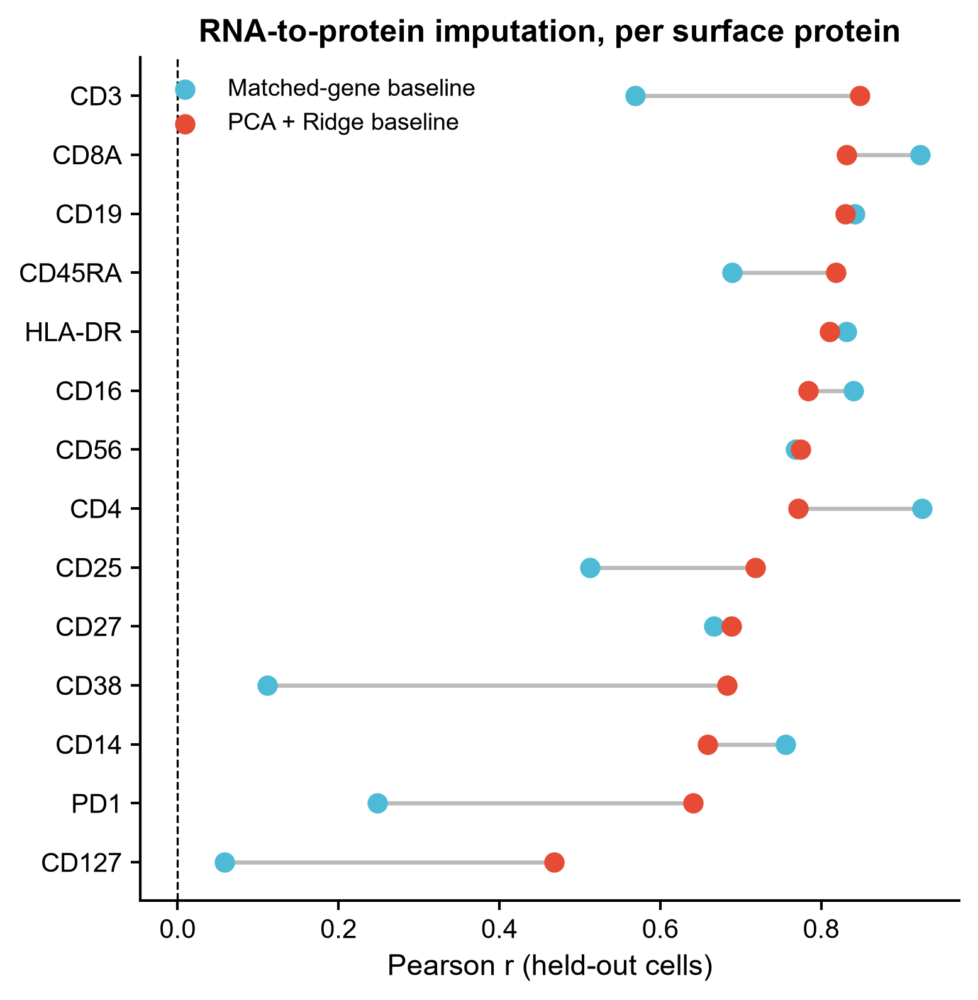
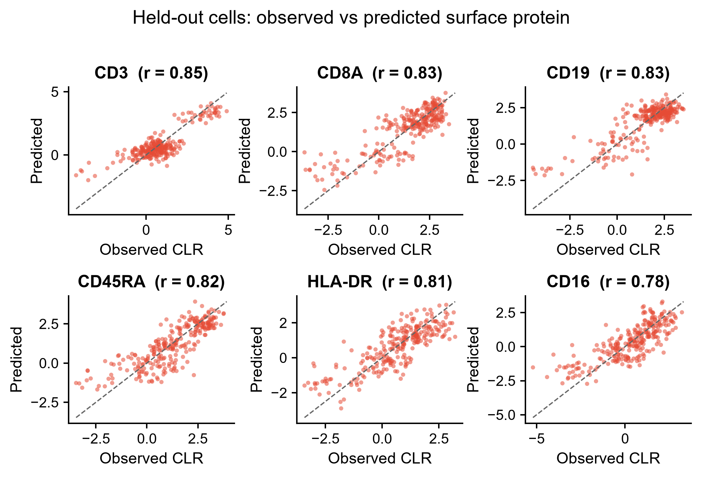
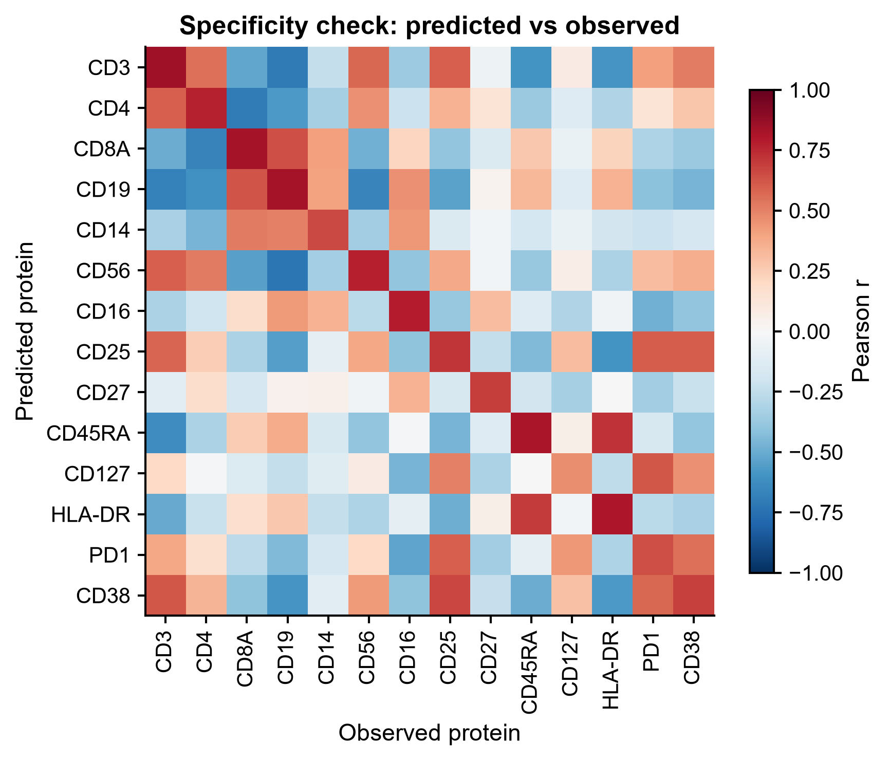

# 571 · CAPTAIN — 配对 RNA+表面蛋白多模态基础模型(CITE-seq 蛋白填补基准台)

> 一句话定位:输入**配对 CITE-seq**(细胞×基因 计数 + 细胞×表面蛋白 ADT 计数)→ 在留出细胞上评测
> 「**从 RNA 预测表面蛋白**」这一 CAPTAIN 旗舰任务,并**始终先跑两条本机可跑的朴素基线**(同源基因 /
> PCA+Ridge)→ 出 dumbbell、observed-vs-predicted 散点、特异性 heatmap。

| | |
|---|---|
| **语言 / 主依赖** | Python 3.12 · `numpy` `pandas` `scikit-learn` `matplotlib`(基线全本机可跑);CAPTAIN 本体需 GPU + 克隆上游仓库 |
| **一句话用途** | 蛋白填补/多模态整合前,先量出"RNA 到底能预测多少蛋白",给基础模型一条必须跨过的地板线 |
| **输入** | `example_data/citeseq_rna_counts.csv` + `citeseq_adt_counts.csv` + `protein_gene_map.csv` |
| **输出** | `results/`(运行生成)· 展示图见 `assets/` |
| **状态** | 🟡 基线本机零改动跑通出图;CAPTAIN 本体为守卫式封装(需 GPU + 权重) |

---

## ① 输入数据

**文件 1**:`citeseq_rna_counts.csv`(行=细胞,列=基因,值=原始 UMI 计数;首行 `#` 注释行)

| 列名 | 类型 | 必需 | 示例 | 说明 |
|------|------|:---:|------|------|
| (索引列) | str | ✔ | `CELL0000` | 细胞条码,须与 ADT 文件一致 |
| `GENE000`… | int | ✔ | `13` | 每个基因一列,原始计数(脚本内部做 CPM+log1p) |

**文件 2**:`citeseq_adt_counts.csv`(行=细胞,列=表面蛋白,值=ADT 原始计数)

| 列名 | 类型 | 必需 | 示例 | 说明 |
|------|------|:---:|------|------|
| (索引列) | str | ✔ | `CELL0000` | 细胞条码 |
| `CD3` `CD19`… | int | ✔ | `2011` | 每个抗体一列(脚本内部做 CLR 归一) |

**文件 3**:`protein_gene_map.csv`(蛋白 → 同源基因,供 matched-gene 基线使用)

| 列名 | 类型 | 必需 | 示例 | 说明 |
|------|------|:---:|------|------|
| `protein` | str | ✔ | `CD19` | 须与 ADT 列名完全一致 |
| `cognate_gene` | str | ✔ | `GENE003` | 编码该蛋白的基因,须在 RNA 列名中 |

**命名/格式约定**:两个矩阵的**行名必须是同一批细胞条码**(脚本取交集,交集为空直接报错退出);
CSV 首行允许 `#` 开头的注释行。`example_data/` 内为 **synthetic, for demo only** 的合成数据
(由 `make_example_data.py` 生成,种子固定),**不是真实 CITE-seq**。

**样例(前 3 行,`citeseq_adt_counts.csv`)**:
```
# synthetic, for demo only -- not real CITE-seq data (571_captain_rna_protein_fm)
,CD3,CD4,CD8A,CD19,CD14,CD56,CD16,CD25,CD27,CD45RA,CD127,HLA-DR,PD1,CD38
CELL0000,2011,2110,55,73,109,4160,22,24,294,1,11,93,5,14
CELL0001,4676,758,60,14,74,892,215,69,310,222,4,233,17,7
```

## ② 方法 / 原理

**归一化**:RNA 走文库大小归一 + `log1p`(scanpy 标准做法);ADT 走 **CLR**(centered log-ratio,
按细胞跨蛋白中心化,对应 Seurat `NormalizeData(normalization.method="CLR", margin=1)`)。

**评测设计(本模块的核心)**:按**细胞**随机切 train/test(默认 30% 留出,种子 `20260720`),
`StandardScaler` / `PCA` / `Ridge` **一律只在训练集拟合**再 transform 测试集,避免把测试细胞的
方差结构泄漏进降维——这是蛋白填补类文章最常见的漏洞。指标为 **per-protein 留出细胞 Pearson r 与 RMSE**。

**两条基线**:
1. **B0 matched-gene**:直接用蛋白同源基因的归一化表达(按训练集均值/方差对齐到蛋白尺度)当预测值。
   这是最朴素、也最难堪的对照——如果一个基础模型赢不了它,说明它没学到转录本以外的东西。
2. **B1 PCA + Ridge**:RNA → 30 个主成分 → 每个蛋白一个岭回归。这是 CITE-seq 蛋白填补文献里
   反复出现的线性地板线(totalVI / sciPENN 类工作的常规比较项)。

**CAPTAIN 本体(守卫式封装)**:CAPTAIN 在**超过四百万**配对细胞、**382** 个精选表面蛋白
(人+鼠多组织)上预训练,通过建模跨模态依赖学习统一的多模态表征,下游支持蛋白填补(微调 / 零样本)、
细胞类型注释、多组学整合、批次校正、扰动后蛋白预测、细胞通讯推断
(六项任务对应上游 `downstream_tasks/` 下六个实际存在的子目录)。

> 数字口径:`over four million single cells` 与 `382 surface proteins` 取自**论文摘要原文**
> (PubMed efetch 核对,2026-07-21)。注意上游 GitHub README 自身不一致——其摘要段(L17)写 382,
> 而 "Pretrained CAPTAIN Models" 段(L71)与 token_dict 说明(L89)写 387。
> 实测上游 `token_dict/csp_token_dict.pickle` 载入后是一个 **387 项的 dict**
> (`{'CD19': 0, 'CD59': 1, ...}`),即 **387 = 模型蛋白 token 词表大小**,
> **382 = 论文表述的预训练精选蛋白数**。本模块正文以论文为准取 382。

> **诚实说明**:CAPTAIN **没有 PyPI 包,也没有可 import 的函数式 API**
> (上游仓库无 `setup.py` / `pyproject.toml`,`captain/` 目录下无 `__init__.py`,已在本地克隆核实)。
> 上游用法是「克隆仓库 → 从 Google Drive 下载 `CAPTAIN_Base.pt` / `CAPTAIN_PBMC` 权重 →
> 跑 `downstream_tasks/<任务>/` 下的脚本」。本模块因此**不写 `import captain`**,只做环境探测
> (仓库文件、权重、CUDA)并打印从上游源码逐行核对过的命令。

> ⚠️ **上游的占位符陷阱(本模块已防)**:上游仓库里各任务目录下的 `CAPTAIN_Base.pt`(88 B)
> 和 `prior_knowledge/final_*_prior_knwo.npy`(86 B)**不是真文件**,内容只是一行
> Google Drive 链接。所以"文件存在"≠"权重就位"。本模块的探测会按体积+内容识别占位符,
> 把它们报成 `placeholder_weights`,并拒绝把状态判为 `ready`。

上游 API 核对来源:**本地克隆源码逐行 grep**(2026-07-21),非网页转述:
- `downstream_tasks/cell_surface_protein_prediction/zeroshot_genate.py`:
  L35 `argparse.ArgumentParser` · L38–49 全部命令行 flag · L545 / L548 两个输出 pickle
- 同目录 `finetune.py` / `genate.py` / `Tutorial_Protein_Prediction.ipynb` /
  `Tutorial_Protein_Prediction_Zero_shot.ipynb`(**均实际存在**)
- `token_dict/`(vocab.json、csp_token_dict.pickle、csp_align_dict.pickle、human_mouse_align.pickle)
- 上游 `README.md` L27(docker)、L45/L56(conda + pip)、L71–76(权重 Drive 链接)、`LICENSE`(MIT)

## ③ 用途

回答的科学问题:**在我这批 CITE-seq 数据里,表面蛋白丰度有多少是能从转录本推出来的?**
典型场景:① 手上只有 scRNA 而想"扩展"出表面蛋白通道时,先量清楚可信上限;
② 引入 CAPTAIN 这类多模态基础模型前后做同口径对照,判断它究竟带来了增量还是只是复现了细胞类型信号;
③ 挑出 RNA-蛋白**脱耦**的蛋白(翻译后调控/内吞主导,如示例中人为设弱的几个位点)——这些位点恰恰是
多模态模型最可能有价值、也最该被单独报告的地方。

## ④ 特点 / 亮点

- **turnkey**:`python 571_captain_rna_protein_fm.py` 一条命令跑完,不需要 GPU,不需要装任何新包;
- **基线优先**:CAPTAIN 没装也照样出完整评测结果——库规矩是任何"更好"都必须有朴素对照;
- **防泄漏**:降维与回归只见训练集,指标只在留出细胞上算;
- **特异性自查**:heatmap 的对角占优检验能戳穿"预测其实只学到了共享细胞类型信号"的假好成绩;
- **不伪造 API**:CAPTAIN 路径只探测 + 打印上游真实命令,状态写进 `571_summary.json`;
- **图型合规**:dumbbell / 散点 / heatmap,无条形图,图中文字全英文。

## ⑤ 输出结果图

| 文件 | 图型 | 说明 |
|------|------|------|
| `assets/571_protein_r_dumbbell.png` | Dumbbell | 每个蛋白两条基线的留出集 Pearson r,连线长度=增量 |
| `assets/571_obs_vs_pred_scatter.png` | 散点小多图 | ridge 表现最好的 6 个蛋白,observed vs predicted(含 y=x 参考线) |
| `assets/571_specificity_heatmap.png` | Heatmap | 预测×真实蛋白相关矩阵;对角占优=预测有蛋白特异性 |
| `results/571_baseline_metrics.csv` | 表 | per-protein r / RMSE / delta_r |
| `results/571_pred_pca_ridge.csv`、`571_observed_clr.csv` | 表 | 留出细胞的预测值与观测 CLR 值 |
| `results/571_summary.json` | JSON | 样本量、PC 数、中位 r、CAPTAIN 探测状态、随机种子 |







示例数据上的实测(合成数据,仅说明流程可跑,不代表真实生物学):
train=630 / test=270 / PCs=30,中位 r 同源基因 = 0.722、PCA+Ridge = 0.773,14 个蛋白中 8 个 ridge 更优。

---

## 运行

```bash
# 零改动跑示例(CPU,秒级)
python 571_captain_rna_protein_fm.py

# 换成自己的数据
python 571_captain_rna_protein_fm.py \
  --rna data/rna_counts.csv --adt data/adt_counts.csv \
  --protein-map data/protein_gene_map.csv --outdir results/run1

# 探测本机能否跑 CAPTAIN 本体(给出本地克隆路径)
python 571_captain_rna_protein_fm.py --captain-repo /path/to/CAPTAIN

# 重新生成合成示例数据(可选)
python make_example_data.py
```

可调参数:`--n-pcs`(默认 30)、`--test-frac`(默认 0.3)、`--alpha`(Ridge 正则,默认 10)。

## 依赖安装

基线路径所需的包本机均已具备(numpy / pandas / scikit-learn / matplotlib),**无需安装**。

CAPTAIN 本体(需 GPU,上游 README 给出的两种方式):

```bash
# 方式一:docker(上游推荐)
docker pull crpi-nzg91d1psypntvav.cn-beijing.personal.cr.aliyuncs.com/jiboya/captain_image:latest
docker run --gpus all -it --rm <image> /bin/bash && conda activate captain

# 方式二:conda
git clone https://github.com/iamjiboya/CAPTAIN && cd CAPTAIN
conda create -n captain python==3.10.0 && conda activate captain
pip install -r requirements.txt && pip install scgpt
# ⚠️ 上游 requirements.txt 是**硬钉版本**的:torch==2.1.2 / scanpy==1.10.4 / numpy==1.26.4 /
#    anndata==0.11.3 / scikit-learn==1.6.1 / omicverse==1.6.10 / muon==0.1.7 等,
#    与本机环境(torch 2.6.0+cu124 / numpy 2.4.6 / scanpy 1.12.1)不兼容 —— 必须建独立 conda 环境,
#    不要往本机环境里装。上游 README 另注:flash-attn 可选,不装也能跑。
# 权重 CAPTAIN_Base / CAPTAIN_PBMC 按上游 README 的 Google Drive 链接下载
#   上游 README 建议放到 ./pretrained_models/CAPTAIN_Base;
#   但脚本的实际默认 --load_model_dir = 脚本自身所在目录,
#   即最省事的做法是用真权重直接覆盖 downstream_tasks/<任务>/CAPTAIN_Base.pt 那个 88 B 占位符。
# 同理 prior_knowledge/final_human_prior_knwo.npy 也需从 Drive 下载覆盖占位符。
```

蛋白预测任务的调用(以下 flag 全部核对过 `zeroshot_genate.py` L38–49 的 argparse,
输出文件名来自同文件 L545 / L548;另见同目录官方 `Tutorial_Protein_Prediction_Zero_shot.ipynb`):

```bash
cd downstream_tasks/cell_surface_protein_prediction
python zeroshot_genate.py --data_rna_path <rna_test.h5ad> --data_protein_path <adt_test.h5ad> \
       --model_filename CAPTAIN_Base.pt --species human
# 必需参数:--data_rna_path / --data_protein_path(required=True)
# 有默认值:--model_filename(CAPTAIN_Base.pt)--species(human,choices=human|mouse)
#           --token_dict_dir(../token_dict)--prior_know(../prior_knowledge)
#           --load_model_dir(脚本目录)--save_dir(脚本目录/results)
#           --batch_size 1 --layer_size 128 --nlayers 4 --nhead 4
# 输出:<save_dir>/true_adt_data_scale.pickle 与 <save_dir>/predicted_adt_scale.pickle
```

## 引用

Ji B, Hu T, Wang J, Liu M, Xu L, Zhang Q, Zhong S, Qiao L, Zhang Y, Peng S, Yu F.
**CAPTAIN: a multimodal foundation model pretrained on co-assayed single-cell RNA and protein.**
*Nature Communications* 2026 May 7;17(1):6161. doi:10.1038/s41467-026-72882-y ·
PMID **42098152** · PMCID PMC13365403
(PMID/DOI/卷期页/作者名单/摘要数字均经 NCBI E-utilities `efetch` 核实,2026-07-21)

仓库:https://github.com/iamjiboya/CAPTAIN(MIT 许可;依赖 scGPT 等第三方组件)
