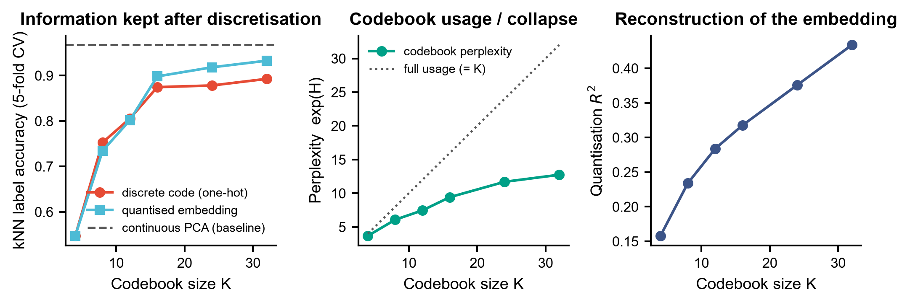
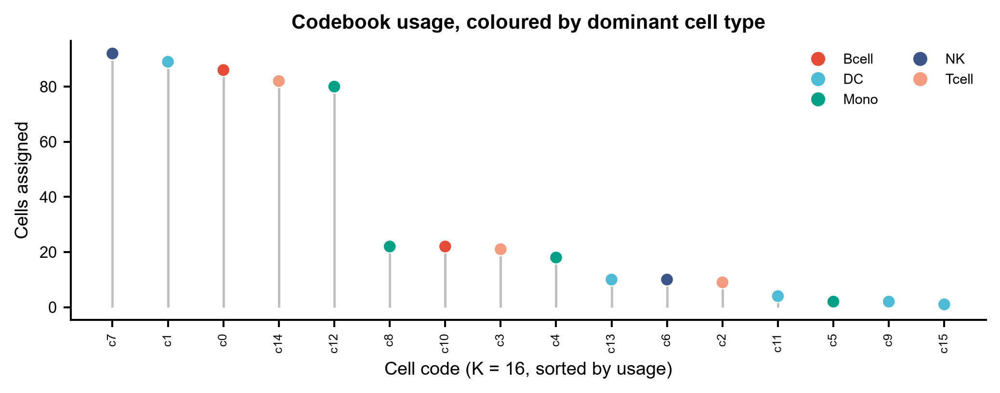
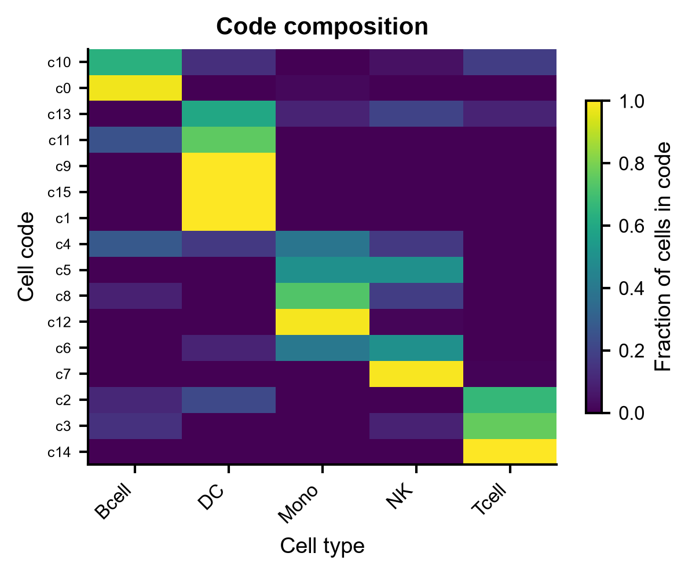
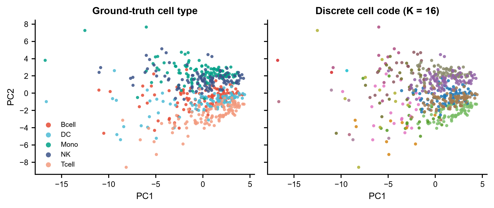

# 572 · CellVQ — 离散「细胞词表」单细胞基础模型

> 一句话定位:输入 **cells × genes 计数矩阵** → 把每个细胞压成一个整数 **cell code**(向量量化码本),
> 量化「离散化到底损失了多少信息、码本用满了没有」→ 出 **折线扫描 / lollipop 码本利用 / 码×类型热图 / PCA 散点** 四张图。

| | |
|---|---|
| **语言 / 主依赖** | Python 3.12 · `numpy` `pandas` `scikit-learn` `matplotlib`(全部本机已有) |
| **一句话用途** | 用可跑基线量化 VQ 离散细胞表征的代价与收益;并为官方 CellVQ 提供守卫式入口 |
| **输入** | `example_data/synthetic_counts.csv` |
| **输出** | `results/`(运行生成) · 展示图见 `assets/` |
| **状态** | 🟡 基线本机零改动跑通出图;**官方 CellVQ 需 clone 仓库 + 下预训练权重 + GPU,本模块不复刻** |

---

## ① 输入数据

**文件**:`synthetic_counts.csv`(csv;orientation:**行 = 细胞,列 = 基因**)

| 列名 | 类型 | 必需 | 示例 | 说明 |
|------|------|:---:|------|------|
| `cell_id` | str | ✔ | `C0000` | 首列,索引列 |
| `cell_type` | str | ✔ | `Tcell` | 细胞类型标签,基线用它评估「码里还剩多少标签信息」 |
| `G000` … `G159` | int | ✔ | `15` | 原始 UMI 计数(未归一化;脚本内部做 CP10K+log1p) |

**命名/格式约定**:第二列**必须**叫 `cell_type`;以 `#` 开头的行视为注释(示例数据首行是 synthetic 声明)。

**样例(前 3 行)**:
```
# synthetic, for demo only -- 5 cell types x 110 cells x 160 genes, seed=572
cell_id,cell_type,G000,G001,G002,G003,G004,...
C0000,Tcell,15,2,7,0,1,...
C0001,Tcell,4,2,6,0,2,...
```

示例数据由 `make_example_data.py` 生成:5 种细胞类型 × 110 细胞 × 160 基因,marker 块上调幅度
**刻意压小**(1.5–1.9 倍)且相邻类型共享程序 —— 若把类型造得干净可分,连续嵌入准确率会顶到 1.000,
天花板效应会让「离散化损失多少信息」这个比较完全失去分辨力。

## ② 方法 / 原理

**基线(始终执行,CPU,只用本机已有依赖)**

1. CP10K + log1p + z-score → PCA 取 30 个主成分,得到**连续细胞嵌入** `Z`(这是被离散化的对象;
   归一化方式与官方 `inference.py` 的 `input_type=singlecell, pre_normalized=False` 分支一致)。
2. 对 `Z` 做 **k-means 码本**(码本大小 K 扫描 4→32),每个细胞落到一个码上 → 整数 `cell code`。
   *为什么 k-means 是合法对照*:VQ-VAE 的码本更新本身就是对 encoder 输出做 k-means / EMA 聚类,
   所以「PCA 嵌入 + k-means 码本」正是**去掉预训练 encoder 之后的 VQ 朴素下界**。任何
   「离散词表更好」的主张都必须先赢过它。
3. 三个读出:
   - **信息保留**:5 折分层交叉验证 kNN 分类准确率,分别用 one-hot 码 / 量化后嵌入 / 连续嵌入,
     三者同图对比 —— 连续嵌入那条虚线就是天花板。
   - **码本利用率**:perplexity `exp(H(p))`。等于 K 表示码全用满,远小于 K 表示**码本坍缩**
     (VQ 训练里最常见的失败模式)。
   - **量化重构** `R²`:码本向量替代原嵌入后还原了多少方差。
   附带 ARI / NMI 与码 × 类型列联表。

**CellVQ 路径(`--cellvq-repo`,守卫式,不复刻模型)**

官方 CellVQ 是 encoder–SCD–decoder 架构,**6800 万细胞**预训练,核心是 SCD
(Single-Cell Discretization)模块:用统一码本把细胞表征转成 cell code。本模块**不重写它**,
只做环境体检并打印**逐符号定位到上游源码行**的真实调用方式:

| 项 | 已核实内容 | 源码位置 |
|---|---|---|
| CLI | `--input_type {singlecell,bulk}`(默认 `singlecell`) `--pool_type {all,max}`(默认 `all`) `--data_path` `--save_path` `--pre_normalized`(默认 `False`) `--mode`(默认 `m1`) `--device`(默认 `cuda`) `--model_path`(默认 `./model/models/models.ckpt`) | `inference.py` 第 15–22 行 |
| Python 入口 | `load_model_frommmf(best_ckpt_path, mode='m1', params=None, device='cuda')` → `(model.to(device), config)` | `model/load.py:124` |
| 取码函数 | `get_cellcode(x, padding_label, encoder_position_gene_ids, output_attentions=False, **kwargs)` → `(geneemb, cell_code, encoder_position_gene_ids[:, indexes2[0]])`;`inference.py` 解包为 `(x, cell_code, _)` | `model/pretrainmodels/model.py:156` |
| 输入契约 | 默认 `./examples/cluster_19264.h5ad`(仓库内实有该文件,约 86 MB)—— **19264 基因固定面板、顺序敏感**;`.h5ad` 走 `sc.read(path).X.toarray()`,否则走 `np.load` | `inference.py:17` / `inference.py:41` |
| 基因面板 | `OS_scRNA_gene_index.19264.tsv`(仓库内实有,228 KB);代码里以 **`./` 相对当前工作目录**读取,不是相对脚本路径 | `model/` 目录;`model/load.py:174` |
| 输出契约 | `torch.save([cellembs, cell_codes], save_path)` → 含两个张量的 `.pth` | `inference.py:74` |
| 安装 | `conda create -n CellVQ python=3.9.17`(来自 README)+ `./install.sh`(内容仅两行:`pip install torch==2.6.0` / `pip install scanpy einops cell-gears`) | 上游 `README.md` / `install.sh` |
| 权重 | 从 [ModelScope](https://modelscope.cn/models/wj1006/CellVQ/files) 下载 | 上游 `README.md` |
| 教程 | 仓库确有 `quick_start.ipynb`(181 KB)与 `run_example.sh`;`run_example.sh` 内容即上表 CLI 的一条完整调用 | 上游仓库根目录 |
| 许可证 | README 正文写 MIT;**仓库根目录并无 LICENSE 文件**,该说法仅有 README 一处依据 | 上游 `README.md` |

> ⚠️ 上游文档与代码有三处漂移(均以源码为准):
> 1. README 正文说权重放 `pretrained_models/`,参数表又写默认 `pretrained_model/checkpoint.pt`,
>    而 `inference.py` 实际默认 `./model/models/models.ckpt` → **一律用 `--model_path` 显式指定**。
> 2. README 参数表列了 `--verbose`,`inference.py` 里**根本没有这个参数**,传了会直接报错。
> 3. README 参数表**漏了** `--input_type` / `--pool_type` / `--pre_normalized` 三个真实存在的参数。
>
> ⚠️ 模型参数量上下游说法不一致:**论文摘要写 "model parameters totaling 500 million"**,
> **仓库 README 写 "511 million parameters"**(两者都写 68 million cells 预训练)。
> 本模块不替上游裁决,只如实标注两个出处。
>
> ⚠️ 本模块的合成 CSV **不满足**官方的 19264 基因面板契约。跑官方模型前必须先用仓库
> `preprocess/` 把自己的数据对齐到该面板 —— 因此脚本刻意**不**把本地 CSV 填进打印出的命令里,
> 免得诱导你跑一条注定报错(或更糟,静默错位)的命令。

## ③ 用途

回答的科学问题:**把连续的细胞状态压成一本离散「词表」,值不值?**

- 选码本大小 K:多大才够表达组织的细胞状态异质性,多大开始只是切碎噪声。
- 诊断码本坍缩:perplexity 远低于 K 说明大部分码是死码,是 VQ 类模型上线前的必查项。
- 可解释性读出:码 × 细胞类型热图给出「这个码代表什么」的直接证据 —— 这正是 CellVQ
  宣称的 interpretability 的落地形式。
- 给任何 VQ / 离散 token 类单细胞模型(CellVQ、scGPT 的 binning、RVQ 系列)提供一条
  **必须被超过的朴素下界**,避免只报绝对指标不报对照。

## ④ 特点 / 亮点

- **turnkey**:`python 572_cellvq_discrete_cell_fm.py` 一条命令跑完,不需要装任何包。
- **自带朴素对照**:连续 PCA 嵌入的 kNN 准确率作为天花板虚线,离散码永远与它同图对比,
  不给「只报离散码好看数字」留空间。
- **不臆造 API**:CellVQ 的 CLI / Python 入口 / 输入输出契约全部逐符号定位到 master 分支源码的
  具体文件与行号(见 ② 的表),并标注了上游文档与代码自相矛盾之处;没读到的一概不写。
- **失败时优雅退出**:未提供仓库 / 仓库不对 / 缺权重 / 无 GPU 各有独立诊断信息,不静默降级。
- **顶刊图规范**:统一 `pubstyle`,矢量 PDF + 300dpi PNG 双出;**全程无条形图**
  (lollipop / heatmap / 折线 / 散点)。

## ⑤ 输出结果图

| 文件 | 图型 | 说明 |
|------|------|------|
| `assets/572_codebook_sweep.png` | 折线+点 三联 | 码本大小 K 扫描:信息保留(含连续基线虚线)/ perplexity vs 满用对角线 / 量化 R² |
| `assets/572_code_usage_lollipop.png` | lollipop | 各码被分配的细胞数(按使用量排序),点色 = 该码的主导细胞类型 |
| `assets/572_code_celltype_heatmap.png` | heatmap | 码 × 细胞类型组成(按码归一化),viridis |
| `assets/572_embedding_vs_code.png` | 散点 双联 | PC1-PC2:左=真实类型,右=离散码,看词表把连续流形切成了什么 |

`results/` 另有 `572_codebook_sweep.csv`(逐 K 指标表)、`572_cell_codes.csv`(每细胞的码)、
`572_summary.json`(全部指标 + CellVQ 体检结果 + 上游标识符)。









**示例数据上的实测**(seed=572,可复现):连续 PCA 嵌入 kNN 准确率 **0.967**;离散码
K=4 时仅 **0.547**,随 K 增大单调回升到 K=32 的 **0.893**,始终未追平连续嵌入。
同时 perplexity 全程明显低于 K(K=32 时仅 12.7),说明码本没被用满 —— 离散化是有代价的,
这条曲线就是代价的量化。

---

## 运行

```bash
# 零改动跑示例
python 572_cellvq_discrete_cell_fm.py

# 换成自己的数据 + 自定义码本扫描
python 572_cellvq_discrete_cell_fm.py --input data/你的counts.csv --k-grid 8,16,32,64 --k-show 32 --outdir results/run1

# 有官方仓库和权重时做体检(打印已核实的真实调用命令)
python 572_cellvq_discrete_cell_fm.py --cellvq-repo /path/to/CellVQ --cellvq-ckpt /path/to/models.ckpt

# 重新生成示例数据(产物已提交,一般不需要)
python make_example_data.py
```

参数:`--input` `--outdir` `--n-pcs`(默认 30) `--k-grid`(默认 `4,8,12,16,24,32`)
`--k-show`(默认 16,用于展示图) `--cellvq-repo` `--cellvq-ckpt`。随机种子固定为 572。

## 依赖安装

基线**无需安装任何东西**(numpy / pandas / scikit-learn / matplotlib 本机已有)。

官方 CellVQ(不是 pip 包,需从源码装,建议服务器 + GPU):

```bash
git clone https://github.com/A4Bio/CellVQ.git && cd CellVQ
conda create -n CellVQ python=3.9.17 && conda activate CellVQ
./install.sh
# 权重:https://modelscope.cn/models/wj1006/CellVQ/files → 放好后用 --model_path 显式指定
# 测试数据:https://doi.org/10.6084/m9.figshare.28787489.v2
```

## 引用(已核实)

Wang J, Tan C, Gao Z, Shao S, Liu S, Li SZ. **Illuminating cell states by a comprehensive and
interpretable single cell foundation model.** *Nature Communications* 2026;**17**:4037.
doi:[10.1038/s41467-026-70071-5](https://doi.org/10.1038/s41467-026-70071-5) ·
PMID [41839876](https://pubmed.ncbi.nlm.nih.gov/41839876/) · PMC13139411

核实方式:Crossref API 查 DOI 返回 `Nature Communications` / vol 17 / article-number 4037 /
作者 Wang-Tan-Gao-Shao-Liu-Li / 2026-03-16;NCBI E-utilities `esummary` + `efetch` 查
PMID 41839876 返回同一篇(`Nat Commun. 2026 Mar 16;17(1):4037`,PMCID PMC13139411),
两条独立来源互相对得上。上游仓库 [A4Bio/CellVQ](https://github.com/A4Bio/CellVQ) 已本地克隆,
`inference.py` / `model/load.py` / `model/pretrainmodels/model.py` / `run_example.sh` /
`install.sh` 均已逐行读过,文件存在性另经 GitHub Contents API 核对。
注:上游 README 的 References 一节当前仍写着 `TBD`,论文引用信息来自 Crossref/PubMed 而非仓库。
