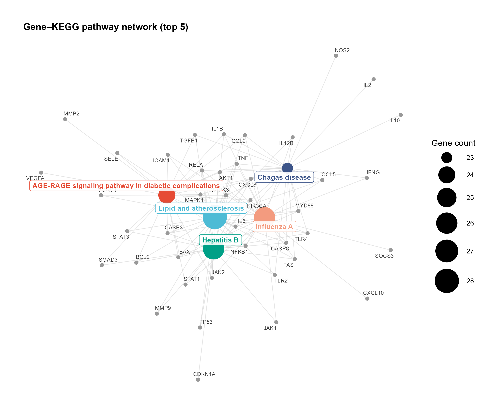

# 007 · GO / KEGG Enrichment

GO (BP/CC/MF) and KEGG pathway enrichment from a gene list, producing result tables and separate figures (three-ontology dot plot, KEGG lollipop, gene-pathway network).

## Summary

| | |
|---|---|
| Language / main dependencies | R · `clusterProfiler` `org.Hs.eg.db` `DOSE` `ggplot2` `ggraph` |
| Purpose | Annotate a gene list to GO functions and KEGG pathways and identify enriched biological processes |
| Input | `example_data/gene_list.csv` (single column of genes) |
| Output | Tables and figures in `results/`; display figures in `assets/` |

## Input

File: `gene_list.csv` (CSV; one gene per line)

| Column | Type | Required | Example | Notes |
|------|------|:---:|------|------|
| `Gene` | str | yes | `TP53` | Human gene symbol (default); ENTREZ IDs are accepted with `--keytype ENTREZID` |

Format: a single column named `Gene` (if the name differs, the first column is used). Species defaults to human; for other species change `--organism` and replace the OrgDb.

Sample (first 3 lines):
```
Gene
TNF
IL6
```

## Method

1. Gene ID conversion: `clusterProfiler::bitr()` maps symbols to ENTREZID via `org.Hs.eg.db`.
2. GO enrichment: `enrichGO(ont="ALL")` runs the hypergeometric test with BH correction over the BP/CC/MF ontologies (offline, local annotation database).
3. KEGG enrichment: `enrichKEGG()` queries the online KEGG pathway database (requires network access; skipped without interrupting the run if no network is available).
4. Visualization: results are redrawn with the shared theme `theme_pub.R` (viridis palette, vector export).

Method citation: Wu *et al.*, *The Innovation* 2021 (clusterProfiler 4.0).

## Use

Answers which biological processes, molecular functions, cellular components, and signaling pathways a gene set is involved in. Typical inputs are differential genes, WGCNA module genes, machine-learning feature genes, or intersection target genes. This is a standard downstream step for most omics analyses.

## Notes

- Runs the example with `Rscript 007_GO_KEGG_enrichment.R`; use `--input` to run other data without editing the script.
- Each figure is a separate file: faceted three-ontology dot plot, KEGG lollipop, and gene-pathway concept network, for flexible layout.
- KEGG falls back automatically when offline; ID conversion failures and empty results produce messages rather than errors.
- Each figure is exported as both an editable PDF and a 300 dpi PNG.

## Outputs

Each figure is a separate file (vector PDF and 300 dpi PNG).

| File | Type | Notes |
|------|------|------|
| `assets/GO_enrichment_dotplot.png` | Faceted dot plot | GO BP/CC/MF top 8 each; point size = gene count, color = −log₁₀Padj |
| `assets/KEGG_enrichment_lollipop.png` | Lollipop plot | KEGG top pathways, color = −log₁₀Padj |
| `assets/GenePathway_network.png` | Concept network | Bipartite network of top 5 pathways and their genes, hubs in a distinct color |
| `results/GO_results.csv` / `KEGG_results.csv` | Tables | Full enrichment results |

GO enrichment faceted dot plot:


Gene-pathway concept network:


## Usage

```bash
# Run the example
Rscript 007_GO_KEGG_enrichment.R
# Run your own data with custom parameters
Rscript 007_GO_KEGG_enrichment.R --input data/my_genes.csv --outdir results/run1 --top 10 --padjust 0.05
```

Optional parameters: `--top` (number shown per category, default 8), `--pvalue`/`--padjust` (thresholds, default 0.05), `--organism` (KEGG species, default hsa), `--keytype` (SYMBOL/ENTREZID).

## Dependencies

```r
if (!require("BiocManager")) install.packages("BiocManager")
BiocManager::install(c("clusterProfiler","org.Hs.eg.db","DOSE"))
install.packages(c("ggplot2","dplyr","ggraph","tidygraph","ggrepel"))
```
