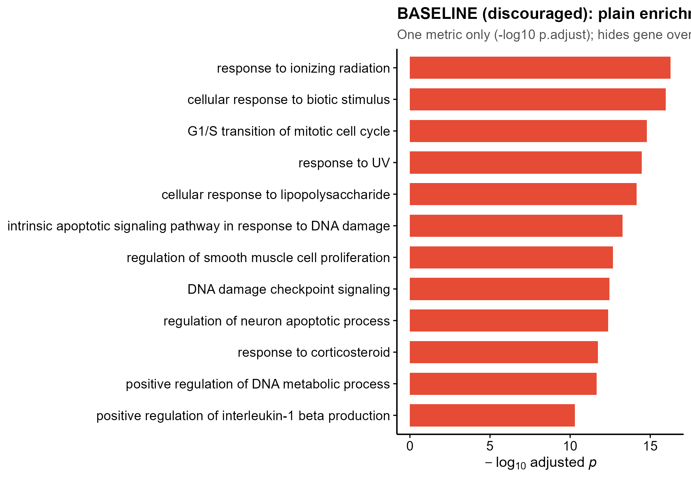
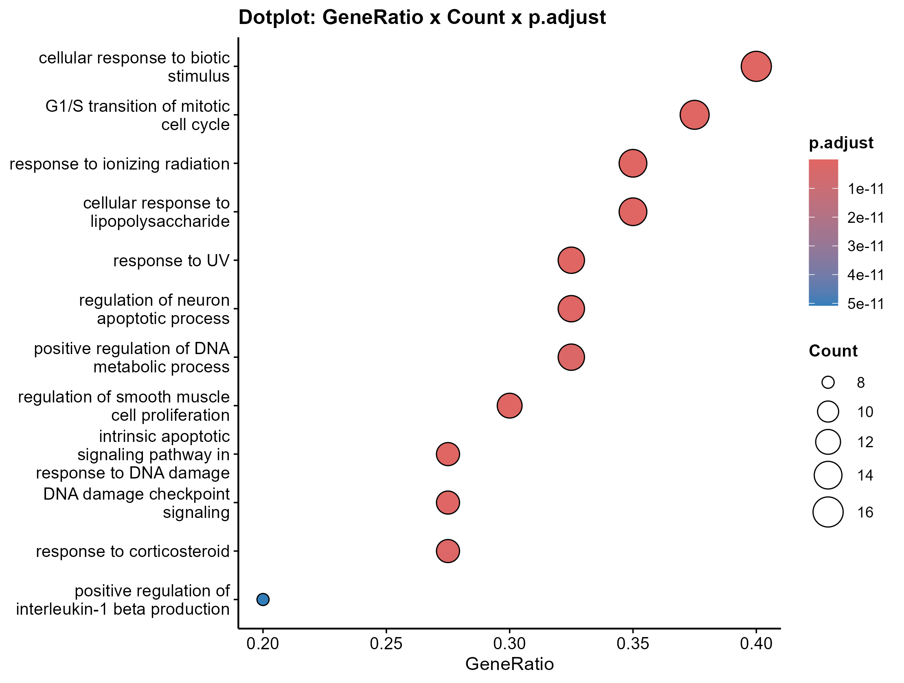
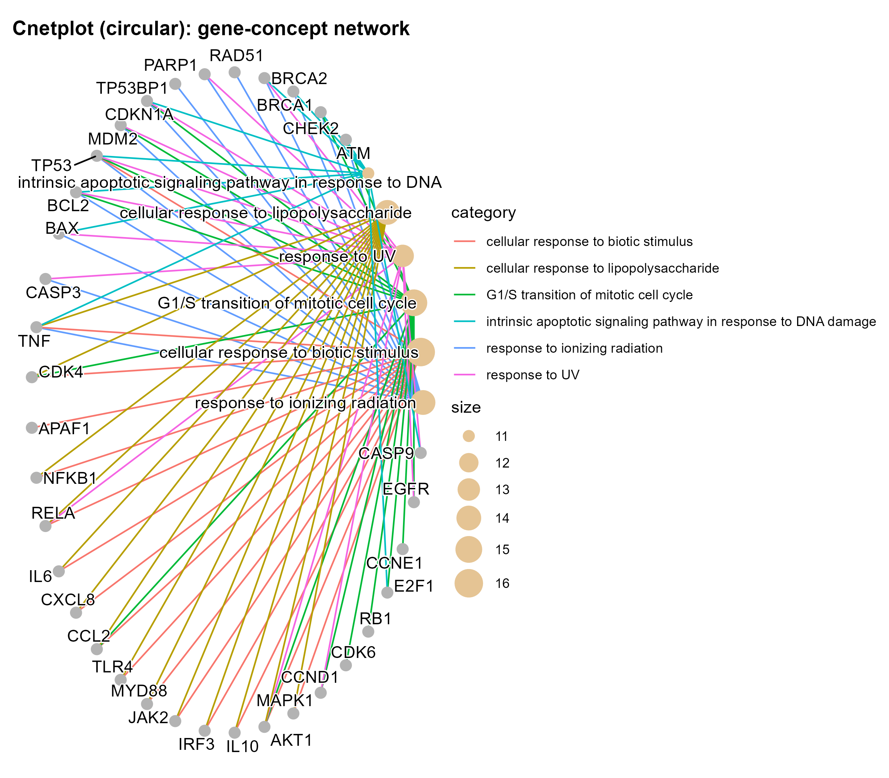
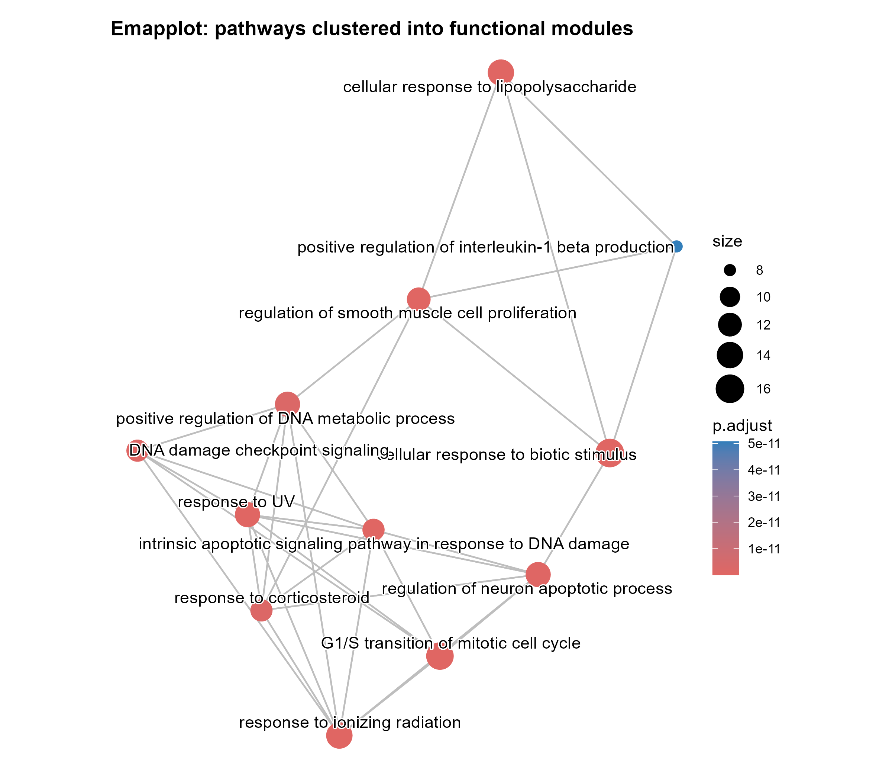
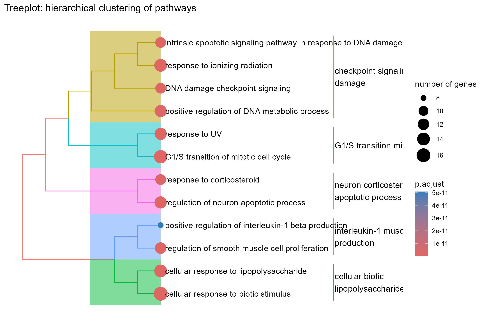

<!-- 模块 README:图中文字英文,正文中文。 -->

# 546 · 富集结果高级图 enrichplot dotplot / cnetplot / emapplot / treeplot

> 一句话定位:**输入一份差异基因列表 → 跑 enrichGO 富集 → 出 4 张顶刊级高级图(气泡 / 基因-概念网络 / 富集图谱 / 层次聚类树),系统性替代"平凡富集条形图"**,并内置一张条形图作 BEFORE 基线量化增益。

| | |
|---|---|
| **语言 / 主依赖** | R · `enrichplot` `ggtangle` `clusterProfiler` `DOSE` `org.Hs.eg.db` `ggtree` |
| **一句话用途** | 把 GO/通路富集结果画成显式承载"基因重叠 / 通路冗余 / 功能模块"的高级图 |
| **输入** | `example_data/gene_list.csv`(单列 `SYMBOL`,人类基因符号) |
| **输出** | `results/`(运行生成:富集表 + 基线对照表) · 展示图见 `assets/` |

---

## ① 输入数据

**文件**:`example_data/gene_list.csv`(类型:csv;orientation:每行一个基因)

| 列名 | 类型 | 必需 | 示例 | 说明 |
|------|------|:---:|------|------|
| `SYMBOL` | str | ✔ | `TP53` | 人类基因符号(HGNC);脚本内部用 `clusterProfiler::bitr` 转 ENTREZID |

**命名/格式约定**:单列、列名须为 `SYMBOL`;无表头以外的额外列。无输入文件时脚本自动写出一份 40 基因的合成示例(`synthetic, for demo only`),刻意取自 DNA 损伤修复 / 细胞周期 / 凋亡 / 炎症-NFkB / JAK-STAT 5 个内聚主题,便于 emapplot/treeplot 显出清晰功能模块。

**样例(前 3 行)**:
```
SYMBOL
ATM
CHEK2
```

## ② 方法 / 原理 + 诚实基线

1. **富集**:`clusterProfiler::enrichGO`(over-representation test,GO-BP,BH 校正)→ `simplify(cutoff=0.6)` 按语义相似度去冗余。本机装有 `org.Hs.eg.db` 时走**真包真分析**路径(示例数据实测得 141 条通路);换机缺包时降级构造合成 `enrichResult` 仍可出图(turnkey)。
2. **相似度前置**:`enrichplot::pairwise_termsim()` —— emapplot / treeplot 的**真实 API 必需前置**(否则报错)。
3. **4 张高级图**:`dotplot`(GeneRatio×Count×p.adjust 一图三维)、`cnetplot`(基因-概念网络,**已迁入 ggtangle 包**,新 API `layout="circular"` / `color_edge=`)、`emapplot`(词项相似度聚成功能模块,`layout="kk"` 力导向)、`treeplot`(通路层次聚类 + 高阶簇标签)。

**★诚实基线(可视化基线)**:内置一张 `geom_col` **朴素富集条形图**作 BEFORE 对照,与 4 张高级图并列。由代码生成的对照表 `results/baseline_vs_advanced.csv` 量化每张图承载的信息维度,实测显示条形图仅编码 1 个维度(p.adjust),完全无法表达基因重叠 / 通路冗余 / 功能模块结构——证明"换图不换分析"的真实增益,而非自夸。这是本模块唯一保留 `geom_col` 之处(反面教材,符合顶刊"少用条形图"铁律)。

> 方法引用:Yu G. *enrichplot* / *clusterProfiler* (OMICS 2012; Innovation 2021);cnetplot 自 enrichplot 1.26 起迁入 *ggtangle*(实测 enrichplot 1.26.6 / ggtangle 0.1.2)。

## ③ 用途

回答"我的差异基因富集到哪些通路、这些通路由哪些基因驱动、彼此是否冗余、能否归并为高阶功能模块"。典型场景:转录组 / scRNA marker / WGCNA 模块基因的 GO/KEGG 富集后出图,直接用于论文 Figure。

## ④ 特点 / 亮点

- **turnkey**:`Rscript 546_enrichplot_emap_cnet_tree.R` 一条命令零改动跑通(真包真分析,示例实测 141 通路);
- **接地真实 API**:cnetplot 走 ggtangle 新接口、emapplot/treeplot 前置 `pairwise_termsim()`、emapplot 无 `repel` 参数等坑均已实测对齐,不臆造;
- **诚实基线**:不只报好看图,内置条形图对照 + 代码生成的信息维度量化表;
- **顶刊出图**:`save_fig()` 一次出矢量 PDF + 300dpi 白底 PNG;网络图用专用 `net_theme()`(白底 / 去坐标轴 / 粗体标题),避免对网络图硬套坐标轴主题。

## ⑤ 输出结果图

| 文件 | 图型 | 说明 |
|------|------|------|
| `assets/00_baseline_barplot.png` | 条形图(基线) | BEFORE 对照:仅编码 -log10 p.adjust 单一维度 |
| `assets/01_dotplot_bubble.png` | 气泡图 | x=GeneRatio,size=Count,color=p.adjust(一图三维) |
| `assets/02_cnetplot_network.png` | 基因-概念网络 | 显式连出哪些基因驱动哪些通路(circular 布局) |
| `assets/03_emapplot_modules.png` | 富集图谱 | 按词项相似度把通路聚成功能模块(kk 力导向) |
| `assets/04_treeplot_hierarchy.png` | 层次聚类树 | 通路自动归并为带高阶标签的簇 |

**基线(弃用)→ 高级图对照预览**:







---

## 运行

```bash
# 零改动跑合成示例
Rscript 546_enrichplot_emap_cnet_tree.R
# 换成自己的差异基因(单列 csv,列名 SYMBOL)
Rscript 546_enrichplot_emap_cnet_tree.R --genes data/my_genes.csv --outdir results/run1
# 可选参数:--ont BP/MF/CC   --showCategory 12
```

## 依赖安装

```r
if (!requireNamespace("BiocManager", quietly = TRUE)) install.packages("BiocManager")
BiocManager::install(c("enrichplot", "ggtangle", "clusterProfiler",
                       "DOSE", "org.Hs.eg.db", "ggtree"))
```
