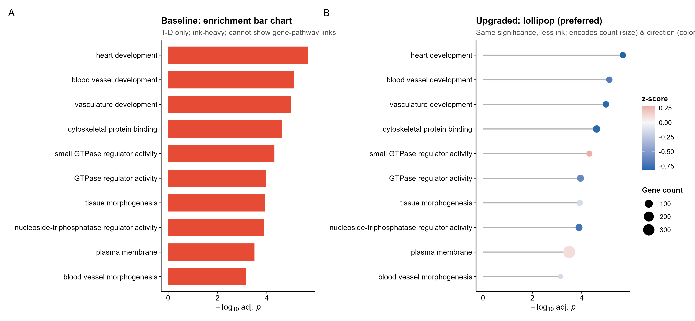
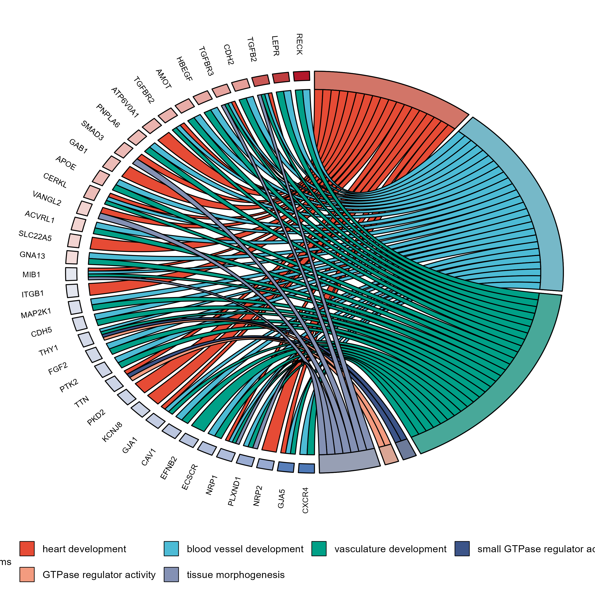
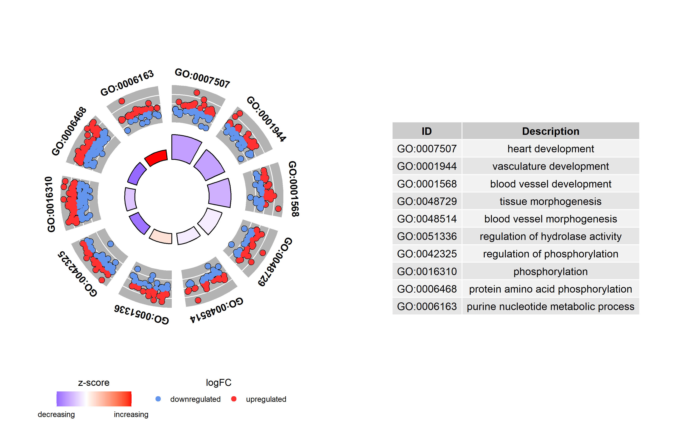
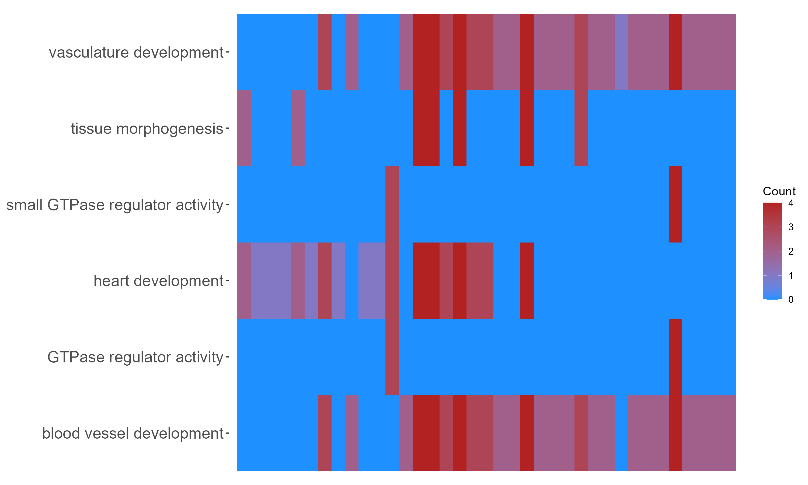

<!-- 图中文字英文,正文中文。 -->

# 549 · GOplot 富集环形/和弦高级图 GOplot Chord & Circle Enrichment

> 一句话定位:输入**富集结果 + 基因 logFC** → 用 GOplot 画**基因×通路和弦/富集圈图/成员热图** → 出代替富集条形图的**多对多关系**顶刊级展示图。

| | |
|---|---|
| **语言 / 主依赖** | R · `GOplot` `ggplot2`(framework `theme_pub.R`) |
| **一句话用途** | 把 GO/通路富集结果可视化为基因-通路多对多关系图,代替信息单薄的富集条形图 |
| **输入** | `example_data/david_enrichment.csv` + `genelist_logFC.csv` + `genes_subset_logFC.csv` |
| **输出** | `results/`(关系矩阵、长表 CSV) · 展示图见 `assets/` |

---

## ① 输入数据

三张表(均为 GOplot 内置 `EC` 数据集落盘,`built-in demo only`;心内皮细胞 GO 富集 + 差异表达):

**(1) `david_enrichment.csv`** — 富集结果(DAVID/clusterProfiler 风格)

| 列名 | 类型 | 必需 | 示例 | 说明 |
|------|------|:---:|------|------|
| `Category` | str | ✔ | `BP` | 本体类别 BP/CC/MF 或通路库名 |
| `ID` | str | ✔ | `GO:0007507` | 通路 ID |
| `Term` | str | ✔ | `heart development` | 通路名 |
| `Genes` | str | ✔ | `DLC1, NRP2, ...` | 该通路命中基因(**逗号分隔**) |
| `adj_pval` | num | ✔ | `2.17e-06` | 校正 p 值 |

**(2) `genelist_logFC.csv`** — 全转录组差异表达(给通路成员上色 + 算 z-score)

| 列名 | 类型 | 必需 | 示例 | 说明 |
|------|------|:---:|------|------|
| `ID` | str | ✔ | `Sema3c` | 基因名(须与 `david` 的 `Genes` 同命名体系) |
| `logFC` | num | ✔ | `5.52` | log2 fold change |

**(3) `genes_subset_logFC.csv`** — 重点 DEG 子集(GOChord/GOHeat 关系矩阵成员,通常几十个)

| 列名 | 类型 | 必需 | 示例 | 说明 |
|------|------|:---:|------|------|
| `ID` | str | ✔ | `PTK2` | 关注的差异基因 |
| `logFC` | num | ✔ | `-0.65` | log2 fold change |

**命名/格式约定**:`david$Genes`、`genelist$ID`、`genes$ID` 三者基因命名体系须一致(同为人源大写 symbol 或同为鼠源），否则匹配为空。和弦/热图只在**可读数量(~几十)**的重点基因上有意义,故单独用 `genes` 子集;圈图/lollipop 用全 `genelist`。这正是 GOplot 官方 vignette 的用法。

**样例(`david` 前 2 行)**:
```
Category,ID,Term,Genes,adj_pval
BP,GO:0007507,heart development,"DLC1, NRP2, NRP1, EDN1, ...",2.17e-06
BP,GO:0001944,vasculature development,"GNA13, ACVRL1, NRP1, ...",1.04e-05
```

## ② 方法 / 原理 + ★诚实基线

1. **`circle_dat(david, genelist)`**(GOplot 真包函数)把富集表展开为「基因×通路」长表,并对每条通路计算 **z-score = (上调基因数 − 下调基因数)/√count**,反映通路整体激活方向。
2. **`chord_dat(circ, genes, process)`** 构造「基因×通路」0/1 关系矩阵(末列 logFC),供和弦/热图使用。
3. **四种图**:`GOChord`(和弦)、`GOCircle`(圈图)、`GOHeat`(成员热图),以及诚实基线对照。

**★诚实基线(本模块内置,非空喊)**:`fig0` 把**富集条形图**与**升级版 lollipop**并排画出 —— 同样的 `-log10(adj.p)` 信息量,但 lollipop 墨水更少、并额外用**点大小编码基因数、颜色编码 z-score 方向**;而条形图根本无法表达 GOChord/GOHeat 的基因-通路多对多关系。对照图直观自证「为何升级」,符合本库绘图铁律(顶刊罕用平凡条形图)。

> 工具坑(已在脚本内修复):①GOChord/GOHeat 在「成员数为 0 的通路列」上会触发 GOplot 已知 bug(`replacement rows mismatch`)→ 脚本绘图前剔除空列/空行;②GOplot 几个函数默认不设背景,透明 PNG 在查看器里显示为黑底吞掉黑色文字 → `save_any()` 统一铺白底。

## ③ 用途

回答:**哪些差异基因同时参与哪些富集通路、各通路整体是上调还是下调**。适用于 GO/KEGG 富集后的高级可视化(转录组/scRNA 差异分析下游),尤其当审稿要求「不要又一张条形图」时,用和弦/圈图展示基因-通路关系结构。

## ④ 特点 / 亮点

- **turnkey**:`Rscript 549_goplot_chord_enrichment.R` 一条命令即跑(自动落盘内置 EC 示例)；
- **真包实跑**:全部图来自 `GOplot::circle_dat/chord_dat/GOChord/GOCircle/GOHeat` 真实调用,非 stub;
- **诚实基线对照**:内置 bar vs lollipop 自证图,不只报好看结果；
- **顶刊配色**:lollipop 走 framework `theme_pub` + RdBu 发散 z-score；和弦走 NPG 通路色 + 红蓝 logFC；
- **稳健**:自动剔空通路列/无连接基因行(防 GOplot 空弧 bug)、强制白底、grob/ggplot 双格式矢量导出。

## ⑤ 输出结果图

| 文件 | 图型 | 说明 |
|------|------|------|
| `assets/fig0_baseline_bar_vs_lollipop.png` | 条形 vs lollipop 对照 | ★诚实基线:同信息量下 lollipop 更克制且多编码 count/方向 |
| `assets/fig1_GOChord_gene_pathway.png` | 和弦图 | 基因×通路多对多关系 + logFC 上下调着色(条形图无法表达) |
| `assets/fig2_GOCircle_enrichment.png` | 富集圈图 | 外圈成员散点上/下调 + 内圈 z-score 条 + 旁附通路表 |
| `assets/fig3_GOHeat_membership.png` | 成员热图 | 基因×通路成员矩阵,颜色=参与通路计数 |

**★诚实基线对照(bar vs lollipop)**


**GOChord 基因-通路和弦图**


**GOCircle 富集圈图**


**GOHeat 基因-通路成员热图**


---

## 运行

```bash
# 零改动跑内置 EC 示例
Rscript 549_goplot_chord_enrichment.R

# 换成自己的数据
Rscript 549_goplot_chord_enrichment.R \
  --david    my_enrichment.csv \
  --genelist my_full_logFC.csv \
  --genes    my_DEG_subset.csv \
  --n_proc 7 --n_circ 10 --outdir results/run1
```

参数:`--n_proc` GOChord/GOHeat 展示的通路数(默认 7,过多不可读)；`--n_circ` GOCircle/lollipop 展示的通路条数(默认 10)。

## 依赖安装

```r
install.packages("GOplot")   # 自带 EC 示例数据;CRAN 包,已安装可跳过
install.packages("ggplot2")
```
