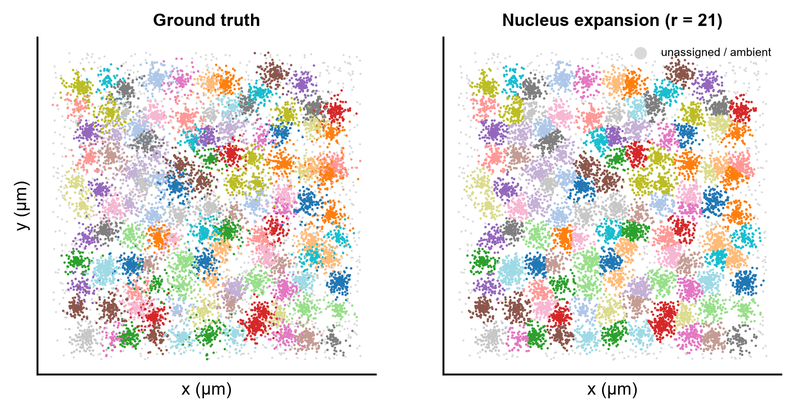
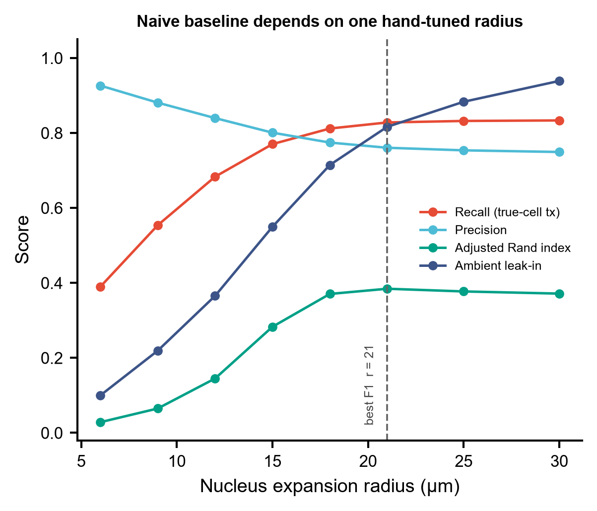
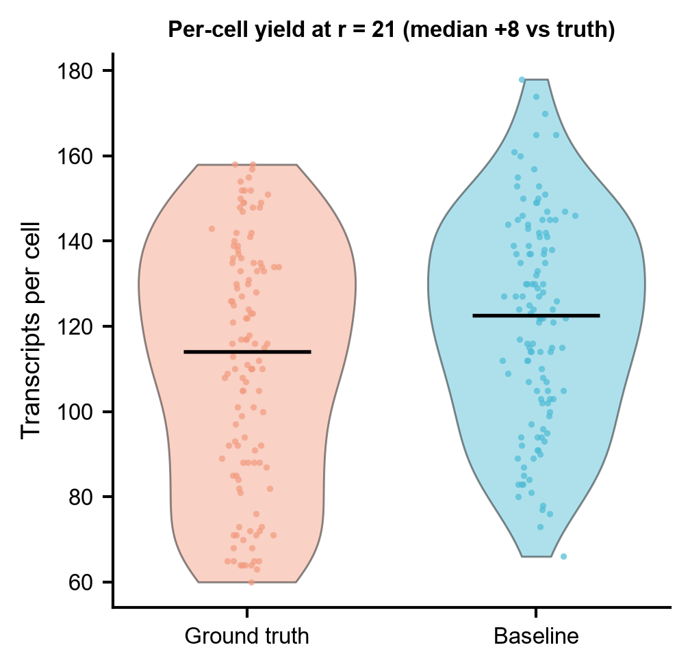
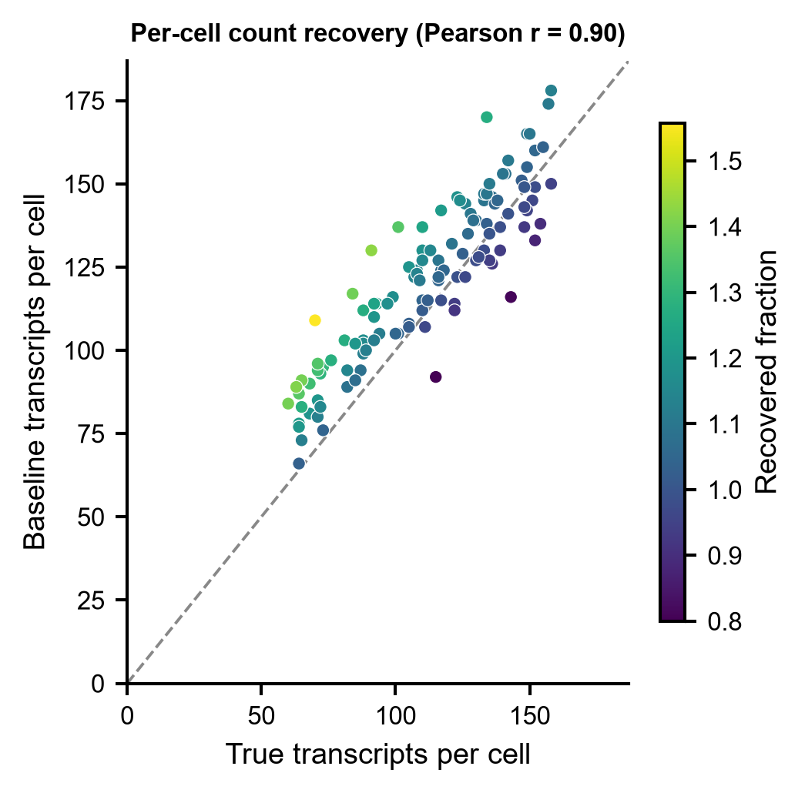
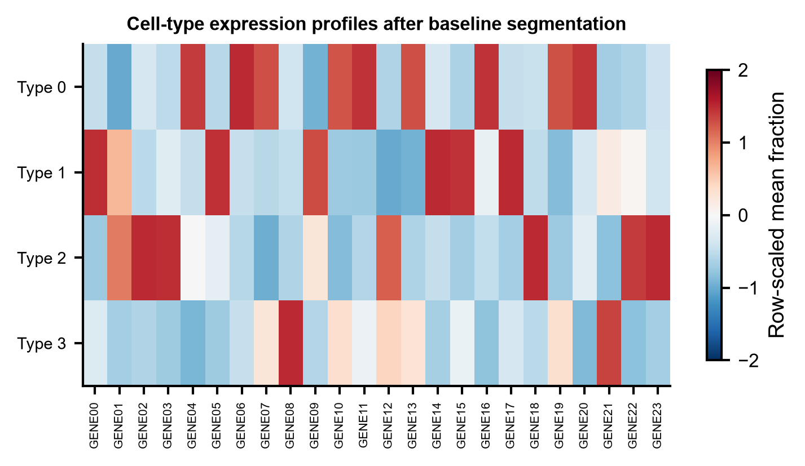

# 573 · Proseg — 概率式细胞分割 Probabilistic cell segmentation

> 输入成像空间转录组的**转录本点云**(Xenium/CosMx/MERSCOPE)→ 把转录本重新分配给细胞、
> 复原细胞边界 → 出分割空间图、半径敏感性曲线、每细胞产出分布与计数复原散点、细胞类型热图。

| | |
|---|---|
| **语言 / 主依赖** | Python 3.12 · 基线 `numpy` `pandas` `scipy` `scikit-learn` `matplotlib`;Proseg 本体为 **Rust CLI**(需 `cargo install proseg`) |
| **一句话用途** | 从转录本点云做细胞分割,并给出朴素「最近核外扩」基线作为对照 |
| **输入** | `example_data/transcripts.csv`(合成) |
| **输出** | `results/`(运行生成)· 展示图见 `assets/` |
| **状态** | 🟡 基线本机零改动跑通出图;Proseg 本体需装 Rust 二进制(守卫式封装,不代跑) |

---

## ① 输入数据

**文件**:`transcripts.csv`(csv;行 = 一条转录本)

| 列名 | 类型 | 必需 | 示例 | 说明 |
|------|------|:---:|------|------|
| `transcript_id` | int | | `0` | 转录本编号 |
| `x_location` | float | ✔ | `274.99` | x 坐标(µm) |
| `y_location` | float | ✔ | `53.67` | y 坐标(µm) |
| `z_location` | float | | `0.0` | z 坐标;2D 数据填 0 |
| `feature_name` | str | ✔ | `GENE22` | 基因/探针名 |
| `overlaps_nucleus` | int | | `1` | 是否落在核内(0/1) |
| `cell_id` | int | ✔ | `95` | **初步**核/细胞分配,未分配为 `-1` |
| `true_cell_id` | int | 仅基线评分 | `95` | ground truth;真实数据没有 |
| `true_cell_type` | int | 仅基线评分 | `1` | ground truth 细胞类型 |

**命名/格式约定**:上游 README(第 335 行)的原话是「Typically Proseg is run with prior
segmentation in the form of a transcript table with prior cell assignments」——即**通常**以
带先验细胞分配的转录本表运行,但**并非唯一入口**:同段也说明可以直接用 Cellpose 等分割
掩膜初始化。本模块沿用常规约定:`cell_id >= 0` 视为已归核。
`true_cell_*` 两列只服务于基线打分,真实数据缺失时请只走 `--run-proseg` 路径。

**样例(前 3 行)**:
```
transcript_id,x_location,y_location,z_location,feature_name,overlaps_nucleus,cell_id,true_cell_id,true_cell_type
0,274.9873091234656,53.66539968287856,0.0,GENE22,0,-1,-1,-1
1,141.2867969816212,333.1993215631875,0.0,GENE11,0,-1,-1,-1
```

## ② 方法 / 原理

**Proseg 的思路**:把分割当作**细胞模拟**。它在体素(voxel)场上跑贝叶斯采样,让细胞边界
从转录本点云本身长出来,而不是靠染色图像的形态学分割;同时显式建模**扩散/环境转录本**
(`--diffusion-probability` 等参数),把误落到邻居身上的转录本拉回来。
出处:Jones et al., *Nature Methods* 2025。

**本模块跑的两条路**:

1. **基线(始终运行,只用本机依赖)——最近核外扩 nucleus expansion**
   这是各家厂商流水线的默认做法,也是概率法必须打败的地板:
   ① 由 `cell_id >= 0` 的转录本求各核质心;② `scipy.spatial.cKDTree` 给每条转录本找半径
   内最近的核,超出半径判为未分配;③ 在一串半径上扫描,按 F1 选最优半径;④ 导出与
   proseg 语义对齐的产物(cell-by-gene 计数矩阵 + 细胞元数据)。
   指标:recall(真属细胞的转录本归位比例)、precision、**ambient leak-in**(环境转录本被
   错塞进细胞的比例)、ARI。

2. **Proseg 路径(`--run-proseg`,守卫式)**
   proseg 是 Rust 二进制,**没有 Python API**,所以这里不包装任何 Python 函数,而是
   `shutil.which("proseg")` 找可执行文件并按官方 README 的 flag 拼命令行:

   ```
   proseg --xenium --nthreads N \
          --output-counts counts.mtx.gz \
          --output-cell-metadata cell-metadata.csv.gz \
          --output-transcript-metadata transcript-metadata.csv.gz \
          --output-cell-polygons cell-polygons.geojson.gz \
          --output-spatialdata proseg-output.zarr \
          /path/to/transcripts.csv.gz
   ```

   平台预设 `--xenium` / `--cosmx` / `--cosmx-micron` / `--merscope` / `--visiumhd`。
   模型参数(`--ncomponents` `--voxel-size` `--diffusion-probability` `--cell-compactness`
   `--samples` 等)**本模块不代为固定**,请以 `proseg --help` 为准。
   默认只打印命令供核对,加 `--proseg-execute` 才真正调用。二进制不在 PATH 时打印真实
   安装命令后干净跳过,不静默降级。

   **API 核对来源:proseg 3.2.0 的 Rust 源码本身**(`src/main.rs` 的 clap `struct Args`、
   `src/output.rs` 的 writer),不是只读 README。逐 flag 定义行号:

   | flag | 源码位置 |
   |---|---|
   | 位置参数 `transcript_csv` | `src/main.rs:54` |
   | `--xenium` / `--cosmx` / `--cosmx-micron` / `--merscope` / `--visiumhd` | `src/main.rs:58 / 63 / 67 / 71 / 103` |
   | `--nthreads` (`-t`, `Option<usize>`,默认用满所有核) | `src/main.rs:265`(`#[arg]` 在 264) |
   | `--output-counts` | `src/main.rs:371` → `write_sparse_mtx` `src/output.rs:140` |
   | `--output-cell-metadata` | `src/main.rs:389` |
   | `--output-transcript-metadata` | `src/main.rs:396` |
   | `--output-cell-polygons` | `src/main.rs:425` → `write_cell_multipolygons` `src/output.rs:854` |
   | `--output-spatialdata` | `src/main.rs:359`(默认值 `"proseg-output.zarr"`) |

   两个从源码读出、光看 README 会踩的细节:
   ① 表格类输出的格式**由文件扩展名推断**(`infer_format_from_filename`,`src/output.rs:95`),
   只认 `.csv.gz` / `.csv` / `.parquet`,别的扩展名直接 panic —— 所以 metadata 一律写 `.csv.gz`;
   计数矩阵走的是 `write_sparse_mtx`,恒定 gzip matrix-market、不看扩展名,`.mtx.gz` 合法。
   ② proseg 3.x **默认必写 spatialdata zarr**(默认值 `proseg-output.zarr`),不显式指定就落在
   当前工作目录而非 `--outdir`,故本模块显式指到 outdir 下;该 zarr 已存在时 proseg 拒绝覆盖,
   需 `--overwrite`(`src/main.rs:367`,`#[arg]` 在 366),本模块不代加以免删掉别人的结果。

   补充一条边界说明:上游 `extra/` 下确实有几个 Python 脚本(`proseg-to-anndata.py`、
   `cellpose-xenium.py`、`illumina-to-spatialdata.py`)和一个 R 脚本(`proseg-to-seurat.R`),
   但它们是**结果转换/前处理的独立脚本**,不是可 import 的 Python 包 —— 分割本体仍只能通过
   Rust 二进制的命令行调用,所以本模块的封装方式(拼命令行)是唯一正确的做法。

## ③ 用途

回答的问题是:**这条转录本到底属于哪个细胞?** 成像空间转录组(Xenium/CosMx/MERSCOPE)
只测到带坐标的转录本点,细胞边界要靠分割给。分割错了,下游一切——细胞类型注释、
差异表达、细胞通讯、空间邻域分析——都建在错的计数矩阵上。典型场景:
细胞密集组织(淋巴结、肿瘤浸润灶)里核外扩会大面积串扰;胞质/突起长的细胞(神经元、
成纤维)转录本远离核,外扩半径调大就吃进邻居和环境噪声。本模块的半径扫描图正是把
这个两难量化出来,作为「为什么需要概率式分割」的对照证据。

## ④ 特点 / 亮点

- **turnkey**:`python 573_proseg_cell_segmentation.py` 一条命令,自动生成合成数据、跑基线、出 5 张图;
- **带可跑基线**:不装 proseg 也有完整可复现的对照(最近核外扩 + 半径扫描),概率法的
  任何"更好"都有地板可比;
- **不臆造 API**:proseg 是 Rust CLI(无 Python API),模块只做命令行封装,每个 flag 都在
  上游 3.2.0 源码 `src/main.rs` 的 clap `struct Args` 里指得出定义行号(见 ② 的对照表);
- **诚实指标**:除 recall/precision 外显式报 **ambient leak-in**,不让"分配率高"掩盖噪声灌入;
- **顶刊图风格**:统一 `_framework/pubstyle.py`,矢量 PDF + 300dpi PNG 双出,**无条形图**。

## ⑤ 输出结果图

| 文件 | 图型 | 说明 |
|------|------|------|
| `assets/fig1_segmentation_map.png` | 空间散点(双 panel) | ground truth vs 基线分割,灰点为未分配/环境 |
| `assets/fig2_radius_sweep.png` | 折线 + 点 | 外扩半径 vs recall/precision/ARI/ambient leak-in |
| `assets/fig3_counts_per_cell.png` | violin + 抖动点 | 每细胞转录本数,真值 vs 基线 |
| `assets/fig4_count_recovery.png` | 散点 + y=x 参考线 | 每细胞计数复原,颜色为复原比例 |
| `assets/fig5_celltype_heatmap.png` | 热图 | 基线分割后细胞类型 × 基因表达谱 |

`results/`(不入库):`baseline_radius_sweep.csv`、`baseline_cell_by_gene_counts.csv`、
`baseline_cell_metadata.csv`、`573_summary.json`。











**示例数据上的基线结果**(种子 573,14,943 条转录本 / 120 细胞 / 24 基因):
最优半径 r = 21 µm 时 recall 0.828、precision 0.760、ARI 0.384、**ambient leak-in 0.816**。
即:把半径调到 recall 最高处,代价是 82% 的环境转录本被塞进了细胞——这正是朴素外扩法
的失效模式,也是 proseg 这类显式建模扩散噪声的方法要解决的问题。

---

## 运行

```bash
# 零改动跑示例(自动生成合成数据)
python 573_proseg_cell_segmentation.py

# 换成自己的数据 + 自定半径扫描
python 573_proseg_cell_segmentation.py --input data/transcripts.csv --outdir results/run1 --radii 5,10,15,20

# 打印将要执行的 proseg 命令(需二进制在 PATH)
python 573_proseg_cell_segmentation.py --run-proseg --preset xenium --nthreads 8

# 真正执行 proseg
python 573_proseg_cell_segmentation.py --run-proseg --proseg-execute --preset xenium
```

## 依赖安装

基线所需(通常已有):

```bash
pip install numpy pandas scipy scikit-learn matplotlib
```

Proseg 本体(**Rust 二进制,不是 Python 包**):

```bash
cargo install proseg          # 上游 README 给的方式
# 或 bioconda(上游 README 顶部有 bioconda badge,recipe 名为 rust-proseg)
conda install -c bioconda rust-proseg
# 或从源码(Cargo.toml 要求 rust-version >= 1.88.0,edition 2024)
git clone https://github.com/dcjones/proseg && cd proseg && cargo build --release
```

许可证:**GPLv3**(上游 `LICENSE.md`,Copyright 2024 Daniel C. Jones)。本模块只做命令行
封装、不分发上游代码。

## 引用

Jones DC, Elz AE, Hadadianpour A, Ryu H, Glass DR, Newell EW.
**Cell simulation as cell segmentation.** *Nature Methods* 2025;22(6):1331-1342.
doi:[10.1038/s41592-025-02697-0](https://doi.org/10.1038/s41592-025-02697-0) · PMID **40404994**

> 引用已核实(2026-07-21,NCBI E-utilities esummary db=pubmed id=40404994):标题
> "Cell simulation as cell segmentation."、Nature Methods 22(6):1331-1342、2025 Jun、
> 作者 Jones DC / Elz AE / Hadadianpour A / Ryu H / Glass DR / Newell EW、
> DOI 10.1038/s41592-025-02697-0、PMC12285883 —— 与上文逐项一致。
> 上游 README 第 20 行也把这篇列为 proseg 的正式引用。
