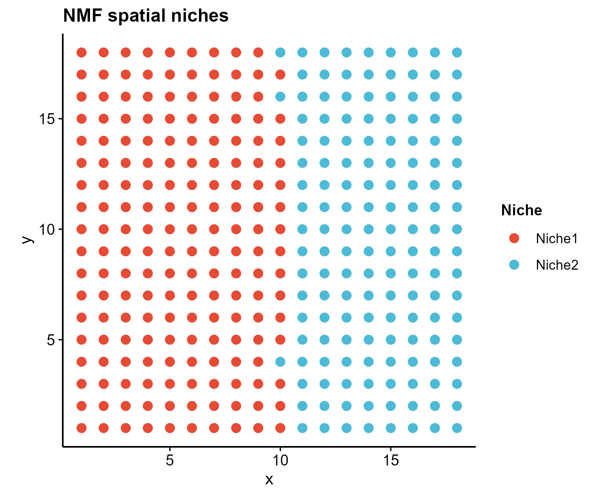

# 505 · Spatial advanced toolkit (deconvolution + niche + co-localization)

Advanced spatial-transcriptomics analysis beyond basic clustering (modules
027/050): reference-based deconvolution, spatial niche factorization, and
cell-type co-localization. Follows the PDAC spatiotemporal paper, which used
RCTD + MISTy + neighborhood + NMF as multi-method spatial evidence.

| | |
|---|---|
| Language / deps | R · `spacexr`(RCTD) `RcppML`(NMF) `mistyR`(optional) `ggplot2` |
| Purpose | Deconvolve spots, find spatial niches, quantify cell-type interfaces |
| Input | `example_data/spatial_demo.rds` (sc reference + spatial slice) |
| Output | `results/` (weights/niches/degree); spatial maps in `assets/` |

## Input

`spatial_demo.rds`: a list with `sc` (gene×cell reference counts), `cell_ct`
(cell-type labels), `st` (gene×spot spatial counts), `coords` (spot x/y).
Example data is synthetic (600-cell 3-type reference + 324-spot slice with a
left→right Tumor→CAF→Immune gradient), generated on first run.

## Method

1. **RCTD deconvolution** (`spacexr`) — reference-based; estimates each spot's cell-type proportions. (Example recovers truth at mean cor ≈ 0.99.)
2. **NMF spatial niches** (`RcppML`) — factorize the spot × cell-type matrix into spatial niches.
3. **CellDegree** (base KNN-6) — heterotypic-neighbor fraction per spot → cell-type interfaces (high = mixing zones). Lightweight reimplementation of the semla-style neighborhood metric.
4. **MISTy** (`mistyR`, optional) — multi-view spatial dependency modeling (intra + paraview); skipped gracefully if unavailable.

## Use

Turn a spatial slice + matched single-cell reference into: per-spot composition,
data-driven spatial niches, and cell-type interface maps — the spatial half of a
"single-cell + spatial" multi-evidence framework (pairs with cell-communication
modules 051/073).

## Outputs

| File | Type | Description |
|------|------|------|
| `results/RCTD_weights.csv` | table | spot × cell-type proportions |
| `results/NMF_niches.csv` | table | spot niche loadings + assignment |
| `results/CellDegree.csv` | table | dominant type + heterotypic degree |
| `results/misty/` | folder | MISTy importances (if run) |
| `assets/rctd_dominant.png` | spatial map | dominant cell type per spot |
| `assets/nmf_niche.png` | spatial map | NMF spatial niches |
| `assets/celldegree_interface.png` | spatial map | cell-type interface (heterotypic degree) |



## Run

```bash
Rscript 505_spatial_advanced.R
```

## Dependencies

```r
install.packages(c("RcppML","Matrix","ggplot2"))
# spacexr (RCTD) + mistyR — behind GFW use gh-proxy + install_local / BiocManager:
#   git clone https://gh-proxy.org/https://github.com/dmcable/spacexr ; R -e 'remotes::install_local("spacexr")'
#   BiocManager::install("mistyR")
```
