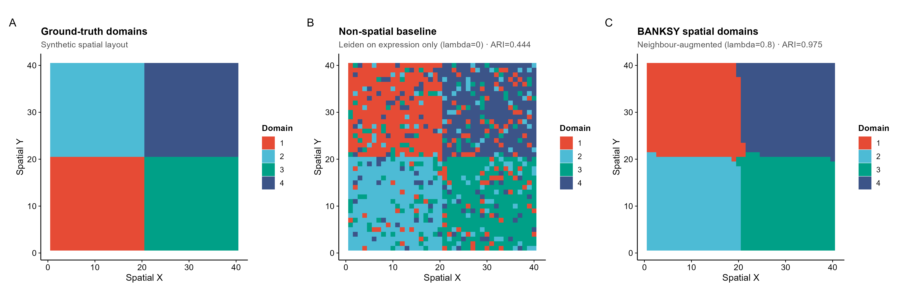
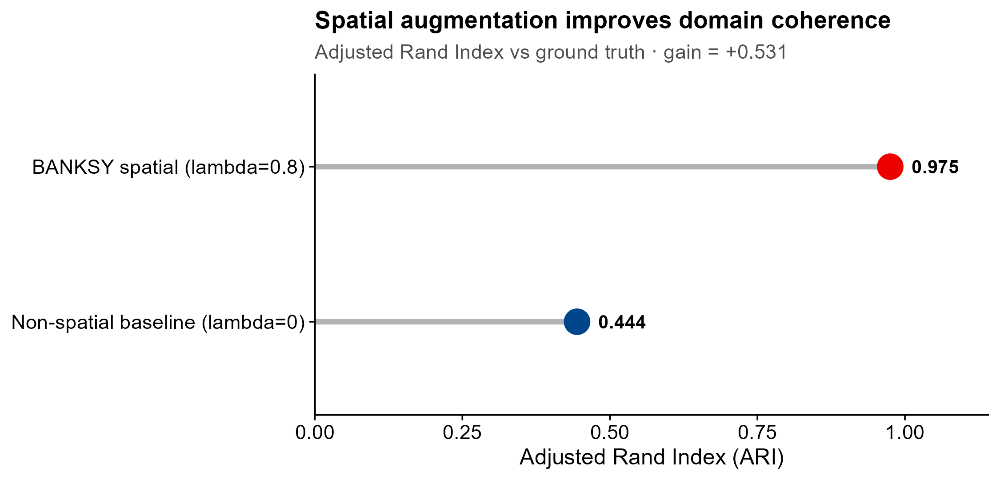
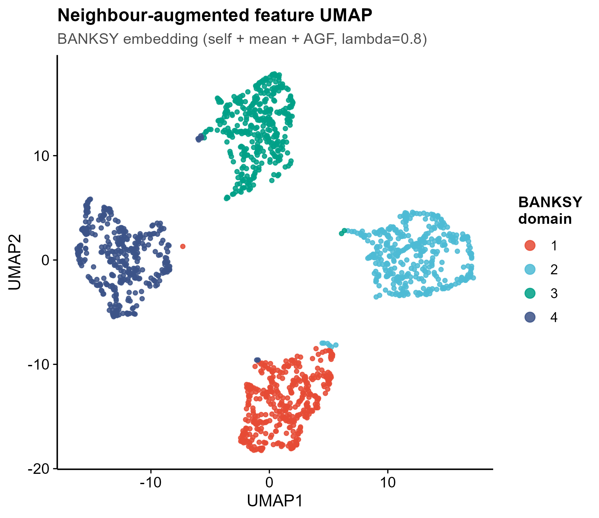

<!-- 图中文字英文,正文中文。 -->

# 541 · BANKSY 空间域识别 BANKSY Spatial Domains

> 一句话定位:输入**一张空间转录组表(坐标 + 各 spot 表达)→ 用 BANKSY 把"自身表达 + 邻域均值 + 方位 Gabor 梯度"拼成 neighbor-augmented 特征再聚类 → 出空间域分割图**;并**内置非空间基线对照**,用 ARI 量化空间增强带来的域连贯性提升。

| | |
|---|---|
| **语言 / 主依赖** | R · `Banksy` `SpatialExperiment` `SummarizedExperiment` · `aricode`/`mclust`(算 ARI) · `ggplot2` |
| **一句话用途** | 空间转录组的"空间域(spatial domain)"识别,非深度学习、完全可解释(lambda 旋钮显式控制邻域上下文权重) |
| **输入** | `example_data/spatial_demo.csv`(long-format:每行一个 spot = 坐标 + 各基因表达,可带真值 `domain` 列) |
| **输出** | `results/`(运行生成:ARI 表、spot 归属表、sessionInfo) · 展示图见 `assets/` |

---

## ① 输入数据

**文件**:`spatial_demo.csv`(类型:csv;orientation:**行 = spot**,列 = 坐标 + 基因)

| 列名 | 类型 | 必需 | 示例 | 说明 |
|------|------|:---:|------|------|
| `spot` | str | ○ | `spot0001` | spot 唯一 ID(缺省自动编号) |
| `x` | num | ✔ | `1` | 空间坐标 X |
| `y` | num | ✔ | `1` | 空间坐标 Y |
| `domain` | int/str | ○ | `1` | **真值域标签,仅评估用**;有则算 ARI,无则只出分割图 |
| `gene01` … `geneN` | num | ✔ | `8.79` | 各基因在该 spot 的表达(每个基因一列) |

**命名/格式约定**:`x`/`y` 两列必需;除 `spot`/`x`/`y`/`domain` 外的所有列都视为基因表达;`domain` 列可选(无真值的真实数据照样跑,只是不出 ARI)。

**样例(前 3 行,部分列)**:
```
spot,x,y,domain,gene01,gene02,gene03,...
spot0001,1,1,1,8.798,2.024,5.271,...
spot0002,2,1,1,3.512,4.760,1.903,...
```

> 示例数据由脚本内 `synthetic, for demo only` 生成:40×40 spot 网格 = 4 个连续方块域(象限),每域 10 个 marker 基因均值抬高、但单 spot 噪声很大(sd=3.5)——**刻意让"仅看自身表达"难以分辨域**,以诚实展示空间增强的增益(而非掩盖差距)。

## ② 方法 / 原理

**BANKSY**(Singhal et al., *Nature Genetics* 2024)把每个 spot 的特征向量从"仅自身表达"扩展为 **neighbor-augmented**:

1. **`computeBanksy`** — 对每个 spot 计算两类邻域统计量:
   - **H0 = 邻域均值**(kNN 表达均值,`k_geom`),捕捉局部细胞微环境;
   - **H1 = 方位 Gabor 梯度**(Azimuthal Gabor Filter, AGF,harmonic m=1,用 `2×k_geom`),捕捉表达的**方向性/边界**信息。
2. **`runBanksyPCA`** — 把 `[自身表达 ⊕ √λ·H0 ⊕ √λ·H1]` 拼接后做 PCA;**`lambda`(λ) 显式权衡"自身 vs 邻域"**:λ=0 退化为普通非空间表达;λ≈0.8 为"空间域分割"模式(BANKSY 文档推荐域识别用 0.8)。
3. **`clusterBanksy`** — 在增强 PCA 空间上跑 Leiden(或 louvain/kmeans/mclust)聚类得到空间域。

**★诚实基线(内置)**:BANKSY 的 λ 旋钮天然给出对照——脚本**同时**跑 `lambda=0`(=普通非空间 Leiden,纯表达)与 `lambda=0.8`(空间域),对同一数据、同一聚类算法,用 **ARI(Adjusted Rand Index,vs 已知真域)** 量化"空间增强带来的域连贯性提升"。不只报好看指标,非空间基线的 ARI 一并打印并出图,差距即增益。

## ③ 用途

回答:**"组织里有哪些在空间上连续、表达上一致的区域(空间域 / 解剖小生境)?"** 典型场景:Visium / Slide-seq / MERFISH 等空间转录组的无监督区域分割(肿瘤 vs 间质 vs 免疫带、皮层分层、生发中心定位等),作为下游差异表达 / 细胞通讯 / 轨迹分析的空间分区基础。相比纯表达聚类,BANKSY 输出的域**空间连贯**(少椒盐噪声),且**可解释**(λ 是物理意义明确的旋钮,非黑箱)。

## ④ 特点 / 亮点

- **turnkey**:`Rscript 541_banksy_spatial_domains.R` 一条命令,自动生成合成数据、跑完整 BANKSY 链、出图;
- **真包实跑**:全程 Bioconductor `Banksy 1.2.0` + `SpatialExperiment`,非 stub;
- **★诚实基线**:非空间(λ=0)vs 空间(λ=0.8)同框对比,ARI 量化增益(示例实测 **0.444 → 0.975,ΔARI=+0.53**);
- **顶刊级图**:空间分割三联图 / lollipop ARI 对比(非条形图)/ 邻域增强特征 UMAP,统一 `theme_pub` 矢量 PDF+PNG;
- **换数据即跑**:`--input 你的.csv`(有/无 `domain` 真值列都支持),`--lambda` `--k_geom` `--res` 可调;
- 固定随机种子(42)、脚本相对路径、`sessionInfo` 依赖快照,可复现。

## ⑤ 输出结果图

| 文件 | 图型 | 说明 |
|------|------|------|
| `assets/fig1_spatial_domains_banksy.png` | 空间分割图 | spot 按 **BANKSY 空间域**上色(单图) |
| `assets/fig1b_spatial_domains_baseline.png` | 空间分割图 | spot 按**非空间基线**域上色(单图,可见椒盐噪声) |
| `assets/fig2_segmentation_compare.png` | 三联分割图 | 真值 / 非空间基线 / BANKSY,标注各自 ARI |
| `assets/fig3_ari_baseline_vs_banksy.png` | lollipop | ★诚实基线:非空间 vs BANKSY 的 ARI,标注增益 ΔARI |
| `assets/fig4_banksy_feature_umap.png` | UMAP 散点 | 邻域增强特征空间的 UMAP,按 BANKSY 域上色 |

**空间分割三联(真值 / 非空间基线 / BANKSY)**



**ARI:空间增强提升域连贯性(诚实基线)**



**邻域增强特征 UMAP**



---

## 运行

```bash
# 零改动跑示例(自动生成合成数据)
Rscript 541_banksy_spatial_domains.R

# 换成自己的空间数据(long-format CSV:x,y,[domain],gene...)
Rscript 541_banksy_spatial_domains.R --input data/你的.csv --outdir results/run1

# 调参:邻域大小 / 空间权重 / Leiden 分辨率 / PCA 维度
Rscript 541_banksy_spatial_domains.R --k_geom 18 --lambda 0.8 --res 0.8 --npcs 20
```

## 依赖安装

```r
if (!requireNamespace("BiocManager", quietly = TRUE)) install.packages("BiocManager")
BiocManager::install(c("Banksy", "SpatialExperiment", "SummarizedExperiment", "S4Vectors"))
install.packages(c("aricode", "ggplot2"))   # aricode 算 ARI(或已有 mclust 亦可)
```

> 参考:Singhal V, et al. *BANKSY unifies cell typing and tissue domain segmentation for scalable spatial omics data analysis.* Nature Genetics 2024;56:431-441. Bioconductor 包 `Banksy`。
