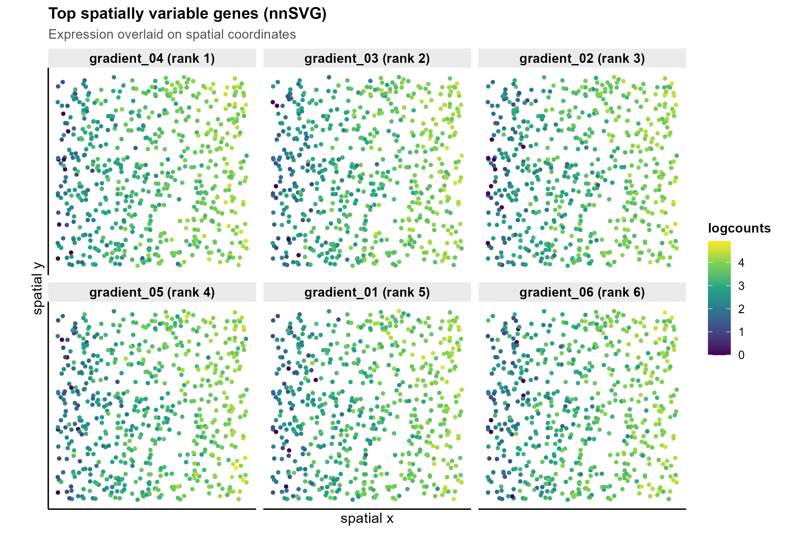
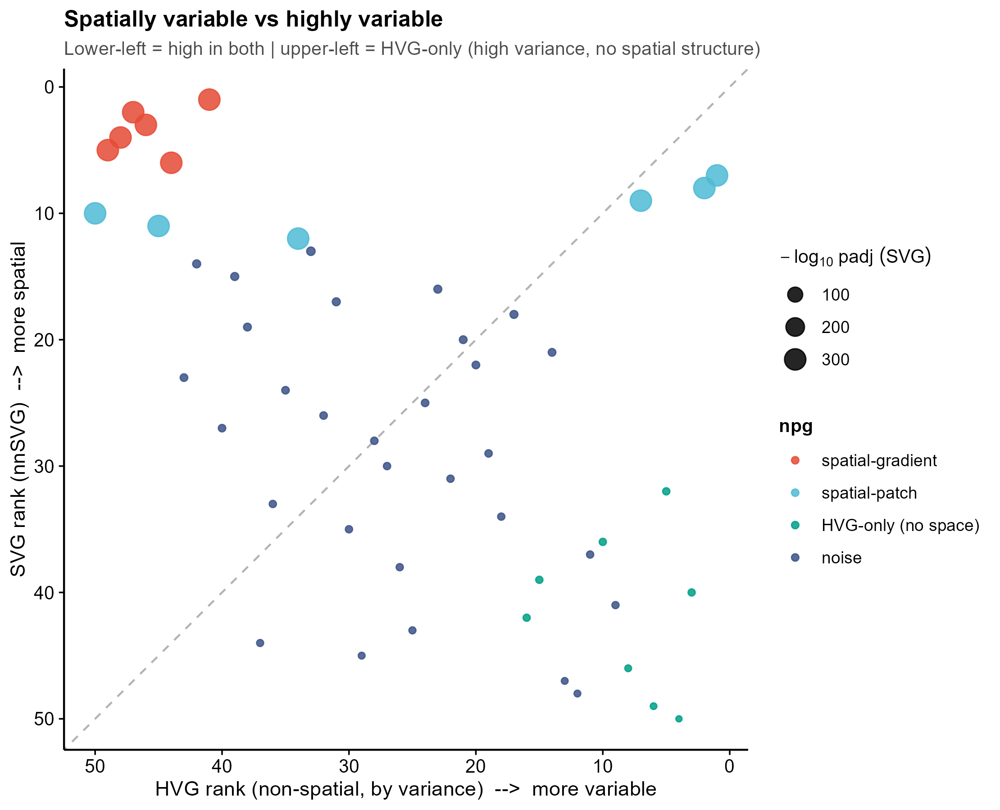

<!-- 模块 README:图中文字英文,正文中文。 -->

# 542 · nnSVG 空间可变基因识别 Spatially Variable Genes (nnSVG)

> 一句话定位:输入空间转录组 (计数矩阵 + spot 坐标) → 用 **nnSVG**(最近邻高斯过程,线性可扩展)识别"空间可变基因 (SVG)",并内置**非空间 HVG 基线**证明 SVG 抓的是**空间结构**而非单纯高变 → 出 4 张顶刊级图。

| | |
|---|---|
| **语言 / 主依赖** | R · `nnSVG` `SpatialExperiment` `scran` `scater` `scuttle` |
| **一句话用途** | 识别表达随空间坐标呈梯度/斑块的基因(SVG),区别于仅高方差的 HVG |
| **输入** | `example_data/spatial_counts.csv`(基因×spot 计数) + `spatial_coords.csv`(spot,x,y) |
| **输出** | `results/`(运行生成) · 展示图见 `assets/` |

---

## ① 输入数据

**文件 1**:`spatial_counts.csv`(基因 × spot 计数矩阵,首列基因名)

| 列名 | 类型 | 必需 | 示例 | 说明 |
|------|------|:---:|------|------|
| `gene` | str | ✔ | `gradient_01` | 基因名(首列) |
| `spot0001` … | int | ✔ | `7` | 每个 spot 该基因的原始计数(整数) |

**文件 2**:`spatial_coords.csv`(spot 坐标)

| 列名 | 类型 | 必需 | 示例 | 说明 |
|------|------|:---:|------|------|
| `spot` | str | ✔ | `spot0001` | spot 名,需与 counts 列名一一对齐 |
| `x` | num | ✔ | `0.42` | 空间横坐标 |
| `y` | num | ✔ | `0.83` | 空间纵坐标 |

**命名/格式约定**:`coords$spot` 必须与 `counts` 的列名顺序完全一致(脚本内 sanity-check `stopifnot`)。

**样例(前几行)**:
```
# spatial_counts.csv
gene,spot0001,spot0002,spot0003,...
gradient_01,3,11,7,...
patch_01,2,18,2,...

# spatial_coords.csv
spot,x,y
spot0001,0.42,0.83
```

## ② 方法 / 原理 与 ★诚实基线

1. **构 SpatialExperiment** → `logNormCounts` 标准化 → `nnSVG::filter_genes` 过滤低表达基因。
2. **nnSVG**(Weber et al., *Nat Commun* 2023):对每个基因拟合一个**最近邻高斯过程 (NNGP)** 空间协方差模型,与无空间的线性模型做**似然比检验 (LR)**;LR 统计量越大 → 空间信号越强。结果落在 `rowData(spe)$LR_stat / rank / pval / padj`。NNGP 使计算量随 spot 数**线性**扩展(可上 10 万 spot)。
3. **★诚实基线 — 非空间 HVG**:同一数据上跑 `scran::modelGeneVar` / `getTopHVGs`,**完全不看坐标**,仅按表达方差排"高变基因"。
   - 合成数据埋了 4 类地面真值:**空间梯度**、**空间斑块**(均有空间结构)、**仅高变无空间**(把有梯度的表达对坐标随机重排 → 高方差但空间随机)、**噪声**。
   - 正确表现应是:**nnSVG 把空间梯度/斑块排到最前**,而 **HVG 会把"仅高变"基因也误抬到前列** → `SVG vs HVG 散点`里这些基因落在"HVG 靠前、SVG 靠后"的区域,直观证明 **SVG ≠ HVG**:SVG 抓的是空间结构,不是单纯方差。

## ③ 用途

回答"哪些基因的表达具有空间组织模式(组织分层、微环境斑块、梯度)"——空间转录组(Visium / Slide-seq / Stereo-seq 等)下游分析的起点:挑 SVG 做空间域聚类、空间共表达、细胞通讯的特征基因。HVG 基线提醒使用者:**直接拿 HVG 当空间特征会混入大量非空间高变基因**。

## ④ 特点 / 亮点

- **turnkey**:`Rscript 542_nnsvg_spatial_svg.R` 一条命令即跑(合成数据脚本内生成)。
- **真包实跑**:用真实 `nnSVG` NNGP 模型,非 stub;`assets/` 图来自真实运行。
- **★内置诚实基线**:非空间 HVG 对照 + 4 类地面真值,量化展示 SVG 与 HVG 的差异,不只报好看指标。
- **顶刊级图**(无平凡条形图):空间表达 facet(viridis)、LR-stat lollipop、SVG-vs-HVG 散点、按类别的 rank 小提琴+抖动。
- **路径全相对**,种子固定 (42),末尾落 `sessionInfo.txt` 依赖快照。

## ⑤ 输出结果图

| 文件 | 图型 | 说明 |
|------|------|------|
| `assets/fig1_top_svg_spatial_expression.png` | 空间散点 facet (viridis) | Top SVG 的 logcounts 叠在 spot 坐标上,直观看空间梯度/斑块 |
| `assets/fig2_svg_lrstat_lollipop.png` | lollipop | Top 20 基因按 LR 统计量排序,颜色=地面真值类别 |
| `assets/fig3_svg_vs_hvg_scatter.png` | 散点 (★基线核心) | x=HVG rank,y=SVG rank;"仅高变"基因落在 HVG 靠前/SVG 靠后区域 |
| `assets/fig4_svgrank_by_class_violin.png` | violin + jitter | 各地面真值类别的 nnSVG rank 分布,量化基线对照 |




---

## 运行

```bash
# 零改动跑合成示例
Rscript 542_nnsvg_spatial_svg.R
# 换成自己的数据
Rscript 542_nnsvg_spatial_svg.R --counts data/counts.csv --coords data/coords.csv --outdir results/run1
# 关键参数: --n_top 6 (空间图基因数) --n_hvg 30 (HVG 取数) --n_threads 1
```

## 依赖安装

```r
BiocManager::install(c("nnSVG","SpatialExperiment","SingleCellExperiment",
                       "scran","scater","scuttle"))
# 绘图主题由本库 _framework/theme_pub.R 提供 (需 ggplot2)
```

> 备注:**Castl**(集成多种 SVG 方法的元分析)与 **SPARK-X** 本机未装(装不上),故本模块仅用 nnSVG。
> 若需多方法集成,另装后可在 Step 3 后追加并用 `cmp` 表合并比较。nnSVG 在真实数据上建议先按 Visium
> 流程跑(`SpatialExperiment` 直读 10x),`filter_genes` 用默认阈值 (3 / 0.5);本模块为适配小合成数据放宽为 (2 / 0.2)。
