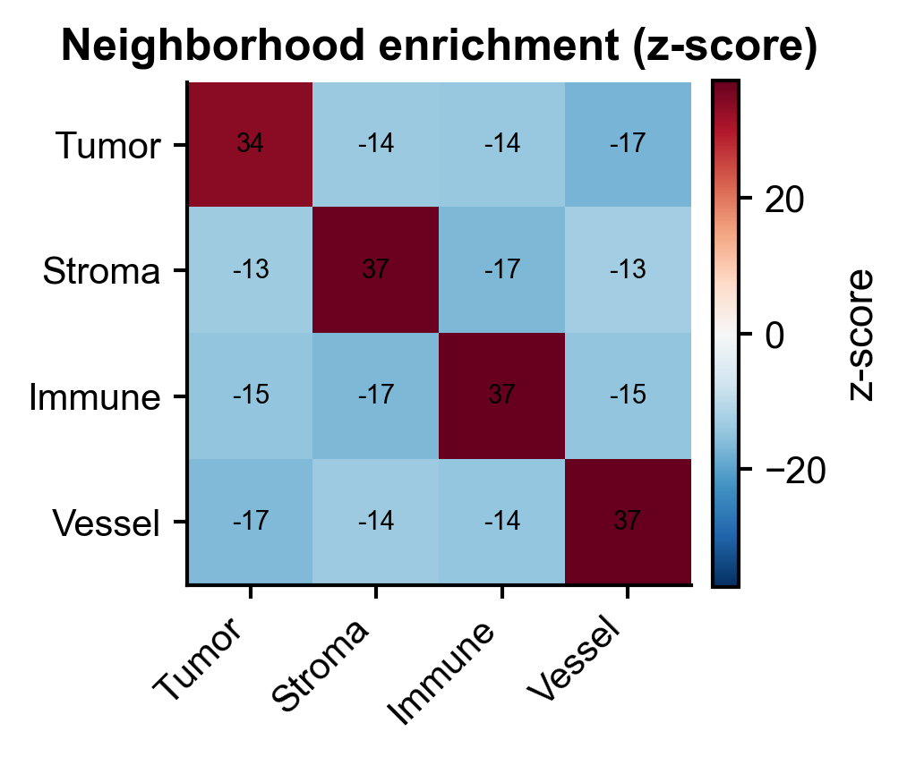
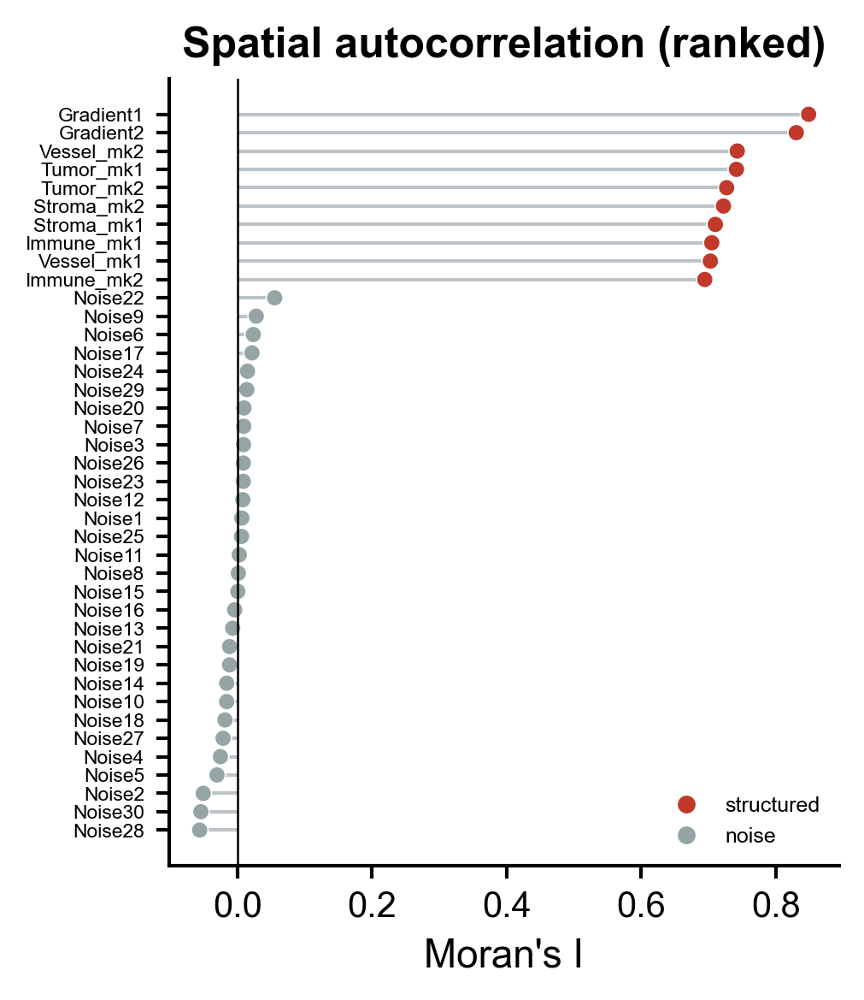
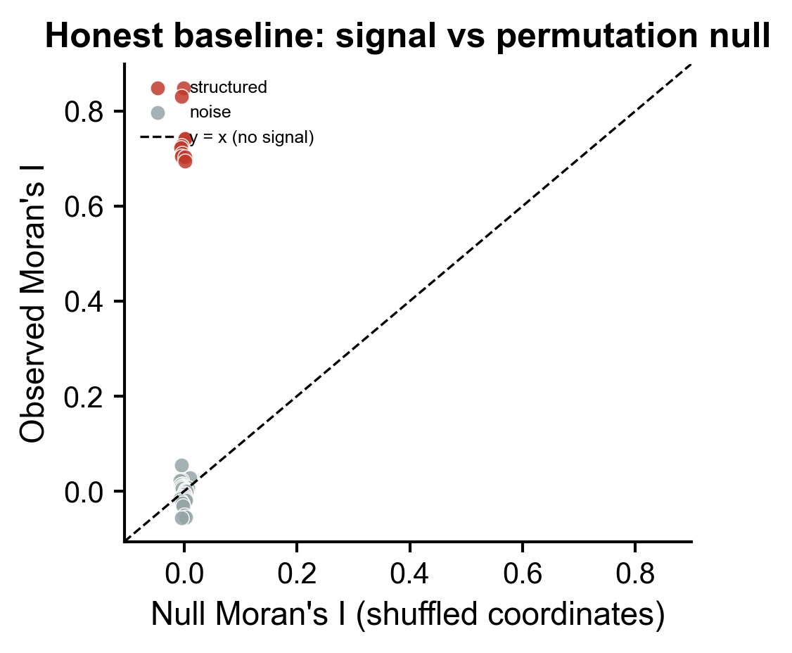
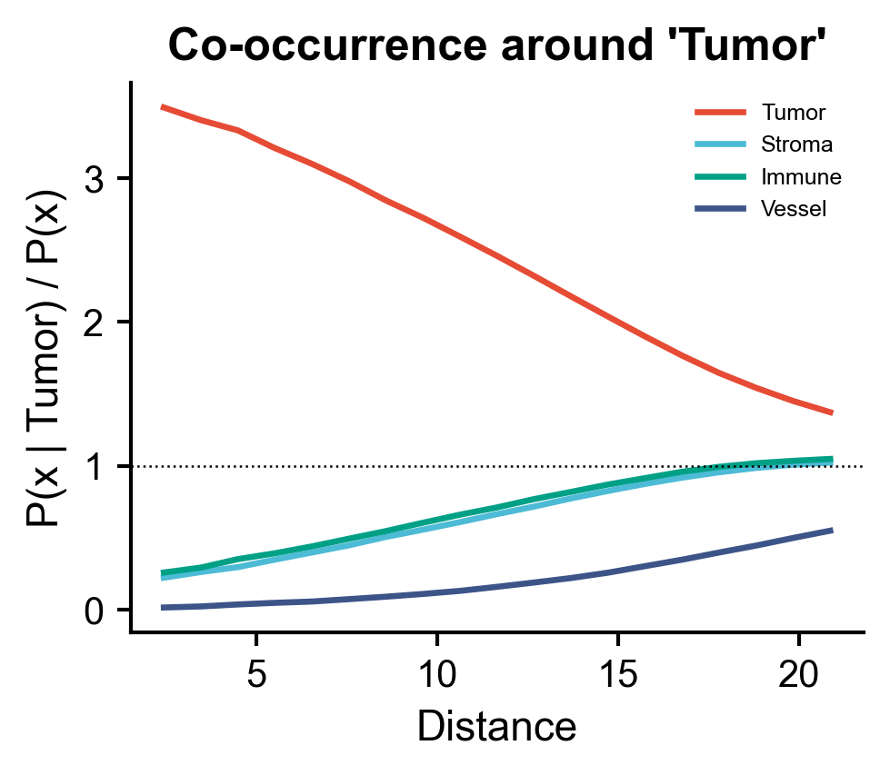
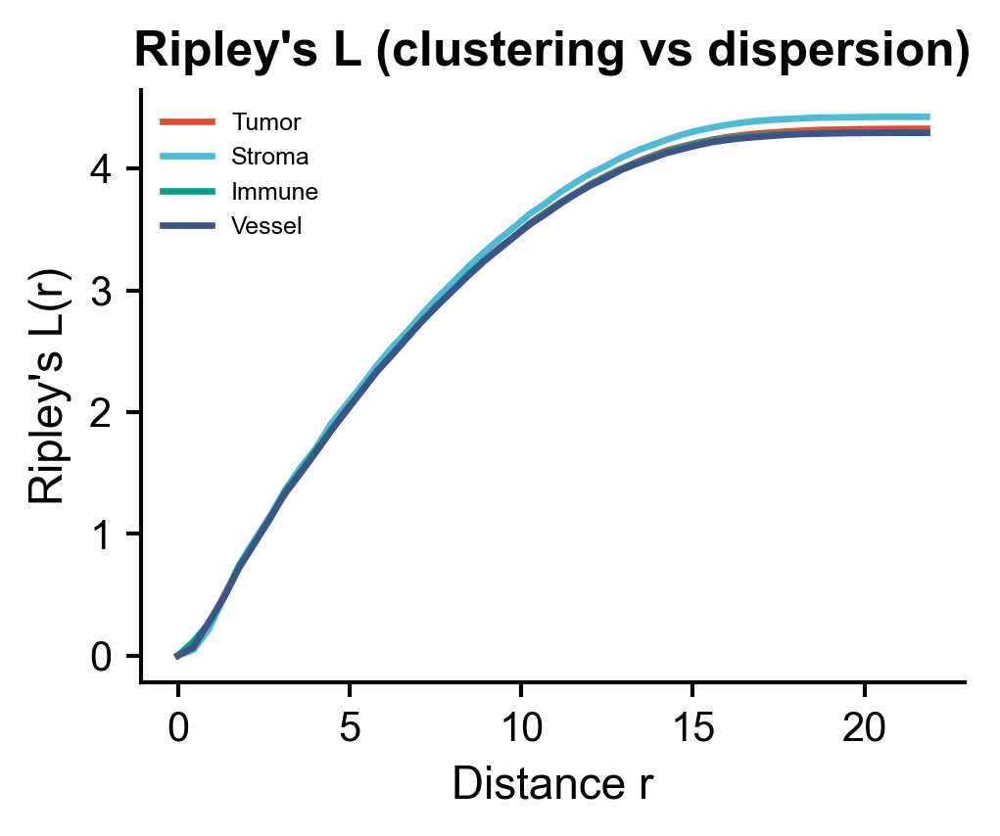
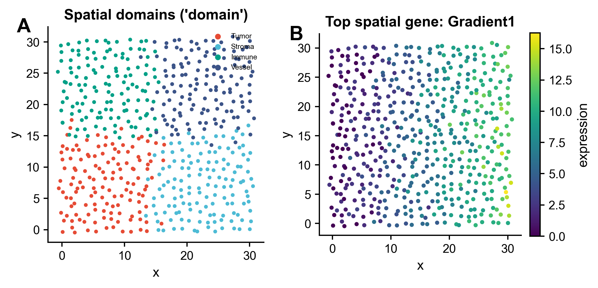

# 543 · squidpy 空间统计 (Moran / 邻域富集 / 共现 / Ripley)

用 **squidpy** 对空间转录组(spot/cell × 坐标)做一站式空间统计:空间邻接图 →
邻域富集 → Moran's I 空间自相关 → 细胞类型共现 → Ripley's L,并内置**坐标置换
null 诚实基线**证明信号非偶然。Turnkey,零改动即跑。

| | |
|---|---|
| 语言 / 依赖 | Python · `squidpy` 1.8.2 · `anndata` · `scanpy` · `numpy/pandas/matplotlib` (+ 共享 `_framework/pubstyle.py`) |
| 输入 | `--input .h5ad`(含 `obsm['spatial']` + 一个类型/域标签列);缺省自动合成 ~500 spot 演示 |
| 输出 | `results/` 统计表 + `assets/` 6 张展示图(PDF+PNG) |

---

## ① 输入数据

| 项 | 规格 |
|----|------|
| 主对象 | `AnnData`(`.h5ad`),`n_obs` = spot/cell 数,`n_vars` = 基因数 |
| `adata.obsm["spatial"]` | **必需**,形状 `(n_obs, 2)` 的 x/y 坐标 |
| `adata.obs[<cluster_key>]` | **必需**,离散细胞类型 / 空间域标签(自动转 category) |
| `adata.X` | 表达矩阵(可为归一化或原始计数) |

**样例(合成,首次运行自动生成于 `example_data/spatial_demo.h5ad`)**:529 个 spot
排成抖动网格,4 个空间域(Tumor / Stroma / Immune / Vessel)按 2D 高斯 niche 分布;
40 个基因中 10 个由域/坐标驱动(空间结构化),30 个为纯噪声(内部阴性对照)。

| spot | x | y | domain | Tumor_mk1 | … | Noise1 |
|------|------|------|--------|-----------|---|--------|
| spot0000 | 0.1 | -0.3 | Tumor | 7.2 | … | 2 |
| spot0001 | 1.5 | 0.2 | Tumor | 6.8 | … | 1 |

## ② 方法 / 原理

1. **空间邻接图** `sq.gr.spatial_neighbors(coord_type="generic", n_neighs=6)` —— 通用坐标 KNN 图(Visium 可改 `coord_type="grid"`)。
2. **邻域富集** `sq.gr.nhood_enrichment(cluster_key, seed=42, n_perms=200)` —— 置换检验得每对类型相邻的 z-score(谁挨着谁)。
3. **空间自相关 Moran's I** `sq.gr.spatial_autocorr(mode="moran", n_perms=200, seed=42)` —— 每个基因的空间结构强度(`uns['moranI']`:`I, pval_sim, …`)。
4. **共现概率** `sq.gr.co_occurrence(cluster_key, interval=20)` —— 距离依赖的条件富集 `P(x|cond)/P(x)`。
5. **Ripley's L** `sq.gr.ripley(cluster_key, mode="L", n_simulations=50, seed=42)` —— 点模式聚集 vs 分散。
6. **★诚实基线(坐标置换 null)**:对每个基因把 `obsm['spatial']` 随机打乱 30 次、重建邻接图重算 Moran's I。真实结构化基因 observed I 应远高于 null(I→0);经验单尾 p = null 中 ≥ observed 的比例。

> 参考:Palla et al., *squidpy: Spatial single cell analysis in Python*, **Nat Methods** 2022。Moran's I 为经典空间自相关统计量;Ripley's L 为点过程聚集度统计量。

## ③ 用途

- 在空间数据里**筛选有空间结构的基因**(空间可变基因 SVG 的快速先验)。
- 量化**空间域/细胞类型的相邻关系**(肿瘤-免疫界面、niche 邻接)。
- 判断某类型是**聚集还是弥散**分布(Ripley's L),并看**共现随距离衰减**模式。
- 作为空间转录组分析报告的标准统计模块,接 Visium / Slide-seq / MERFISH 等任意带坐标的 `AnnData`。

## ④ 特点 / 亮点

- **Turnkey**:零参数即跑,自动合成带真实空间信号的演示数据,无需预放文件。
- **★诚实基线**:坐标置换 null 直接证明 Moran's I 信号非偶然——结构化基因高悬于 `y=x` 线上方,噪声基因落在线上(≈0)。防止"看起来都显著"的自欺。
- **内部阴性对照**:合成数据含 30 个噪声基因,验证管道不会把噪声判成信号(实测噪声 I≈0)。
- **真实 squidpy API**:全部函数签名/返回键经 squidpy 1.8.2 实测核对,非臆造。
- **非条形图**:heatmap / lollipop / 散点 / 距离曲线,符合顶刊绘图规范;固定 `SEED=42` 可复现。

## ⑤ 输出结果图

| 文件 | 内容 |
|------|------|
| `assets/A_nhood_enrichment_heatmap.png` | 邻域富集 z-score 热图(对角自富集、离对角互斥) |
| `assets/B_moranI_lollipop.png` | Moran's I 排序 lollipop(结构化 vs 噪声着色) |
| `assets/C_moran_null_baseline.png` | ★诚实基线:observed vs 坐标置换 null 散点 |
| `assets/D_co_occurrence_curve.png` | 共现概率随距离曲线 |
| `assets/E_ripley_L_curve.png` | Ripley's L 曲线(各类型) |
| `assets/F_spatial_scatter_expr.png` | 空间散点:域分布 + top 空间基因表达叠加 |
| `results/nhood_enrichment_zscore.csv` | 邻域富集 z-score 表 |
| `results/moranI_with_null.csv` | Moran's I + null 均值 + 置换 p |
| `results/versions.txt` | 依赖版本快照 |








---

### 运行

```bash
# turnkey(自动合成演示数据)
python 543_squidpy_spatial_statistics.py

# 换自己的数据
python 543_squidpy_spatial_statistics.py --input my.h5ad --cluster_key cell_type
```

可选参数:`--n_neighs`(KNN 邻居数,默认 6)、`--n_perms`(置换次数,默认 200)。

### 依赖安装

```bash
pip install squidpy anndata scanpy numpy pandas matplotlib
```
