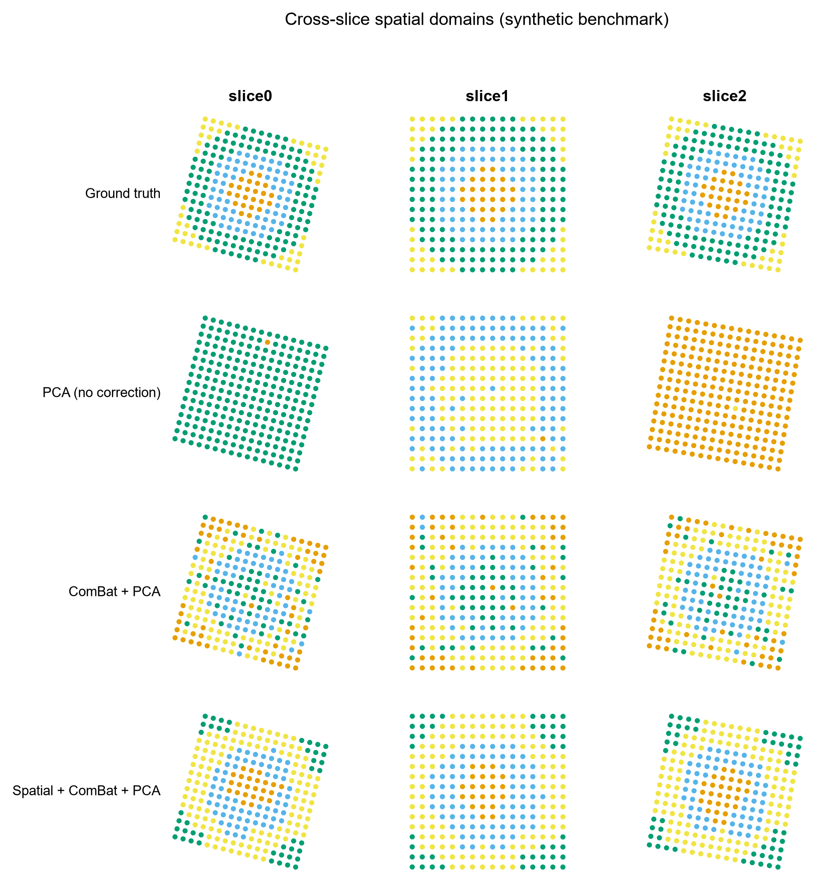
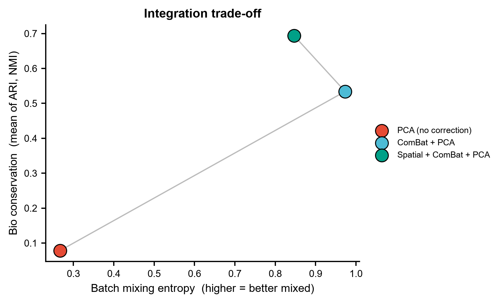
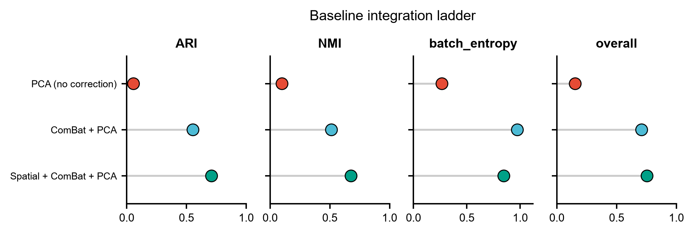
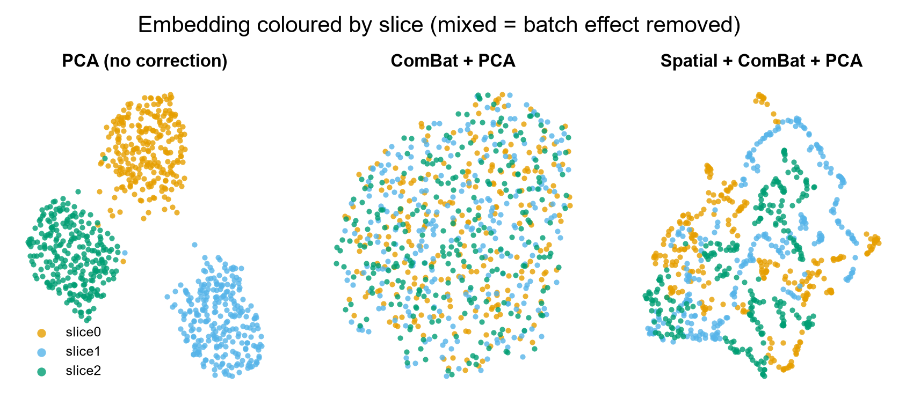

# 574 · STAIR — 多切片空间转录组对齐与整合 (Spatial Transcriptomic Alignment & Integration)

> 一句话定位:**输入**多张空间转录组切片(表达矩阵 + 空间坐标 + 切片标签)→ **做**跨切片整合、
> 得到共享嵌入与切片间一致的空间域 → **出**空间域散点图、整合权衡散点图、指标棒棒糖图、UMAP 批次混合图。

| | |
|---|---|
| **语言 / 主依赖** | Python 3.12 · 基线 `scanpy` `anndata` `scikit-learn` `umap-learn`;STAIR 路径 `STAIR_tools`(**未装,需 GPU**) |
| **一句话用途** | 多切片 ST 整合:去切片批次效应、跨切片一致的空间域划分(上游 STAIR 还做 3D 重建) |
| **输入** | `example_data/slices_expression.csv` + `example_data/slices_meta.csv` |
| **输出** | `results/`(运行生成) · 展示图见 `assets/` |
| **状态** | 🟡 诚实基线本机零改动跑通并出图;完整 STAIR 方法需装 wheel + CUDA GPU |

> ⚠️ **归类说明(请核对)**:上游 README 与论文标题都表明 STAIR 是
> **alignment / integration / 3D reconstruction** 方法,**不是** SVG(空间可变基因)检测,
> 也不是单切片 domain detection 工具。它确实会产出"跨切片一致的空间区域划分",
> 但那是整合的下游产物而非其定位。本模块现放在 `02_domains_svg_stats/` 下,
> 更贴切的位置是**多切片整合/对齐**类目。

---

## ① 输入数据

**文件 1**:`slices_expression.csv`(csv;行 = spot,列 = 基因;首行为 `# synthetic, for demo only` 注释行)

| 列名 | 类型 | 必需 | 示例 | 说明 |
|------|------|:---:|------|------|
| (索引) | str | ✔ | `S0_spot0000` | spot ID,须与 meta 的 `spot` 对应 |
| `G000` … | int | ✔ | `3` | 原始 count(未标准化) |

**文件 2**:`slices_meta.csv`(csv;行 = spot)

| 列名 | 类型 | 必需 | 示例 | 说明 |
|------|------|:---:|------|------|
| `spot` | str | ✔ | `S0_spot0000` | spot ID |
| `slice` | str | ✔ | `slice0` | 切片/批次标签(整合的 batch key) |
| `x` | float | ✔ | `2.31` | 空间坐标 x |
| `y` | float | ✔ | `0.87` | 空间坐标 y |
| `true_domain` | int | ✘ | `2` | 真实空间域;**仅评测用**,真实数据没有它时自动跳过打分 |

**命名/格式约定**:两文件通过 `spot` 对齐,行序须一致;`slice` 的取值即切片顺序。

**样例(前 3 行)**:
```
# synthetic, for demo only -- module 574 STAIR baseline
spot,slice,x,y,true_domain
S0_spot0000,slice0,-1.10,1.02,3
S0_spot0001,slice0,-0.13,0.77,3
```

示例数据为 **synthetic**:3 张切片 × 16×16 grid = 768 spots × 200 基因,4 个同心空间域,
切片间加了**平移 + 旋转的刚体错位**(模拟连续切片的物理错位)与**基因水平的批次效应**。

> ★ 信噪比是**刻意压低**的(弱 marker `fc=0.9`、浅测序 `depth=2.0`、`dropout=0.3`)。
> 最初用干净信号时朴素 PCA 直接拿到 ARI=1.000,阶梯完全失去分辨力、空间平滑反而"有害" ——
> 那种基准什么都证明不了。当前参数下单点表达本身是模糊的,必须借邻域信息才能稳定判域,
> 这才贴近真实 ST 数据的处境。参数经小规模扫描后选定(见脚本 `make_synthetic` 注释)。

## ② 方法 / 原理

### 本模块跑的基线(CPU,本机依赖即可)

三级**整合阶梯**,每一级只加一个成分,好判断增益来自哪里:

1. **PCA(无校正)** — 地板线。切片批次效应原封不动。
2. **ComBat + PCA** — 非空间的经典批次校正(`scanpy.pp.combat`,本机自带,无需额外包)。
3. **Spatial + ComBat + PCA** — 先做**切片内空间 kNN 均值平滑**(k=6),再校正。这是 STAIR
   同质图(intra-slice)的**朴素替身**:没有注意力、没有跨切片异质边。把"空间信息"单独拆出来,
   才能判断 STAIR 的增益究竟来自空间图还是来自 HGAT 注意力。

**评分**采用 scIB 式双轴:
- 生物保真 = 聚类(KMeans,固定种子)对 `true_domain` 的 **ARI / NMI**;
- 批次去除 = **局部邻域批次熵**(k=30 邻域内切片标签的归一化 Shannon 熵,0=完全分离,1=完全混合;iLISI 同精神的轻量实现);
- `overall = 0.6 × mean(ARI, NMI) + 0.4 × batch_entropy`。

### 上游 STAIR 方法(本模块守卫式封装,未在本机执行)

STAIR 用**异质图注意力网络(HGAT)**同时建模切片内(homogeneous)与切片间(heterogeneous)邻域,
学到共享嵌入 → 跨切片一致的空间域;再由**注意力分数**经最小生成树推断切片 z 轴顺序,
配合 MNN 初对齐 + 边界点精对齐完成 x/y 刚体对齐,从而**仅凭 ST 数据本身**做 de-novo 3D 重建。

## ③ 用途

回答的科学问题:**多张空间转录组切片,如何在去掉切片间技术差异的同时,得到彼此可比、
编号一致的空间域?** 典型场景 —— 连续切片的 3D 器官/脑图谱构建;跨平台切片整合
(如 Stereo-seq × Slide-seqV2);把新切片并入已有 3D 图谱(atlas expansion);
以及在做任何跨切片差异分析之前,先确认切片效应已被压住。

## ④ 特点 / 亮点

- **turnkey**:`python 574_stair_spatial_integration.py` 一条命令跑完,示例数据缺失时自动生成;
- **自带可跑基线**:不装 STAIR 也能跑完整评测,任何"STAIR 更好"的说法都有地板线可比;
- **阶梯式拆解**:批次校正与空间信息分两级加入,增益来源可归因,不是黑箱对比;
- **不臆造 API**:STAIR 调用序列的每个参数名都逐一核对自上游源码(URL 见下),未核对的部分明确标注;
- **顶刊图规范**:统一 `pubstyle`,矢量 PDF + 300dpi PNG,色盲安全配色,**全程无条形图**。

## ⑤ 输出结果图

| 文件 | 图型 | 说明 |
|------|------|------|
| `assets/fig1_spatial_domains.png` | 空间散点矩阵 | 行=方法(含 Ground truth),列=切片;直观看跨切片域是否一致 |
| `assets/fig2_integration_tradeoff.png` | 权衡散点 | x=批次混合熵,y=生物保真;右上角最优 |
| `assets/fig3_metric_lollipop.png` | 棒棒糖图 | ARI / NMI / batch_entropy / overall 逐指标对比 |
| `assets/fig4_umap_by_slice.png` | UMAP 散点 | 按切片着色,混匀=批次效应已去除 |
| `results/574_baseline_metrics.csv` | 表 | 各方法四项指标 |
| `results/574_summary.json` | JSON | 基线结果 + STAIR 路径状态 |









**示例数据上的实测结果**(`python 574_stair_spatial_integration.py`,退出码 0):

| method | ARI | NMI | batch_entropy | overall |
|---|---|---|---|---|
| PCA (no correction) | 0.057 | 0.100 | 0.267 | 0.154 |
| ComBat + PCA | 0.555 | 0.514 | 0.973 | 0.710 |
| Spatial + ComBat + PCA | 0.710 | 0.678 | 0.846 | 0.755 |

阶梯单调:批次校正把切片混匀(熵 0.27→0.97),空间平滑再把域判准(ARI 0.56→0.71),
代价是混合熵略降(0.97→0.85)—— 这正是整合方法要权衡的两端。

---

## 运行

```bash
# 零改动跑示例(example_data 不存在时自动生成合成数据)
python 574_stair_spatial_integration.py

# 换成自己的数据
python 574_stair_spatial_integration.py \
    --expr data/expr.csv --meta data/meta.csv \
    --n-domains 7 --outdir results/run1 --figdir results/run1

# 尝试真实 STAIR 路径(需 wheel + CUDA GPU,否则优雅跳过并打印原因)
python 574_stair_spatial_integration.py --run-stair
```

## 依赖安装

基线所需依赖本机已全部具备(`scanpy` `anndata` `scikit-learn` `umap-learn` `matplotlib`),**无需安装**。

STAIR 本体(本机**未安装**,需 GPU):

```bash
# 官方 wheel(命令逐字取自上游 README「3. Install STAIR-tools」)
pip install https://github.com/yuyuanyuana/STAIR/releases/download/1.3.1/STAIR_tools-1.3.1-py3-none-any.whl
```

上游 README 给的前置(核对自其「Installation」节 + `environment-python3.12.yaml`):
Python 3.12 + CUDA 12.4 → `torch==2.6.0`/`torchvision==0.21.0`/`torchaudio==2.6.0`(cu124 源),
再 `pip install pyg_lib torch_scatter torch_sparse torch_cluster torch_spline_conv
-f https://data.pyg.org/whl/torch-2.6.0+cu124.html` 与 `torch_geometric`;
另有 Python 3.10 + CUDA 11.7(`torch==1.13.1`)一套。上游包名 `STAIR-tools` v1.3.1,
**许可证 MIT**(`LICENSE`,Copyright (c) 2025 yuyuanyuana)。
`clustering='mclust'` 另需 `rpy2` + R 包 `mclust`。

## API 溯源与诚实边界

STAIR 调用序列写在脚本 `run_stair()` 中,**每个符号都在本地克隆的上游源码里定位到了文件:行号**
(2026-07-21 复核,STAIR @ main / STAIR-tools 1.3.1):

| 本模块调用 | 上游定义位置 |
|---|---|
| `Emb_Align(adata, batch_key, hvg, likelihood, device, result_path)` | `STAIR/emb_alignment.py:23` |
| `.prepare(count_key=None, lib_size='explog', normalize=True, scale=False)` | `STAIR/emb_alignment.py:114` |
| `.preprocess(lr, weight_decay, epoch_ae, batch_size, plot)` | `STAIR/emb_alignment.py:148` |
| `.latent(batch_size=10000, return_data=False)` → `obsm['latent']` | `STAIR/emb_alignment.py:226`(写入在 `:285`) |
| 异质图读 `obsm['latent']` + `obsm['spatial']`(故 `.latent()` 必须先于 `.prepare_hgat()`) | `STAIR/embedding/dataset_hgat.py:107-108` |
| `.prepare_hgat(slice_key, slice_order, spatial_key, n_neigh_hom, c_neigh_het, kernal_thresh)` | `STAIR/emb_alignment.py:291` |
| `.train_hgat(gamma, epoch_hgat, ...)` | `STAIR/emb_alignment.py:334` |
| `.predict_hgat(...) → (adata, atte_)` | `STAIR/emb_alignment.py:533` |
| `cluster_func(adata, clustering, use_rep, res, cluster_num, key_add)` | `STAIR/utils.py:85` |
| `sort_slices(atte, start=None, return_tree=False)` | `STAIR/loc_prediction.py:13` |
| `Loc_Align(adata, batch_key, batch_order, make_log, result_path)` | `STAIR/loc_alignment.py:12` |
| `.init_align / .detect_fine_points / .fine_align` | `STAIR/loc_alignment.py:65 / 109 / 201` |
| `likelihood ∈ {'nb','zinb'}` | `STAIR/embedding/module_ae.py:156` (`ae_dict`) |

**本次复核改掉的两处实质问题**(原版本会在真跑时出错):

1. **喂错了矩阵**。`STAIR/embedding/dataset_ae.py:25-27` 显示 `count_key=None` 时 STAIR 直接把
   `adata.X` 当 **raw count**(`adata.layers['counts'] = adata.X.copy()`),随后自己做
   `normalize_total`(L63)+`log1p`(L66);`nb/zinb` 似然与 `flavor='seurat_v3'` 的
   HVG(L68-74)也都要 count。
   原代码把已 `log1p` 的 AnnData 传了进去 → 二次 log1p + 似然失配。现改为 `_preprocess()`
   保留 `layers['counts']`,`run_stair()` 传入前把 `X` 换回 count,并在缺 counts 层时守卫返回。
2. **`clustering='mclust'` 需要 rpy2 + R 包 mclust**(`STAIR/utils.py:62` 的 `mclust_R` 里
   `import rpy2` / `robjects.r.library("mclust")`),本机无 rpy2。默认改为源码里同样存在的
   纯 sklearn `'kmeans'` 分支(`STAIR/utils.py:92-95`),`clustering=` 可切回 `'mclust'`。

**诚实边界**:本模块**未在本机执行过 STAIR 本体**(无 wheel、无 GPU),
仅保证调用签名与上游源码一致,运行时行为未经验证。官方教程链接来自上游 README「Tutorial」节,
本模块未抓取其页面内容,参数取值以源码默认值为准。

## 引用

Yu Y, Xie Z. Spatial transcriptomic alignment, integration, and 3D reconstruction by STAIR.
*Genome Biology* 2025;26(1):427. doi:10.1186/s13059-025-03895-x · PMID **41398698**

引用已核实:PMID 41398698 经 NCBI E-utilities esummary 查得,标题/期刊/DOI 与本模块所封装方法一致。
