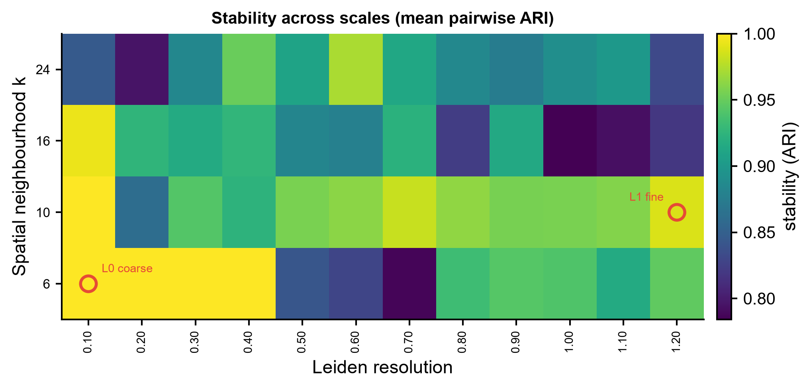
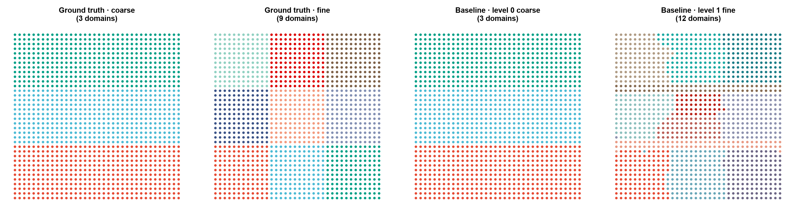
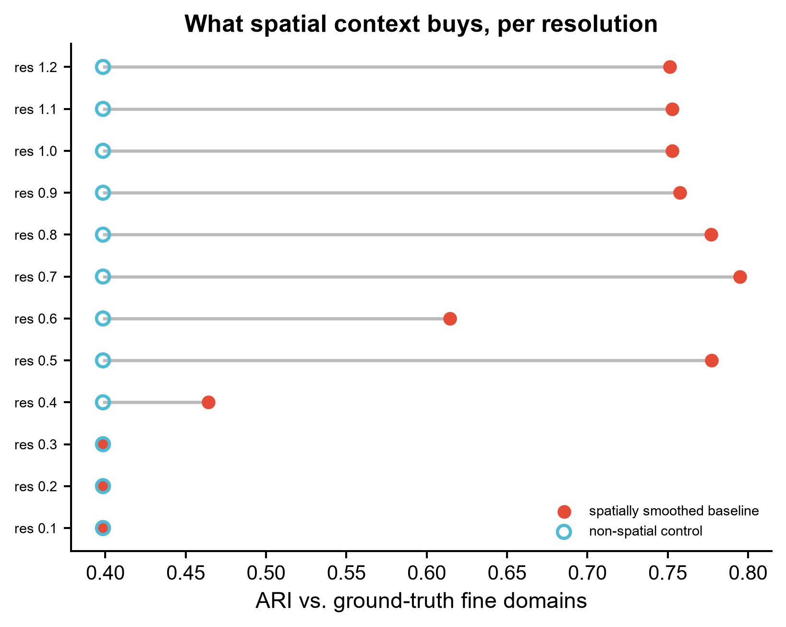

# 575 · SCALE — 空间组学多尺度空间域识别 (multi-scale spatial domain identification)

> 一句话定位:输入**带坐标的空间组学表达矩阵** → 在「空间邻域尺度 × 聚类分辨率」网格上找**跨随机种子稳定**的分层空间域 → 出**稳定性热图 / 多尺度域空间散点 / 空间信息增益 dumbbell**。

| | |
|---|---|
| **语言 / 主依赖** | Python 3.12 · 基线:`scanpy` `scikit-learn` `leidenalg` `igraph` `matplotlib`;上游 SCALE:`scale` + `torch-geometric`(**未装,走守卫路径**) |
| **一句话用途** | 无监督地识别组织中「粗-细」多个尺度上都稳定的空间域 |
| **输入** | `example_data/spatial_counts_synthetic.csv` |
| **输出** | `results/`(运行生成) · 展示图见 `assets/` |
| **状态** | 🟡 朴素基线本机零改动跑通并出图;SCALE 真身需另装 `scale` + `torch-geometric` |

---

## ① 输入数据

**文件**:`spatial_counts_synthetic.csv`(csv;行 = spot/cell,列 = 坐标 + 可选真值 + 基因)
`synthetic, for demo only` —— 仅用于冒烟测试与出图。

| 列名 | 类型 | 必需 | 示例 | 说明 |
|------|------|:---:|------|------|
| `spot_id`(索引) | str | ✔ | `spot0000` | 行名 |
| `x` | float | ✔ | `0.0` | 空间横坐标 |
| `y` | float | ✔ | `0.0` | 空间纵坐标 |
| `domain_coarse` | str | ✘ | `C1` | 粗尺度真值标签(有则做 ARI 评估) |
| `domain_fine` | str | ✘ | `C1_a` | 细尺度真值标签(嵌套于粗标签) |
| `Gene00` … | float | ✔ | `7.72` | 表达值,其余所有列都当基因 |

**命名/格式约定**:除 `x` / `y` / `domain_coarse` / `domain_fine` 外的列一律按基因处理;真值列可缺,缺了就跳过 ARI 评估与增益图。

**样例(前 3 行,截前 6 列)**:
```
spot_id,x,y,domain_coarse,domain_fine,Gene00
spot0000,0.0,0.0,C1,C1_a,7.72
spot0001,1.0,0.0,C1,C1_a,19.70
```

示例数据是 36×36 网格共 1296 个 spot、80 个基因,**3 个粗域,每个再分 3 个细亚域(共 9 个嵌套真域)**;粗域信号强、细域信号弱,细结构只有在加了空间上下文之后才稳 —— 这正是多尺度方法要处理的情形。

## ② 方法 / 原理

模块两条路,**默认只跑第一条**。

**A. 朴素基线(本机可跑,默认)** —— 「多尺度稳定域」这一想法在没有 GNN 时的下限:

1. **空间平滑**:每个 spot 的表达替换为其 `k` 个空间近邻(含自身)的均值。`k` 就是这条基线的尺度旋钮(对应 SCALE 里的空间图距离/kNN 半径)。
2. **表征 + 聚类**:平滑后 PCA(15 维)→ 在 `k × Leiden resolution` 网格上跑 Leiden(`flavor="igraph"`,与上游聚类后端一致),每格跑 `--n-repeats` 个随机种子。
3. **稳定性**:每格的稳定性 = 种子之间的**平均成对 ARI**。这与上游 `scale/search/_stability.py` 的 `calc_stability` 同一思路(它也用 `adjusted_rand_score` 衡量重复间一致性)。
4. **选层**:取稳定性前 `--top-frac` 的候选,按簇数取两端得到粗层与细层。
   ⚠️ **诚实说明**:上游用的是**基于熵的层级搜索** `scale.search.calc_entropy`(会检查跨层的嵌套关系与簇数单调递增)。这里只是「top 稳定候选 → 按簇数取两端」的朴素代理,**不是熵搜索**,不要当成 SCALE 的复现。
5. **对照**:同时跑一遍**完全不用空间信息**的 Leiden(原始表达 PCA),量化空间上下文到底买到了多少 —— 这是本库要求的可跑基线兼 sanity check。

**B. SCALE 真身(`--run-scale`,守卫式)**:`scale` 或 `torch-geometric` 导入失败时打印真实安装命令后优雅退出,**不静默降级**。上游真实入口(读自源码,见下):

```python
from scale import run_scale
from scale.config import load_config      # 或 from scale.config import Config

cfg = load_config()          # cfg.distance_set / cfg.knn_set / cfg.resolution_set /
                             # cfg.lambda_set / cfg.n_repeats / cfg.seed(默认 200)…
run_scale(adata, cfg,
          use_svgs=True, use_hvgs=False,
          sample_key=None, integration_method=None,   # 多样本可用 "harmony" / "celltype_expression"
          layer=None, celltype_key=None,
          spatial_key="spatial", n_levels=2, top_n=0.15)
```
结果落在 `adata.obs['scale_l*']`(各尺度的域标签)、`adata.obsm['scale_clusterings']`、`adata.uns['scale']`。
也可按 vignette 手动分步:`train` → `select_best_lambdas` → `calc_clusterings` → `calc_stability` → `calc_entropy`。

**API 来源(实际抓取的 URL,2026-07-20)**:
`raw.githubusercontent.com/imsb-uke/scale/HEAD/` 下的 `README.md`、`scale/__init__.py`、`scale/scale.py`、`scale/config.py`、`scale/training.py`、`scale/clustering.py`、`scale/search/_stability.py`、`scale/search/_entropy.py`、`notebooks/vignette.ipynb`。

⚠️ **上游自身不一致(已核实)**:`notebooks/vignette.ipynb` 里写的是 `calc_clusterings(adata, flavor=..., n_iterations=...)`,但当前 `scale/clustering.py` 的签名是 `calc_clusterings(adata, cfg, ...)`(`cfg` 为必需位置参数)。**生产运行前请以官方最新教程为准,本模块不固定这一签名。**

## ③ 用途

回答:**这块组织在哪些空间尺度上存在可重复的分区,各尺度的分区长什么样?**
典型场景:MERFISH / Xenium / Visium 等空间组学的无监督组织结构解析 —— 既想要「皮质 / 白质」这种粗分层,也想要粗分层内部的细亚区,而且不想手工试分辨率、不想把随机种子噪声当成生物学。本模块同时给出「不加空间信息能做到什么程度」的对照,避免把普通表达聚类包装成空间域发现。

## ④ 特点 / 亮点

- **turnkey**:`python 575_scale_spatial_method.py` 一条命令跑完,默认读 `example_data/` 写 `results/`,固定种子 200(与上游 `cfg.seed` 默认一致)。
- **自带朴素基线与非空间对照**:上游包没装也能跑出完整结果与图;示例数据上空间平滑基线中位 ARI ≈ 0.75,无空间对照 ≈ 0.40。
- **稳定性优先**:不挑「看起来好」的分辨率,而是挑跨随机种子可重复的设置。
- **守卫式上游封装**:`--run-scale` 缺依赖时打印真实安装命令,不假装跑过、不臆造 API。
- **不用条形图**:热图 + 空间散点 + dumbbell。

## ⑤ 输出结果图

| 文件 | 图型 | 说明 |
|------|------|------|
| `assets/575_stability_grid.png` | heatmap | `k × resolution` 网格的种子间平均 ARI,红圈标出选中的两个尺度层 |
| `assets/575_domains_multiscale.png` | 空间散点(多面板) | 粗/细真值域 vs 基线在两个尺度上给出的域 |
| `assets/575_spatial_gain_dumbbell.png` | dumbbell | 每个分辨率下「无空间对照 → 空间平滑基线」的真值 ARI 变化 |
| `results/stability_grid.csv` | 表 | 稳定性网格 |
| `results/n_clusters_grid.csv` | 表 | 各设置的平均簇数 |
| `results/spatial_vs_nonspatial_ari.csv` | 表 | 逐分辨率的空间 / 非空间 ARI 与簇数 |
| `results/baseline_domain_labels.csv` | 表 | 每个 spot 在两个尺度层上的域标签 + 坐标 |
| `results/575_summary.json` | JSON | 选中层、稳定性、中位 ARI、SCALE 路径状态 |







---

## 运行

```bash
# 零改动跑示例(仅基线)
python 575_scale_spatial_method.py

# 换成自己的数据 + 调网格
python 575_scale_spatial_method.py --input data/你的.csv --outdir results/run1 \
    --k-set 6,12,20,30 --res-min 0.1 --res-max 1.5 --res-step 0.1 --n-repeats 5

# 尝试真正的 SCALE(缺依赖会打印安装命令后跳过)
python 575_scale_spatial_method.py --run-scale
```

示例数据(1296 spots × 80 genes,4 个 k × 12 个分辨率 × 3 个种子)本机 CPU 数分钟跑完。

## 依赖安装

基线所需(本机已具备,**本模块不自动安装任何包**):
```bash
pip install scanpy scikit-learn leidenalg igraph matplotlib pandas numpy
```

上游 SCALE(可选,本机未装):
```bash
git clone https://github.com/imsb-uke/scale.git
cd scale && poetry install     # 或 pip install -e .
# torch-geometric 需按本机 torch / CUDA 版本安装,见 https://pytorch-geometric.readthedocs.io
```

## 引用(已核实)

Yousefi B, Schaub DP, Khatri R, Kaiser N, Kuehl M, Ly C, Puelles VG, Huber TB, Prinz I, Krebs CF, et al.
**SCALE: unsupervised multiscale domain identification in spatial omics data.**
*Nucleic Acids Research* 2026 Jan 5. doi:10.1093/nar/gkaf1456 · PMID 41495880

核实方式:NCBI E-utilities esummary 返回该 PMID 的标题/期刊/DOI 与本条一致;`https://doi.org/10.1093/nar/gkaf1456` 302 跳转至 `academic.oup.com/nar/article/doi/10.1093/nar/gkaf1456/8415817`。
仓库 README 里给的仍是 2025 年 bioRxiv 预印本条目(`biorxiv 2025.05.21.653987`),正式版为上述 NAR 2026。
