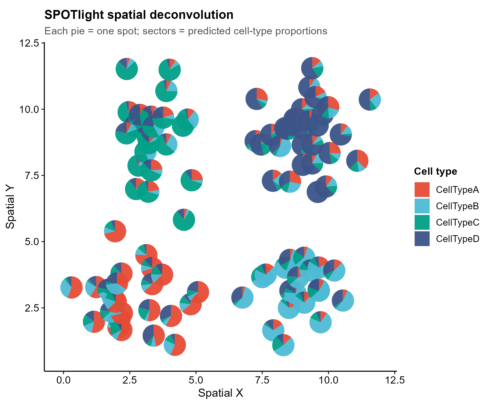
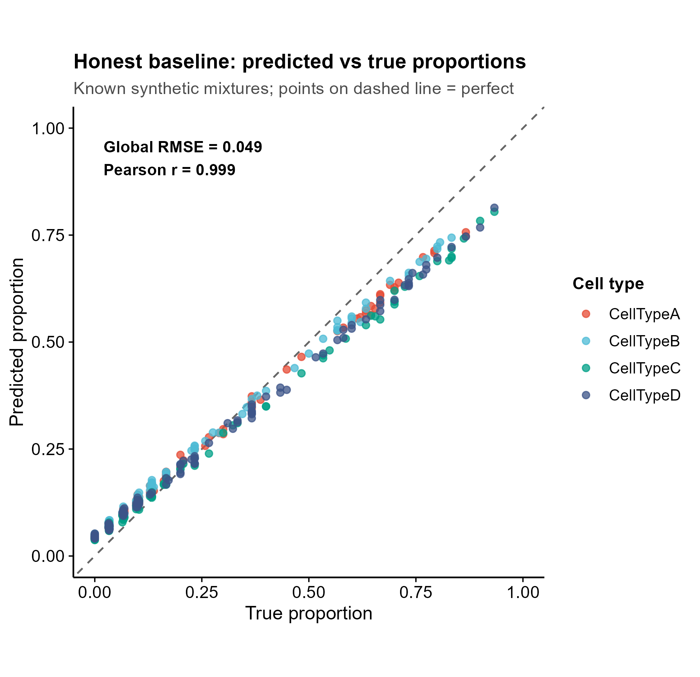
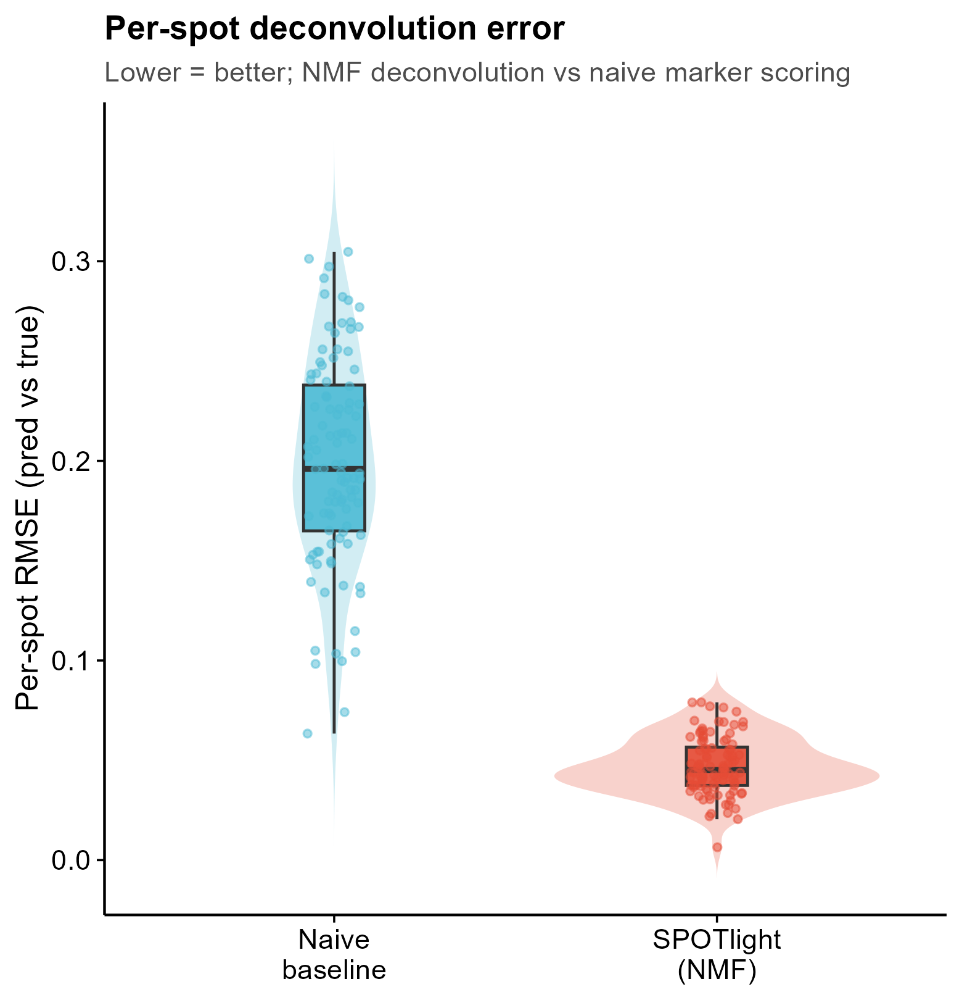

<!-- 图中文字英文,正文中文。 -->

# 545 · 空间 spot 细胞类型去卷积 SPOTlight Spatial Deconvolution

> 一句话定位:用带标签的 scRNA 参考,对空间转录组**每个 spot** 做细胞类型去卷积(SPOTlight = NMF 主题建模 + NNLS 回归),输出每 spot 的细胞类型比例,并以 **scatterpie 空间饼图 / 比例热图 / 预测-vs-真实散点** 展示;★内置**已知混合比例的诚实基线**验证可信度。

| | |
|---|---|
| **语言 / 主依赖** | R · `SPOTlight` `SingleCellExperiment` `scran` `scuttle` `scatterpie` `ggplot2` |
| **一句话用途** | 空间 spot → 细胞类型比例去卷积 + 空间饼图 |
| **输入** | 合成 demo,脚本内生成(scRNA 参考 + 空间 spot,均写入 `example_data/`) |
| **输出** | `results/`(比例表 + 诚实基线评估) · 展示图见 `assets/` |

---

## ① 输入数据

脚本默认**自带合成 demo**(`synthetic, for demo only`),无需准备任何文件即可跑通。运行时写入 `example_data/`:

**A. scRNA 参考**(`scRNA_reference_counts.csv` 基因 × 细胞 + `scRNA_reference_labels.csv`)

| 列名 | 类型 | 必需 | 示例 | 说明 |
|------|------|:---:|------|------|
| (行名) | str | ✔ | `gene001` | 基因 ID |
| `cell0001` … | int | ✔ | `0,3,11,…` | 各细胞原始 counts |
| `cell_type` | str | ✔ | `CellTypeA` | 每细胞的细胞类型标签(labels 表) |

**B. 空间 spot**(`spatial_spots_truth.csv`)

| 列名 | 类型 | 必需 | 示例 | 说明 |
|------|------|:---:|------|------|
| (行名) | str | ✔ | `spot001` | spot ID |
| `x` `y` | num | ✔ | `11.56, 10.37` | spot 空间坐标(画 scatterpie 用) |
| `CellTypeA`… | num | — | `0.13, 0.23,…` | ★**真实**混合比例(仅合成 demo 有,用于诚实基线) |

**换真实数据**:参考构造为 `SingleCellExperiment`(`counts` + `colData$cell_type`);空间为 counts 矩阵(基因行 × spot 列)+ 每 spot 的 `x/y`。

**样例(前 3 行,truth)**:
```
"","x","y","CellTypeA","CellTypeB","CellTypeC","CellTypeD"
"spot001",11.56,10.37,0.129,0.226,0.065,0.581
"spot002",8.30,1.09,0.100,0.567,0.267,0.067
```

## ② 方法 / 原理 与 ★诚实基线

1. **合成参考**:4 类细胞,每类有专属 marker 基因(负二项 counts,marker 高表达 + 背景低表达)。
2. **合成 spot(ground truth)**:每 spot 按 **Dirichlet 抽取的已知比例** 混合若干参考细胞、counts 相加;真实比例随抽样实际细胞数重算后存盘 → 这就是诚实基线的金标准。
3. **marker gene set**:`scuttle::logNormCounts` + `scran::scoreMarkers`(mean.AUC)取各类标记基因。
4. **去卷积**:`SPOTlight::SPOTlight(x=参考SCE, y=空间SCE, groups=, mgs=, ...)` —— NMF 学习各细胞类型主题特征,再 NNLS 回归把每个 spot 表达分解为细胞类型主题的非负组合,返回 `$mat`(spots × cell_types 比例,行和=1)。
5. **★诚实基线评估**:预测比例 vs 真实比例算 **全局 RMSE / Pearson r** + **逐 spot RMSE/相关**;并对比一个**朴素基线**(不做 NMF,直接用 spot 表达对各类 marker 求平均再归一化),证明 NMF 去卷积确实优于朴素打分,不只报好看指标。

方法引用:Elosua-Bayes et al., *SPOTlight*, Nucleic Acids Research 2021(NMF + NNLS 空间去卷积)。

## ③ 用途

回答"**这个组织切片的每个空间位置由哪些细胞类型、各占多少**":肿瘤微环境构成、组织分层、免疫浸润空间格局等;为后续邻域分析 / 细胞通讯 / 空间差异提供 spot 级细胞组成。

## ④ 特点 / 亮点

- **turnkey**:`Rscript 545_spotlight_deconvolution.R` 一条命令,CPU 秒级跑通(NMF 训练 < 0.1 min);
- **真包实跑**:SPOTlight v1.10 真实 NMF 去卷积,非 stub;
- **★诚实基线内置**:已知混合比例做金标准,RMSE/相关量化可信度,并与朴素基线对照(实测 NMF RMSE 0.049 ≪ 朴素 0.206);
- **顶刊级图、禁平凡条形**:scatterpie 空间饼代替堆叠条形、viridis 比例热图、对角线散点、violin+box+jitter 误差分布;
- 路径全相对,固定种子 42,出图一次出 PDF+PNG,末尾落 sessionInfo 依赖快照。

## ⑤ 输出结果图

| 文件 | 图型 | 说明 |
|------|------|------|
| `assets/spatial_scatterpie.png` | 空间饼图(scatterpie) | 每 spot 一个饼,扇区=各细胞类型预测比例;4 空间区域各由一类主导 |
| `assets/proportion_heatmap.png` | 比例热图(viridis) | spot × cell type 预测比例,spot 按主导类型排序呈块状对角 |
| `assets/pred_vs_true_scatter.png` | ★诚实基线散点 | 预测 vs 真实比例,点贴对角线;标注全局 RMSE / r |
| `assets/method_rmse_violin.png` | violin+box+jitter | 逐 spot RMSE 分布,SPOTlight vs 朴素基线 |





`results/` 另含:`predicted_proportions.csv`、`honest_baseline_eval.csv`、`sessionInfo.txt`。

---

## 运行

```bash
# 零改动跑合成示例
Rscript 545_spotlight_deconvolution.R
# 自定义规模 / 输出目录
Rscript 545_spotlight_deconvolution.R --n_types 4 --n_spots 100 --outdir results/run1
```

## 依赖安装

```r
if (!requireNamespace("BiocManager", quietly = TRUE)) install.packages("BiocManager")
BiocManager::install(c("SPOTlight","SingleCellExperiment","scran","scuttle"))
install.packages(c("scatterpie","ggplot2"))
```
