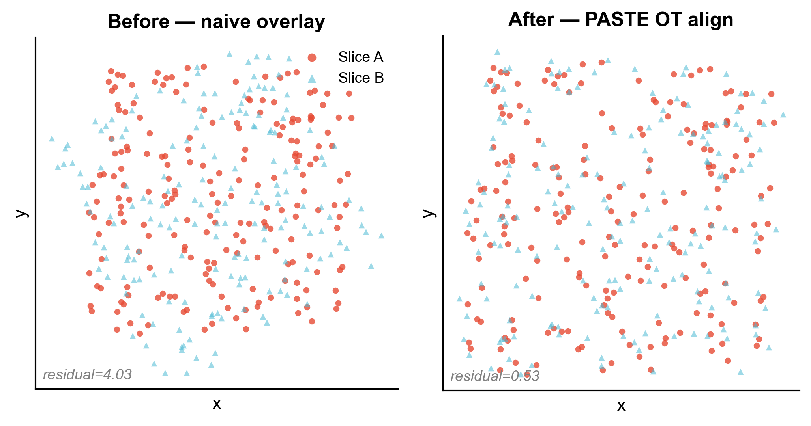
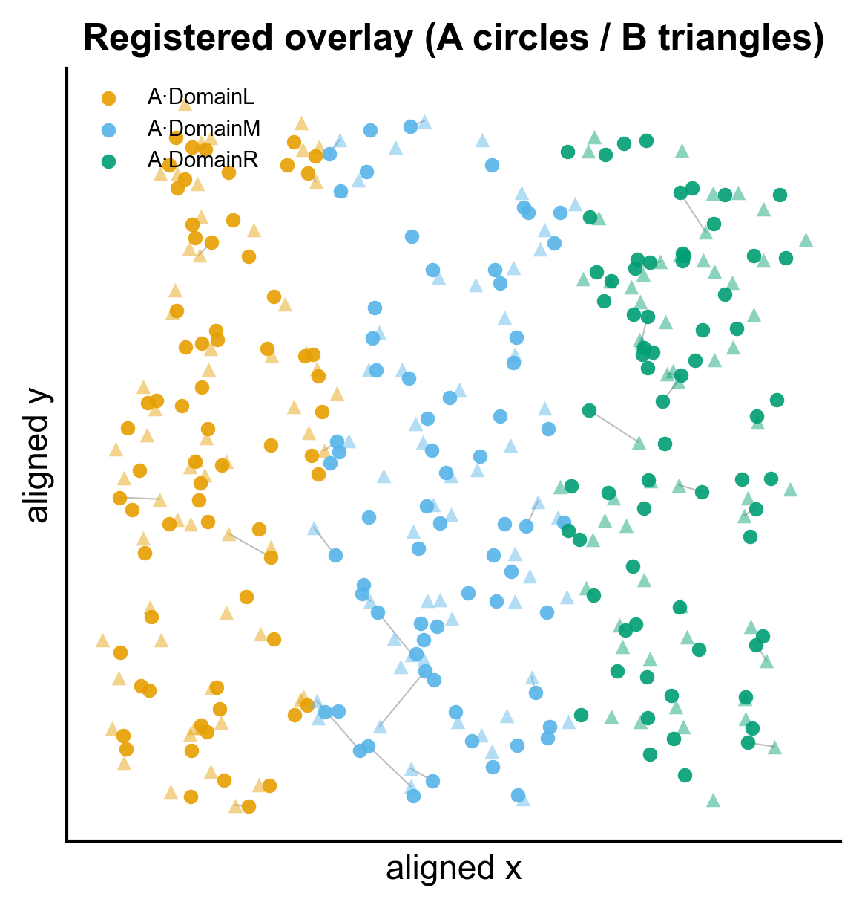
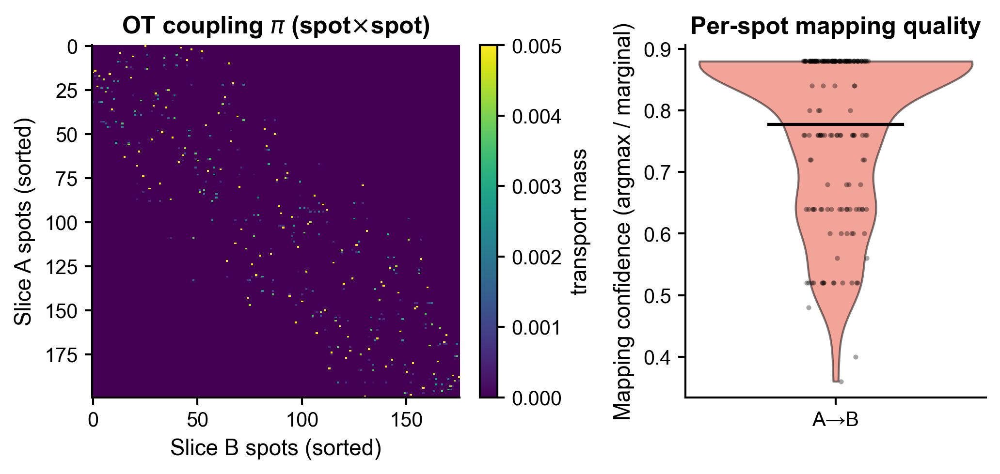
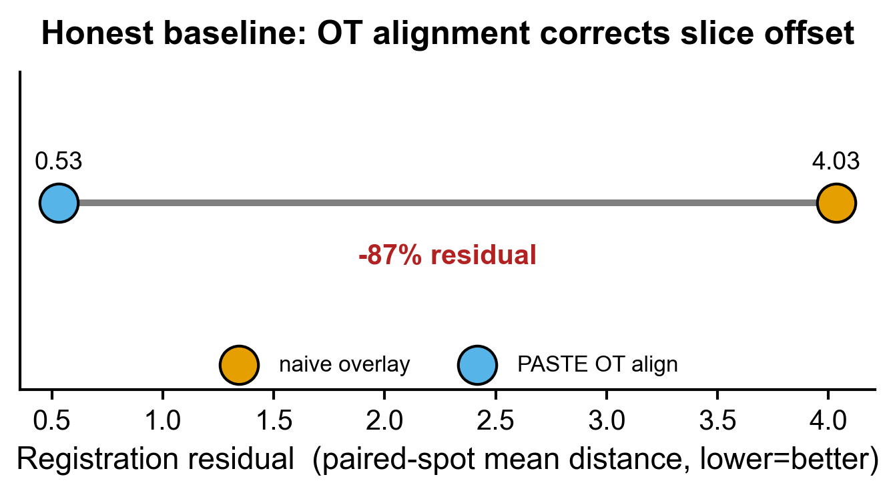

<!-- 图中文字英文,正文中文。 -->

# 544 · PASTE 多空间切片对齐 / 3D 堆叠 PASTE optimal-transport slice alignment

> 一句话定位:**输入** 两张同组织相邻切片的空间转录组 AnnData(各带 `.obsm["spatial"]`)→ **做** 最优传输(FGW)切片配准:`pairwise_align` 求 spot↔spot 概率耦合 `pi`,`stack_slices_pairwise` 由 `pi` 解出刚体变换(旋转+平移)把两切片叠进同一坐标系 → **出** 对齐前后空间叠加散点、配准叠加图、映射质量(耦合热图+置信度小提琴)、诚实基线残差哑铃图。

| | |
|---|---|
| **语言 / 主依赖** | Python · `paste-bio`(import 名 `paste`)· `POT`(0.9.4)· `anndata` |
| **一句话用途** | 把相邻空间切片配准/整合到同一坐标系,支持部分重叠与 3D 堆叠 |
| **输入** | 两张 h5ad(`example_data/sliceA_synth.h5ad`、`sliceB_synth.h5ad`),各含 `.obsm["spatial"]` |
| **输出** | `results/`(运行生成) · 展示图见 `assets/` |

---

## ① 输入数据

**文件**:两张 `*.h5ad`(AnnData),分别为相邻切片 A、B。

| 字段 | 位置 | 必需 | 示例 | 说明 |
|------|------|:---:|------|------|
| 表达矩阵 | `adata.X` | ✔ | 200×60 计数 | spot × gene,建议原始计数(PASTE 默认 `kl` 散度) |
| 空间坐标 | `adata.obsm["spatial"]` | ✔ | `N×2` float | 每个 spot 的 (x, y);**两切片都必须有** |
| 基因名 | `adata.var_names` | ✔ | `g000…` | 两切片须有**共享基因**(否则先 `paste.filter_for_common_genes`) |
| 空间域 | `adata.obs["domain"]` | ✖ | `DomainL/M/R` | 仅用于配色与示例评估,非必需 |

**命名/格式约定**:两切片基因集合需可对齐;换自己数据时用 `--sliceA a.h5ad --sliceB b.h5ad`,脚本会自动 `filter_for_common_genes`。

**样例**:`example_data/` 内的合成切片(`synthetic, for demo only`)—— 切片 B = 切片 A 旋转 30° + 平移 (6,-4) + spot 级抖动 + 随机丢弃 12% spot(部分重叠),A=200 / B=176 spot × 60 gene、3 个空间域。

## ② 方法 / 原理 与 ★诚实基线

1. **`paste.pairwise_align(A, B, alpha)`** —— 用 Fused Gromov-Wasserstein 最优传输,把表达相似度(`alpha=0` 端)与空间几何一致性(`alpha=1` 端)联合优化,返回 `pi`(`nA×nB` 概率耦合,总质量=1)。`alpha` 默认 0.1(偏重表达)。
2. **`paste.stack_slices_pairwise([A,B], [pi], output_params=True)`** —— 由耦合 `pi` 求最小化加权配对距离的**刚体变换**(旋转 θ + 平移 t),把两切片写回同一坐标系(可级联多切片做 3D 堆叠);同时返回恢复出的旋转角与平移。
3. 核心方法:Zeira et al., *Nature Methods* 2022, PASTE(`paste-bio`)。

**★诚实基线(必须看,不可只报好看图)**:对照 **naive 直接坐标叠加**(完全不对齐)。本模块以「配对 spot 平均欧氏残差」量化两者差距 —— 合成数据中残差 **4.03 → 0.53(下降 86.8%)**,且 PASTE 恢复出的旋转 **-31°**(真值 -30°,因抖动/丢弃不会完美)。残差未归零、旋转略有偏差,正是**诚实**地展示方法收益与边界,而非把问题做成 0 残差的假完美。

## ③ 用途

多张连续/相邻空间切片(10x Visium、Slide-seq、ST 等)拍摄时存在旋转、平移、形变与 spot 网格不一致;直接堆叠会错位,导致下游 3D 重建、跨切片域比对、空间通讯分析失真。本模块把切片配准到统一坐标系,为 **3D 组织重建 / 跨切片整合 / 部分重叠切片拼接** 打底。

## ④ 特点 / 亮点

- **turnkey**:一条命令即跑(合成数据 → `results/` + `assets/`),换数据加 `--sliceA/--sliceB`。
- **真包实跑**:全程调用真实 `paste-bio` API(`pairwise_align` / `stack_slices_pairwise`),非 stub;assets 图来自真实运行。
- **内置诚实基线**:naive 叠加 vs OT 对齐的残差对照,可量化、可证伪。
- **顶刊级合成图(禁平凡条形图)**:对齐前后散点、配准叠加 + 匹配连线、耦合热图、置信度小提琴+抖点、残差哑铃图;统一 `pubstyle` 主题,一次出矢量 PDF + 300dpi PNG。
- **坑已踩平(见 ⑤ 后)**:已锁定 `POT==0.9.4` 以兼容 `paste-bio` 1.4.0。

## ⑤ 输出结果图

| 文件 | 图型 | 说明 |
|------|------|------|
| `assets/overlay_before_after.png` | 双联空间散点 | 对齐前 naive 叠加(残差 4.03)vs 对齐后(残差 0.53),一眼可见 OT 把 B 转回与 A 重合 |
| `assets/registration_overlay.png` | 配准叠加 + 匹配连线 | 对齐后按 3 空间域同色(A 圆 / B 三角),抽样连线展示跨切片 spot 映射,域结构对上 |
| `assets/mapping_quality.png` | 耦合热图 + 小提琴 | 左:`pi` 耦合矩阵(spot 按 x 排序呈对角带=匹配清晰);右:逐 spot 映射置信度分布 |
| `assets/baseline_residual_dumbbell.png` | 哑铃图 | ★诚实基线:naive(4.03)→ PASTE(0.53),残差下降 87% |






`results/` 另落盘:`alignment_summary.csv`(两法残差)、`spot_mapping.csv`(B→A argmax 匹配 + 置信度)、`pi_coupling.npy`(耦合矩阵)、`versions.txt`(依赖快照)。

---

## 运行

```bash
# 零改动跑合成示例
python 544_paste2_slice_alignment.py
# 换成自己的两张切片(各需 .obsm["spatial"];基因自动取交集)
python 544_paste2_slice_alignment.py --sliceA data/A.h5ad --sliceB data/B.h5ad --alpha 0.1 --outdir results/run1
```

参数:`--alpha` FGW 表达↔几何权衡(0=只看表达,1=只看空间,默认 0.1)。

## 依赖安装

```bash
pip install paste-bio anndata scanpy
# ★关键:paste-bio 1.4.0 与 POT>=0.9.5 不兼容(line_search 回调签名变 6 参 → TypeError),
#   且 POT 0.9.3 按 NumPy1 编译会崩。须锁定:
pip install "POT==0.9.4"     # NumPy2 兼容 + 旧 5 参 line_search,paste-bio 实测通过
```
