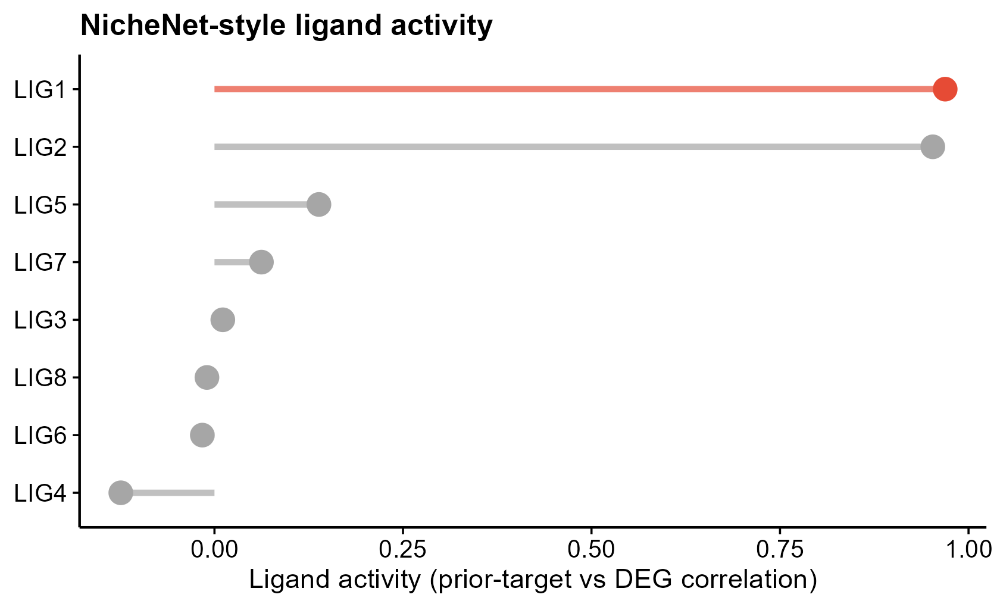
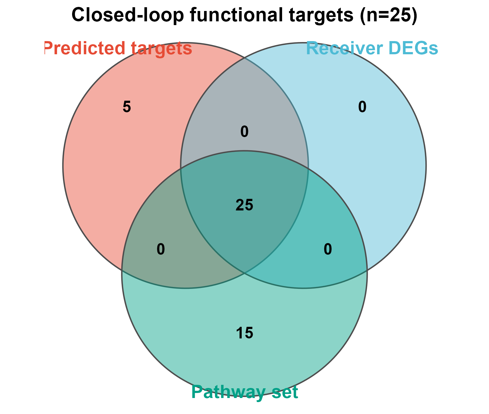

# 509 · Cell-communication functional closed-loop (ligand activity → UCell → enrichment → Venn)

Closes the loop that most cell–cell communication analyses leave open — "you found a
ligand–receptor pair, but did it *do* anything downstream?" — by chaining four
verifiable steps into one consensus target set.

| | |
|---|---|
| Language / deps | R · `ggplot2` (+ shared `theme_pub.R`, uses built-in `venn_pub` + UCell-style scorer) |
| Purpose | Turn LR predictions into evidenced, function-level target genes |
| Input | receiver expr + ligand-target prior + groups (synthetic by default) |
| Output | `results/` activity / scores / consensus; preview in `assets/` |

## Method (the loop)

1. **Ligand activity** (NicheNet-style) — correlate each ligand's prior target weights
   with the receiver-cell DEG log-fold-changes; rank ligands.
2. **UCell single-cell scoring** — score every receiver cell for the top ligand's
   predicted-target signature (rank/U-statistic based), compare near-sender vs distal.
3. **Enrichment** — hypergeometric test of predicted targets among receiver DEGs.
4. **Venn closure** — predicted targets ∩ receiver DEGs ∩ pathway set → the
   **consensus functional targets** worth following up.

## Input

| File | Spec |
|------|------|
| `receiver_expr.csv` | gene × cell expression of the receiver population |
| `ligand_target_prior.csv` | ligand × gene prior weight matrix (NicheNet `ligand_target_matrix`) |
| `receiver_groups.csv` | `cell,group` (e.g. near-sender vs distal) |

Demo data is synthetic (150 genes × 300 cells, 8 ligands, true active = LIG1/LIG2),
generated on first run. **On real data**: replace the prior with NicheNet's
`ligand_target_matrix`, DEGs with `Seurat::FindMarkers` on the receiver cells, and the
pathway set with your MSigDB/KEGG gene set.

## Use

A reusable "did the signal land?" verification to bolt onto CellChat / CellPhoneDB /
NicheNet (modules 051/077): pairs LR inference with cell-level functional scoring and a
defensible consensus gene set, pre-empting the "no functional follow-through" critique.

## Outputs

| File | Type | Description |
|------|------|------|
| `results/ligand_activity.csv` | table | ranked ligand activity |
| `results/ucell_scores.csv` | table | per-cell UCell signature score + group |
| `results/consensus_targets.csv` | table | targets ∩ DEGs ∩ pathway |
| `assets/ligand_activity.png` | lollipop | ranked ligand activity (top highlighted) |
| `assets/ucell_violin.png` | violin+box | predicted-target signature, near vs distal |
| `assets/closedloop_venn.png` | Venn | the closed-loop consensus functional targets |




## Run

```bash
Rscript 509_communication_functional_loop.R
```

## Dependencies

```r
install.packages("ggplot2")   # UCell-style scorer + Venn are built into the module / framework
# real data: BiocManager::install("UCell"); nichenetr from GitHub for the prior matrix
```
