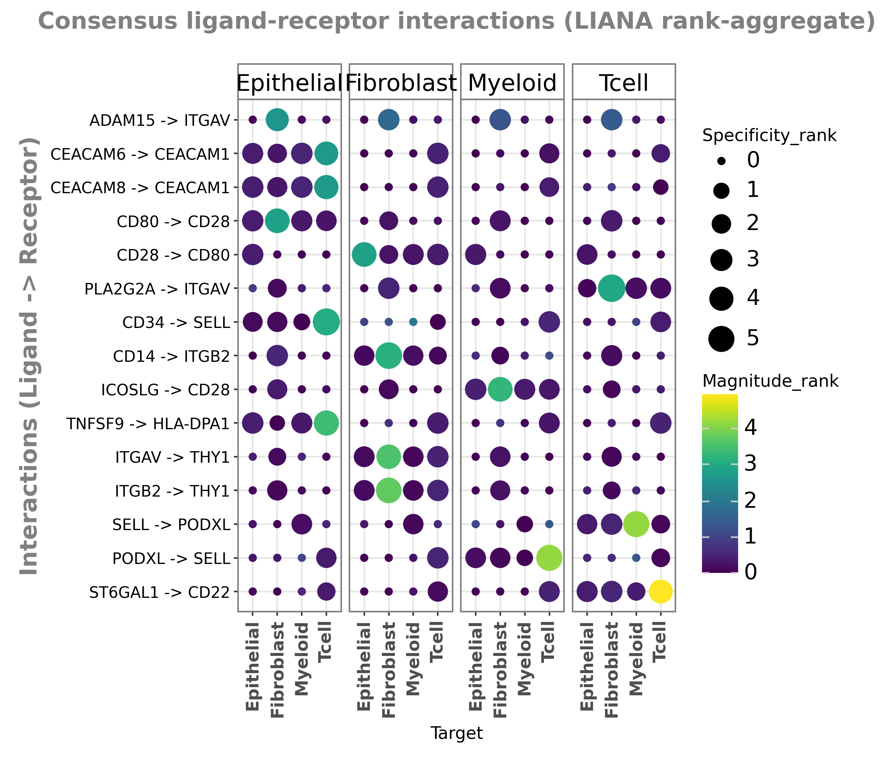
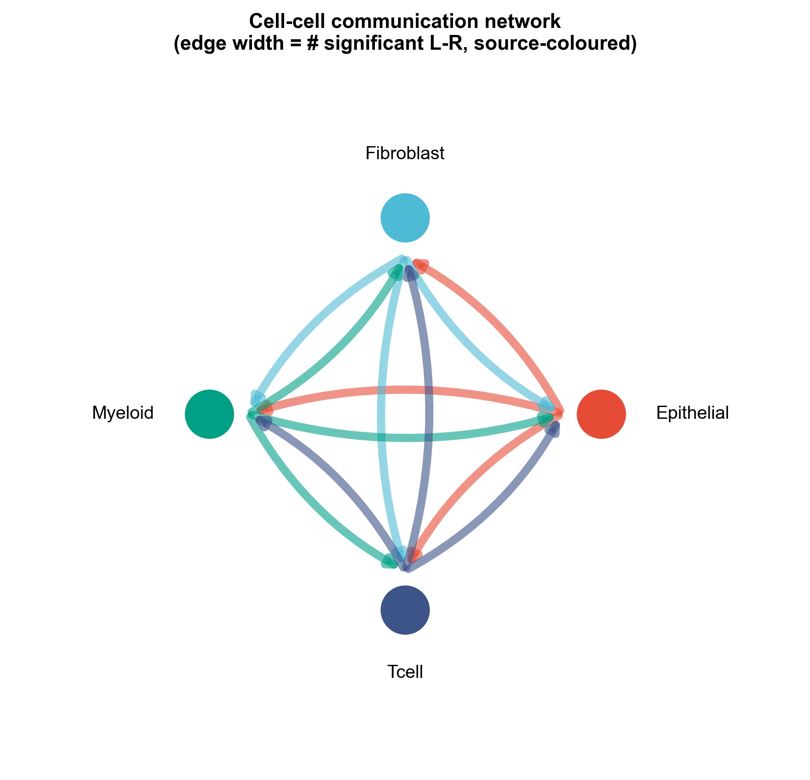
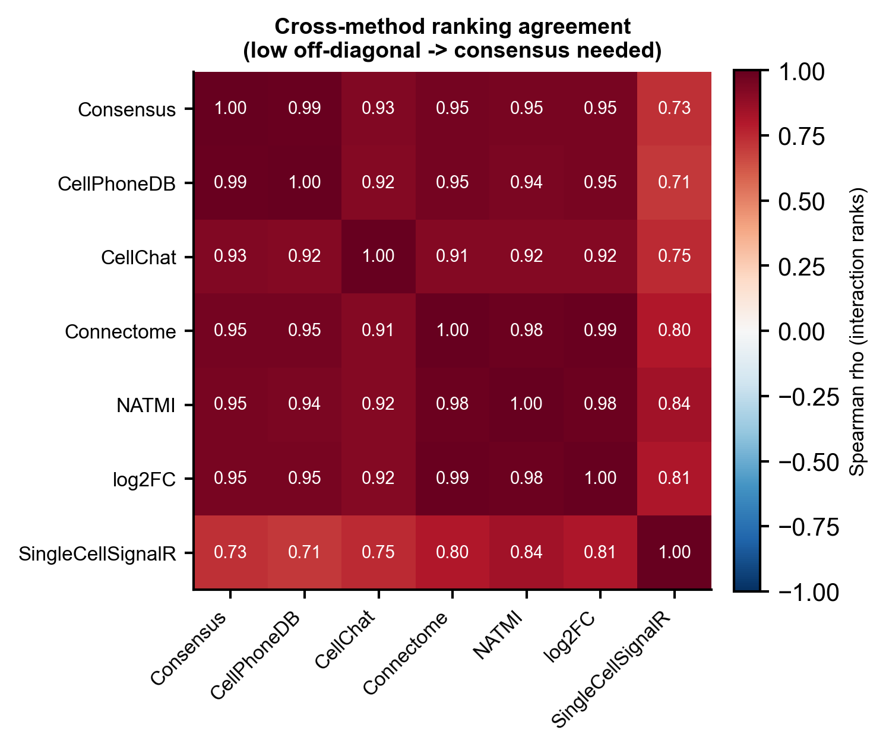
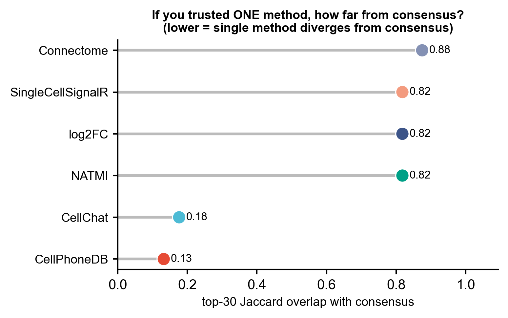
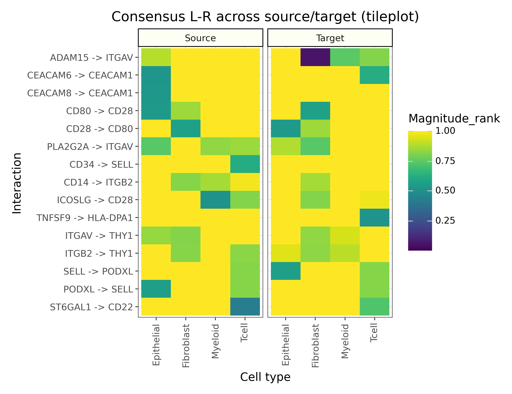

<!-- 图中文字英文,正文中文。 -->

# 531 · LIANA+ 多方法共识细胞-细胞通讯 (Consensus Cell-Cell Communication)

> 一句话定位:输入 **单细胞 AnnData (带细胞类型注释)** → 用 **LIANA+ rank-aggregate** 把 6 个配体-受体打分方法融合成 **共识通讯排名** → 出 **dotplot / 通讯网络 / 跨方法一致性热图 / 共识-vs-单方法 lollipop / source×target tile**,并**诚实地展示"共识比押单一工具更稳健"**。

| | |
|---|---|
| **语言 / 主依赖** | Python · `liana(>=1.7)` `scanpy` `anndata` `plotnine` `scipy` |
| **一句话用途** | 多方法共识细胞通讯 (CCI):统一 CellPhoneDB/CellChat/NATMI/Connectome/SingleCellSignalR/log2FC + RRA 共识 |
| **输入** | `example_data/synthetic_lr.h5ad`(脚本首跑自动生成) |
| **输出** | `results/`(运行生成 CSV) · 展示图见 `assets/` |

---

## ① 输入数据

**文件**:`<name>.h5ad`(AnnData;`.X` = log-normalized 表达,行=细胞、列=基因)

| 字段 | 位置 | 类型 | 必需 | 示例 | 说明 |
|------|------|------|:---:|------|------|
| 表达矩阵 | `adata.X` | float (log1p) | ✔ | — | 已 `normalize_total` + `log1p` |
| 细胞类型 | `adata.obs[groupby]` | category/str | ✔ | `Tcell` | `--groupby` 指定列名,默认 `cell_type` |
| 基因符号 | `adata.var_names` | str | ✔ | `TGFB1` | 须为基因 symbol,供 L-R 资源匹配 |

**命名/格式约定**:基因名须与 LIANA `consensus` 资源的 ligand/receptor symbol 可匹配(人类 symbol)。`.X` 必须是 log-normalized(非原始 counts)。

**样例**:合成数据为 400 细胞 × 160 基因、4 个细胞类型(Tcell / Myeloid / Fibroblast / Epithelial),基因符号取自 LIANA `consensus` L-R 资源,并人为植入两类信号(高特异 / 高幅度)使各方法**真的产生分歧**(`synthetic, for demo only`)。

## ② 方法 / 原理 与 ★诚实基线

**共识流程**:`li.mt.rank_aggregate()` 同时跑 6 个 L-R 方法,各自给出 specificity(特异性)与 magnitude(表达幅度)两类分数,再用 **RRA(Robust Rank Aggregation)** 把多方法排名融合成 `specificity_rank` / `magnitude_rank` 共识(`adata.uns["liana_res"]`)。方法集:**CellPhoneDB · CellChat · Connectome · NATMI · log2FC · SingleCellSignalR**(LIANA+, Dimitrov et al. *Nat Commun* 2022 / *Nat Cell Biol* 2024)。

**★诚实基线(本模块的灵魂,不只报好看指标)**:
1. **跨方法一致性热图**(Fig 3):逐方法对 L-R 排名两两算 Spearman ρ。**off-diagonal 越低 = 单方法之间分歧越大 = 越需要共识**——把分歧如实暴露,而非掩盖。
2. **共识 vs 单方法 top-K Jaccard**(Fig 4):若"只信一个方法",其 top-K L-R 与共识的 Jaccard 重叠有多少。**重叠低 = 押单一工具会系统性漏检**,共识的稳健性以实测 % 报出、不夸大。

## ③ 用途

回答:**在多细胞群体里,哪些配体-受体对、在哪对细胞之间介导了稳健的通讯?** 适用 scRNA-seq 下游的细胞通讯刻画(肿瘤微环境、免疫-基质互作、纤维化生态位等)。共识排名规避了"换一个工具结论就变"的脆弱性。

## ④ 特点 / 亮点

- **turnkey**:一条命令即跑,首跑自动生成合成数据、写 `results/` 与 `assets/`;换数据 `--input your.h5ad --groupby celltype` 即可。
- **真包实跑**:全程调用真实 LIANA+ 1.x API(`li.mt.rank_aggregate` / 6 个 `li.mt.*` / `li.pl.dotplot` / `li.pl.tileplot`),非 stub。
- **★内置诚实基线**:不押单一工具,用一致性热图 + Jaccard lollipop 把"共识更稳健"量化展示。
- **顶刊级图,无平凡条形图**:dotplot / 有向通讯网络 / 发散色热图 / lollipop / 信息密集 tile;每图独立成文件,一次出 PDF+PNG。
- **可复现**:固定 `SEED=42`、脚本相对路径、`results/versions.txt` 锁依赖版本。

## ⑤ 输出结果图

| 文件 | 图型 | 说明 |
|------|------|------|
| `assets/fig1_consensus_dotplot.png` | dotplot | 共识 L-R:点大小=specificity、颜色=magnitude(rank 反转,"好"=大/亮) |
| `assets/fig2_communication_network.png` | 有向网络 | source→target 通讯网络,边宽=显著 L-R 计数,节点按 source 着色 |
| `assets/fig3_cross_method_heatmap.png` | 发散热图 | ★诚实基线1:跨方法排名 Spearman 一致性(低 off-diagonal → 需共识) |
| `assets/fig4_consensus_vs_single_lollipop.png` | lollipop | ★诚实基线2:共识 vs 各单方法 top-K Jaccard 重叠 |
| `assets/fig5_source_target_tileplot.png` | tile | source×target × L-R 的 magnitude(填色)× specificity(格内数字) |







`results/`:`consensus_liana_res.csv`(共识全表)、`method_rank_table.csv`(各方法对每条 L-R 的排名)、`cross_method_spearman.csv`、`consensus_vs_single_topK_jaccard.csv`、`versions.txt`。

---

## 运行

```bash
# 零改动跑示例(首跑自动生成 example_data/synthetic_lr.h5ad)
python 531_liana_consensus_cci.py

# 换成自己的数据(AnnData 已 normalize_total + log1p)
python 531_liana_consensus_cci.py --input data/your.h5ad --groupby cell_type
# 可选: --expr_prop 0.1 --n_perms 1000 --top_n 15 --outdir results/run1
```

## 依赖安装

```bash
pip install "liana>=1.7" scanpy anndata plotnine scipy matplotlib
# 或: conda install -c conda-forge scanpy anndata plotnine; pip install liana
```
纯 CPU 即可跑通示例;真实数据建议 `--n_perms 1000`(置换越多排名越稳)。
