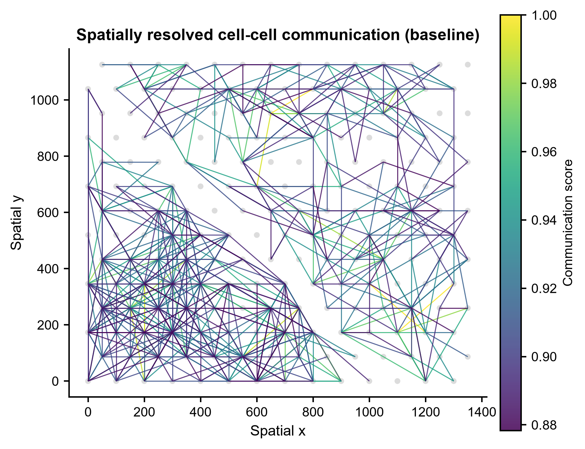
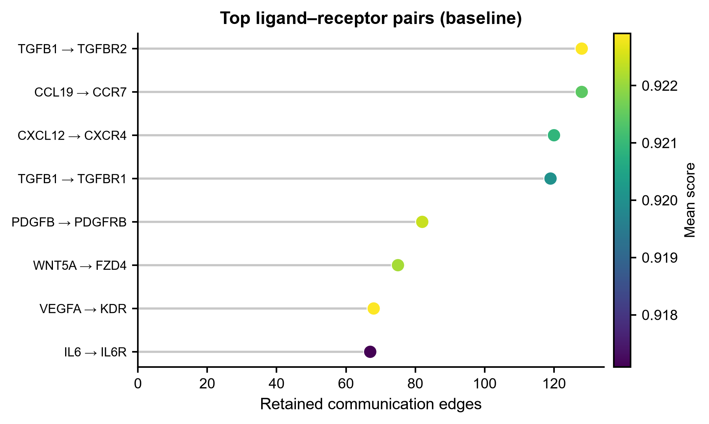
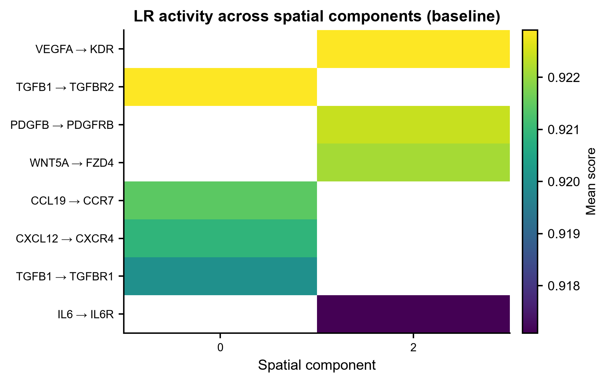
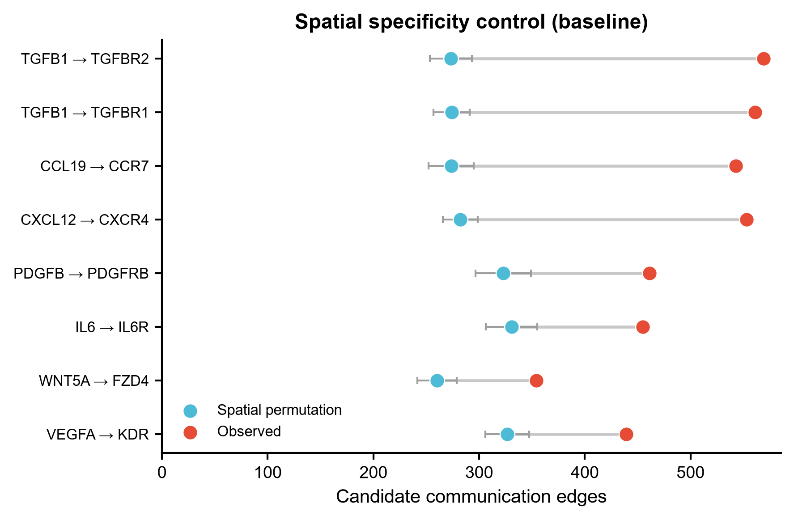

# 576 · CellNEST — 空间转录组细胞通讯(图注意力)

> 一句话定位:输入**空间转录组表达矩阵 + spot 坐标 + 配体-受体数据库** → 推断**空间分辨的细胞通讯边**
> → 出**空间通讯图 / LR lollipop / LR×分量 heatmap / 置换对照 dumbbell**。

| | |
|---|---|
| **语言 / 主依赖** | Python 3.12 · 基线:`numpy` `pandas` `scipy` `scikit-learn` `matplotlib`(本机全有)· CellNEST 本体:Linux + NVIDIA GPU + singularity |
| **一句话用途** | 在组织切片上定位"谁在跟谁说话、说的是哪条配体-受体信号" |
| **输入** | `example_data/spatial_counts.csv` + `spatial_coordinates.csv` + `lr_pairs.csv` |
| **输出** | `results/`(运行生成)· 展示图见 `assets/` |
| **状态** | 🟡 **基线本机零改动跑通并出图**;CellNEST 本体需 Linux GPU 服务器 |

---

## ① 输入数据

**文件 1**:`spatial_counts.csv`(csv;行 = spot,列 = 基因,**原始 counts**,勿归一化/log 化)

| 列名 | 类型 | 必需 | 示例 | 说明 |
|------|------|:---:|------|------|
| `barcode` | str | ✔ | `SPOT_0000` | 行索引,spot 条码 |
| `<基因名>` | int | ✔ | `TGFB1` = 12 | 每个基因一列,原始计数 |

**文件 2**:`spatial_coordinates.csv`(csv;每行一个 spot,顺序须与文件 1 一致)

| 列名 | 类型 | 必需 | 示例 | 说明 |
|------|------|:---:|------|------|
| `barcode` | str | ✔ | `SPOT_0000` | 与表达矩阵行索引对应 |
| `x` / `y` | float | ✔ | `100.0` / `86.6` | 组织坐标(像素或 µm,与 `--spot-diameter` 同单位) |
| `region` | str | ✘ | `A` | 可选注释,仅用于查看,不参与计算 |

**文件 3**:`lr_pairs.csv`(列名与 [CellNEST 官方数据库](https://github.com/schwartzlab-methods/CellNEST/blob/main/database/CellNEST_database.csv) 一致)

| 列名 | 类型 | 必需 | 示例 |
|------|------|:---:|------|
| `Ligand` / `Receptor` | str | ✔ | `TGFB1` / `TGFBR1` |
| `Annotation` | str | ✘ | `Secreted Signaling` |
| `Reference` | str | ✘ | `KEGG: hsa04350` |

**命名/格式约定**:基因名必须与 LR 数据库同一 symbol 体系(默认 HGNC 大写)。坐标行序 = 表达矩阵行序。

**样例(前 3 行)**:
```
# spatial_counts.csv
barcode,CCL19,CCR7,CXCL12,CXCR4,FZD4,IL6,...
SPOT_0000,26,17,25,25,4,17,...
SPOT_0001,22,17,17,17,3,14,...

# spatial_coordinates.csv
barcode,x,y,region
SPOT_0000,0.0,0.0,A
SPOT_0001,100.0,0.0,A

# lr_pairs.csv
Ligand,Receptor,Annotation,Reference
TGFB1,TGFBR1,Secreted Signaling,"synthetic, for demo only"
```

`example_data/` 全部为 **synthetic, for demo only**:196 个蜂窝状 spot 分成 A / B 两个空间区域,
各自富集一组 LR 对(A:TGFB1/CCL19/CXCL12;B:VEGFA/PDGFB/IL6/WNT5A),用来检验管道能否
把边正确地收敛到区域内部 —— 这是本模块自带的"已知答案"阳性对照。

## ② 方法 / 原理

### 基线(默认路径,本机 CPU 即跑)—— 空间受限 LR 共表达乘积

这是"**无注意力下限**":任何声称更好的模型都得先打赢它。预处理规则照搬 CellNEST vignette 的描述,
但**打分本身是共表达乘积,不是 CellNEST 的注意力**。

1. **基因过滤**:至少在 `--filter-min-cell`(默认 5)个 spot 中表达(对应 CellNEST `--filter_min_cell`)。
2. **分位数归一化**:`sklearn.QuantileTransformer(output_distribution='uniform')`。
   *近似,非复刻*:上游用的是 `qnorm.quantile_normalize`(`data_preprocess_CellNEST.py` L113)。
3. **活跃基因**:每个 spot 内取 `--threshold-gene-exp` 分位以上的基因为活跃(CellNEST 默认 98,
   源码 `data_preprocess_CellNEST.py` L35 已核实;合成小数据基因数少,本模块默认 **80**,换真实数据请调回 98)。
4. **空间邻域图**:`scipy.cKDTree` 取半径 `--neighborhood`(默认 `spot_diameter × 4`)内的 spot 对;
   通讯有方向,`i→j` 与 `j→i` 分别成边;`--block-autocrine` 可去掉自环。
5. **打分**:`score(i→j, L→R) = 归一化表达(L @ i) × 归一化表达(R @ j)`,要求两端基因都活跃。
6. **取 top**:按分数排序保留 `--top-percent`(默认 20,同 CellNEST postprocess,源码 L50 已核实)。
7. **连通分量**:`scipy.sparse.csgraph.connected_components` 给出 `component` 列。做法对齐上游
   **可视化步骤**(`output_visualization_CellNEST.py` L291);注意上游 postprocess CSV 里的
   `component` 列是硬编码 `-1`(L284 / L342),那一列本身不含信息。
8. **空间置换对照**:把 spot 的空间位置打乱 20 次(表达谱整体搬家,邻域图结构不变),
   逐 LR 对比较候选边数,给出 `enrichment` 与经验 `p_perm`。
   *注:分位数归一化让分数的边际分布几乎不受置换影响,真正的空间信号体现在**候选边数**上,
   所以对照比的是边数而不是分数 —— 这一点已写进图 4 的设计。*

输出 CSV 采用**与 CellNEST 完全一致的 9 列 schema**,方便两条路的结果互换:
`from_cell, to_cell, ligand, receptor, edge_rank, component, from_id, to_id, attention_score`
(列名核实自 [`output_postprocess_CellNEST.py` L275/L333](https://github.com/schwartzlab-methods/CellNEST/blob/main/output_postprocess_CellNEST.py);
文件名形如 `CellNEST_<SAMPLE>_top20percent.csv`,由 L302 / L399 的 `to_csv(..., header=False)` 写出)。

### CellNEST 本体(守卫式引用封装)

CellNEST 是**命令行流水线**,不是可 import 的 Python 包 —— 官方只在 **Linux (CentOS 7) + NVIDIA P100/V100**
上测试,单次训练约 **13 小时 @ V100**,推荐 5 个种子做 ensemble。**本机(Windows)无法运行**,
所以本模块不假装能跑:`--run-cellnest` 只做环境检查(`cellnest` 命令是否在 PATH / CUDA / 平台),
失败时打印**从官方 vignette 逐字抄录**的真实命令并优雅退出,基线结果照常产出。

模型侧:GATv2 图注意力(`GATv2Conv_CellNEST.py`)在 spot 邻域图上学习,注意力权重即通讯强度;
多次运行按 **rank 乘积**做 ensemble,取 top 20%;并可进一步抽取 **relay(接力)网络**与置信度分数。

**本模块不 import 任何 CellNEST 代码**(上游没有 `setup.py` / `pyproject.toml`,不是可安装的
Python 包),只复用其 **CLI 命令字符串** 与 **输出 CSV schema**。上游许可证:**GNU GPL v3**(`LICENSE`)。

打印出来的每个参数名都对照上游 argparse 逐条核实过(2026-07-21,本地克隆源码):

| 打印的命令 | 参数定义在 |
|---|---|
| `cellnest preprocess` | `data_preprocess_CellNEST.py` L28-L64 |
| `cellnest run` | `run_CellNEST.py` L22-L44 |
| `cellnest postprocess` | `output_postprocess_CellNEST.py` L42-L55 |
| `cellnest visualize` | `output_visualization_CellNEST.py` L88-L120 |
| `cellnest relay_extract` | `extract_relay_cellnest.py` L61-L68 |
| `cellnest relay_confidence` | `relay_confidence.py` L183-L186 |
| 9 列输出 schema | `output_postprocess_CellNEST.py` L275 / L333 |
| GATv2 模型 | `GATv2Conv_CellNEST.py` L19 → `CCC_gat.py` L78-L79 |

### ⚠ 上游文档与实现不一致 / 已知缺陷(原样报告,别踩坑)

- `setup.sh` 内容是 `chmod +x nest; cp nest $HOME/.local/bin/`,但仓库里的脚本叫 **`cellnest`**,
  没有 `nest` 文件 —— 官方 README 让你跑的 `sudo bash setup.sh` 会失败,需手动改名或自己 `cp`。
- `cellnest` 分发脚本 L44 把 `relay_extract` 指向 `extract_relay_nest.py`,而仓库里是
  **`extract_relay_cellnest.py`** —— 该子命令会静默无输出。绕过:直接 `python -u extract_relay_cellnest.py ...`。
- vignette 写「`--neighborhood_threshold` 默认 = `spot_diameter*4`(`--spot_diameter=89.43`)」,
  但源码 L246-251 实际用的是**第一个 spot 到最近邻的距离 × 4**,且 argparse 里**没有 `--spot_diameter` 参数**。
- vignette 写 `--filter_min_cell` 默认 5,argparse L34 实际 `default=1`。
- `cellnest` 只是个 `if/elif` 分发脚本(L3-L57),**没有 `--help` 分支** —— `cellnest --help`
  会静默落空并返回退出码 0,不能用它判断安装是否正常。各子命令的帮助要向下游脚本要,
  例如 `python -u data_preprocess_CellNEST.py --help`。

跑完真实 CellNEST 后,把 `CellNEST_*_top20percent.csv` 喂回来即可复用同一套出图,
并自动与基线做 `edge_rank` 的 Spearman 秩一致性比对:

```bash
python 576_cellnest_spatial_ccc.py --cellnest-csv output/<SAMPLE>/CellNEST_<SAMPLE>_top20percent.csv
```

## ③ 用途

回答的科学问题:**在完整的组织空间背景下,哪些配体-受体信号在哪些位置被激活,方向是谁→谁?**

典型场景:
- 肿瘤微环境中定位免疫-基质通讯热点(论文用的就是 LUAD / PDAC 样本);
- 淋巴结等有清晰解剖分区的组织,找区域特异的趋化因子梯度(如 CCL19→CCR7);
- 纤维化/血管新生边界上的 TGFB / VEGF 信号定位;
- 需要 **relay(A→B→C 接力)** 而不只是成对通讯时,CellNEST 是目前少数直接建模接力的方法。

与库内同类模块的分工(不可互换):

| 模块 | 引擎 | 空间信息 |
|---|---|---|
| 051 CellChat | 通讯概率 + 质量作用定律 | 不用空间,靠细胞类型 |
| 073 COMMOT | 最优传输 | 用空间,但无学习式权重 |
| 531 LIANA | 多方法共识打分 | 主要针对 scRNA |
| **576 CellNEST** | **GATv2 图注意力(需训练)** | **原生空间图 + relay 网络** |

## ④ 特点 / 亮点

- **turnkey**:`python 576_cellnest_spatial_ccc.py` 一条命令跑完,零改动出 4 张图 + 3 张表;
- **不装包也能用**:基线只用本机已有的 numpy/scipy/sklearn/matplotlib,不依赖 CellNEST;
- **自带阳性对照**:合成数据的两区域结构是已知答案,图 3 heatmap 应把两组 LR 分到不同 component
  (实测确实分开:component 0 = A 区 TGFB1/CCL19/CXCL12,component 2 = B 区 VEGFA/PDGFB/WNT5A/IL6);
- **自带阴性对照**:20 次空间置换零模型,给出每个 LR 对的 enrichment 与经验 p;
- **schema 对齐**:输出列与 CellNEST 官方 9 列完全一致,两条路结果可直接互换、可做秩一致性比对;
- **诚实的守卫路径**:不臆造 CellNEST API,环境不满足就打印官方真实命令后优雅退出;
- **顶刊图风格**:统一 `pubstyle`,viridis 连续色,矢量 PDF + 300dpi PNG;**全程无条形图**。

## ⑤ 输出结果图

| 文件 | 图型 | 说明 |
|------|------|------|
| `assets/fig1_spatial_ccc_map.png` | 空间散点 + 线段 | top 通讯边画在组织坐标上,viridis 按通讯分数着色 |
| `assets/fig2_lr_lollipop.png` | lollipop | 各 LR 对保留的边数,点色 = 平均分数 |
| `assets/fig3_lr_component_heatmap.png` | heatmap | LR 对 × 空间连通分量的平均分数 |
| `assets/fig4_permutation_control.png` | dumbbell | 观测 vs 20 次空间置换的候选边数(空间特异性对照) |

表格产物(`results/`,不提交):`baseline_top_ccc.csv`(带表头)、
`baseline_top_ccc_cellnest_schema.csv`(CellNEST 9 列 schema)、
`baseline_lr_summary.csv`、`baseline_permutation_control.csv`、`session_info.txt`(依赖版本 + 本次参数快照);
带 `--cellnest-csv` 时另出 `baseline_vs_cellnest_concordance.csv`。









---

## 运行

```bash
# 零改动跑示例(生成合成数据 + 基线 + 4 张图)
python 576_cellnest_spatial_ccc.py

# 同时把图写进 assets/
python 576_cellnest_spatial_ccc.py --save-assets

# 换成自己的数据(真实数据请把活跃基因阈值调回 CellNEST 默认 98)
python 576_cellnest_spatial_ccc.py \
    --counts data/counts.csv --coords data/coords.csv --lr-db database/CellNEST_database.csv \
    --threshold-gene-exp 98 --filter-min-cell 1 --top-percent 20 --outdir results/run1

# 检查本机能否跑真实 CellNEST(不能则打印官方命令)
python 576_cellnest_spatial_ccc.py --run-cellnest

# 读入真实 CellNEST 输出,复用同一套出图 + 与基线比对秩一致性
python 576_cellnest_spatial_ccc.py --cellnest-csv output/S1/CellNEST_S1_top20percent.csv
```

常用参数:`--spot-diameter`(默认 89.43,Visium)、`--neighborhood`(默认 spot_diameter×4)、
`--block-autocrine`、`--seed`(默认 42,已固定)、`--regen-example`。

## 依赖安装

基线**无需安装任何东西**(numpy / pandas / scipy / scikit-learn / matplotlib 本机已有)。

CellNEST 本体需在 **Linux GPU 服务器**上安装,本机不要尝试:

```bash
# 方式一:官方 singularity 镜像(推荐,免装包)
singularity pull cellnest_image.sif library://fatema/collection/cellnest_image.sif:latest

# 方式二:克隆仓库后安装(需 sudo;无 sudo 则所有命令前加 bash)
git clone https://github.com/schwartzlab-methods/CellNEST.git
cd CellNEST && sudo bash setup.sh
#  ⚠ setup.sh 里写死的文件名是 `nest`,仓库里实际叫 `cellnest`,这一步会失败。
#     手动替代:  chmod +x cellnest && cp cellnest $HOME/.local/bin/
```

上游依赖(`requirements.txt`,仅供参考,本机不要装):`torch==1.13.1+cu117`、
`torch_geometric==2.5.2`、`torch-scatter==2.1.2`、`torch-sparse==0.6.18`、`qnorm==0.8.1`、
`scanpy==1.9.8`、`pygraphviz==1.12`、`altair==5.2.0`。上游许可证 **GNU GPL v3**。

交互式可视化前端:https://github.com/schwartzlab-methods/cellnest-interactive

## 引用

Zohora FT, Paliwal D, Flores-Figueroa E, Li J, Gao T, Notta F, Schwartz GW.
**CellNEST reveals cell-cell relay networks using attention mechanisms on spatial transcriptomics.**
*Nature Methods* 2025;22(7):1505-1519. doi:10.1038/s41592-025-02721-3 · PMID 40481363 · PMC12240806

> 引用已核实:PMID 40481363 经 NCBI E-utilities `esummary` 查询,标题、期刊、卷期页、DOI 与作者列表均对应本文。
