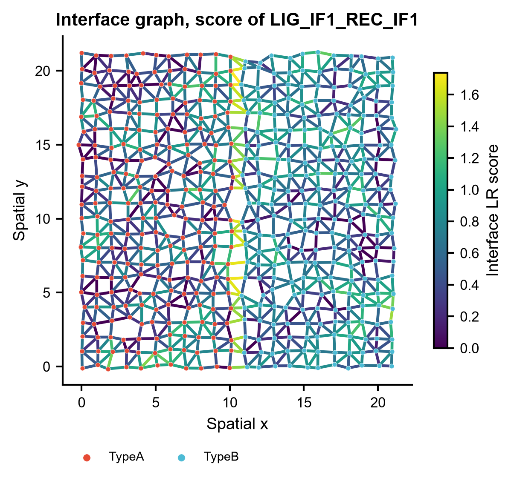
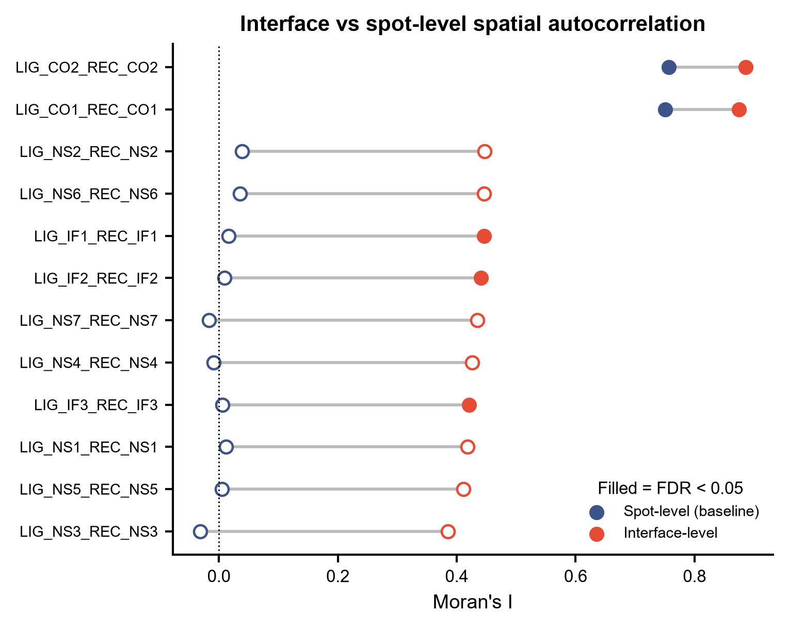
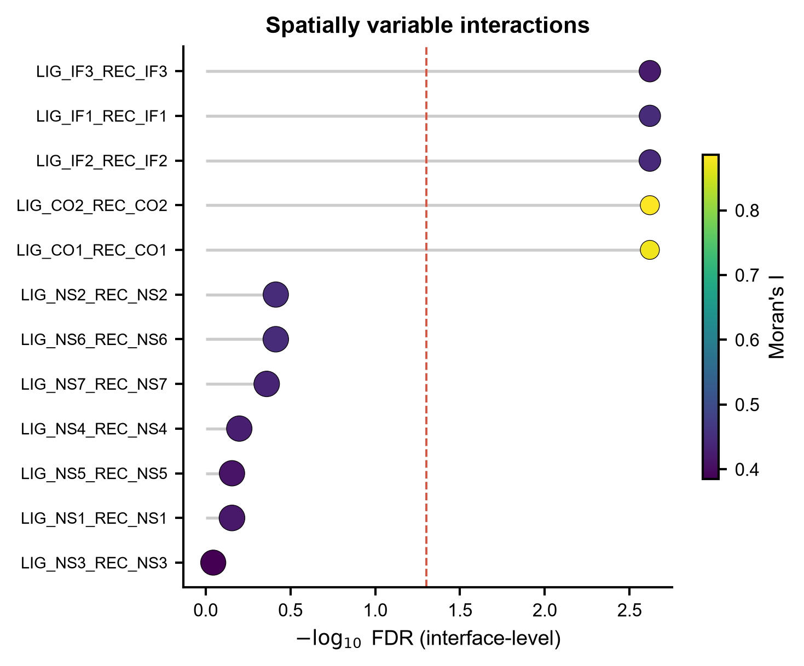

# 577 · SPIDER — interface 层面的空间可变配体-受体互作 (spatially variable LR interactions)

> 输入空间转录组(spot 坐标 + 表达 + LR 对)→ 在**相邻 spot 之间建 interface**、在 interface 上给
> LR 打分并做空间自相关置换检验 → 出 interface 图 / dumbbell 对照 / SVI lollipop / 热图 / 空间分布图。

| | |
|---|---|
| **语言 / 主依赖** | Python 3.12 · `numpy` `pandas` `scipy` `scikit-learn` `matplotlib`(官方路径另需 `spider-st`) |
| **一句话用途** | 找出**空间上分布不均**、且只有在细胞交界面上才成立的配体-受体互作 |
| **输入** | `example_data/expression.csv` + `spot_meta.csv` + `lr_pairs.csv` |
| **输出** | `results/`(运行生成)· 展示图见 `assets/` |
| **状态** | 🟡 诚实基线 + interface 层面最小复现本机跑通;**官方 SPIDER 算法需装包**(见下) |

---

## ① 输入数据

**文件 1**:`spot_meta.csv`(行 = spot)

| 列名 | 类型 | 必需 | 示例 | 说明 |
|------|------|:---:|------|------|
| `spot` | str | ✔ | `S0000` | spot ID,与表达矩阵对齐 |
| `x` / `y` | float | ✔ | `0.037` | 空间坐标(任意单位,只用相对距离) |
| `cell_type` | str | ✔ | `TypeA` | 域/细胞类型注释,用于 interface 分类 |

**文件 2**:`expression.csv`(行 = spot,列 = 基因;首列 `spot`)。归一化后的表达值,非负。

**文件 3**:`lr_pairs.csv`

| 列名 | 类型 | 必需 | 示例 | 说明 |
|------|------|:---:|------|------|
| `ligand` | str | ✔ | `LIG_IF1` | 配体基因名,须在表达矩阵中 |
| `receptor` | str | ✔ | `REC_IF1` | 受体基因名 |

**可选**:`ground_truth.json`(仅合成数据有)——`{"LIG_X_REC_X": "interface_SVI"}`,用于自动算召回。

**命名/格式约定**:三个文件的 `spot` 顺序须一致;CSV 可带 `#` 注释头。

**样例(前 3 行)**:
```
spot,x,y,cell_type
S0000,0.0366,-0.1248,TypeA
S0001,1.0901,0.1129,TypeA
```

## ② 方法 / 原理

**本机可跑路径(默认)** —— 受 SPIDER 思想启发的最小复现 + 朴素对照:

1. **建 interface**:Delaunay 三角剖分取邻接 spot 对 → 丢掉过长边(距离 > 90% 分位)→
   **容量约束**:按边长升序贪心,每个 spot 至多保留 `--max-degree` 条边。每条边的中点即
   interface 坐标,两端 `cell_type` 拼成 `interface_type`(如 `TypeA--TypeB`)。
2. **interface 打分**:边是无向的,两端都可能是配体侧,故取双向几何均值
   `[√(L_i·R_j) + √(L_j·R_i)] / 2`。
3. **SVI 检验**:在 interface 的 kNN 图上算 Moran's I,置换检验取经验 p,BH 校正成 FDR。
4. **基线对照(baseline)**:同一批 LR 对走**不建 interface** 的常规做法——在单个 spot 上算
   `√(L·R)` 共表达打分,在 spot kNN 图上做同样的 Moran's I 检验。两条路线并排报告。

**★ 一个必须讲清楚的统计坑**:置换必须打在 **spot 标签**上,不能打在算好的 interface 打分上。
相邻两条 interface 共用同一个 spot,打分天然相关 —— 直接置换 interface 值,零分布会低估这份
**结构性**自相关,结果是**每一个噪声 LR 对都变成假阳性**(本模块开发时实测:7/7 噪声对全部
FDR<0.05)。改成打散 spot 后重算 interface 打分,零分布保留了共用 spot 的依赖结构,假阳性归零。
这也解释了为什么 `fig2` 里所有 LR 对的 interface Moran's I 都有一个 ~0.4 的结构性下限:
**光看 Moran's I 高低会读错,必须看 FDR**。

**官方 SPIDER 路径(`--run-spider`,需装包)**:调用序列逐字取自官方 README,
`op.prep()` → `op.svi.tf_corr()` → `op.find_svi()` → `op.svi.combine_SVI()`。
官方的容量约束求解(`prep(itermax=...)`)、多概率模型 SVI 检验(SPARK-X / nnSVG / SOMDE / scGCO)
与 TF 下游支持打分**本模块均未复现**,参数含义以官方 README 的 Quick Start 与源码 docstring 为准
(上游仓库**没有** `docs/` 或 `tutorials/` 目录,只有 README Quick Start + CodeOcean capsule;
勿引用不存在的"官方教程页")。

**API 读取来源**(实际抓取的 URL):
- https://raw.githubusercontent.com/deepomicslab/SPIDER/main/README.md
- 免安装试用:https://codeocean.com/capsule/1194038/tree/v1

**API 已逐个比对官方源码签名**(2026-07-20 独立复核,不只看 README):

| 调用 | 官方源码位置 | 核实到的签名 |
|---|---|---|
| `import spider` → `spider.SPIDER()` | `spider/__init__.py` | `from .SPIDER import SPIDER` |
| `op.prep(...)` | `spider/SPIDER.py` | `prep(adata_input, cluster_key='type', is_human=True, cutoff=None, imputation=False, itermax=1000, lr_raw=None, pathway_raw=None, is_sc=False, normalize_total=False)` → `idata` |
| `op.svi.tf_corr(...)` | `spider/svi.py` | `tf_corr(idata, adata, is_human, out_f, threshold=0.3, n_jobs=20, overwrite=False, ...)` |
| `op.find_svi(...)` | `spider/SPIDER.py` | `find_svi(idata, out_f, R_path, abstract=True, overwrite=False, n_neighbors=5, alpha=0.3, threshold=0.01, ..., svi_number=10, n_jobs=10)` → `(idata, meta_idata)` |
| `op.svi.combine_SVI(...)` | `spider/svi.py` | `combine_SVI(idata, threshold, svi_number=10)` → `(svi_df, svi_df_strict)` |

⚠️ **`out_f` 必须以路径分隔符结尾**:官方全程用 f-string 直接拼接,不用 `os.path.join`。
对本地克隆源码实测计数(2026-07-21):`f'{out_f}…'` 全仓 27 处(`SPIDER.py` 13、`svi.py` 13、
`util.py` 1);另 `svi.py` 有 35 处 `f'{work_dir}…'` —— `find_svi`(`SPIDER.py:180`)把 `out_f`
按位置传给 `svi.find_svi`(`svi.py:386`)的 `work_dir`,再下传给 `svi_moran` / `svi_nnSVG` 等。
全仓 `os.path.join` 只有 5 处,全部在 vendored 的 `SpatialDE2/io.py`(spaceranger 读图),
SPIDER 核心模块 0 处。不带分隔符会把文件写到上级目录,且 `find_svi` 用的是**非递归** `mkdir`
(`SPIDER.py:155,159`)。本模块已自动补分隔符。

⚠️ 官方 README 的 Quick Start 直接读 `adata.uns['cluster_key'] / ['is_human'] / ['is_sc']`,
但这三个键**不是 h5ad 标准内容**,缺失即 `KeyError`。本模块改为
命令行(`--cluster-key` / `--is-mouse` / `--is-sc`)> `adata.uns` > 官方源码默认值。

## ③ 用途

回答:**哪些配体-受体互作在组织里空间分布不均,且发生在特定细胞类型的交界面上?**

典型场景:肿瘤-基质边界的旁分泌信号、免疫细胞浸润前沿、发育中相邻区室的诱导信号。
这类信号的共同特征是**配体和受体分处两类细胞**,单个 spot 上永远不共表达 ——
只做 spot 层面共表达打分(CellPhoneDB 式)会系统性漏掉它们,必须建 interface 才看得见。

## ④ 特点 / 亮点

- **turnkey**:一条命令即跑,自动生成合成数据、出全部 5 张图,零外部依赖(不需要装 SPIDER);
- **自带朴素基线**:interface 路线永远和 spot-level 路线并排报告,不单独声称"更好";
- **自带阴性对照**:合成数据里放了 7 对无空间结构的噪声 LR 对,每次运行都报假阳性数
  (当前 `interface_level_FP: 0`),管道跑偏能立刻发现;
- **统计上做对了置换**(见 ② 的坑),这是本模块与"随手写个 Moran's I"的关键区别;
- **顶刊级图,无条形图**:散点网络 / dumbbell / lollipop / heatmap,矢量 PDF + 300dpi PNG。

## ⑤ 输出结果图

| 文件 | 图型 | 说明 |
|------|------|------|
| `assets/fig1_interface_graph.png` | 空间网络散点 | interface 图,边着色为 LR 打分;自动挑"只有 interface 层面显著"的对 |
| `assets/fig2_moran_dumbbell.png` | dumbbell | 同一 LR 对 spot-level vs interface-level 的 Moran's I;实心 = FDR<0.05 |
| `assets/fig3_svi_lollipop.png` | lollipop | interface 层面 SVI 显著性排序,点大小 = 平均打分,颜色 = Moran's I |
| `assets/fig4_interface_type_heatmap.png` | heatmap | LR 对 × 细胞类型对的平均打分(行 z-score) |
| `assets/fig5_interface_score_maps.png` | 散点图 | top SVI 与 null 对的 interface 打分空间分布对照 |

`results/`:`interfaces.csv`(interface 表)、`svi_results.csv`(每个 LR 对两条路线的 I/p/FDR)、
`577_summary.json`(参数 + 阴性对照统计 + top SVI)。







---

## 运行

```bash
# 零改动跑示例(首次运行自动生成 example_data/)
python 577_spider_spatial_ccc.py

# 换成自己的数据
python 577_spider_spatial_ccc.py --datadir data/my_spatial --outdir results/run1

# 调参
python 577_spider_spatial_ccc.py --max-degree 8 --k-neighbors 8 --n-perm 1999

# 官方 SPIDER 路径(需装包 + .h5ad)
python 577_spider_spatial_ccc.py --run-spider --adata data/sample.h5ad --r-path /usr/lib/R/bin \
    --cluster-key cell_type --is-sc          # 小鼠数据加 --is-mouse
```

冒烟测试(本机 Windows / Python 3.12,`python 577_spider_spatial_ccc.py`,退出码 0):
484 spots × 24 genes × 12 LR 对 → 1235 条 interface;
interface 路线召回 5/5 真阳性、假阳性 0;spot-level 基线召回 2/5(只捞到同 spot 共表达的两对)、
假阳性 0。即 3 对跨细胞类型的互作**只有建 interface 才找得到**。

## 依赖安装

本机可跑路径无需额外安装(numpy / pandas / scipy / scikit-learn / matplotlib 已具备)。

官方 SPIDER(未在本机安装,以下命令抄自官方 README,**未经本机验证**):

```bash
conda create -n spider python=3.8
conda activate spider
conda install -c conda-forge somoclu fa2
pip install Cython
SKLEARN_ALLOW_DEPRECATED_SKLEARN_PACKAGE_INSTALL=TRUE pip install sklearn
pip install scgco
pip install spider-st
# 可选 R 端 SVI 检验器
# BiocManager::install(c("SpatialExperiment","scran","nnSVG")); devtools::install_github('xzhoulab/SPARK')
```

## 与同类模块的区别

| 模块 | 层级 | 关注点 |
|---|---|---|
| 051 CellChat / 531 LIANA | 细胞类型层面 | 哪两类细胞在通讯(无空间坐标) |
| 073 COMMOT | spot 层面 + 最优传输 | 信号的空间传输方向与距离 |
| **577 SPIDER** | **interface(spot 对)层面** | **互作本身在空间上是否可变、发生在哪种交界面** |

## 引用

Li S, Wang R, Liu S, Li SC. Finding spatially variable ligand-receptor interactions with
functional support from downstream genes. *Nature Communications* 2025;16.
doi:10.1038/s41467-025-62988-0 · PMID 40841363

引用已核实(2026-07-21 复核):PMID 40841363 经 NCBI E-utilities esummary 确认 ——
标题 "Finding spatially variable ligand-receptor interactions with functional support from
downstream genes"、Nature communications、vol 16、2025 Aug 21、作者 Li S / Wang R / Liu S / Li SC、
DOI 10.1038/s41467-025-62988-0、PMC12371056,与上文完全一致。

上游许可证:**MIT**(`LICENSE`,Copyright (c) 2023 DeepOmics Lab);上游包版本
`spider/version.py` = `1.0.0`。本模块不分发上游代码,只做守卫式调用。
