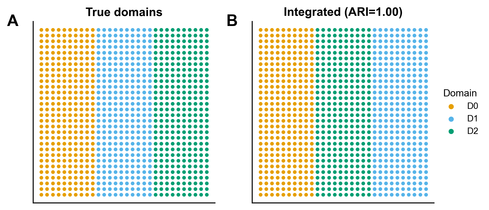

# 521 · SpatialGlue spatial multi-omics integration

Identifies spatial domains by integrating spatial multi-omics (e.g. RNA + protein/ATAC).
The real **SpatialGlue** uses a graph neural network with cross-modality attention; this
turnkey ships a **runnable honest baseline** (single-modality vs simple concat-PCA
integration, scored by ARI against ground truth) plus the real-package call for the server.

| | |
|---|---|
| Language / deps | Python · `numpy` `scikit-learn` `matplotlib` (+ `pubstyle.py`); real version needs **SpatialGlue** + torch-geometric |
| Purpose | Spatial-domain detection from spatial multi-omics |
| Input | synthetic 30×30 spatial grid, RNA(60) + ADT(20), 3 complementary domains |
| Output | `results/` ARI + domains; `assets/` spatial map + ARI lollipop |

## Method (baseline shipped here)

Cluster each modality alone, and an integrated representation (per-modality PCA scaled by
its PC1 std, concatenated → k-means). Domain recovery scored by **ARI** vs ground truth.
The synthetic modalities are **complementary** (RNA separates domain 0; protein separates
domain 2), so neither alone recovers all 3 domains (ARI ≈ 0.5) but integration does
(ARI ≈ 1.0) — demonstrating the value of multi-omics integration.

## ⚠️ Full version on the server (GPU)

The baseline above is **not** SpatialGlue — it shows why integration helps and gives an
honest yardstick. The real GNN must be installed and run on the analysis server (GPU):

```bash
# install on server (GPU); torch + torch-geometric required
pip install SpatialGlue torch torch-geometric   # use a domestic mirror if pip stalls
```
```python
from SpatialGlue.preprocess import construct_neighbor_graph
from SpatialGlue.SpatialGlue_pyG import Train_SpatialGlue
data  = construct_neighbor_graph(adata_rna, adata_adt, datatype='SPOTS')
model = Train_SpatialGlue(data, datatype='SPOTS')
emb   = model.train()           # -> emb['SpatialGlue']; then mclust/k-means for domains
```

**Honest-baseline rule (two knives):** always report the simple concat-PCA baseline
alongside the GNN — a GNN that cannot beat it is not worth the complexity.

## Outputs

| File | Type | Description |
|------|------|------|
| `results/domain_recovery_ARI.csv` | table | ARI of RNA-only / protein-only / integrated |
| `results/spatial_domains.csv` | table | per-spot true + integrated domain |
| `assets/spatial_domains.png` | spatial scatter | true vs integrated domains |
| `assets/ari_lollipop.png` | lollipop | integration vs single-modality ARI |



## Run

```bash
python 521_spatialglue_multiomics.py
```

## Dependencies

```bash
pip install numpy scikit-learn matplotlib          # baseline (runs locally)
pip install SpatialGlue torch torch-geometric      # full GNN (server / GPU)
```
