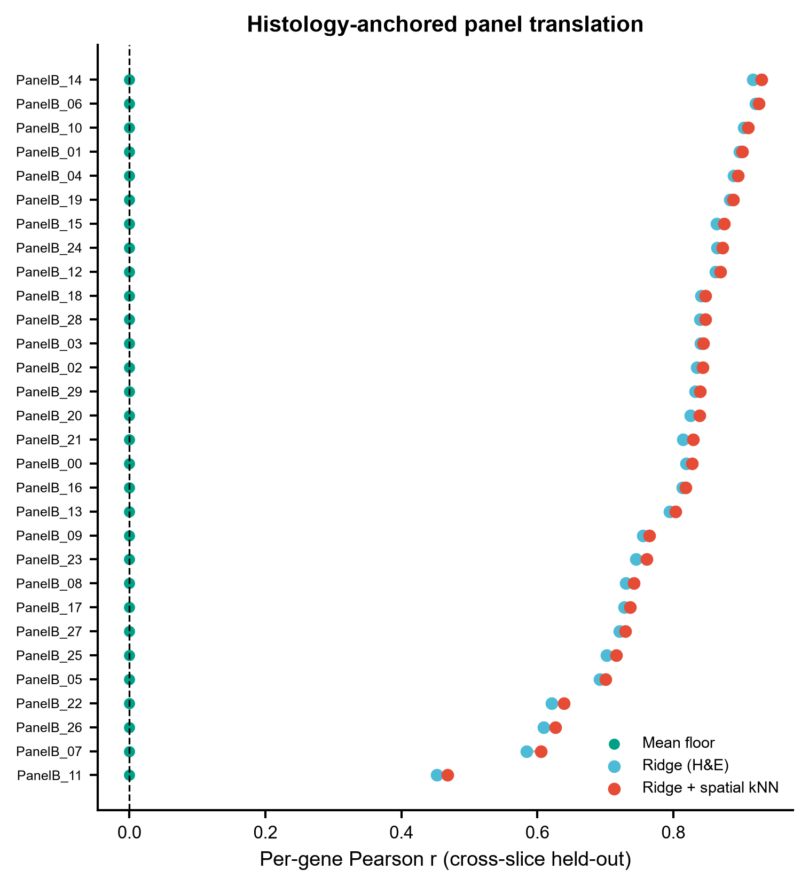
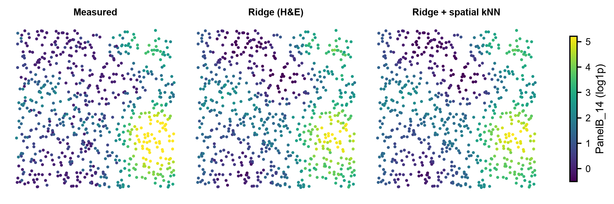
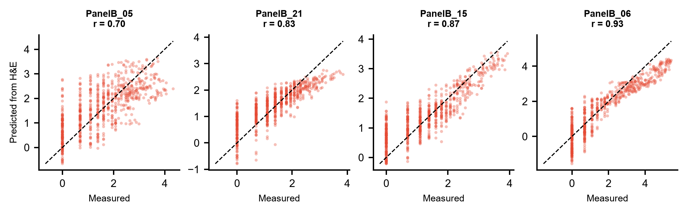
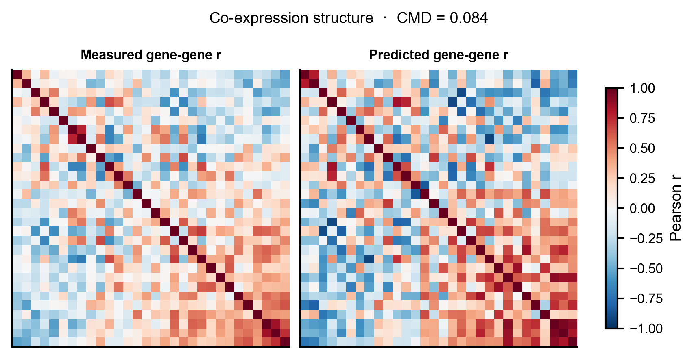

# 578 · SpatialEx / SpatialEx+ —— 组织学锚定的空间组学跨模态翻译

> 输入两张连续切片的 **H&E embedding + 各自测到的一个组学 panel** → 用组织学当"锚"把 panel
> 互相翻译到对方切片上(panel 对角整合)→ 出逐基因 PCC dumbbell、预测-真值散点、空间还原三联图、
> 共表达结构 heatmap。**自带可跑基线**,不装上游包也能跑完出图。

| | |
|---|---|
| **语言 / 主依赖** | Python 3.12 · 基线:`numpy` `pandas` `scikit-learn` `matplotlib`;上游:`SpatialEx`(需 GPU) |
| **一句话用途** | 把只在切片 A 上测到的组学 panel,借 H&E 形态学翻译到只有 H&E 的切片 B 上 |
| **输入** | `example_data/slice{1,2}_{coords,he,panelA,panelB}.csv` |
| **输出** | `results/`(指标表 + 逐基因 PCC) · 展示图见 `assets/` |
| **状态** | 🟡 诚实基线本机零改动跑通出图;完整 SpatialEx(HGNN)需装包 + GPU |

---

## ① 输入数据

四类 CSV × 两张切片,行 = 细胞(`cell_id` 为索引),文件首行是 `# synthetic, for demo only` 注释行
(读取时 `pd.read_csv(..., comment="#")`)。

| 文件 | 列 | 类型 | 必需 | 说明 |
|------|----|------|:---:|------|
| `slice{s}_coords.csv` | `cell_id`,`x`,`y` | str,float,float | ✔ | 细胞空间坐标(对应 `adata.obsm['spatial']`) |
| `slice{s}_he.csv` | `cell_id`,`HE000`…`HE063` | str,float | ✔ | H&E patch embedding(对应上游 `adata.obsm['he']`) |
| `slice{s}_panelA.csv` | `cell_id`,`PanelA_00`… | str,float | ✔ | panel A 表达(log1p) |
| `slice{s}_panelB.csv` | `cell_id`,`PanelB_00`… | str,float | ✔ | panel B 表达(log1p) |

**命名/格式约定**:两张切片的同名 panel 必须**基因列名完全一致**(才谈得上跨切片翻译);
`cell_id` 在切片内唯一,跨切片可不同。

**对角整合设定**:脚本只把 `slice1_panelA` 与 `slice2_panelB` 当作"测到的";
另外两个文件是**留出真值**,仅在评估阶段读取,训练完全没见过 —— 无数据泄漏。

**样例(前 3 行)**:
```
# synthetic, for demo only -- generated by 578_spatialex_omics_translation.py
cell_id,PanelB_00,PanelB_01,PanelB_02
S1_C0000,0.6931,2.1972,1.9459
```

示例数据由脚本合成:先在切片上叠加随机高斯基函数造出**空间平滑的潜在组织程序**,
H&E embedding 与两个 panel 都是这批程序的投影(各带噪声),逐基因耦合强度随机 ——
所以"形态学能预测表达"在合成数据里成立,且基因间有难易差异,不是全部一样好。

## ② 方法 / 原理

**上游 SpatialEx 在做什么**:以 H&E 图像为共享锚点,用超图神经网络(HGNN)学 H&E patch
表征 → 组学 panel 的映射;SpatialEx 训练两张切片各自的模型再交叉推断缺失 panel,
SpatialEx+ 用 cycle 式回归映射头做 panel / omics 对角整合(转录组-蛋白组、转录组-代谢组)。

**本模块的可跑基线(默认路径,CPU,3 步)**:

1. **跨切片岭回归**:在 slice1 上用 `StandardScaler` + `Ridge` 学 H&E embedding → panel A,
   直接应用到 slice2,与 slice2 的留出真值比;panel B 方向对称。
2. **空间 kNN 平滑**:把预测值在空间最近邻(默认 k=7,与上游 `num_neighbors` 默认一致)上做
   加权平均,近似上游超图的邻域聚合。**只平滑预测、不碰真值**。
3. **均值地板对照**:不看 H&E、一律预测训练切片的基因均值。任何"翻译有效"的说法必须先超过它。

指标沿用上游 `utils.Compute_metrics`(`SpatialEx/utils.py:63`)支持的量:**PCC**、**cosine**、
**CMD**(cosine matrix distance,比较基因-基因相关结构,抓逐基因 PCC 抓不到的共表达关系)。
CMD 公式与上游一致(`utils.py:100-107`,`1 - tr(R_pred·R_true)/(‖R_pred‖_F‖R_true‖_F)`);
PCC 与上游同为**逐基因**(`axis=0`)。
⚠️ 一处不同:上游 cosine 也按 `axis=0` 算(逐基因),本模块的 `per_cell_cosine` 按 `axis=1`
算**逐细胞**,是本模块自选的补充视角,不是上游口径。上游未实现 SSIM 之外的逐细胞指标。

> ⚠️ 诚实声明:基线是**线性回归,不是 SpatialEx 的 HGNN 复现**。它的角色是地板,不是替代品。

**上游路径(`--run-spatialex`,需装包 + GPU)** —— 以下调用序列核实自上游源码
(`SpatialEx/__init__.py`、`SpatialEx.py`、`preprocess.py`)与 readthedocs Tutorial 1 渲染页:

```python
import SpatialEx as se
adata = se.pp.Read_Xenium(h5_path, obs_path);  adata = se.pp.Preprocess_adata(adata)
img, scale = se.pp.Read_HE_image(img_path)
adata = se.pp.Register_physical_to_pixel(adata, transform_mtx, scale=scale)
he_patches, adata = se.pp.Tiling_HE_patches(resolution, adata, img)
adata = se.pp.Extract_HE_patches_representaion(he_patches, adata=adata,
                                               image_encoder='uni', device=device, store_key='he')
graph = se.pp.Build_hypergraph_spatial_and_HE(adata, num_neighbors, graph_kind='spatial', return_type='crs')
m = se.SpatialEx(adata1, adata2, graph1, graph2, epochs=500, device=device)
m.train();  panelB1, panelA2 = m.auto_inference()
# SpatialEx+ : se.SpatialExP(...) -> train() -> inference_direct() / inference_indirect() / auto_inference()
# 百万细胞 : se.SpatialExP_Big(...)
```

导出符号已核实:`se.pp`、`se.SpatialEx`、`se.SpatialExP`、`se.SpatialExP_Big`。
`Extract_HE_patches_representaion` 默认 `image_encoder='uni'`(`preprocess.py:140` 的默认值)。
UNI 权重上游是从**本地目录**加载(`utils.py:205` 硬编码了作者机器上的路径),仓库里被注释掉的
`hf_hub_download("MahmoodLab/UNI", filename="pytorch_model.bin", ...)` 表明权重来自 HuggingFace
`MahmoodLab/UNI`(该仓库为 gated,需申请)。**换本机跑必须自行改这个路径** —— 上游没有做成参数。

读 API 的实际来源(每个符号的源码定位):

| 调用 | 源码位置 |
|---|---|
| `se.pp` / `se.SpatialEx` / `se.SpatialExP` / `se.SpatialExP_Big` | `SpatialEx/__init__.py:1-4` |
| `pp.Read_Xenium(h5_path, obs_path)` | `preprocess.py:36` |
| `pp.Preprocess_adata(adata, cell_mRNA_cutoff=10, ...)` | `preprocess.py:45` |
| `pp.Read_HE_image(img_path, suffix='.ome.tif')` → `(image_data, scale)` | `preprocess.py:67`(return 于 `:94`) |
| `pp.Register_physical_to_pixel(adata, transform_matrix, scale=1, ...)` | `preprocess.py:97` |
| `pp.Tiling_HE_patches(resolution, adata, img, key='image_coor')` → `(patches, adata)` | `preprocess.py:122`(return 于 `:137`) |
| `pp.Extract_HE_patches_representaion(he_patches, store_key=None, adata=None, image_encoder='uni', device='cuda')` | `preprocess.py:140` |
| `pp.Build_hypergraph_spatial_and_HE(adata, num_neighbors=7, ..., graph_kind='spatial', return_type='coo')` | `preprocess.py:351`(`return_type` 合法值 `'coo'`/`'crs'`) |
| `se.SpatialEx(adata1, adata2, graph1, graph2, epochs=500, device=...)` | `SpatialEx.py:39`(`__init__` 于 `:85`) |
| `.train()` / `.inference(he, graph, panel)` / `.auto_inference()` → `(panel_1b, panel_2a)` | `SpatialEx.py:144` / `:194` / `:238` |
| `se.SpatialExP(...)` + `.inference_direct()` / `.inference_indirect()` / `.auto_inference()` | `SpatialEx.py:297`,方法 `:481` / `:522` / `:573` |
| `se.SpatialExP_Big(...)`(百万细胞,`SpatialEx.py:11` 文档串 "for millons cells") | `SpatialEx.py:610` |
| `utils.Compute_metrics(x, x_prime, metric=..., reduce='mean', graph=None)` | `utils.py:63`(`'pcc'`/`'cosine_similarity'`/`'rmse'`/`'ssim'`/`'cmd'`) |
| `image_encoder='uni'` 等合法取值 | `utils.py:181` `create_ImageEncoder`(resnet50/101/152、vit_*、uni、conch、prov-gigapath、phikon) |

同一序列在官方 Tutorial 1 中逐行出现(已实际抓取该页核对):
- `https://spatialex-tutorials.readthedocs.io/en/latest/Tutorial%201%20SpatialEx%20Translates%20Histology%20to%20Omics%20at%20Single-Cell%20Resolution_v2.html`
- 文档站共 5 篇教程(Installation / API / Tutorial 1-5),Tutorial 3 为百万细胞扩展性,
  Tutorial 4/5 分别为转录组-蛋白组、转录组-代谢组的 omics 对角整合。

## ③ 用途

回答的科学问题:**在只做了 H&E 的切片上,能不能"补出"没测的组学 panel?**

典型场景:
- **扩 panel**:Xenium/CosMx 探针数受限,把不同切片测的不同 panel 合成一个大 panel;
- **跨模态补全**:一张切片测转录组、另一张测蛋白组/代谢组,借 H&E 对齐成空间多组学;
- **省钱**:队列里只有少数切片做空间组学,其余靠 H&E 外推;
- **可行性预判**:先用本模块的基线看"H&E 到底携带多少该 panel 的信息" —— 如果连岭回归都接近
  均值地板,说明这批数据的形态-表达耦合太弱,上 HGNN 大概率也救不回来。

## ④ 特点 / 亮点

- **turnkey**:`python 578_spatialex_omics_translation.py` 一条命令,自动生成合成数据 → 跑基线 → 出 4 张图;
- **强制基线**:均值地板 / 纯 H&E 岭回归 / +空间平滑 三档并列,上游方法必须超过它们才算数;
- **无泄漏评估**:训练与评估在**不同切片**,留出 panel 训练时不可见 —— 这才是上游宣称的能力;
- **指标对齐上游**:PCC + cosine + CMD,其中 CMD 专门查共表达结构是否被还原;
- **守卫式上游封装**:未装包/无 GPU 时明确打印原因与真实安装命令,绝不静默降级、绝不臆造 API;
- **顶刊图规范**:统一 `pubstyle`,矢量 PDF + 300dpi PNG,**全程无条形图**(dumbbell / 散点 / 空间图 / heatmap)。

示例数据上的基线结果(`results/578_metrics.csv`,panel B → slice1 方向):

| 方法 | median gene PCC | mean cell cosine | CMD |
|---|---|---|---|
| Mean floor | 0.000 | 0.793 | 0.804 |
| Ridge (H&E) | 0.822 | 0.935 | 0.082 |
| Ridge + spatial kNN | **0.834** | **0.938** | 0.084 |

## ⑤ 输出结果图

| 文件 | 图型 | 说明 |
|------|------|------|
| `assets/578_gene_pcc_dumbbell.png` | dumbbell | 逐基因 PCC:均值地板 → Ridge → Ridge+空间平滑 的移动 |
| `assets/578_pred_vs_measured_scatter.png` | 散点 | 预测 vs 真值,按 PCC 分位取代表基因(不只挑最好的) |
| `assets/578_spatial_translation.png` | 空间散点三联 | 同一基因的真值 / Ridge / Ridge+空间,看空间结构是否还原 |
| `assets/578_coexpression_heatmap.png` | heatmap | 真值 vs 预测的基因-基因相关矩阵,标注 CMD |

`results/` 另有 `578_metrics.csv`、`578_gene_pcc_*.csv`、`578_summary.json`(含参数与随机种子)。









---

## 运行

```bash
# 零改动跑示例(自动生成合成数据)
python 578_spatialex_omics_translation.py

# 换成自己的数据(目录内需含 slice{1,2}_{coords,he,panelA,panelB}.csv)
python 578_spatialex_omics_translation.py --datadir data/mydata --outdir results/run1

# 调参
python 578_spatialex_omics_translation.py --ridge-alpha 1.0 --knn 15 --smooth-alpha 0.3

# 重新生成合成示例数据
python 578_spatialex_omics_translation.py --regen-example-data

# 检测上游 SpatialEx 是否可用(需装包 + GPU;不可用会说明原因并只跑基线)
python 578_spatialex_omics_translation.py --run-spatialex
```

随机种子固定为 0;所有路径均为脚本相对路径,无 `setwd` / 绝对路径。

## 依赖安装

基线所需(`numpy` `pandas` `scikit-learn` `matplotlib`)本机已具备,**无需安装**。

上游完整方法(本机未安装,走守卫路径):

```bash
pip install SpatialEx      # 上游推荐按 requirements.txt 顺序装以避免冲突
                           # anndata 0.8.0 / scanpy 1.9.3 / numpy 1.23.5 / pandas 2.0.3
                           # cellpose 3.0.10 / scikit-image 0.21.0 / torch 2.3.1 等
```

注意上游 pin 的 `numpy 1.23.5` / `anndata 0.8.0` 与本机 `numpy 2.4.6` / `anndata 0.12.14` 冲突,
**建议装在独立 conda 环境或服务器上**,不要污染本机主环境。
另需 `image_encoder='uni'` 的 UNI 病理基础模型权重(需在 HuggingFace 申请)。

## 引用

Liu Y, Wang C, Wang Z, Chen L, Li Z, Song J, Zou Q, Gao R, Qian B, Feng X, Guan R, Yuan Z.
**High-parameter spatial multi-omics through histology-anchored integration.**
*Nature Methods* 2026 Feb;23(2):373-386. doi:[10.1038/s41592-025-02926-6](https://doi.org/10.1038/s41592-025-02926-6) · PMID 41407925

> 引用已核实:NCBI E-utilities `efetch`(PMID 41407925,rettype=abstract)返回
> "Nat Methods. 2026 Feb;23(2):373-386. doi: 10.1038/s41592-025-02926-6. Epub 2025 Dec 17."、
> 标题 "High-parameter spatial multi-omics through histology-anchored integration."、
> 作者 Liu Y … Yuan Z(前三位并列一作),与上游仓库 README 的 BibTeX 一致。
> (仓库 BibTeX 自标 `year={2025}`,对应 Epub 2025-12-17;正式刊期为 2026 Feb。)
>
> 摘要原文对本模块相关表述的支撑(逐句取自 efetch 返回):SpatialEx
> "combines a pretrained hematoxylin and eosin foundation model with hypergraph and
> contrastive learning to predict single-cell omics from histology";SpatialEx+
> "further introduces an omics cycle module that encourages cross-omics consistency via
> slice-invariant mappings"。摘要**未给出**基础模型的预训练规模数字,本模块因此不作任何
> "预训练了 N 张切片 / N 个样本"之类的陈述。许可证:上游 `LICENSE` + `setup.py` 标注 **MIT**。

仓库 https://github.com/KEAML-JLU/SpatialEx · 教程 https://spatialex-tutorials.readthedocs.io
