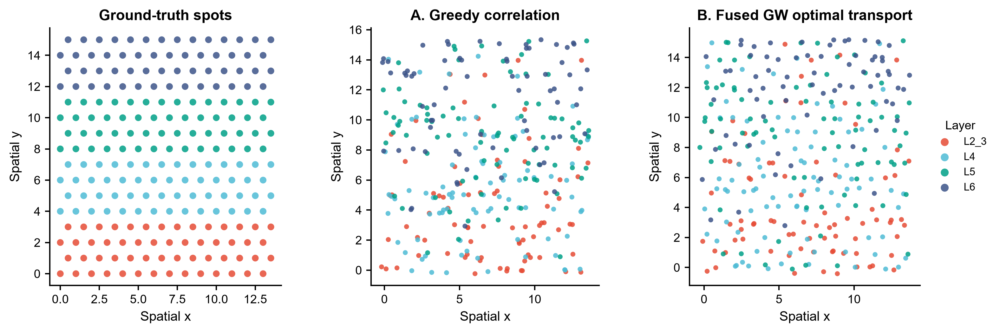
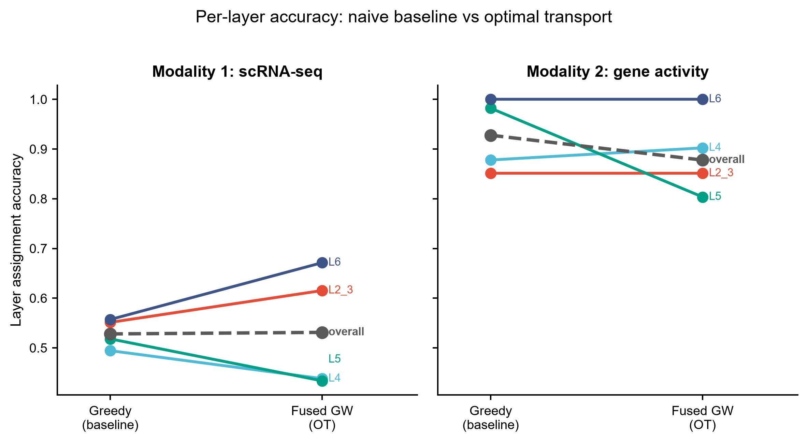
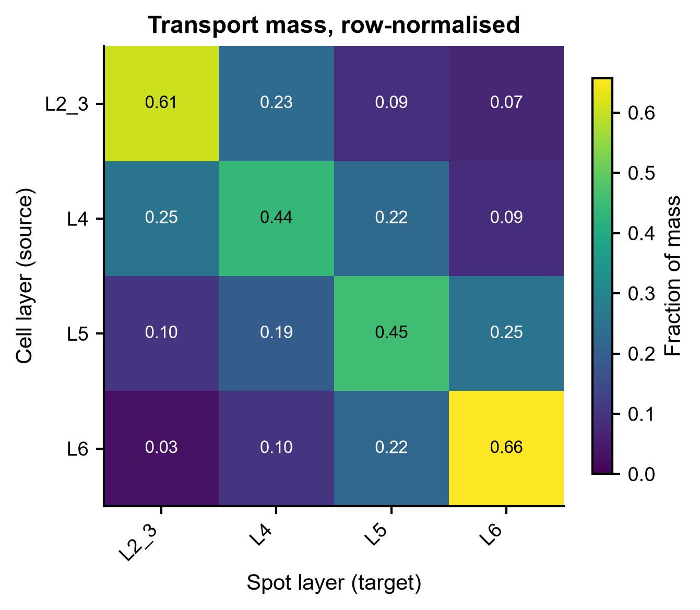
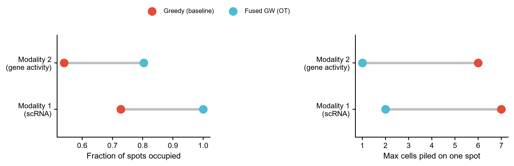

# 579 · SIMO — 单细胞多组学到空间的概率对齐

> 输入一张空间转录组切片 + 两个单细胞模态(RNA / 非转录组)→ 用最优传输把细胞概率性地
> 分配到 spot → 出空间映射图、准确率 slopegraph、传输质量热图、空间占用 dumbbell。

| | |
|---|---|
| **语言 / 主依赖** | Python 3.12 · `numpy` `pandas` `scipy` `scikit-learn` `POT` `matplotlib`;SIMO 正牌路线需 `simo-omics` |
| **一句话用途** | 把没有空间坐标的单细胞多组学(scRNA、scATAC、甲基化)映射到空间切片上 |
| **输入** | `example_data/` 下 5 个 CSV(1 张 ST + 2 个单细胞模态) |
| **输出** | `results/`(运行生成) · 展示图见 `assets/` |
| **状态** | 🟡 朴素基线 + OT 参照本机零改动跑通出图;**SIMO 本体未安装,走守卫路径** |

---

## ① 输入数据

**`st_expression.csv`** — 空间转录组表达(行=spot,列=基因,原始 counts)

| 列名 | 类型 | 必需 | 示例 | 说明 |
|------|------|:---:|------|------|
| (index) | str | ✔ | `spot0000` | spot ID,须与 `st_coords.csv` 的 `spot` 一致 |
| `Gene000`… | int | ✔ | `31` | 该 spot 的基因 counts |

**`st_coords.csv`** — spot 坐标与分区标签

| 列名 | 类型 | 必需 | 示例 | 说明 |
|------|------|:---:|------|------|
| `spot` | str | ✔ | `spot0000` | spot ID |
| `x` / `y` | float | ✔ | `0.0` / `3` | 空间坐标 |
| `layer` | str | ✔ | `L2_3` | 分区标签;**仅用于打分**,算法不读它 |

**`sc_rna_expression.csv` / `sc_rna_meta.csv`** — 模态 1(scRNA counts;meta 含 `cell`、`layer`)
**`sc_mod2_gene_activity.csv` / `sc_mod2_meta.csv`** — 模态 2(非转录组 gene-activity 分,已归一到 `[0,1]`)

**命名约定**:三个表达矩阵必须共享基因列名(脚本自动取交集);meta 的 `cell` 必须覆盖表达矩阵全部行名。

**样例(前 3 行,`st_coords.csv`)**:
```
spot,x,y,layer
spot0000,0.0,0,L2_3
spot0001,1.0,0,L2_3
```

> `example_data/` 全部为 **synthetic, for demo only**,由 `make_example_data.py` 生成(种子 2026)。
> 合成时刻意加了三种真实困难:相邻层基因程序互相渗透、单细胞 dropout(25%)、
> ST 与 scRNA 之间的平台捕获效率差异。不加这些,贪心基线能拿 100% 准确率,对比就没意义了。

## ② 方法 / 原理

模块并排跑三条路线,同一份数据、同一套打分:

**A. 朴素基线(always-on)** — 每个细胞选表达相关性最高的 spot。不用 OT、不用空间坐标、
无配额约束。这是本库要求的地板对照:任何"更好"的说法都得先赢它。

**B. OT 参照(always-on)** — 直接用 POT 的 `ot.gromov.fused_gromov_wasserstein`:
表达不相似度作 fused 项,细胞嵌入距离与 spot 空间距离作两侧结构项,`alpha` 权衡二者;
均匀边缘分布隐含了"每个 spot 容量相当"的配额约束。

> ⚠️ **B 是我们自己用 POT 写的,不是 SIMO。** 它与 SIMO 同属 fused-GW 传输算法族,
> 但 SIMO 的 aware-label 约束、坐标 refine、跨模态 UOT 标签传递都不在 B 里。
> B 的作用是给"OT 相对贪心买到了什么"一个可跑的量化下界,**不是复现 SIMO**。

**C. SIMO 正牌路线(`--run-simo`,守卫式)** — `import simo` 失败即优雅退出并打印真实安装命令。
下列调用签名**逐条核对自上游源码**(ZJUFanLab/SIMO @ main),**不是抄教程 notebook** ——
官方 `tutorial/mouse_brain.ipynb` 仅在上游 README 中被链接,本地克隆未取回该 notebook,
本模块不声称读过它。**参数默认值未在本模块固定,以源码为准**:

```python
from simo import (load_data, process_anndata, find_marker,
                  alignment_1_batch, assign_coord_1, alignment_2, assign_coord_2)
from simo.regulation import regulation_analysis, spatial_regulation

st  = process_anndata(st,  neighbors=True, umap=True, n_comps=100)
gene_list1 = find_marker(st, rna, gene_selection_method='deg', deg_num=100,
                         marker1_by='seurat_clusters', marker2_by='cell_type')
out1 = alignment_1_batch(adata1=st[:, gene_list1], adata2=rna[:, gene_list1],
                         alpha=0.1, aware_st_label='seurat_clusters',
                         aware_sc_label='cell_type')          # fused GW:细胞→spot
map1 = assign_coord_1(adata1=..., adata2=..., out_data=out1,
                      no_repeated_cells=True, top_num=5, layer='data')
out2, transfer_df, obs_df1, obs_df2 = alignment_2(              # 跨模态 UOT 标签传递
    adata1=rna_mapped[:, gene_list2], adata2=mod2[:, gene_list2], coor_df=map1,
    reg=1, adata1_avg_by='leiden', adata2_avg_by='cell_type', modality2_type='neg')
map2 = assign_coord_2(adata1=st, adata2=mod2, out_data=out2, top_num=3)
```

**上游源码逐符号定位表**(所有位置均在本地克隆 `upstream-sources/579_SIMO/` 中实读确认):

| 本模块引用的上游调用 | 定义位置 | 核对要点 |
|---|---|---|
| `load_data` | `simo/helper.py:23` | 存在 |
| `process_anndata(..., neighbors, umap, n_comps)` | `simo/helper.py:33` | 三个参数均真实,默认 `True/True/100` |
| `find_marker(..., gene_selection_method, deg_num, marker1_by, marker2_by)` | `simo/helper.py:138` | 参数真实;`return_anndata=False`(默认)时返回 **gene list**(`helper.py:299`),故 `gene_list1 = find_marker(...)` 写法正确(上游 docstring 写"返回 tuple",与代码不符,以代码为准) |
| `alignment_1_batch(..., alpha, aware_st_label, aware_sc_label)` | `simo/simo.py:1014` | 参数真实;内部循环调 `alignment_1`(`simo.py:13`)→ `fgw_ot`(`simo.py:169`),确为 fused-GW |
| `assign_coord_1(..., out_data, no_repeated_cells, top_num, layer)` | `simo/simo.py:357` | 参数真实,`layer` 默认 `'data'`,`top_num` 默认 `None` |
| `alignment_2(..., coor_df, reg, adata1_avg_by, adata2_avg_by, modality2_type)` | `simo/simo.py:203` | 参数真实;返回 **4 元组** `out_data, transfer_df, obs_df1, obs_df2`(`simo.py:354`);`modality2_type='neg'` 是受支持取值(`helper.py:313` 有分支,虽 docstring 只写了 `'pos'`) |
| `assign_coord_2(..., out_data, top_num)` | `simo/simo.py:662` | 参数真实 |
| `regulation_analysis` / `spatial_regulation` | `simo/regulation.py:64` / `:312` | 存在;**`regulation` 未被 `simo/__init__.py` 星号导入**,必须写 `from simo.regulation import ...` |
| 跨模态 UOT 的实际求解器 | `simo/helper.py:321` | `ot.unbalanced.mm_unbalanced(a, b, M, reg, div='kl')` —— "unbalanced OT 标签传递"的说法有源码依据 |

> **装包注意**:PyPI 包名是 **`simo-omics`**(上游 `setup.py` 中 `name='simo-omics'`,version v1.0.0,
> author Penghui Yang),import 名是 `simo`。PyPI 上另有一个完全无关的包 `simo`,自述为
> "Smart Home Supremacy"(智能家居),`pip install simo` 会装错东西。
> (PyPI JSON API 实查;该无关包的作者/许可证字段为空,故不对其作者与协议作任何断言。)

## ③ 用途

回答:**没有空间坐标的单细胞多组学数据,每个细胞原本待在组织的哪个位置?**

典型场景:scRNA + scATAC(或甲基化)分别测过、但没有共测空间样本时,把它们都投影到
同一张 ST 切片上,得到"虚拟的空间多组学",再看跨模态的空间共定位与区域特异调控。
本模块本身也可当作**空间映射方法的评测骨架**:换上你的方法,复用同一套 ground-truth 打分与图。

## ④ 特点 / 亮点

- **turnkey**:`python 579_simo_spatial_multiomics.py` 零改动跑完,不依赖 SIMO 是否装上;
- **有地板、有量化**:贪心基线 + OT 参照并排,层准确率/位移/spot 占用四个指标全部落盘;
- **合成数据带 ground truth**:层标签是外部真答案,不是方法自算的内部一致性;
- **不臆造 API**:SIMO 调用签名逐条核对到上游源码的**文件:行号**(见 ② 的定位表),
  未取回的教程 notebook 明确标注"未实读",不拿它当依据;
- **诚实报告**:见下方结果——OT 在本合成数据上**没有**赢准确率,只赢空间分布,README 照实写。

## ⑤ 输出结果图

| 文件 | 图型 | 说明 |
|------|------|------|
| `assets/fig1_spatial_mapping.png` | 散点三联 | ground-truth spot / 贪心映射 / OT 映射 |
| `assets/fig2_accuracy_slopegraph.png` | slopegraph | 每层准确率 贪心→OT,两个模态 |
| `assets/fig3_transport_heatmap.png` | 热图 | 传输质量矩阵(细胞层 × spot 层),行归一 |
| `assets/fig4_spot_occupancy_dumbbell.png` | dumbbell | spot 占用率 与 单 spot 最大堆叠数 |

`results/` 另有 `modality1_cell_to_spot.csv`、`modality2_cell_to_spot.csv`(逐细胞分配结果)
与 `579_summary.json`(全部指标 + 依赖版本快照)。






### 本机实跑结果(合成数据,种子 2026)

| 指标 | 模态1 贪心 | 模态1 OT | 模态2 贪心 | 模态2 OT |
|---|---|---|---|---|
| 层准确率 | 0.528 | **0.531** | **0.928** | 0.878 |
| spot 占用率 | 0.728 | **1.000** | 0.540 | **0.804** |
| 单 spot 最大堆叠 | 7 | **2** | 6 | **1** |

**怎么读这张表**:OT 在层准确率上模态1 打平、模态2 还略输;真正的差别在空间分布——
贪心把 7 个细胞堆到同一个 spot、只用掉 73% / 54% 的 spot,OT 因为有边缘约束而铺满切片。
下游任何依赖空间邻域的分析(邻域富集、空间共定位、区域特异调控)都吃这个差别,
但**层准确率这一项上,本合成数据没有显示 OT 的优势**。这是这份数据上的结果,
不是对 SIMO 的评价——SIMO 本体没跑(未安装),B 路线也不等于 SIMO。

---

## 运行

```bash
# 零改动跑示例(仅 A + B)
python 579_simo_spatial_multiomics.py

# 尝试 SIMO 正牌路线(未装则打印安装命令后跳过)
python 579_simo_spatial_multiomics.py --run-simo

# 换成自己的数据 / 调 FGW 结构项权重
python 579_simo_spatial_multiomics.py --datadir data/mydata --outdir results/run1 --alpha 0.5

# 重新生成合成示例数据
python make_example_data.py
```

## 依赖安装

```bash
# A + B 路线(本机已具备)
pip install numpy pandas scipy scikit-learn POT matplotlib

# C:SIMO 正牌路线 —— 注意包名是 simo-omics
conda create -n simo python=3.8 && conda activate simo
pip install simo-omics
```

## 引用与出处(已核实)

- **论文**:Yang P, Jin K, Yao Y, Jin L, Shao X, Li C, Lu X, Fan X.
  *Spatial integration of multi-omics single-cell data with SIMO.*
  **Nat Commun** 2025;16(1):1265. doi:[10.1038/s41467-025-56523-4](https://doi.org/10.1038/s41467-025-56523-4)
  · PMID [39893194](https://pubmed.ncbi.nlm.nih.gov/39893194/) · PMC11787318
  (经 NCBI E-utilities esummary 核实,PMID/DOI 与题名作者对得上)
- **官方仓库**:https://github.com/ZJUFanLab/SIMO · 许可证 **GPL-3.0**(本地克隆 `LICENSE` 首行实读
  确认为 "GNU GENERAL PUBLIC LICENSE Version 3, 29 June 2007")· 版本 v1.0.0(`setup.py`)
- **Zenodo 存档**:10.5281/zenodo.14498257 —— Zenodo API 实查,记录标题为
  **"Paul-YPH/SIMO: v1.0.0"**(creators: Penghui Yang, Xiaohui Fan;发布 2024-12-16)。
  注意该存档挂在作者个人仓库 `Paul-YPH/SIMO` 名下,上游 `ZJUFanLab/SIMO` 的 README 与 setup.py 中
  **未出现任何 Zenodo/DOI 字样**,此 DOI 由本模块独立查证补入。
- **API 出处**:本模块 C 路线的函数名与参数名**全部核对自上游源码**(见上文「上游源码逐符号定位表」)。
  上游 README 链接了 `tutorial/mouse_brain.ipynb` 与 `tutorial/human_heart.ipynb` 两份教程,
  但本地克隆只取回了 10 个源码文件、**不含 notebook,故未实读教程**,不以教程作为依据。
- **B 路线求解器**:POT(Python Optimal Transport),调用 `ot.gromov.fused_gromov_wasserstein`
  (本机 POT 0.9.4 实测签名 `(M, C1, C2, p=None, q=None, loss_fun='square_loss', ..., alpha=0.5,
  ..., max_iter=10000.0, ...)`,本模块所传参数名全部匹配)。POT 官方指定引用其
  JMLR 论文 https://jmlr.org/papers/v22/20-451.html(JMLR 22, 2021)与软件本体
  (Flamary et al.,Zenodo **concept DOI** 10.5281/zenodo.17161062 —— 经 Zenodo API 实查,
  该 concept DOI 当前解析到记录 "POT Python Optimal Transport" 10.5281/zenodo.21239100)。
