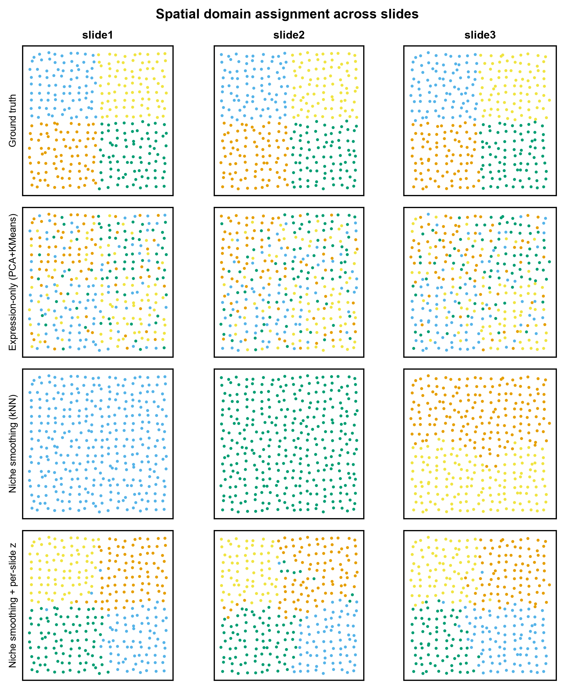
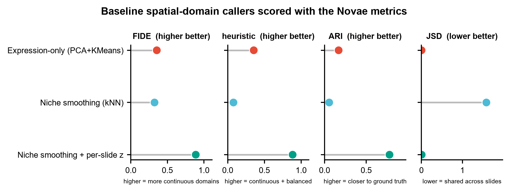

# 580 · Novae — 空间转录组基础模型(跨切片空间域 / niche 表征)

> 输入多切片的空间转录组细胞表(坐标 + 表达)→ 划分**跨切片可迁移的空间域(niche)**,
> 并用 **Novae 论文自己的指标(FIDE / JSD / heuristic)** 给结果打分 → 出空间域图、
> 指标棒棒糖图、跨切片域组成热图。上游 Novae 走**守卫式封装**,本机默认跑**朴素基线阶梯**。

| | |
|---|---|
| **语言 / 主依赖** | Python · 基线:`numpy` `pandas` `scikit-learn` `matplotlib`;Novae 路径:`novae`(Python ≥3.11 + `torch-geometric`) |
| **一句话用途** | 多切片空间转录组的空间域 / niche 划分与可迁移性评估 |
| **输入** | `example_data/spatial_demo_cells.csv` |
| **输出** | `results/`(运行生成) · 展示图见 `assets/` |
| **状态** | 🟡 基线与指标本机零改动跑通出图;Novae 本体需 `pip install novae` + 真实基因 symbol + HuggingFace 权重 |

---

## ① 输入数据

**文件**:`spatial_demo_cells.csv`(csv;行 = 细胞,列 = 元信息 + 基因)

| 列名 | 类型 | 必需 | 示例 | 说明 |
|------|------|:---:|------|------|
| `cell_id` | str | ✔ | `s1_c0000` | 细胞唯一 ID |
| `slide` | str | ✔ | `slide1` | 切片 / 样本 ID(`--slide-key` 可改名) |
| `x` / `y` | float | ✔ | `0.088` | 空间坐标(同一切片内同一坐标系) |
| `domain_true` | str | ✘ | `D0` | 真实空间域,仅用于算 ARI;真实数据没有就不给 |
| `cell_type_true` | str | ✘ | `CT2` | 真实细胞类型,仅用于诊断列 `ARI_celltype` |
| `<基因列>` | int/float | ✔ | `G000` … | 其余所有列一律当作基因表达(原始 count) |

**命名/格式约定**:除上表元信息列外的**所有**列都被当成基因。用真实数据跑 Novae 本体时,
基因列名必须是**真实的 human / mouse 基因 symbol**(Novae 靠基因嵌入做跨 panel 迁移),
合成数据的 `G000` 这类占位名不可用 —— 脚本会把这一点作为失败原因明确打出来。

**样例(前 3 行)**:
```
cell_id,slide,x,y,domain_true,cell_type_true,G000,G001,G002,...
s1_c0000,slide1,0.088,0.128,D0,CT0,3,1,0,...
s1_c0001,slide1,1.012,-0.183,D0,CT3,1,4,2,...
```

`example_data/` 为**合成数据(synthetic, for demo only)**,文件首行已注明。若文件不存在,
脚本会用固定种子自动重新生成。

**★ 合成数据的关键设计**:域**不是**由单细胞表达定义的,而是由邻域内**细胞类型组成比例**
定义的(4 种细胞类型在 4 个域中都出现,只是主导型占 55%、其余各 15%)。因此单看一个细胞
的表达只能还原它的细胞类型、还原不了它属于哪个空间域 —— 必须看邻域。这才是 niche 问题,
也才让 expression-only 成为一条真实的地板;同时每张切片带乘性批次漂移,逼出跨切片可迁移性。

## ② 方法 / 原理

**基线阶梯(默认路径,纯本机依赖,一定跑得完)**

1. `Expression-only (PCA+KMeans)` — 完全忽略空间坐标。空间方法若打不过它,说明空间信息没用上。
2. `Niche smoothing (kNN)` — 在切片内空间 kNN 邻域上做表达平均(经典 niche 构造)→ PCA + KMeans。
3. `Niche smoothing + per-slide z` — 同上,但先做**逐切片 z-score**(最朴素的批次处理)。

**评价指标 —— 复刻自上游源码 `novae/monitor/eval.py`(v1.1.1),逐个标了源码行号**

| 本模块函数 | 上游定义位置 | 含义 |
|---|---|---|
| `fide_score` | `novae/monitor/eval.py:34` | 空间邻接图上把边两端标签当 `y_true`/`y_pred` 求逐类 F1 再平均。**越高 = 域越空间连续** |
| `mean_fide` | `novae/monitor/eval.py:11` (`mean_fide_score`) | 逐切片 FIDE 再平均 |
| `jensen_shannon_divergence` | `novae/monitor/eval.py:65` + `:94` (`_jensen_shannon_divergence`) | 跨切片域占比分布的 JSD。**越低 = 域在切片间越共享(可迁移)** |
| `_entropy` | `novae/monitor/eval.py:110` (`entropy`) | Shannon 熵;EPS 取上游 `Nums.EPS = 1e-8`(`novae/_constants.py:47`) |
| `heuristic` | `novae/monitor/eval.py:139` + `:157` (`_heuristic`) | **逐切片**算 `FIDE_s × entropy(该片域占比) / log2(n_classes)` 后跨片平均 |

唯一与上游的差异:上游从 `adata.obsp["spatial_distances"]`(`Keys.ADJ`,`_constants.py:14`)取邻接,
本模块换成显式 kNN 边表,以便不装 `novae`/`squidpy` 也能打分。
另加 `ARI`(对 `domain_true`)与诊断列 `ARI_celltype`(对 `cell_type_true`)作独立 sanity-check。

**Novae 路径(`--run-novae`,守卫式)** — 调用序列已逐个在本地上游源码里核对到定义位置:

```python
novae.spatial_neighbors(adata, slide_key=slide_key)
model = novae.Novae.from_pretrained("prism-oncology/novae-human-0")
model.compute_representations(adata, zero_shot=True)
key = model.assign_domains(adata, level=7, n_domains=n_domains)
```

**每个调用 → 上游源码位置**(核对基准:`prism-oncology/novae` @ main,`pyproject.toml` version = 1.1.1):

| 本模块调用 | 上游定义 | 签名(源码原文) |
|---|---|---|
| `novae.spatial_neighbors` | `novae/utils/build.py:35`(经 `novae/__init__.py` 由 `.utils` 导出) | `spatial_neighbors(adata, *, slide_key=None, radius=None, technology=None, coord_type=None, n_neighs=None, delaunay=None, n_rings=1, percentile=None, set_diag=False, reset_slide_ids=True, verbose=True)` |
| `novae.Novae` | `novae/model.py:26`(`class Novae(L.LightningModule, PyTorchModelHubMixin)`) | — |
| `Novae.from_pretrained` | `novae/model.py:309` | `from_pretrained(model_name_or_path: str \| Path, **kwargs) -> Novae` |
| `model.compute_representations` | `novae/model.py:379` | `compute_representations(adata=None, *, zero_shot=False, reference="all", accelerator="cpu", num_workers=None) -> None` |
| `model.assign_domains` | `novae/model.py:539` | `assign_domains(adata=None, level=7, n_domains=None, resolution=None, key_added=None) -> str`(返回 `adata.obs` 新增的 key) |
| 模型名 `prism-oncology/novae-human-0` | 名称合法性由 `novae/utils/_validate.py:302` `check_model_name` 校验(`ORGANIZATION = "prism-oncology/"` 于 `:299`;`MICS-Lab/` 作为 `OLD_ORGANIZATION` 仍被接受;v0 模型要求名字以 `-0` 结尾) | — |

两点必须知道的上游行为(均见源码,不是推测):

1. `compute_representations` 内有 `assert self.mode.trained`;`from_pretrained` 会调用
   `model.mode.as_pretrained()`(`model.py:325`),所以预训练模型可直接 zero-shot,无需 `fit()`。
2. zero-shot 下 `assign_domains` 若走 `level`,上游会 `log.warning` 建议改用 `resolution=`
   (`model.py:585`)。本模块保留 `level`/`n_domains` 路径,可用 `--novae-level` 调。

`fine_tune(...)`(`novae/model.py:620`)、`batch_effect_correction(...)`、`novae.label.label_domains`、
`novae.plot.*` 也确实存在(见 `novae/__init__.py` 导出),但**本模块未封装,签名未逐一核对**。
任一前置条件不满足(包未装 / 基因名非真实 symbol / 拿不到 HuggingFace 权重),脚本返回
`skipped` 或 `failed` 并打印真实原因与补救命令,**不伪造结果**。

## ③ 用途

- 多张切片(甚至跨技术平台:Xenium / MERFISH / CosMx / Visium)上划分**同一套**空间域,
  使得"slide1 的 domain 3"和"slide2 的 domain 3"指同一种组织生态位,可直接做跨样本比较。
- 回答的科学问题:肿瘤/纤维化组织里有哪些**可复现的细胞生态位**?某个 niche 的比例是否
  在疾病组与对照组间变化?哪些 niche 跨病人稳定、哪些是切片伪影?
- 本模块的基线阶梯还能直接用作**批次效应诊断**:若 `Niche smoothing (kNN)` 的 JSD 接近
  `log2(切片数)`,说明聚类完全被切片批次主导(见 ⑤ 的热图,呈块对角)。

## ④ 特点 / 亮点

- **turnkey**:`python 580_novae_spatial_fm.py` 一条命令跑完,不依赖 Novae 是否安装。
- **基线不是摆设**:三级阶梯直接暴露"空间信息有没有用上""批次有没有压住"两个问题;
  Novae 的任何增益都必须相对第 3 级来读,而不是单独报告。
- **指标复刻自上游源码**,与 Novae 论文的 benchmark 口径一致,可直接把 Novae 的输出塞进
  同一套打分函数横向比。
- **顶刊图风格**,全部非条形图:空间散点 / 棒棒糖 / 热图。
- 固定随机种子、脚本相对路径、无 `setwd`、关键参数均可 `--key value` 覆盖。

## ⑤ 输出结果图

| 文件 | 图型 | 说明 |
|------|------|------|
| `assets/580_domain_maps.png` | 空间散点矩阵 | 行 = 方法(含 ground truth),列 = 切片;看域是否空间连续、跨切片是否对齐 |
| `assets/580_metric_comparison.png` | 棒棒糖图 | FIDE / heuristic / ARI(越高越好)与 JSD(越低越好)四联 |
| `assets/580_slide_composition.png` | 热图 | 域 × 切片 的细胞占比;列间越一致 = 越可迁移,块对角 = 被批次主导 |

`results/` 内(不提交):`580_metrics.csv`、`580_domain_labels.csv`、`580_summary.json`,
以及跑过 `--run-novae` 时的 `580_novae_status.json`。






**本机实跑结果**(合成数据,seed=0,972 cells × 40 genes × 3 slides):

| method | FIDE ↑ | JSD ↓ | heuristic ↑ | ARI(域)↑ | ARI_celltype |
|---|---|---|---|---|---|
| Expression-only (PCA+KMeans) | 0.3555 | 0.0027 | 0.3553 | 0.1689 | **1.0000** |
| Niche smoothing (kNN) | 0.3244 | **1.5850** | 0.3110 | 0.0557 | 0.0157 |
| Niche smoothing + per-slide z | **0.8885** | 0.0056 | **0.8870** | **0.7797** | 0.1360 |

读法:第 1 行 `ARI_celltype=1.00` 而域 ARI 只有 0.17 —— expression-only 完美还原了细胞类型,
但基本没抓到 niche,符合合成数据的设计。第 2 行 JSD = 1.585 = `log2(3)`,即三张切片各自成域,
邻域平均把细胞类型噪声抹平后批次成了主方差方向。第 3 行加一步逐切片 z-score 就把域找回来了。
这条阶梯就是 Novae 需要越过的门槛。

---

## 运行

```bash
# 零改动跑示例(默认只跑基线,不需要 novae)
python 580_novae_spatial_fm.py

# 换成自己的数据
python 580_novae_spatial_fm.py --csv data/你的细胞表.csv --slide-key sample_id --n-domains 8

# 尝试真正调用 Novae(需已装 novae、基因名为真实 symbol、能访问 HuggingFace)
python 580_novae_spatial_fm.py --csv data/你的细胞表.csv --run-novae \
    --novae-model prism-oncology/novae-human-0 --novae-level 7
```

主要参数:`--k-niche`(niche 平滑近邻数,默认 20)、`--k-graph`(FIDE 邻接图近邻数,默认 6)、
`--n-domains`、`--outdir`、`--assets`、`--seed`。

## 依赖安装

基线路径只需本库通用 Python 环境(`numpy` `pandas` `scikit-learn` `matplotlib`)。
Novae 本体需要单独安装(**本模块未在本机安装,故 Novae 路径未做端到端验证**):

```bash
pip install novae     # 需要 Python >=3.11;会拉入 torch>=2.2.1, torch-geometric, lightning, huggingface-hub
```

## 引用

Blampey Q, Benkirane H, Bercovici N, Mulder K, Gessain G, Ginhoux F, André F, Cournède PH.
**Novae: a graph-based foundation model for spatial transcriptomics data.**
*Nature Methods.* 2025;22(12):2539-2550. doi:10.1038/s41592-025-02899-6 · **PMID 41372623**

引用已核实:DOI 经 Crossref 解析、PMID 经 NCBI E-utilities `esummary` 反查,标题、作者、
卷期页(Nat Methods 22(12):2539-2550)三者一致。

上游仓库 https://github.com/prism-oncology/novae(BSD-3-Clause;旧地址 `MICS-Lab/novae`
会 302 重定向到此,README 中的组织名已随之改变) · 文档 https://prism-oncology.github.io/novae/
