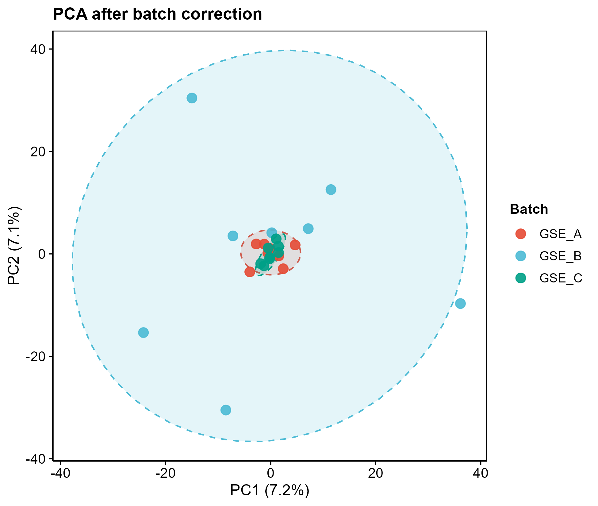

# 056 · GEO multi-cohort merge and batch correction

Merge multiple GEO expression matrices from one directory, remove batch effects, and produce before/after PCA and boxplots as separate figures.

| | |
|---|---|
| Language / dependencies | R · `limma` `ggplot2` `reshape2` |
| Purpose | Batch-effect removal and QC visualization for multi-cohort integration |
| Input | `example_data/` (directory with 3 synthetic cohort CSVs) |
| Output | `results/` merged matrices and figures; display figures in `assets/` |

## Input

The input is a directory (`--input`) containing at least 2 CSV files, each one cohort's expression matrix:

| Column | Type | Required | Description |
|------|------|:---:|------|
| Column 1 | str | yes | Gene name (standardized to geneSymbol, merged by intersection) |
| Sample columns ×N | num | yes | Expression values |

Convention: the batch name equals the file name (e.g. `GSE_A.csv` -> batch GSE_A). Cohorts are merged on the intersection of gene names.

## Method

Merge by geneSymbol on the intersection, then apply `limma::removeBatchEffect(batch=cohort)` to linearly remove batch mean shifts, then run standardized PCA with `prcomp` to compare before and after correction.

Method citation: Ritchie *et al.*, *NAR* 2015 (limma removeBatchEffect).

## Use case

Merging multiple GEO cohorts to increase sample size is common in non-tumor and tumor studies. This module is a preprocessing step for meta-analysis and cross-cohort modeling (04/05 categories), and it visually verifies whether the batch effect has been removed.

## Features

- Drop multiple cohorts into one directory; one command performs the merge, correction, and figure generation.
- Before/after comparison: PCA (colored by batch with ellipses) shows batch-effect removal; boxplots show distribution alignment.
- Vector output: PDF plus 300 dpi PNG per figure.

## Outputs

| File | Plot type | Description |
|------|------|------|
| `assets/PCA_before.png` / `PCA_after.png` | PCA | Batch separation before correction, merged after correction |
| `assets/Boxplot_before.png` / `Boxplot_after.png` | Boxplot | Sample expression distribution alignment |
| `results/merged_*_correction.csv` | Table | Merged matrix before/after correction |




## Usage

```bash
Rscript 056_GEO_merge_batch_correction.R                       # 跑 3 份示例队列
Rscript 056_GEO_merge_batch_correction.R --input data/cohorts  # 你的队列目录
```

## Dependencies

```r
if (!require("BiocManager")) install.packages("BiocManager"); BiocManager::install("limma")
install.packages(c("ggplot2","reshape2"))
```
