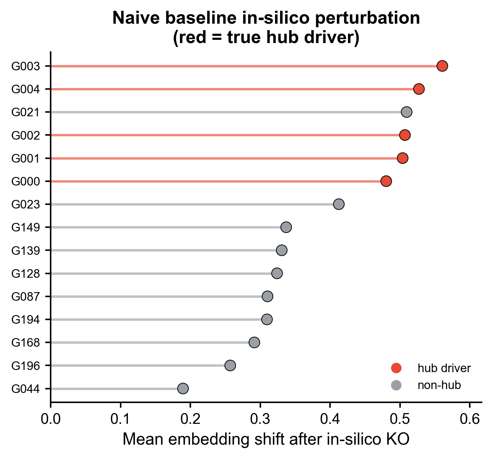

# 507 · Geneformer zero-shot embedding & in-silico perturbation

Uses the **Geneformer** foundation model (Theodoris 2023, *Nature*) for zero-shot
cell embeddings and **in-silico gene deletion** (delete a gene → measure the shift in
the cell-state embedding → rank candidate regulators). Ships with a **runnable honest
baseline** (HVG + PCA embedding and a naive zero-&-reproject perturbation) so the
foundation model is always measured against a simple comparator — not reported alone.

| | |
|---|---|
| Language / deps | Python · baseline: `scanpy` `scikit-learn`; FM: `geneformer` `torch` (**GPU**) |
| Purpose | FM cell embedding + in-silico KO regulator ranking, with a baseline floor |
| Input | synthetic counts (generated); for FM, a tokenized h5ad/loom (see below) |
| Output | `results/` ranking; preview in `assets/` |
| Runtime | baseline CPU < 1 min · **Geneformer path needs GPU + pretrained weights** |

## Method

**Runnable baseline (always, CPU):**
1. **Embedding** — normalize → HVG → PCA → UMAP (`baseline_embedding`).
2. **In-silico KO** — zero each candidate gene, reproject onto the original PCA
   loadings, rank by mean embedding shift (`baseline_perturb`).

**Geneformer path (`--run-geneformer`, GPU):**
`TranscriptomeTokenizer` → `EmbExtractor` (zero-shot embeddings) →
`InSilicoPerturber(perturb_type="delete")` → `InSilicoPerturberStats` (per-gene cosine
shift). The function guards on GPU + package availability and otherwise falls back to
the baseline with a clear message.

## ⏭️ Needs GPU + model download (Geneformer path)

The foundation-model path is **not run locally** (no GPU / weights here). To enable it
on a GPU box (e.g. AutoDL RTX-class):

```bash
pip install geneformer            # or: git clone https://gh-proxy.org/https://github.com/jkobject/geneformer
# pretrained weights auto-download from Hugging Face: ctheodoris/Geneformer (several GB)
python 507_geneformer_insilico.py --run-geneformer
```

Input for the FM must carry Ensembl IDs in `var` and `n_counts` in `obs` before
tokenization (Geneformer requirement). See the in-code skeleton in `run_geneformer()`.

## Honest-baseline note (the "two knives")

> **① Genome Biol 2025** (`10.1186/s13059-025-03574-x`): zero-shot foundation-model
> embeddings do **not** automatically beat PCA / scVI / Harmony. → Compare the
> Geneformer embedding against the **baseline embedding** (`assets/baseline_embedding`)
> on the *same* downstream task before claiming an advantage.
>
> **② Nat Methods 2025** (`10.1038/s41592-025-02772-6`): deep perturbation predictors
> frequently lose to simple linear baselines. → The Geneformer in-silico ranking must
> be shown to **outperform the naive baseline ranking** (`assets/baseline_insilico_ranking`)
> — not merely "look plausible".

In the demo the naive baseline already places most true hubs on top (mean rank
2.6/15) yet still mis-ranks one non-hub above two real drivers — a realistic floor the
foundation model has to clear. For regulatory propagation a GRN method (CellOracle,
module 069) is the other orthogonal route worth triangulating with.

## Outputs

| File | Type | Description |
|------|------|------|
| `results/baseline_insilico_ranking.csv` | table | candidate gene, embedding shift, hub flag |
| `assets/baseline_embedding.png` | UMAP | HVG+PCA embedding; the comparator for FM embeddings |
| `assets/baseline_insilico_ranking.png` | bar | naive in-silico KO ranking (hubs highlighted) |



## Run

```bash
python 507_geneformer_insilico.py                 # honest baseline (CPU), generates figures
python 507_geneformer_insilico.py --run-geneformer  # full Geneformer path (GPU + weights)
```

## Dependencies

```bash
pip install scanpy scikit-learn        # baseline (CPU)
pip install geneformer torch            # foundation-model path (GPU)
```
