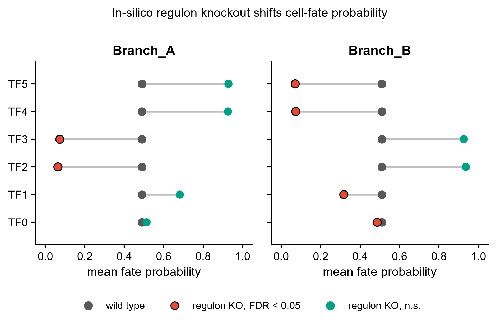
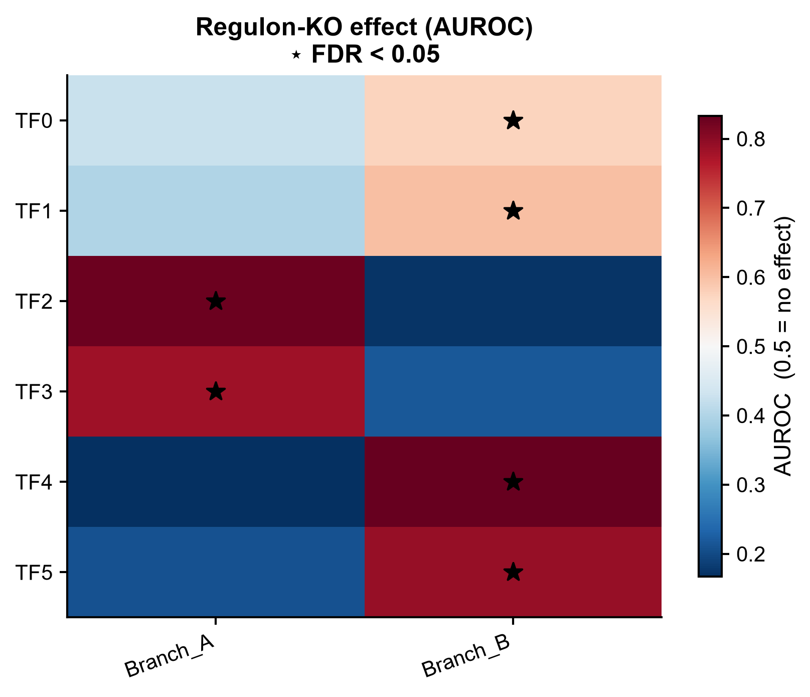
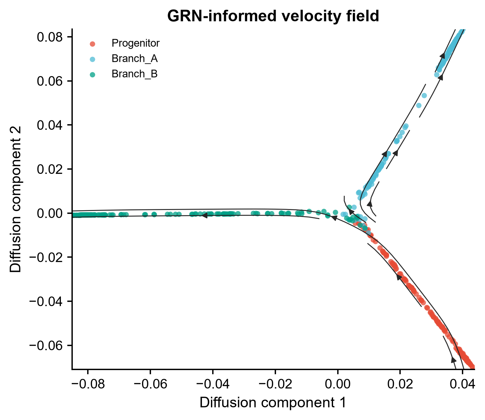
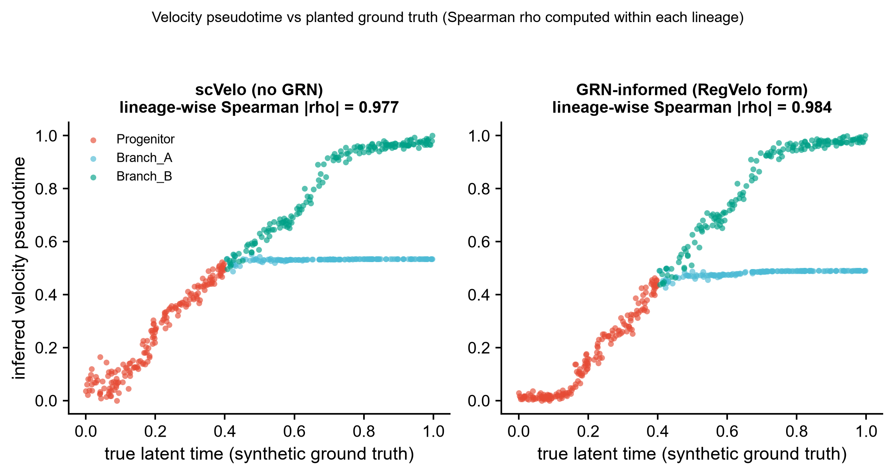

# 561 · GRN 引导的 RNA 速率与调控子敲除 RegVelo

> 一句话定位:输入带 **spliced/unspliced 层的单细胞数据 + TF→靶基因先验网络** → 用基因调控网络约束速率场、算 CellRank 细胞命运概率、逐个 TF 做 in-silico 调控子敲除 → 出速率流场图、命运概率哑铃图、KO 效应热图与拟时校验散点图。

| | |
|---|---|
| **语言 / 主依赖** | Python ≥3.10 · 基线:`scanpy` `scvelo` `cellrank` `statsmodels`;官方路径:`regvelo`(需 `scvi-tools<1.2.1` `torchode` + **GPU**) |
| **一句话用途** | GRN 约束的 RNA 速率 + 调控子敲除的细胞命运重分配筛查 |
| **输入** | `example_data/synthetic_velocity.h5ad` + `example_data/synthetic_prior_grn.csv` |
| **输出** | `results/`(运行生成) · 展示图见 `assets/` |
| **状态** | ✅ 本机零改动跑通并出图(基线路径,CPU 约 1 分钟);RegVelo 官方训练路径需 GPU,守卫式封装 |

---

## ① 输入数据

### 文件 1:`synthetic_velocity.h5ad`(AnnData,行=细胞,列=基因)

| 字段 | 类型 | 必需 | 示例 | 说明 |
|------|------|:---:|------|------|
| `layers['spliced']` | float 矩阵 | ✔ | 500×60 | 剪接后 mRNA 计数 |
| `layers['unspliced']` | float 矩阵 | ✔ | 500×60 | 未剪接 mRNA 计数 |
| `obs['cell_state']` | str | ✔ | `Progenitor` | 细胞状态标签,用于 CellRank 终末状态 |
| `obs['true_time']` | float | ✖ | `0.000301` | 合成数据自带的真实潜时,仅用于校验;真实数据无此列 |
| `var_names` | str | ✔ | `TF0` / `TG00` | 基因名,须与先验 GRN 的行列名对齐 |

**样例(前 3 行 `obs`)**:
```
        true_time  cell_state
C0000    0.000301  Progenitor
C0001    0.002739  Progenitor
C0002    0.004899  Progenitor
```

### 文件 2:`synthetic_prior_grn.csv`(先验调控骨架,**行=靶基因,列=调控因子**)

| 列名 | 类型 | 必需 | 示例 | 说明 |
|------|------|:---:|------|------|
| `target` | str | ✔ | `TG00` | 靶基因名(索引列) |
| `TF0`…`TF5` | int 0/1 | ✔ | `1` | 1 表示该 TF 调控该靶基因 |

**样例(前 3 行)**:
```
target,TF0,TF1,TF2,TF3,TF4,TF5
TG00,0,1,0,0,0,1
TG01,0,0,0,1,0,1
```

**格式约定**:行=靶基因、列=调控因子的方向**不能反** —— 这与上游 `regvelo.pp.set_prior_grn(adata, gt_net=...)` 的约定一致(`preprocessing/_set_prior_grn.py`,docstring 明写 "rows = targets, columns = regulators")。示例数据由主脚本自动生成(seed=0),`example_data/README.txt` 已标注 synthetic, for demo only。

## ② 方法 / 原理

**本机基线路径(默认,CPU 可跑):**

1. **标准速率** — `scvelo` 预处理 → `moments` → 速率拟合(先试 `stochastic`,失败自动回落 `deterministic`;实际使用的模式记在 `results/561_summary.json` 的 `comparator.mode`,示例数据上落在 `deterministic`),作为"无 GRN"对照底线。
2. **GRN 约束速率** — 把先验骨架当作稀疏掩码,对每个靶基因只在其上游 TF 上做岭回归拟合,得到受调控网络约束的速率场(`fit_grn_velocity`,ridge 可调)。这是 RegVelo 思路的**线性代理**,不是官方模型本身;README 与 `results/561_summary.json` 中均如实标为 proxy。
3. **命运概率** — 由速率场构建 CellRank 核 → `GPCCA` 估计器 → 终末状态 → 各细胞对各终末状态的吸收概率。
4. **调控子敲除筛查** — 逐个 TF 把其全部出边置零 → 重算速率场与命运概率 → 用 AUROC 型丰度检验比较扰动前后的命运分布,BH 校正得 FDR(`abundance_test`,对齐上游 `metrics/_abundance_test.py` 的 likelihood 口径)。
5. **阳性对照** — 合成数据里预先"种"了 Branch_A 的驱动因子 TF2/TF3;流程跑完检查这两个是否被排到前列,作为管道有效性的 sanity-check,结论写入 summary 的 `sanity_check` 字段。

**RegVelo 官方路径(`--run-regvelo`,需 GPU):**

调用链与参数**逐条核对自本地克隆源码** `Desktop/upstream-sources/561_regvelo/src/regvelo/`:

| 调用 | 源码位置 |
|---|---|
| `pp.set_prior_grn(adata, gt_net, keep_dim=False, cor_filter=True)` | `preprocessing/_set_prior_grn.py:7` |
| `pp.sanity_check(adata)` | `preprocessing/_sanity_check.py:7` |
| `pp.preprocess_data(adata, spliced_layer="Ms", unspliced_layer="Mu", min_max_scale=True, filter_on_r2=True)` | `preprocessing/_preprocess_data.py:8` |
| `REGVELOVI.setup_anndata(adata, spliced_layer=, unspliced_layer=)` | `_model.py:778` |
| `REGVELOVI(adata, W=, regulators=, soft_constraint=True, lam=1, lam2=0)` | `_model.py:100` |
| `.train(max_epochs=1500, lr=1e-2, ...)` | `_model.py:208` |
| `tl.set_output(adata, vae, n_samples=30, batch_size=None)` | `tools/_set_output.py:11` |
| `tl.in_silico_block_simulation(model, adata, TF, effects=0, cutoff=1e-3)` | `tools/_in_silico_block_simulation.py:6` |
| `tl.TFScanning_func(model, adata, cluster_label=, terminal_states=, KO_list=, n_states=, method="likelihood")` | `tools/_TFScanning_func.py:14` |
| `mt.abundance_test(prob_raw, prob_pert, method)` | `metrics/_abundance_test.py:10` |

未装 `regvelo` 或无 CUDA 时,该函数返回明确的 `skipped` 与原因,不静默降级、不伪造结果。

**CellRank 2.3.2 API 注意**:终末状态用 `GPCCA.predict_terminal_states()`;`set_terminal_states_from_macrostates` 在 2.x 中**不存在**(旧代码常见报错源)。本模块用法与上游 `tools/_TFScanning_func.py:77` 一致。

## ③ 用途

- 有 spliced/unspliced 计数、且手头有 TF→靶基因先验(SCENIC regulon、ChIP-seq、ATAC motif 推断)时,让速率场受调控逻辑约束,而不是只靠表达动力学。
- 分化/命运决定研究中筛"敲掉哪个 TF 会把细胞推向另一条分支":输出的是命运概率的重分配,而非单纯的表达变化。
- 给候选转录因子排序,为后续湿实验(shRNA / CRISPRi)挑靶点。

## ④ 特点 / 亮点

- **turnkey**:`python 561_regvelo_grn_velocity.py` 一条命令,自动生成示例数据 → 跑完 → 出图,零改动。
- **自带对照底线**:scVelo(无 GRN)与 GRN 约束速率并排比较拟时对真值的 lineage-wise Spearman,GRN 路径不会被单独报告。
- **自带阳性对照**:合成数据预埋驱动因子,管道跑完自检能否召回,避免"管道跑通但根本没信号"。
- **API 全部源码接地**:官方路径每个函数名/参数/默认值都标注了本地克隆源码的文件与行号,可逐条复核。
- **顶刊风格图**:哑铃图 / 热图 / 流场图 / 散点图,**全程无条形图**;PNG + PDF 双份输出。
- 关键参数命令行可调:`--ridge` `--n-states` `--h5ad` `--grn` `--outdir`;固定 seed=0,可复现。

## ⑤ 输出结果图

| 文件 | 图型 | 说明 |
|------|------|------|
| `assets/fig1_grn_velocity_stream.png` | 流场图 (stream) | GRN 约束速率场投影到扩散图上,箭头示分叉方向 |
| `assets/fig2_tf_ko_fate_dumbbell.png` | 哑铃图 (dumbbell) | 每个 TF 敲除前后平均命运概率的位移,红点为 FDR<0.05 |
| `assets/fig3_ko_effect_heatmap.png` | 热图 | TF × 终末状态的 KO 效应量(AUROC,0.5 = 无效应),★ 标 FDR<0.05 |
| `assets/fig4_pseudotime_vs_truth.png` | 散点图(双 panel) | scVelo vs GRN 约束速率的拟时对真实潜时,分谱系 Spearman rho |

| 表格 | 说明 |
|------|------|
| `results/tf_ko_fate_shift.csv` | TF × 终末状态的敲除效应:coefficient / pvalue / FDR / 扰动前后命运概率 |
| `results/fate_probabilities_wt.csv` | 野生型每个细胞对各终末状态的吸收概率 |
| `results/561_summary.json` | 运行摘要:细胞/基因数、终末状态、两种速率的 rho 对比、阳性对照结论、Top KO 效应 |









---

## 与 069 / 507 的分工

| 模块 | 引擎 | 扰动逻辑 |
|---|---|---|
| 069 CellOracle | GRN + 向量场信号传播 | TF 置零 → 传播 → 打分状态位移 |
| 507 Geneformer | 基础模型 embedding | 删基因 → 量 embedding 位移 |
| **561 RegVelo** | **GRN 耦合剪接动力学** | **调控子敲除 → CellRank 命运概率重分配** |

三者不可互换:RegVelo 需要 spliced/unspliced 计数,另两者不需要。假设相近的两个引擎叠加并不产生独立证据,做交叉验证时应挑假设不同的引擎。

## 运行

```bash
# 零改动跑示例(自动生成 example_data/ → results/ → assets/)
python 561_regvelo_grn_velocity.py

# 换成自己的数据
python 561_regvelo_grn_velocity.py --h5ad data/你的.h5ad --grn data/你的_grn.csv --outdir results/run1

# 调参
python 561_regvelo_grn_velocity.py --ridge 0.05 --n-states 3

# 重新生成示例数据
python 561_regvelo_grn_velocity.py --regen-example

# 官方 RegVelo 路径(需 GPU + 装包,否则打印跳过原因)
python 561_regvelo_grn_velocity.py --run-regvelo
```

## 依赖安装

```bash
# 基线路径(本机已具备)
pip install scanpy scvelo cellrank statsmodels

# 官方 RegVelo 路径(需 Python>=3.10 + CUDA GPU)
pip install regvelo   # 会拉 scvi-tools<1.2.1, torchode, cellrank
```

## 引用

Wang W, Hu Z, Weiler P, Mayes S, Lange M, Fountain DM, Haug JO, Wang J, Xue Z,
Sauka-Spengler T, et al. RegVelo: Gene-regulatory-informed dynamics of single cells.
*Cell* 2026 Jun 11;189(12):3773-3800.e44. doi:10.1016/j.cell.2026.04.022 · PMID 42119563

仓库:https://github.com/theislab/regvelo · 文档:https://regvelo.readthedocs.io
