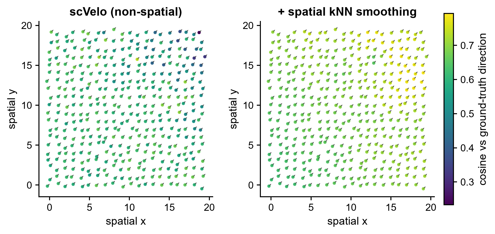
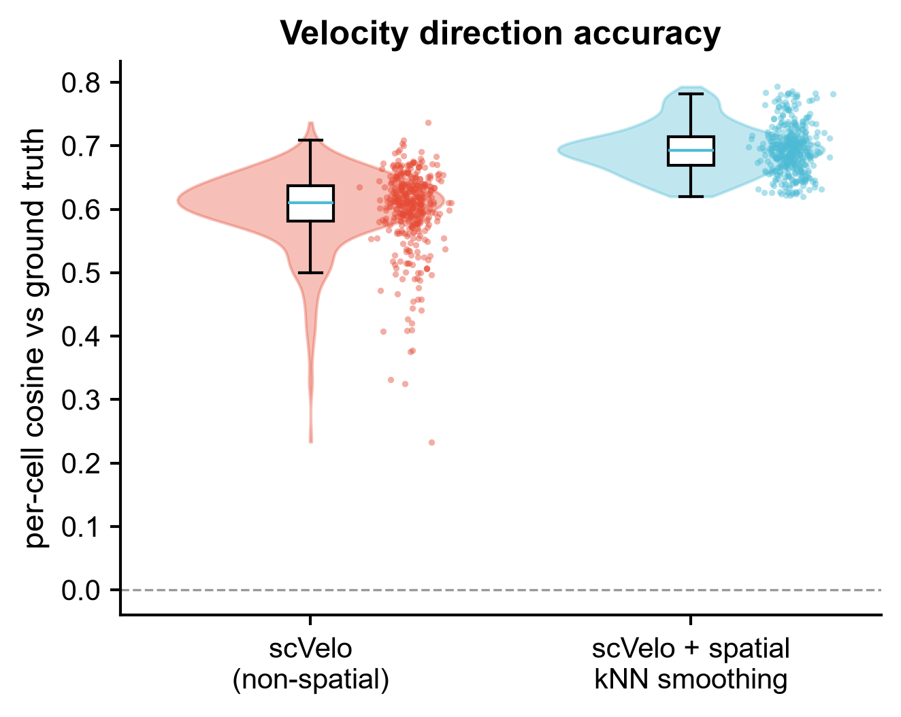
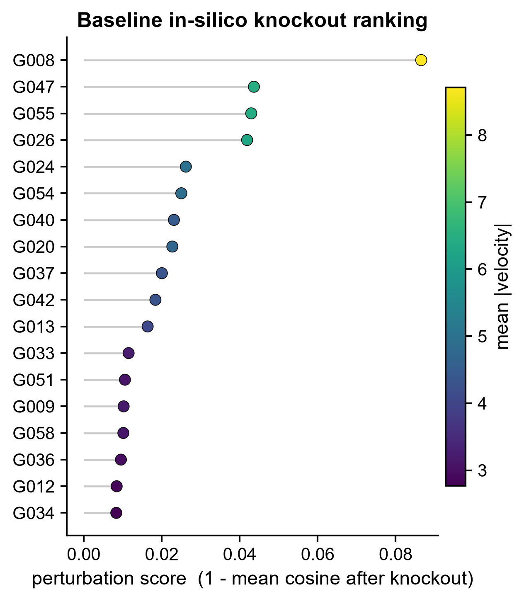

# 581 · veloAgent — 空间信息驱动的 RNA velocity 与 in-silico 扰动

> 一句话定位:输入**带空间坐标的 spliced/unspliced 计数** → 跑一条本机就能跑通的
> 「非空间 scVelo → 空间邻域平滑 → 逐基因敲除打分」朴素基线,并提供上游
> **veloAgent** 的守卫式封装 → 出**空间速度场 quiver / 一致性 raincloud / 敲除 lollipop**。

| | |
|---|---|
| **语言 / 主依赖** | Python 3.12 · 基线:`scanpy` `scvelo` `anndata` `scikit-learn` `matplotlib`(本机已有);上游:`veloagent`(需自行安装) |
| **一句话用途** | 把空间上下文引入 RNA velocity,并做速度场层面的 in-silico 扰动排序 |
| **输入** | `example_data/spliced.csv` `unspliced.csv` `spatial_meta.csv`(+可选 `gene_truth.csv`) |
| **输出** | `results/`(运行生成)· 展示图见 `assets/` |
| **状态** | 🟡 基线本机零改动跑通并出图;完整 veloAgent 方法需装包(mesa/veloproj/PyTorch)+ STRING DB 文件 |

> **重要澄清**:veloAgent 里的 "Agent" 指 **agent-based model(ABM,基于智能体的空间微环境模拟,
> 用 `mesa` 实现)**,**不是 LLM agent**。已读上游 `src/veloagent/abm.py` 与 README 确认:
> **不需要任何外部 LLM API,也不需要 API key / 付费**。(选题扫描时的「LLM-assisted」描述不成立,已更正。)

---

## ① 输入数据

**文件 1**:`spliced.csv`(csv;行=细胞,列=基因;第一行为 `#` 注释行)
**文件 2**:`unspliced.csv`(同上,行列名必须与 spliced 一致)

| 列名 | 类型 | 必需 | 示例 | 说明 |
|------|------|:---:|------|------|
| (index) | str | ✔ | `C0000` | 细胞 barcode |
| `G000`… | int | ✔ | `21` | 该基因的 spliced / unspliced 计数 |

**文件 3**:`spatial_meta.csv`

| 列名 | 类型 | 必需 | 示例 | 说明 |
|------|------|:---:|------|------|
| `cell` | str | ✔ | `C0000` | 与计数矩阵行名对应 |
| `x` / `y` | float | ✔ | `9.846` / `12.171` | 组织切片上的空间坐标 |
| `true_time` | float | ✕ | `0.6075` | **仅合成数据有**:潜在分化时间,用于评估 |
| `cluster` | str | ✕ | `mid` | 细胞分组标签(不参与速度估计) |

**文件 4(可选)**:`gene_truth.csv` — `gene`,`true_direction`(±1),**仅合成数据有**,用作评估的地面真值。
换成真实数据时这两列/这个文件缺失,脚本自动跳过一致性评估,其余步骤照跑。

**命名/格式约定**:三个文件的细胞名必须一致;首行 `#` 注释行会被自动跳过。

**样例(`spatial_meta.csv` 前 3 行)**:
```
# synthetic, for demo only -- generated by _make_example_data.py (seed=2026)
cell,x,y,true_time,cluster
C0000,9.846,12.171,0.6075,mid
C0001,11.222,15.005,0.6898,late
```

## ② 方法 / 原理

### 本模块跑的朴素基线(始终可跑,CPU)

1. **基线 A — 非空间速度场**:标准 scVelo(`filter_and_normalize` → `moments` →
   `velocity`,stochastic 解不出时回退 deterministic)→ `velocity_graph`。完全不看空间坐标,
   这是「没有空间信息」的下限。
2. **基线 B — 空间 kNN 平滑**:每个细胞的速度向量替换为其**空间 k 近邻的距离加权平均**
   (权重 `exp(-d/τ)`)。这是 veloAgent 的 ABM 微环境模拟所对应的**最朴素线性对照**:
   用同一条信息(邻居的速度)但不做任何 agent 规则与迭代。**上游若声称 ABM 有增益,
   至少要赢过这条线。**
3. **基线 C — in-silico 敲除**:把某基因在速度矩阵中的分量置零,计算扰动前后**逐细胞速度向量
   的余弦相似度**,打分 = `1 - mean(cos)`,据此对基因排序。
   口径对齐上游 `veloagent.perturbation_score(..., metric_option=2)` 的「扰动前后速度场余弦
   相似度」思路(已从上游源码读到),但**实现是本模块自己的 numpy 朴素版**,不调用上游,
   也不等价于上游基于 α/β 动力学参数置零的扰动。

评估指标:逐细胞速度方向与合成真值的余弦、velocity pseudotime 与 `true_time` 的 Spearman ρ、
两条基线之间的 Wilcoxon 符号秩检验。固定随机种子 `SEED = 2026`。

### 上游 veloAgent 做的事(守卫式封装,本机未运行)

VAE 学细胞低维表示 → 以 **STRING 基因-基因网络**为连接先验的神经网络(`GeneNet`,
`CustomizedLinear` 稀疏层)预测**逐细胞逐基因**的转录 α / 剪接 β / 降解 γ 速率 → 由此算初始
velocity → 再用 **mesa 的 agent-based model**(`CellModel`)模拟局部微环境、迭代修正速度向量 →
`perturbation_score` / `perturb` 做 in-silico 扰动。

**已核实的官方 API 与调用顺序**(逐行抄自下列来源,未臆造;脚本里存在
`VELOAGENT_WORKFLOW` 常量中):

```python
veloagent.preprocess(adata)                       # preprocessing.py:8  (data, num_genes=2000, min_count=20, log_norm=True)
vae, optimizer, loss_fn = veloagent.get_vae(adata, z_dim=5, lr=1e-2)   # vae.py:318
best = veloagent.train_vae(adata, vae, optimizer, loss_fn,             # vae.py:346 -> state_dict
                           adata.uns['neighbors']['indices'],
                           patience=25, num_epochs=1000, batch=256, device=device)
vae.load_state_dict(best); veloagent.get_embedding(adata, vae, device) # vae.py:472 -> obsm['cell_embed']
paths = veloagent.load_protein_paths(species="mouse", base="data/conn_mat")  # gg_net.py:14 -> [info, aliases, links]
conn_mat = veloagent.create_con_mat(adata, adata.n_vars, paths[0], paths[1], paths[2],   # gg_net.py:53
                                    varname='index', confidence=False, conf_threshold=400)
genenet = veloagent.GeneNet(in_dim=adata.obsm['cell_embed'][0].shape[0],     # gg_net.py:334 / __init__:383
                            gene_dim=adata.n_vars, conn=conn_mat)
veloagent.train_gg(num_epochs=500, data=adata, embed_basis='cell_embed', genenet=genenet,   # gg_net.py:629
                   optimizer=optimizer, patience=25, num_nbrs=30, dt=0.5, batch=256, device=device)
veloagent.train_nbr(num_epochs=50, data=adata, embed_basis='cell_embed', genenet=genenet,   # gg_net.py:760
                    optimizer=optimizer, num_nbrs=30, dt=0.5, batch=256, device=device, tau_nbr=0.2)
abm = veloagent.CellModel(adata, steps=100, tau=2, nbr_radius=30, sig_ratio=0.7); abm.step()  # abm.py:157 / __init__:255
scores = veloagent.perturbation_score(adata, cluster_name='clusters', cluster_edges=[...],    # perturbations.py:10
                                      vel_key='velocity_u', metric_option=2,
                                      pert_param='alpha', dt=0.5)
```

**已核实来源**(2026-07-21 对**本地克隆的上游源码**逐符号 grep 核对,
`C:\Users\fsy\Desktop\upstream-sources\581_veloAgent`,commit `63df2a4`):

| 核对项 | 结论 |
|---|---|
| 12 个符号全部存在 | ✔ 均在 `src/veloagent/__init__.py` 的 `__all__` 导出表里,定义位置见上方行内注释 |
| 参数名 / 默认值 | ✔ 全部一致;两处**源码默认值与 tutorial 传参不同**已在下方注明 |
| 返回结构 | ✔ `get_vae`→3 元组、`train_vae`→`state_dict`、`get_embedding`/`CellModel.step()`→就地改 `adata`、`perturbation_score`→`DataFrame(index=var_names, col='score')` |
| 调用顺序 | ✔ 与 `tutorial/veloagent_tutorial.ipynb` + `tutorial/perturbation_tutorial.ipynb` 逐 cell 对齐 |

**两处需要注意的默认值差异**(源码 vs tutorial):

- `CellModel.__init__` 源码默认 `nbr_radius=40`(`abm.py:255`),tutorial 显式传 `30`;
- `train_gg` 源码默认 `patience=10, dt=0.3`(`gg_net.py:629`),tutorial 显式传 `25 / 0.5`。

**`cluster_edges` 的形状随 `metric_option` 变**(易踩坑,来自 `perturbation_tutorial.ipynb`
里作者自己的注释 "OPTION 1 PARAMETER MUST MATCH metric_option=1"):
`metric_option=1`(cross-boundary correctness)要 `[('cancer1','stromal cells'), ...]` **成对元组**;
`metric_option=2`(余弦相似度)要 `['cancer1','stromal cells', ...]` **扁平列表**。

**两个 `metric_option` 的扰动实现并不对称**(逐行读 `perturbations.py` 所见,如实记录):
`metric_option=1` 在 `perturbations.py:79` 真的把 `idata.layers['alpha'][:, i] = 0` 置零后重算整条
velocity 并跑 cross-boundary correctness;而 `metric_option=2`(`perturbations.py:100-114`)**没有置零**
`alpha`,而是用未置零的 `alpha/beta/Mu` 按 `(a[:,i] - b[:,i]*u[:,i])*dt` **重写该基因那一列**,
再与原 `vel_key` 求余弦。也就是说 option 2 度量的是「该基因速度列被动力学公式重算后的偏移」,
与 option 1 的「敲除 α」语义不同。上游未就此差异给出说明,**本模块不替它下结论**,
只提示:选 `metric_option` 时别默认两者可互换。

**未固定的部分**:`cluster_edges` 的具体取值、STRING 文件版本、ABM 的 `nbr_radius` 等超参
需按自己的数据/物种调,**以官方 tutorial 为准**。上游 `0.1.0` 仓库内**无 `docs/` 目录**
(只有 `tutorial/` 下两个 notebook),**PyPI 上无 `veloagent` 包**
(`https://pypi.org/pypi/veloagent/json` 返回 **404**,2026-07-21 实测)——只能从 GitHub 源码装。
`pyproject.toml` 声明 `license = "MIT"`,但**仓库里没有 LICENSE 文件**。

## ③ 用途

回答:**在有空间坐标的转录组里,细胞正在往哪个状态走,以及哪个基因最能改变这个走向?**

- 空间转录组(Stereo-seq / Visium / MERFISH 等)上的发育轨迹与状态转换;
- 判断「加入空间上下文」是否真的改善了速度场方向(而不是只把噪声抹平);
- in-silico 扰动排序,给湿实验挑候选基因。

## ④ 特点 / 亮点

- **turnkey**:`python 581_veloagent_velocity.py` 一条命令跑完,本机现有依赖即可,无需装任何新包;
- **自带可证伪的对照**:空间平滑不是默认更好,脚本直接给出两条基线的逐细胞余弦分布 +
  Wilcoxon 检验,赢多少写在 `results/581_summary.json` 里;
- **守卫式上游封装**:没装 veloagent 就明确报 `status: skipped` + 真实安装命令,
  **绝不静默降级、也绝不假装跑了 veloAgent**;
- **API 全部来自实读源码**,不是猜的(来源 URL 见上);
- 顶刊图风格(`_framework/pubstyle.py`),**无条形图**。

示例数据上的实测(seed=2026,400 细胞 × 60 基因):
非空间余弦均值 **0.601** → 空间平滑后 **0.695**(Wilcoxon p ≈ 7e-67);
velocity pseudotime vs `true_time` Spearman ρ = **0.98**。

## ⑤ 输出结果图

| 文件 | 图型 | 说明 |
|------|------|------|
| `assets/581_spatial_velocity_field.png` | 空间散点 + quiver 速度场(双 panel) | 左非空间 / 右空间平滑,点色 = 与真值方向的余弦 |
| `assets/581_consistency_raincloud.png` | violin + box + jitter(raincloud) | 两条基线的逐细胞方向准确度分布 |
| `assets/581_knockout_lollipop.png` | lollipop(点色 = mean\|velocity\|) | in-silico 敲除打分 Top 18 |
| `results/581_summary.json` | — | 指标汇总 + veloAgent 路径状态 |
| `results/581_knockout_scores.csv` | — | 全基因敲除打分与排名 |
| `results/581_percell_consistency.csv` | — | 逐细胞两条基线的余弦 |

每张图同时输出矢量 PDF(`assets/*.pdf`)。







---

## 运行

```bash
# 零改动跑示例(基线,本机 CPU,约 1 分钟)
python 581_veloagent_velocity.py

# 换成自己的数据
python 581_veloagent_velocity.py --datadir data/my_spatial --outdir results/run1

# 调空间平滑参数
python 581_veloagent_velocity.py --knn 20 --tau 3.0

# 尝试上游 veloAgent(没装则如实报告并给安装命令,不会失败退出)
python 581_veloagent_velocity.py --run-veloagent
```

示例数据可用 `python _make_example_data.py` 重新生成(产物已提交,通常不需要再跑)。

## 依赖安装

基线所需的包本机已全部具备(`scanpy` `scvelo` `anndata` `scikit-learn` `scipy` `matplotlib`)。

上游 veloAgent(**本模块未在本机安装,以下未经本机验证**):

```bash
conda create -n veloagent python=3.11        # pyproject: requires-python >= 3.11.8
conda activate veloagent
git clone https://github.com/mcgilldinglab/veloAgent.git
cd veloAgent
pip install .
# PyTorch 按平台单独装(未列在 pyproject deps 里):https://pytorch.org/get-started/locally/
```

> ⚠️ **官方 README 的安装步骤已失效,别照抄**:它写的 `conda env create -f environment.yml`
> 在当前仓库跑不通 —— 该文件已被上游 commit `63df2a4 "remove environment file"` 删除,
> 仓库根目录**没有 environment.yml**(2026-07-21 本地克隆实测)。官方 README 同时写着
> `python=3.10`,而 `pyproject.toml` 要求 `>= 3.11.8`,两者自相矛盾,**以 pyproject 为准**。

> ⚠️ **务必装在独立 conda env**:`pyproject.toml` 把依赖全部钉死
> (`anndata==0.9.2`、`numpy==1.24.4`、`scanpy==1.9.8`、`scvelo==0.3.2`、`scipy==1.10.1`、
> `mesa==2.1.5` …),与本机环境(numpy 2.x / anndata 0.12 / scvelo 0.3.4)**直接冲突**。

另需:
- **STRING DB 三件套**(`protein.info` / `protein.aliases` / `protein.links`,注意
  `load_protein_paths` 的返回顺序就是这个)从 <https://string-db.org/> 手动下载,按
  `<base>/<species>/` 放好。目前只支持 `mouse` / `human` / `chicken`
  (`gg_net.py:14` 里硬编码三个分支,其余物种直接 `raise ValueError`);
- `src/veloagent/perturbations.py:6` 是 `from veloproj import *` —— `veloproj` 由 pyproject 的
  `veloae @ git+https://github.com/qiaochen/VeloAE.git` 提供(**需要 git 能连 GitHub**);
  `src/veloagent/abm.py:1` `import mesa` —— 这两个本机均未安装。

## 与同目录模块的关系

| 模块 | 引擎 | 扰动逻辑 | 需要空间坐标 |
|---|---|---|:---:|
| 069 CellOracle | GRN + 向量场信号传播 | TF 置零后传播,打分位移 | ✕ |
| 507 Geneformer | 基础模型 embedding | 删基因,量 embedding 位移 | ✕ |
| 561 RegVelo | GRN 耦合剪接动力学 | regulon 扰动 → CellRank 命运 | ✕ |
| **581 veloAgent** | **动力学 NN + 空间 ABM** | **α/β 动力学参数置零 → 速度场位移** | **✔** |

581 是这一组里唯一把**组织空间结构**写进速度估计的;它需要 spliced/unspliced **加**空间坐标。
多个引擎共用同一套假设并不带来独立性,选引擎要选假设不同的。

## 引用

Raghavan V, Yoon B, Fonseca GJ, Li Y, Ding J. Dissecting and steering cell dynamics using
spatially-informed RNA velocity with veloAgent. *Molecular Systems Biology* 2026;22(7):1180-1200.
**doi:10.1038/s44320-026-00213-w** · **PMID 42092184**

**核实记录(2026-07-20)**:DOI 经 `doi.org` content negotiation 返回 CSL-JSON,标题
"Dissecting and steering cell dynamics using spatially-informed RNA velocity with veloAgent",
期刊 *Molecular Systems Biology*;PMID 42092184 经 NCBI E-utilities `esearch`+`esummary`
返回同一标题与期刊(2026 Jul)。两者一致,**已核实**。
