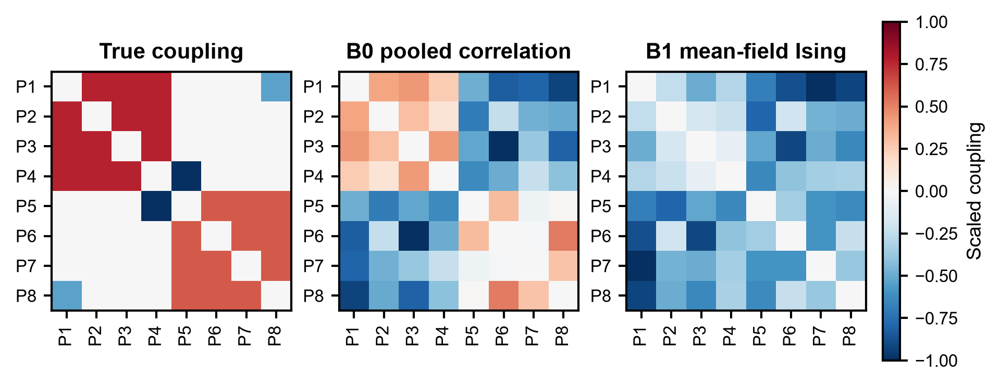
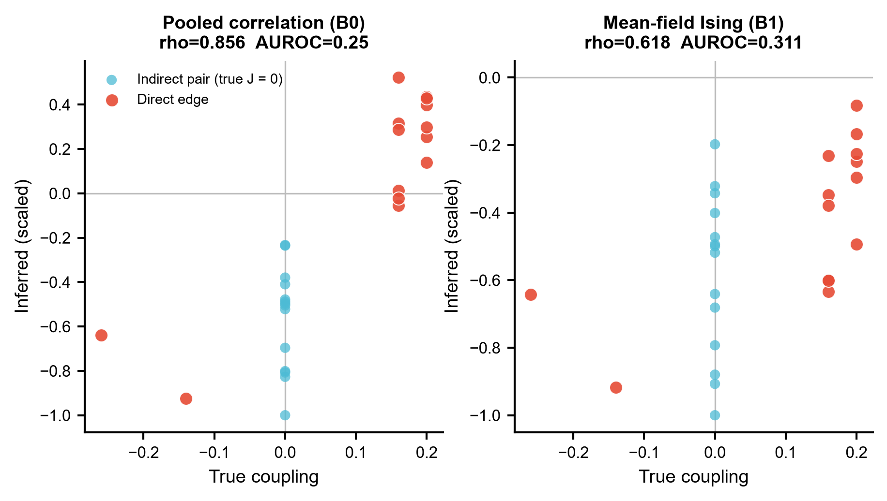
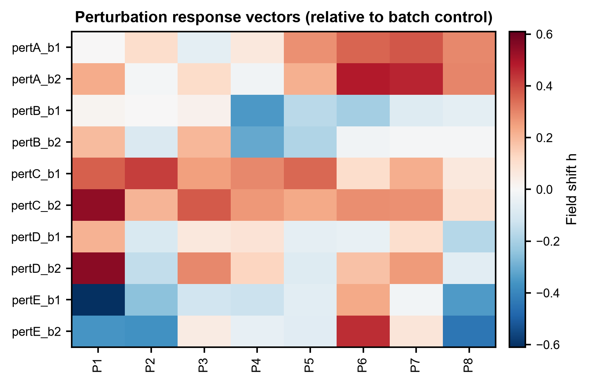
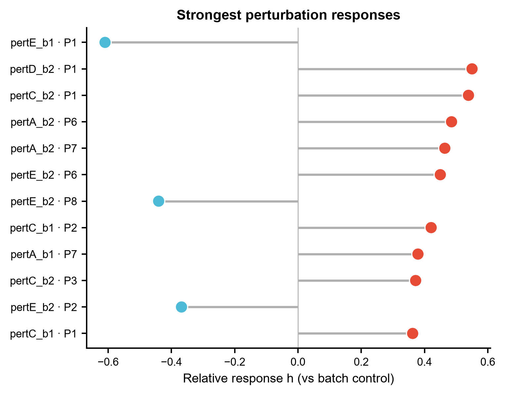
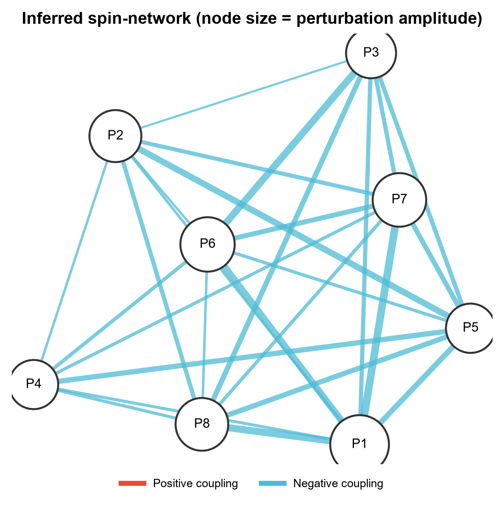

# 582 · D-SPIN — 从多重扰动 scRNA-seq 反推自旋网络(Ising)调控模型

用 **D-SPIN**(Jiang et al., *Cell* 2026)的建模思路处理**多重扰动**单细胞转录组:先把细胞
状态压成若干**基因程序**并离散成 `{-1, 0, +1}` 三态自旋,再拟合一个**跨样本共享的耦合矩阵 J**
(程序 i ↔ 程序 j 的相互作用)加上**每个扰动样本各自的场向量 h**(扰动响应向量)。模块自带
两条本机可跑的朴素对照,把"直接耦合"和"间接共变"这件事摆出来评分;真正的 D-SPIN 求解器走
守卫式调用,签名逐字来自本地克隆的上游源码。

| | |
|---|---|
| **语言 / 主依赖** | Python 3.12 · 基线:`numpy` `pandas` `scipy` `scikit-learn` `matplotlib` `networkx`(全部本机已有) · 正式路径:`pip install dspin` |
| **一句话用途** | 多扰动 scRNA-seq → 程序级自旋耦合网络 J + 各扰动响应向量 h |
| **输入** | `example_data/expression.csv` + `cell_meta.csv`(可选真值 2 个 csv) |
| **输出** | `results/` 网络矩阵/响应向量/评分 JSON · 展示图见 `assets/`(6 张) |
| **运行时间** | 基线 CPU 约 30 秒(1800 细胞 × 48 基因 × 8 程序) |
| **状态** | 🟡 基线本机零改动跑通并出图;完整 D-SPIN 伪似然求解器需 `pip install dspin` |

---

## ① 输入数据

**主输入 1** `example_data/expression.csv` —— log 归一化表达,**行 = 细胞,列 = 基因**。

| 列 | 类型 | 必需 | 示例 | 说明 |
|---|---|:---:|---|---|
| 行索引 `cell_id` | str | ✔ | `ctrl_b1_c000` | 细胞条码,须与 `cell_meta.csv` 对得上 |
| 基因列 | float | ✔ | `PRG1_G1` = `3.8864` | CP10K + log1p 之类的归一化值;上游 `DSPIN.__new__` 检测到负值会告警,别传 z-score |

**主输入 2** `example_data/cell_meta.csv` —— 细胞元数据,**三列缺一不可**(缺列脚本直接退出)。

| 列 | 类型 | 必需 | 示例 | 说明 |
|---|---|:---:|---|---|
| `cell_id` | str | ✔ | `ctrl_b1_c000` | 与表达矩阵行名对应 |
| `sample_id` | str | ✔ | `pertA_b1` | **扰动样本**标识,J 的拟合按它分组、h 按它逐样本给 |
| `batch` | str | ✔ | `b1` | 批次;响应向量是**在 batch 内部**减对照算的 |
| `if_control` | bool | ✔ | `True` | 是否对照样本;`true/1/yes/t` 均可,脚本统一转 bool |

**可选输入** `ground_truth_coupling.csv`(8×8 真值耦合)与 `ground_truth_response.csv`(6×8 真值
响应场)。真实数据当然没有真值,不传脚本会自动跳过评分只出网络图。

**样例(前 3 行)**

```
# expression.csv
cell_id,PRG1_G1,PRG1_G2,PRG1_G3,...
ctrl_b1_c000,3.8864,3.2135,4.285,...
ctrl_b1_c001,5.5223,5.2898,5.5223,...

# cell_meta.csv
cell_id,sample_id,batch,if_control
ctrl_b1_c000,ctrl_b1,b1,True
ctrl_b1_c001,ctrl_b1,b1,True
```

> 示例数据全部为**合成数据**(`example_data/README.txt` 已标 `synthetic, for demo only`):
> 先定义 8 程序真值耦合 J_true 与 5 个扰动的真值响应场,再按 (扰动 × batch) 用 Gibbs 采样
> 抽自旋状态(6 条件 × 2 batch = 12 样本 × 150 细胞 = 1800 细胞),最后经载荷矩阵映射成
> 计数并 Poisson 抽样 + CP10K/log1p。**这个正向模拟器只用来造带 ground truth 的 demo,
> 不是 D-SPIN 的实现,也不是对论文结果的复现。**

---

## ② 方法 / 原理

D-SPIN 的核心假设:细胞状态分布服从基因程序上的 **Ising / 最大熵模型**

```
P(s) ∝ exp( ½ · sᵀ J s + hᵀ s )
```

其中 **J 跨所有样本共享**(细胞内在的调控线路不因加了哪个药而改变),**h 每个扰动样本一份**
(扰动的作用被写成把某几个程序往上/往下推的外场)。这就是它和普通共表达网络的根本差别:
共表达网络把"两个程序一起动"就算成一条边,而自旋耦合试图把**直接耦合**从**经由第三方或
经由外场驱动的间接共变**里拆出来。

**本模块的流程(基线路径,永远可跑):**

| 步 | 做什么 | 实现 |
|---|---|---|
| 1 | 基因程序发现 | `sklearn.decomposition.NMF`(`n_components = --num-spin`) |
| 2 | 三态离散 | 每个程序独立跑 `KMeans(k=3)`,按簇心高低映射 −1/0/+1 |
| 3 | **B0 朴素相关网络** | 全细胞混池的 Pearson 相关,忽略样本结构 |
| 4 | **B1 朴素平均场逆 Ising** | 样本内协方差跨样本加权平均 → `J_mf = −C⁻¹`(去对角) |
| 5 | 响应向量 | 平均场自洽方程 `h_i = arctanh(⟨s_i⟩) − Σ_j J_ij⟨s_j⟩`,再**按 batch 减对照** |
| 6 | 评分(仅示例数据) | 匈牙利算法把 NMF 程序对齐真值程序,再算 Spearman 与边检测 AUROC |

两条基线的定位要说清楚:

- **第 1 步的 NMF 不是 oNMF。** D-SPIN 正式流程用的是重复**正交 NMF**
  (`ProgramDSPIN.gene_program_discovery`),这里用普通 NMF 作为只依赖 sklearn 的朴素替身,
  **不冒充 oNMF**。第 2 步的 KMeans 三态离散则沿用上游 `AbstractDSPIN.discretize` 的思路
  (固定分位数切分会强行让三态各占 1/3,把程序本身的活性不平衡抹掉,KMeans 是数据自适应的)。
- **B1 不是 D-SPIN 的求解器。** D-SPIN 用的是最大似然 / MCMC 最大似然 / **伪似然**;
  朴素平均场逆 Ising 是 Kappen & Rodríguez (1998) 的经典近似(Nguyen, Zecchina & Berg,
  *Adv Phys* 2017 综述里的 nMF)。它在这里的作用是提供一个"**同样想解逆 Ising、但用最粗的
  近似**"的对手,而不是复现论文。
- B1 先在**样本内部**算协方差,是为了不把"不同扰动把整体活性推到不同水平"这种**外场驱动的
  跨样本共变**误当成耦合 —— 这正是 B0 混池相关的主要失真来源。

**D-SPIN 正式路径(`--run-dspin`,守卫式):** 没装包就打印真实安装命令后跳过,**不做任何静默
降级**;上游报错如实抛出不吞。以下签名逐条读自本地克隆源码 `dspin/dspin.py` 与 `dspin/plot.py`
(读取日期 2026-07-20,已逐行核对):

```python
DSPIN(adata, save_path, num_spin=None, filter_threshold=0.02, **kwargs)
#   ↑ 是个 __new__ 工厂,按基因数/程序数自动派发 GeneDSPIN 或 ProgramDSPIN

ProgramDSPIN.gene_program_discovery(num_repeat=10, seed=0, cluster_key='leiden',
        mode='compute_summary', prior_programs=None, params={}, discretize_params={})

AbstractDSPIN.network_inference(sample_id_key='sample_id', method='auto',
        directed=False, params=None, sample_list_ordered=None, prior_network=None,
        perturb_matrix=None, if_control_key='if_control', batch_key='batch',
        run_with_matlab=False)
#   method ∈ {'maximum_likelihood', 'mcmc_maximum_likelihood', 'pseudo_likelihood', 'auto'}

AbstractDSPIN.response_relative_to_control(sample_id_key='sample_id',
        if_control_key='if_control', batch_key='batch')

# 属性:model.network, model.responses, model.relative_responses,
#      model.program_representation, model.sample_list, model.name_list
# 绘图(dspin/plot.py):plot_network_heatmap, plot_response_heatmap,
#      plot_network_diagram, create_undirected_network, compute_modules
```

> **超参**:本模块**不覆写** `params`,一律用上游 `AbstractDSPIN.default_params(method)`
> (`dspin/dspin.py:206-256`)生成的默认值:`num_epoch=400` / `lambda_l1_j=0.01` /
> `lambda_l1_h=0` / `lambda_l2_j=0` / `lambda_l2_h=0.005` / `backtrack_gap=40` /
> `backtrack_tol=5`,`stepsz` 按 method 取 0.2(ML)、0.02(MCMC-ML)、0.05(伪似然)。
> 上游官方教程确实存在(仓库 README「Demos」一节给了两个 Google Colab demo,外加一篇
> bioRxiv 指南 2025.07.28.667326),但本模块的签名核对以**源码**为准而非教程。
> 上游依赖(`setup.py`):`anndata` `matplotlib` `scanpy` `tqdm` `igraph` `leidenalg` ——
> 这六个本机**都已具备**,唯独 `dspin` 包本身未安装,所以正式路径默认不跑(装完即可开)。

---

## ③ 用途

回答的科学问题:**手上有一批"每个孔加一个药/敲一个基因"的单细胞数据,怎么把它们合起来读成
一张网络,并说清每个扰动到底把细胞往哪个方向推?** 典型场景 ——

- **药物/CRISPR 筛选的机制读出**:几十上百个扰动,不想一个个做差异表达,而是想要一张共享的
  程序间调控图 + 每个扰动在这张图上的作用向量;
- **扰动分组**:响应向量 h 相似的扰动大概率打在同一条通路上,可据此给化合物做机制聚类;
- **把间接效应和直接效应分开**:某个程序跟着动,是被扰动直接推的(h 上有分量),还是被耦合
  邻居带动的(J 上有边);
- **本模块另一个用法是当基准床**:示例数据带真值,可直接量化任一网络推断法离"直接耦合"有多远。

---

## ④ 特点 / 亮点

- **turnkey**:`python 582_dspin_regulatory_network.py` 一条命令跑完 8 步并出 6 张图,零改动;
- **自带真值与评分**,不是只画个好看的网络就完事 —— 程序↔真值对齐(本次载荷相关 r = 0.966)
  + Spearman + 边检测 AUROC 都写进 `results/582_summary.json`;
- **上游 API 全部可溯源**:每一个 D-SPIN 调用都能在克隆下来的 `dspin/dspin.py` 里指出定义行,
  超参这种没核实的东西明确标"未固定",不臆造;
- **守卫式而非静默降级**:没装 `dspin` 就明说并给出安装命令,绝不偷偷拿基线冒充正式结果;
- **顶刊级合成图,无条形图**:热图 / 散点 / dumbbell / lollipop / 力导向网络图,统一走
  `modules/_framework/pubstyle.py`,PNG + PDF 双份;
- 固定随机种子(`SEED = 582`),无 `setwd`、无硬编码绝对路径,关键参数全部 `--key value` 可调。

---

## ⑤ 输出结果图

| 文件 | 图型 | 说明 |
|---|---|---|
| `assets/582_fig1_network_heatmap.png` | 并排热图 | 真值耦合 vs B0 混池相关 vs B1 平均场耦合,各自标准化到 [−1,1] 比形状 |
| `assets/582_fig2_edge_recovery_scatter.png` | 散点 | 每个程序对的真值耦合 vs 推断值,**直接边**与**间接对(真值 J=0)**分色 |
| `assets/582_fig3_baseline_dumbbell.png` | Dumbbell | 两条基线在 Spearman / AUROC 两项指标上的位置对比 |
| `assets/582_fig4_response_heatmap.png` | 热图 | 扰动样本 × 程序 的相对响应向量 h |
| `assets/582_fig5_response_lollipop.png` | Lollipop | 响应幅度最大的 12 个「扰动 × 程序」组合 |
| `assets/582_fig6_network_diagram.png` | 力导向网络图 | 边 = 自旋耦合(红正蓝负,粗细 = 强度),节点大小 = 被扰动幅度 |

`results/` 另有:`baseline_correlation_network.csv`、`baseline_meanfield_network.csv`、
`relative_response_vectors.csv`、`program_states.csv`、`program_top_genes.csv`、`582_summary.json`。

**结构总览 —— 真值耦合与两条基线并排:**



真值是清晰的两模块分块结构(P1–P4 一块、P5–P8 一块,外加一条 P1–P8 负耦合)。示例数据上的
实测评分写在 `582_summary.json`:B0 混池相关 Spearman 0.856 / 边 AUROC 0.25,B1 平均场
Spearman 0.618 / 边 AUROC 0.311 —— 两条都是粗糙近似,谁都没重建出干净的分块,这也正是
要装上游伪似然求解器才谈得上正式结果的原因。

**边级别的恢复情况:**



**扰动响应向量:**





**推断出的自旋网络:**



---

## 运行

```bash
# 零改动跑示例(只跑基线,出全部 6 张图)
python 582_dspin_regulatory_network.py

# 换成自己的数据
python 582_dspin_regulatory_network.py \
    --expr data/my_expr.csv --meta data/my_meta.csv \
    --num-spin 15 --outdir results/run1

# 真实数据没有真值,不传 --truth 即可(自动跳过评分)
python 582_dspin_regulatory_network.py --expr ... --meta ... --truth ""

# 尝试真正的 D-SPIN 伪似然求解器(需先装包,见下)
python 582_dspin_regulatory_network.py --run-dspin
```

主要参数:`--num-spin`(基因程序/自旋数,默认 8)、`--genes-per-program`(仅用于示例数据的
程序↔真值对齐,默认 6)、`--seed`(默认 582)、`--outdir`(默认 `results/`)。

## 依赖安装

基线路径所需依赖(`numpy` `pandas` `scipy` `scikit-learn` `matplotlib` `networkx`)本机已有,
**无需安装即可跑通**。正式路径:

```bash
pip install dspin        # 上游依赖:anndata matplotlib scanpy tqdm igraph leidenalg
```

## 引用

- Jiang J, Chen S, Tsou T, McGinnis CS, ..., Thomson M(共 15 位作者). **D-SPIN constructs regulatory network models from
  scRNA-seq that reveal organizing principles of perturbation response.**
  *Cell*. 2026 Jun 25;189:4159-4184.e35. doi:10.1016/j.cell.2026.04.028 · PMID 42127893
  (标题/卷期页/DOI 经 NCBI E-utilities 核实)
- 上游仓库:https://github.com/JialongJiang/DSPIN · PyPI:https://pypi.org/project/dspin
- 基线 B1 的方法来源:Kappen HJ & Rodríguez FB, *Neural Comput* 1998(naive mean-field 逆问题);
  综述见 Nguyen HC, Zecchina R & Berg J, *Adv Phys* 2017。
