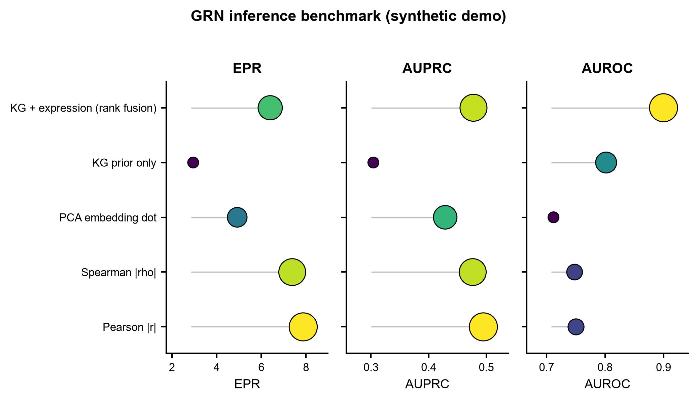
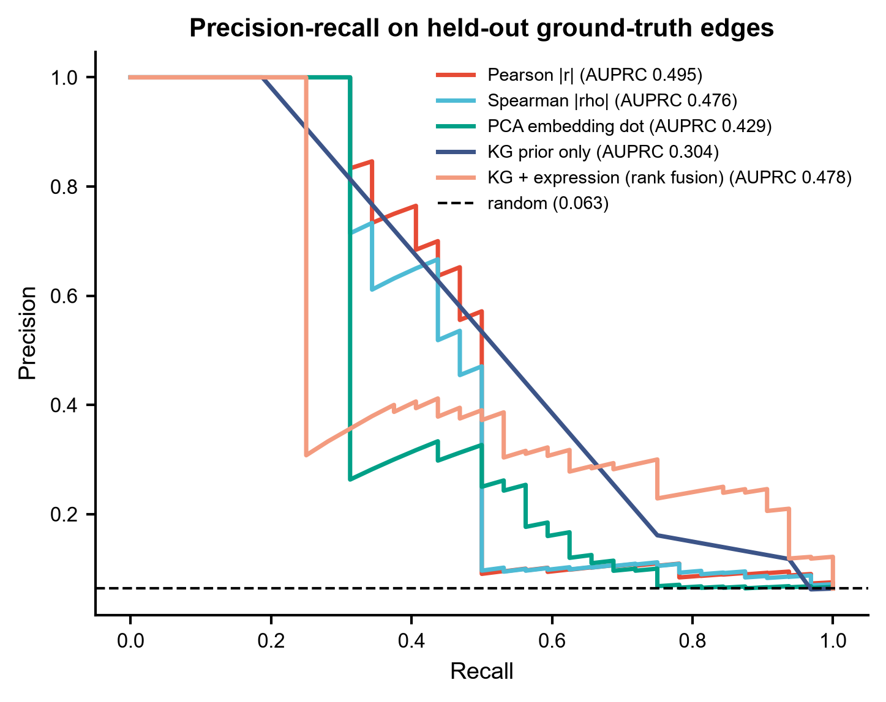
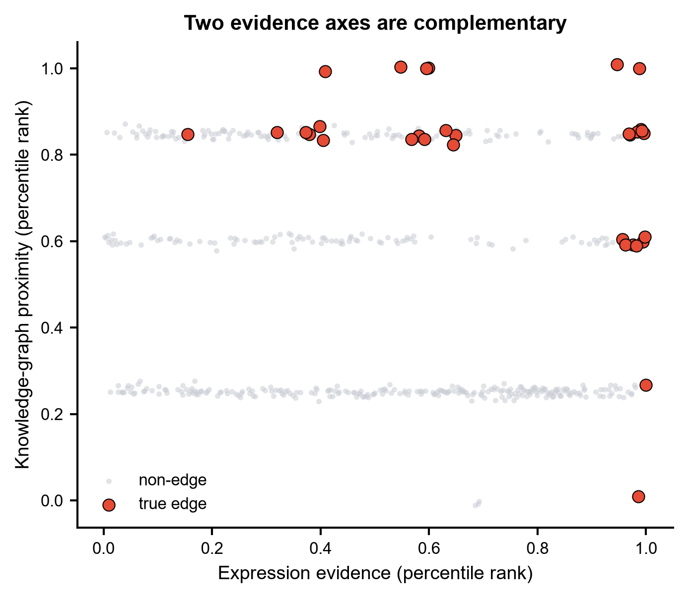
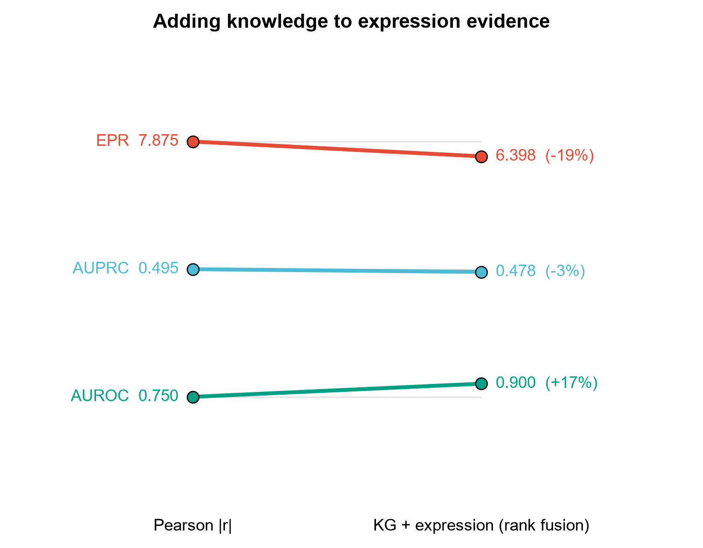

# 583 · KEGNI — 知识图增强的基因调控网络推断

> 输入 **单细胞表达矩阵 + 知识图三元组 + ground-truth 网络** → 跑一套本机可跑的 GRN 推断基线
> (相关性 / 秩相关 / PCA 嵌入点积 / 纯知识先验 / 知识-表达秩融合),按 BEELINE 口径出
> **EPR / AUPRC / AUROC** 榜单 → dot plot、PR 曲线、证据互补性散点、slopegraph 四张图;
> 上游 KEGNI 深度模型走**守卫式封装**(依赖齐备才调经核实的真实命令行,否则诚实退出)。

| | |
|---|---|
| **语言 / 主依赖** | Python 3.12 · `numpy` `pandas` `scipy` `scikit-learn` `networkx` `matplotlib`(全部本机已有) |
| **一句话用途** | 量化"把先验知识加进来,到底给 GRN 推断加了多少分",并给 KEGNI 留出可对接的接口 |
| **输入** | `example_data/expression.csv` + `knowledge_graph.tsv` + `ground_truth_network.csv` |
| **输出** | `results/`(运行生成)· 展示图见 `assets/` |
| **状态** | 🟡 基线本机零改动跑通出图;KEGNI 深度模型本身需服务器装 `dgl` + `transformers` + GPU |
| **上游许可证** | MIT(`Lipxiao/KEGNI`,已核对本地 `LICENSE`) |

---

## ① 输入数据

三个文件的格式**严格对齐上游 KEGNI 仓库**(逐一比对过源码,见文末「API 溯源」)。

**1. `expression.csv`** —— 行 = 基因,列 = 细胞,第一列为基因名索引
(对应 `dataset/MAEDataset.py` 里的 `pd.read_csv(input, index_col=0, header=0)`,即 KEGNI `--input`)

| 列名 | 类型 | 必需 | 示例 | 说明 |
|------|------|:---:|------|------|
| (索引,无列名) | str | ✔ | `TF01` | 基因名,上游会 `.str.upper()` |
| `Cell0001` … | float | ✔ | `2.8009` | 每列一个细胞的表达值 |

```
,Cell0001,Cell0002,Cell0003
TF01,2.8009,3.654,2.8593
TF02,3.6218,3.9411,2.9525
```

**2. `knowledge_graph.tsv`** —— **无表头**三列 TSV:`head` / `relation` / `tail`
(对应 `dataloader/kge_dataloader.py` 的 `pd.read_csv(path, sep='\t', header=None)`,即 KEGNI `--data_path`)

| 列 | 类型 | 必需 | 示例 | 说明 |
|---|------|:---:|------|------|
| 0 `head` | str | ✔ | `TF01` | 头实体 |
| 1 `relation` | str | ✔ | `in_pathway` | 关系类型 |
| 2 `tail` | str | ✔ | `PATHWAY01` | 尾实体 |

> **命名约定(上游语义)**:出现在表达矩阵里的节点被 KEGNI 当作 `scg`(单细胞基因),
> 不在表达矩阵里的节点(通路、复合物等)被当作 `kgg`(纯知识图节点),两类节点的三元组
> 分别进四条 dataloader。所以通路节点必须用表达矩阵中**不存在**的名字。

```
DC001	in_pathway	PATHWAY03
PATHWAY01	part_of	PATHWAY_ROOT
TF01	interacts_with	TG001
```

**3. `ground_truth_network.csv`** —— 表头 `Gene1,Gene2`,`Gene1` 为调控子
(对应上游 `eval.py` 的 `--trueDF`,以及仓库里的 `data/GroundTruth/TFs500/<name>/<name>-ChIP-network.csv`)

```
Gene1,Gene2
TF01,TG001
TF01,TG002
```

示例数据为 **synthetic, for demo only**,由 `example_data/_make_example_data.py` 固定种子生成
(64 基因 × 300 细胞、108 条三元组、32 条真实边)。构造意图写在该脚本头部:一半真实边表达上强相关、
另一半被噪声淹没只能靠先验找回;知识图覆盖 3/4 真实边但同时掺入大量假边。这样两路证据才**真的互补**,
基线对比才有意义,而不是让某一路凭构造碾压。

## ② 方法 / 原理

**基线套件(本模块实际执行的部分,全部 CPU 秒级)**

1. **`Pearson |r|` / `Spearman |rho|`** —— BEELINE 里最经典的朴素对照,只用共表达。
2. **`PCA embedding dot`** —— 基因表达做 PCA 得基因嵌入,边权 = 嵌入点积。
   这是对 **KEGNI 读出方式的浅层同构对照**:上游 `--norm -1` 就是用基因嵌入的**点积**构造预测边权,
   只不过它的嵌入来自 GAT 掩码自编码器 + 知识图嵌入的联合训练。深度嵌入若打不过这个线性嵌入,
   增益就不来自"深度"。
3. **`KG prior only`** —— 只用知识图最短路邻近度 `1/(1+d)`,完全不看表达。用来暴露
   "融合的分数是不是先验一个人挣的"。
4. **`KG + expression (rank fusion)`** —— 两路各转百分位秩后加权平均(`--fusion-weight`)。
   透明、无需训练。**它不是 KEGNI 的算法**,只是同一动机下的最低成本实现与诚实下界。
   融合时刻意用表达侧**最强**的基线(Pearson)而非最弱的,避免"知识有增益"是靠挑软柿子挑出来的。

评估:候选边限定在 (ground truth 出现过的调控子 × 其余全部基因),
计算 **EPR**(前 k 条精确率 / 随机期望,k = 真实边数)、**AUPRC**、**AUROC**。
预测边表按上游格式 `Gene1,Gene2,EdgeWeight` 落盘,可直接喂给 KEGNI 自带的
`python eval.py -p <pred.csv> -t <truth.csv>`。

> **与上游 `eval.py` 的三处定义差异(读源码后照实列出,勿把数字跨表对比)**
> | | 上游 `utils/utility.py` | 本模块 |
> |---|---|---|
> | EPR | `EarlyPrec()` 返回**裸 early precision**,不除随机期望 | 除随机期望的**比值**(BEELINE 论文常用口径) |
> | AUPRC | `computeScores()` 用 `auc(recall, prec)` 梯形积分 | `average_precision_score`(阶梯式) |
> | 候选边集 | `product(unique(GT.Gene1 ∪ GT.Gene2), repeat=2)`,两端都限定在 GT 基因内,默认含自环 | 调控子 × 表达矩阵全部基因,已去自环 |
>
> 三者单调性一致,但**数值不同**,不能与 KEGNI 论文表格直接比。本模块的数字只用于同一张榜单内部横比。

**KEGNI 本体(守卫式封装)**

KEGNI 是 GraphMAE 式的图掩码自编码器(基因 KNN 图上的 GAT)与知识图嵌入(`--model` 默认 `ComplEx`)**联合训练**,
用 `--lambda_kge` 平衡两个损失,再由基因嵌入点积读出调控边。上游**没有 pip 包、也没有 requirements.txt**,是命令行研究代码,MIT 许可证。
本模块检查 `torch`/`dgl`/`transformers` 与本地仓库,凑齐才按下面这条经核实的命令行调用,否则打印真实安装指引后跳过 —— 不伪造任何 Python API。

> **三条读源码才知道的坑(都已写进守卫逻辑)**
> 1. **`--eval` 只对 BEELINE 数据有效**。`train/trainer.py:128-165` 把 ground truth 路径写死为
>    `<--dir>data/GroundTruth/TFs500/<name>/<name>-{STRING,NonSpe,ChIP}-network.csv`
>    (mESC 另多一档 `-lofgof-`;`--genes 1000` 时整体切到 `TFs1000/`,见 `trainer.py:148-160`),
>    其中 `name` = 日志文件名 basename 的 `split('_')[0]`,而日志名 = `<input 去扩展名>_<时间戳>`
>    (`train.py:21,29` + `trainer.py:89`),等价于 `basename(--input).split('_')[0]`。
>    喂任意数据加 `--eval` 会 FileNotFoundError。
>    上游自己的非 BEELINE 例子 `run_pbmc_naiveCD4T.sh` 也没传 `--eval`。故本模块默认**不加**,需要时用 `--kegni-eval`。
> 2. **上游默认不导出预测边表**。`train/trainer.py:247` 的 `predDF.to_csv(...)` 是注释掉的;
>    真正落盘的是 `outputs/<input去扩展名>_<时间戳>-scg_embedding.csv` 等三个嵌入(`trainer.py:240-242`)。
>    因此本模块提供 `--kegni-embedding`,按上游 `recon()`(`trainer.py:336-360`)用 numpy 复原边表并入榜
>    —— 不需要装 torch。★ 该 `recon()` 在点积**之前**先做 `z = torch.tanh(z)`(`trainer.py:343`),
>    而落盘的嵌入是 tanh **之前**的原始 `z`(`trainer.py:234,240`),所以复原时必须自己补 `np.tanh`;
>    漏掉会得到另一套边权(本模块已按此实现)。
> 3. **`transformers` 是硬依赖**。`train/trainer.py:6` 有 `from transformers import Trainer`,
>    虽然看似未被使用,但缺它 `train.py` 直接 ImportError。上游未提供任何版本约束。

> **签名未固定说明**:上游只暴露命令行,不暴露稳定的 Python 函数接口。本模块拼的命令行参数
> 逐一读自 `utils/args.py` 与 `run_mESC.sh`,**参数名与默认值以官方仓库为准**;若上游后续改了
> CLI,以官方为准,此处未固定。

引用(已核实,见文末):Li P *et al.* **KEGNI: knowledge graph enhanced framework for gene
regulatory network inference.** *Genome Biology* 2025;26:294.

## ③ 用途

- 拿到一个候选调控网络后,回答:**"这些边里,有多少是共表达就能给出的?知识先验额外贡献了什么?"**
  —— 这是审稿人最常问 GRN 类工作的一句话。
- 为 KEGNI / SCENIC / CellOracle 等任何 GRN 推断结果准备**统一口径的对照榜单**(同一批候选边、同一套 ground truth)。
- 评估自建的细胞类型特异知识图值不值得做:`KG prior only` 一栏直接给出先验单独的上限。

## ④ 特点 / 亮点

- **turnkey**:`python 583_kegni_knowledge_grn.py` 零改动跑完,不需要 `dgl`、不需要 GPU、不需要联网。
- **强制带基线**:知识融合永远和纯共表达、纯先验并排出现在同一张榜单上,不给"只报融合结果"留余地。
- **线性嵌入对照**:`PCA embedding dot` 与 KEGNI 的点积读出同构,专门用来检验深度模型的增益是否真的来自深度。
- **格式即接口**:输入输出全按上游格式,`results/edges_*.csv` 可直接送进 KEGNI 的 `eval.py`;
  已有 KEGNI 预测可用 `--kegni-pred` 一键并入同一张榜单。
- **无条形图**:dot plot / PR 曲线 / 散点 / slopegraph。

**示例数据上的实测结果(可复现,种子 2024)**

| method | EPR | AUPRC | AUROC |
|---|---:|---:|---:|
| Pearson \|r\| | **7.875** | **0.495** | 0.750 |
| Spearman \|rho\| | 7.383 | 0.476 | 0.748 |
| PCA embedding dot | 4.922 | 0.429 | 0.712 |
| KG prior only | 2.953 | 0.304 | 0.802 |
| KG + expression (rank fusion) | 6.398 | 0.478 | **0.900** |

结论照实写:在这份合成数据上,**知识融合把全局排序显著拉高(AUROC 0.750 → 0.900),但没有赢下 top-k 精确率
(EPR 7.88 → 6.40)**。PR 曲线看得很清楚 —— 融合在 recall > 0.5 的区间大幅领先,而在最前面几条边上仍是
纯相关性更准。这正是带基线的意义:如果只报融合的 AUROC,就会得出"知识全面更优"的错误结论。

## ⑤ 输出结果图

| 文件 | 图型 | 说明 |
|------|------|------|
| `assets/fig1_benchmark_dotplot.png` | dot plot(棒棒糖) | 5 种方法 × 3 个指标的总榜,点大小=组内相对位置,颜色=原值 |
| `assets/fig2_pr_curves.png` | PR 曲线 | 各方法精确率-召回率全曲线 + 随机基准虚线 |
| `assets/fig3_evidence_complementarity.png` | 散点 | 表达证据 vs 知识证据(百分位秩),真实边高亮 —— 两轴为何互补 |
| `assets/fig4_knowledge_gain_slopegraph.png` | slopegraph | 纯表达 → 知识融合,三指标各自的方向与相对变化 |

`results/` 另有:`benchmark_metrics.csv`(榜单)、`edges_<method>.csv`(各方法的
`Gene1,Gene2,EdgeWeight` 边表)、`predicted_edges_best.csv`、`583_summary.json`(含运行参数、
指标、KEGNI 守卫检查报告与引用)。









---

## 运行

```bash
# 零改动跑示例(约 5 秒,纯 CPU)
python 583_kegni_knowledge_grn.py

# 换成自己的数据
python 583_kegni_knowledge_grn.py \
    --expr data/exp.csv --kg data/kg.tsv --truth data/gt.csv --outdir results/run1

# 调融合权重(0=纯表达,1=纯知识)
python 583_kegni_knowledge_grn.py --fusion-weight 0.3

# 把已有的 KEGNI 预测并入同一张榜单(CSV 需为 Gene1,Gene2,EdgeWeight)
python 583_kegni_knowledge_grn.py --kegni-pred path/to/kegni_pred.csv

# 更常见的情形:上游只吐了嵌入(它默认不导出边表),按 recon(tanh + norm=-1) 复原后并入榜单
# 注意上游文件名带训练时间戳
python 583_kegni_knowledge_grn.py --kegni-embedding outputs/mESC_exp_2025-01-01-12-00-00-scg_embedding.csv

# 依赖齐备时真正调用上游模型(需 dgl + transformers + GPU)
python 583_kegni_knowledge_grn.py --kegni-repo /path/to/KEGNI --run-kegni

# 重新生成合成示例数据
python example_data/_make_example_data.py
```

## 依赖安装

基线路径**无需安装任何东西**(numpy / pandas / scipy / scikit-learn / networkx / matplotlib 本机已有)。

KEGNI 本体(建议服务器 + GPU):

```bash
git clone https://github.com/Lipxiao/KEGNI      # MIT License
# 上游无 requirements.txt / setup.py;下面这份清单是对仓库全部 *.py 的 import 做穷举得到的,
# 版本号上游从未给出,故此处不写死版本(写了就是编造)。
pip install torch dgl transformers pandas numpy scikit-learn matplotlib
# 数据(表达 / ground truth / 细胞类型特异知识图):https://zenodo.org/records/14028211
cd KEGNI
python train.py --input <expr.csv> --data_path <kg.tsv> --genes <N> \
    --n_neighbors 30 --num_hidden 512 --num_heads 4 --num_layers 4 \
    --norm -1 --max_steps 1000 --lambda_kge 1
# 只有 BEELINE 命名的数据(如 mESC_exp.csv)且摆好 data/GroundTruth/ 目录时才能加 --eval
python eval.py -p <pred.csv> -t <ground_truth.csv>
```

> `dgl` / `transformers` 本机未安装,故上游模型在本机**从未运行过**,本 README 不对其性能作任何断言,
> 也不复述论文里的任何基准数字。上面的超参取自上游 `configs.yml` 的 `mESC` 档与 `run_mESC.sh`。
> 上游 `docs/` 下确实带有 tutorial(`native_CD4T_cell_KG.html`、`benchmark_cistrome.ipynb`、
> `ARI_calculation.html`),但本模块未执行过它们。

## API 溯源(逐条指向本地克隆的源码位置)

本地克隆:`C:\Users\fsy\Desktop\upstream-sources\583_KEGNI\`(GitHub `Lipxiao/KEGNI`,MIT)。
下表每一行都是**打开源码核对过**的,不是凭 README 或记忆书写:

| 模块里用到的东西 | 源码位置 |
|---|---|
| 全部 CLI 参数名与默认值(`--input --data_path --genes --n_neighbors --num_hidden --num_heads --num_layers --norm --max_steps --lambda_kge --eval --model`) | `utils/args.py:9-52` |
| `--eval` 语义(“only for dataset with ground truth”) | `utils/args.py:14` |
| `--model` 默认 `ComplEx`(确认被真正消费,非死参数) | 定义 `utils/args.py:44`;分派表 `loss/kge_loss.py:33-36`;打分函数 `loss/kge_loss.py:352` |
| GraphMAE 式掩码自编码器(掩码 token / `sce_loss` / `encoding_mask_noise`) | `model/MAE/MAEmodel.py:175,192,197`(上游自己在 `:261` 注释里点名 graphMAE) |
| `kge_model.relation_embedding` / `kgg_embedding` 两个嵌入属性确实存在 | `model/KGE/KGEmodel.py:35,55`(由 `trainer.py:241-242` 落盘) |
| mESC 超参档 `n_neighbors=30 / num_hidden=512 / num_heads=4 / num_layers=4` | `configs.yml`(mESC 段) |
| `max_steps=1000` `lambda_kge=1` `norm=-1` | `run_mESC.sh`;CLI 拼装见 `run_mESC_30_512_4_4.sh` |
| 表达矩阵格式 `pd.read_csv(input, index_col=0, header=0)` + `.str.upper()` | `dataset/MAEDataset.py:15,24` |
| KNN 图建在**基因**上(节点 = matrix.index) | `dataset/MAEDataset.py:25,35-48` |
| 知识图 TSV 格式 `sep='\t', header=None` | `dataloader/kge_dataloader.py:47` |
| scg / kgg 节点划分规则(`kgg = 全部KG节点 − 表达矩阵基因`) | `dataloader/kge_dataloader.py:53`,四类三元组分派 `:63-73` |
| `recon()`:先 `z = torch.tanh(z)`,再 `norm == -1` → `pred = torch.mm(z, z.t())`,melt 成 `Gene1,Gene2,EdgeWeight` 并去自环 | `train/trainer.py:336-360`(tanh 在 `:343`) |
| 嵌入落盘的是 tanh **之前**的 `z`,路径 `outputs/<input去扩展名>_<时间戳>-scg_embedding.csv` | `train/trainer.py:234,240-242`;文件名来源 `trainer.py:89` + `train.py:21,29` |
| 预测边表 `to_csv` **被注释掉**(上游默认不导出边表) | `train/trainer.py:247` |
| `--eval` 下 ground truth 路径写死为 BEELINE 目录 | `train/trainer.py:128-165` |
| `transformers` 为硬依赖 | `train/trainer.py:6` |
| `eval.py` 的 `-p/--predDF`、`-t/--trueDF` | `eval.py:6-7` |
| `EarlyPrec` 返回裸 early precision | `utils/utility.py:109-154` |
| `computeScores` 的 AUPRC = `auc(recall, prec)`、候选集 `product(unique(GT基因), repeat=2)` | `utils/utility.py:10-106` |
| Zenodo 数据地址、tutorial 清单、MIT 许可证 | 上游 `README.md`、`LICENSE` |

## 引用

Li P, Li L, Nan J, Chen J, Sun J, Cao Y. KEGNI: knowledge graph enhanced framework for gene
regulatory network inference. *Genome Biology*. 2025 Sep 22;26(1):294.
**PMID 40983951** · **doi:10.1186/s13059-025-03780-7** · PMC12455831

> 引用状态:**已核实**。PMID 与 DOI 均经 NCBI E-utilities `esummary` 与 `doi.org` 解析确认,
> 指向同一篇 *Genome Biology* 2025 论文,与上游仓库 `Lipxiao/KEGNI` 对得上。

评估指标口径参考 BEELINE:Pratapa A *et al.* Benchmarking algorithms for gene regulatory network
inference from single-cell transcriptomic data. *Nat Methods* 2020;17:147-154
(PMID 31907445 · doi:10.1038/s41592-019-0690-6,已核实)
(上游 `utils/utility.py` 的 `EarlyPrec` / `computeScores` 即从 BEELINE 改写而来;
本模块按 BEELINE 语义独立实现,与上游的三处具体定义差异见 ② 节表格)。
